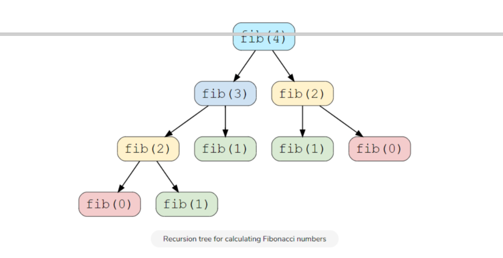
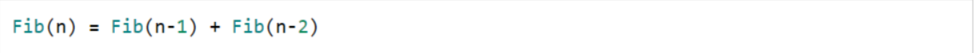

### 1、introduction

​		解决多阶段决策过程最优化的一种数学方法。把多阶段问题变换为一系列相互联系的的单阶段问题，然后逐个加以解决。是一种数学方法，是求解某类问题的一种方法，而**不是一种特殊的算法**，没有一个标准的数学表达式或明确定义的一种规则。

### 2、特征

#### 重叠子问题



#### 最优子结构



### 3、方法

#### 自顶向下，缓存已计算的重复结果

```c++
int fibRecursive(vector<int> &memoize, int n) {
    if (n < 2) return n;

    if (memoize[n] != 0) {
        return memoize[n];
    }
    
    memoize[n] = fibRecursive(memoize, n - 1) + fibRecursive(memoize, n - 2);

    return memoize[n];
}

int fib(int n) {
    vector<int> memoize(n + 1, 0);
    return fibRecursive(memoize, n-1)+fibRecursive(memoize,n-2);
}
```


#### 自底向上，列表计算后续结果

```c++
int fib(int n) {
    if (n == 0) return 0;
    vector<int> dp(n + 1);
    dp[0] = 0;
    dp[1] = 1;
    for (int i = 2; i <= n; i++) {
        dp[i] = dp[i - 1] + dp[i - 2];
    }

    return dp[n];
}
```

