---


# Documentation: https://sourcethemes.com/academic/docs/managing-content/

title: "Dynamic Programming-2 0-1 Knapsack"
subtitle: ""
summary: "0-1背包"
authors: []
tags: ["Dynamic Programming"]
categories: []
date: 2020-07-01T16:33:38+08:00
lastmod: 2020-07-01T16:33:38+08:00
featured: false
draft: false
toc: true

# Featured image
# To use, add an image named `featured.jpg/png` to your page's folder.
# Focal points: Smart, Center, TopLeft, Top, TopRight, Left, Right, BottomLeft, Bottom, BottomRight.
image:
  caption: ""
  focal_point: ""
  preview_only: false

# Projects (optional).
#   Associate this post with one or more of your projects.
#   Simply enter your project's folder or file name without extension.
#   E.g. `projects = ["internal-project"]` references `content/project/deep-learning/index.md`.
#   Otherwise, set `projects = []`.
projects: []
---


## 1、0-1 Knapsack

> 给定N个物品的价值和重量，一个容量为C的背包。每个物品只能挑选一次且总容量不能超过C，求最大价值

```c++
input:	weights=[2, 3, 1, 4]
    	profits=[4, 5, 3, 7]
    	C=5
    
output:	10  
  
explanations:	1+4=5,3+7=10
```

### 暴力法

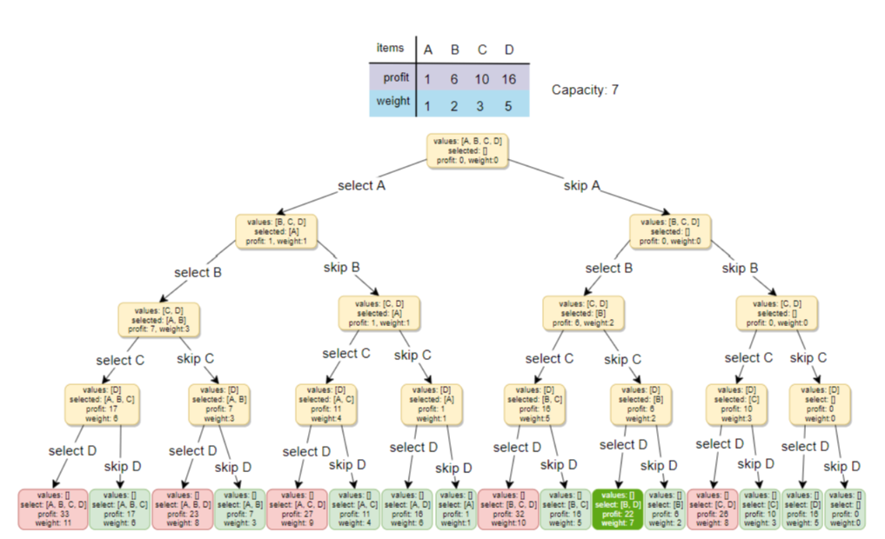

```c++
int knapsackRecursive(const vector<int> &weight, const vector<int> &profits, int capacity, int currentIndex) {
    if (capacity <= 0 || currentIndex >= weight.size() || weight.size() != profits.size()) {
        return 0;
    }

    int profit1 = 0;

    if (weight[currentIndex] <= capacity) {
        profit1 = profits[currentIndex] +
                  knapsackRecursive(weight, profits, capacity - weight[currentIndex], currentIndex + 1);
    }

    int profit2 = knapsackRecursive(weight, profits, capacity, currentIndex + 1);

    return max(profit1, profit2);
}

int knapsack(const vector<int> &weight, const vector<int> &profits, int capacity) {
    return knapsackRecursive(weight, profits, capacity, 0);
}
```

Time Complexity : *O*(*2^N* )

Space Complexity : *O*(*N*)

### 自顶向下

有重复

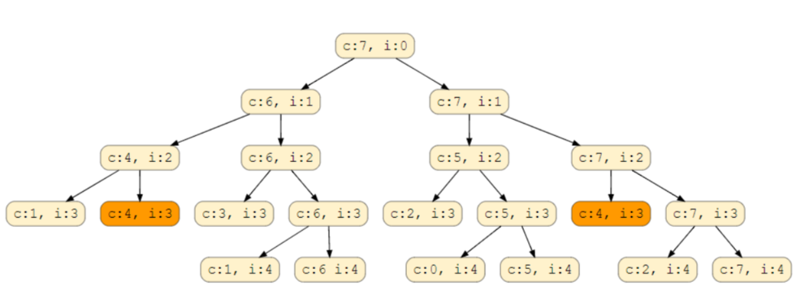

```c++
int knapsackRecursive(const vector<int> &weight, const vector<int> &profits, int capacity, vector<vector<int>> &dp,
                       int currentIndex) {
    if (capacity <= 0 || currentIndex >= weight.size()) {
        return 0;
    }

    if (dp[currentIndex][capacity] != -1) {
        return dp[currentIndex][capacity];
    }

    int profit1 = 0;

    if (weight[currentIndex] <= capacity) {
        profit1 = profits[currentIndex] +
                  knapsackRecursive(weight, profits, capacity - weight[currentIndex], dp, currentIndex + 1);
    }

    int profit2 = knapsackRecursive(weight, profits, capacity, dp, currentIndex + 1);
    dp[currentIndex][capacity] = max(profit1, profit2);

    return dp[currentIndex][capacity];
}

int knapsack(const vector<int> &weight, const vector<int> &profits, int capacity) {
    vector<vector<int>> dp(weight.size(), vector<int>(capacity + 1, -1));
    return knapsackRecursive(weight, profits, capacity, dp, 0);
}
```

Time Complexity : *O*(*N \* C*)

Space Complexity : *O*(*N \* C*)

### 自底向上

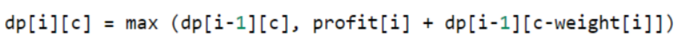

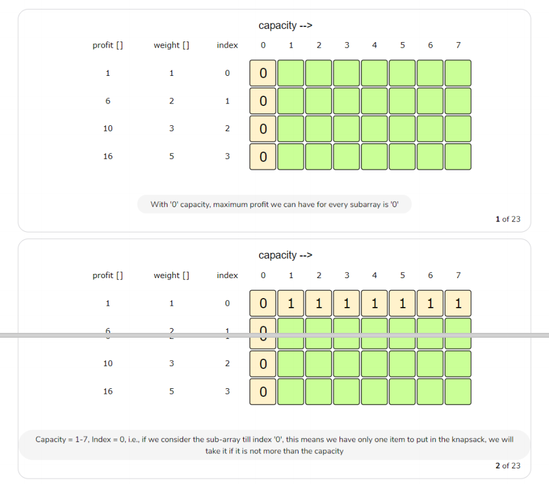

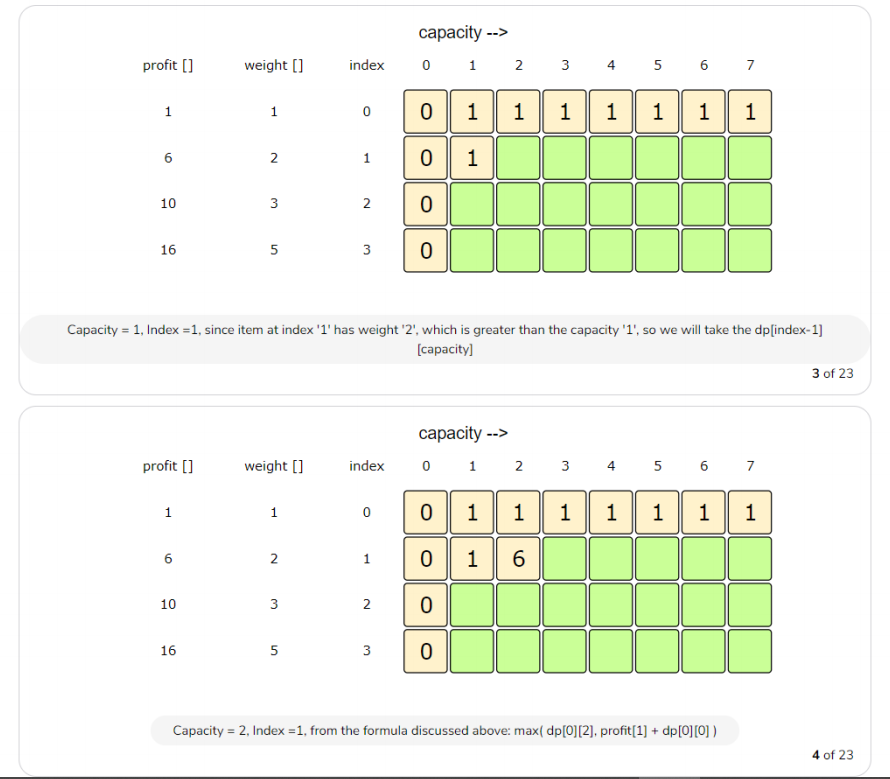

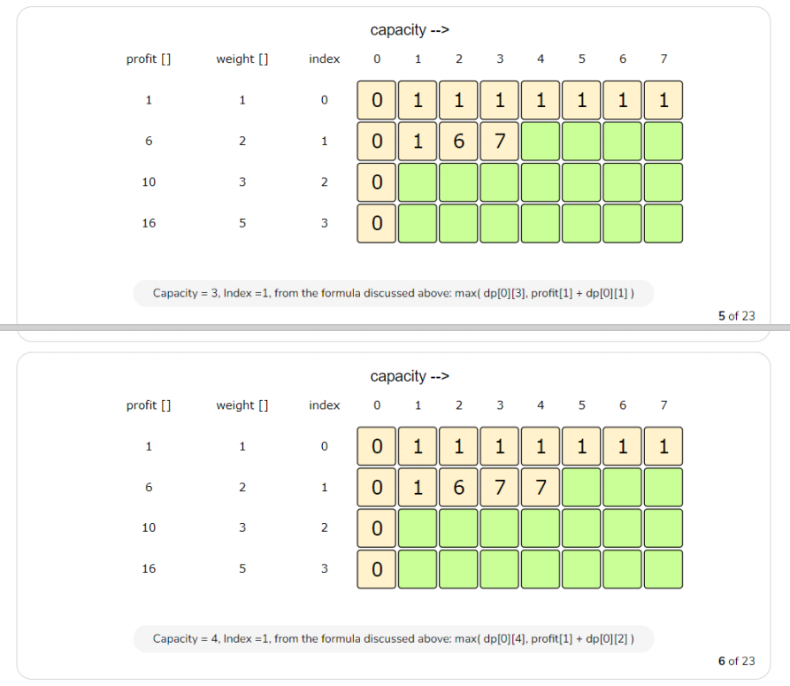

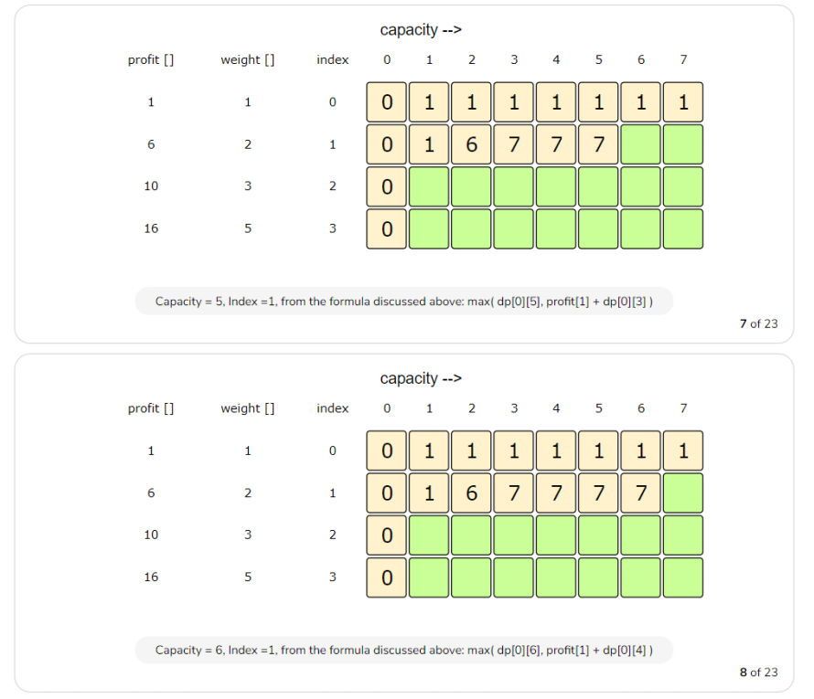

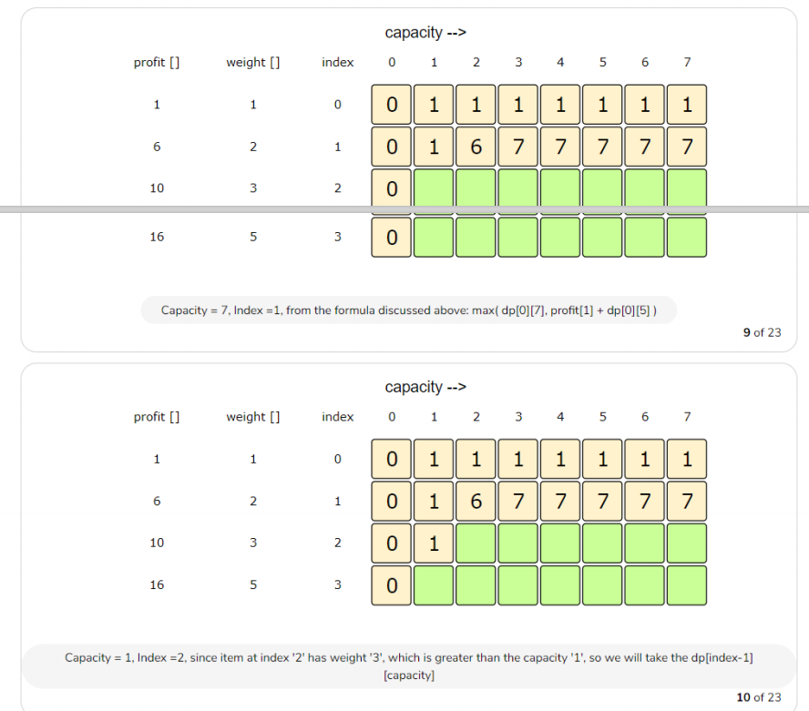

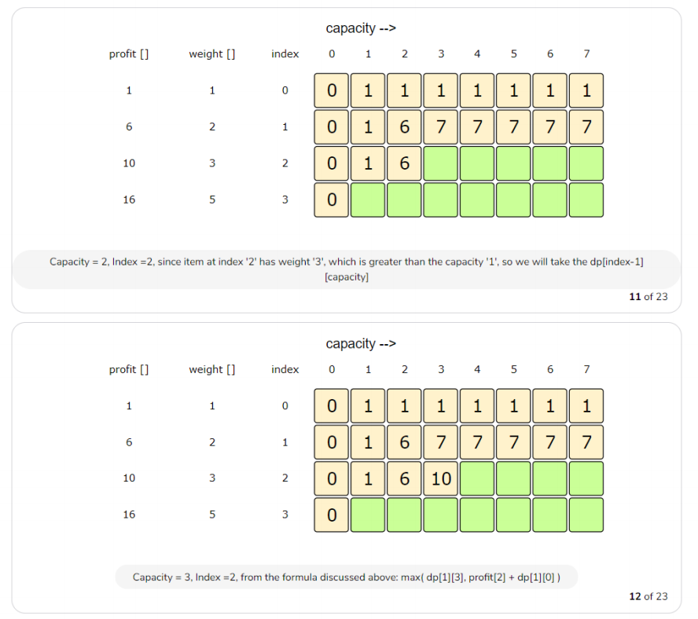

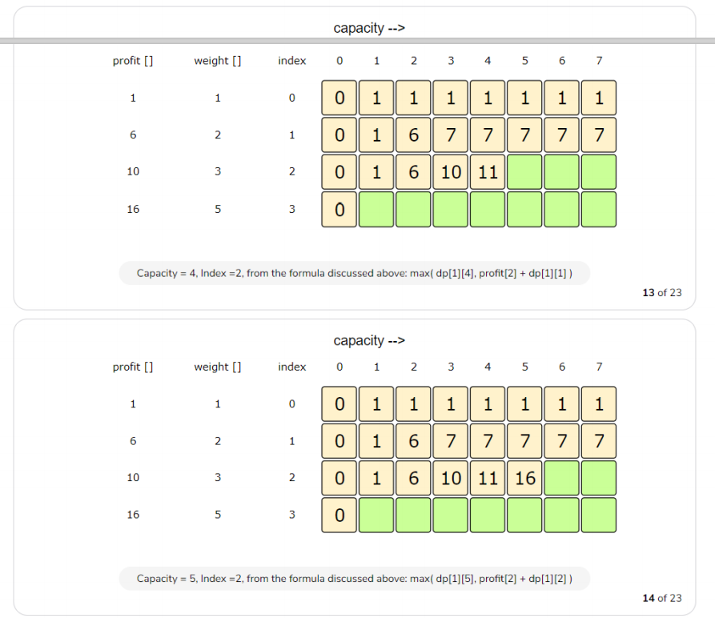

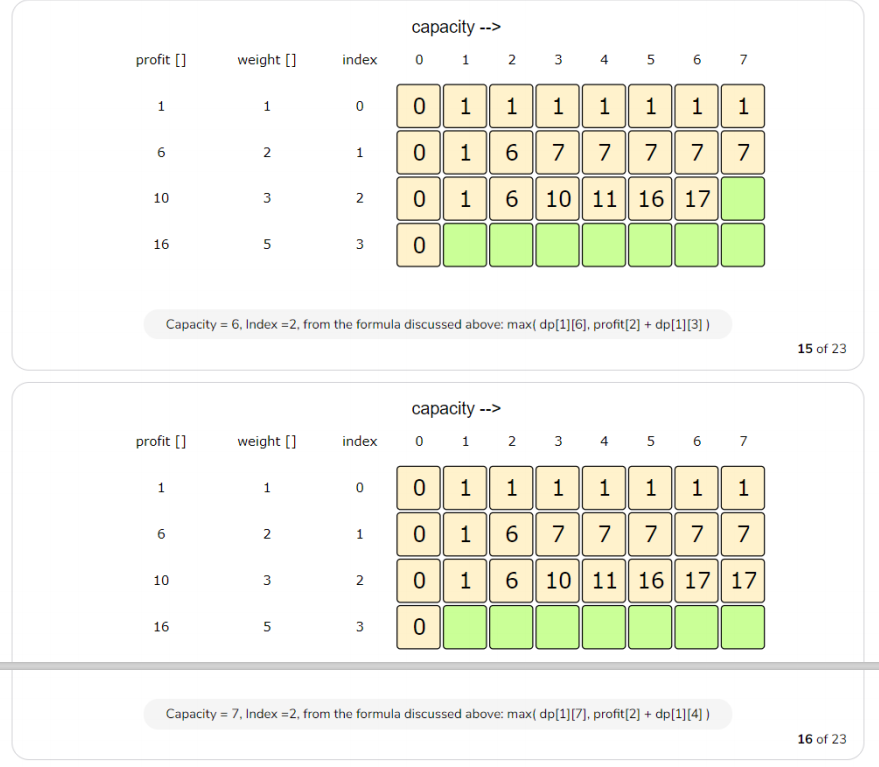

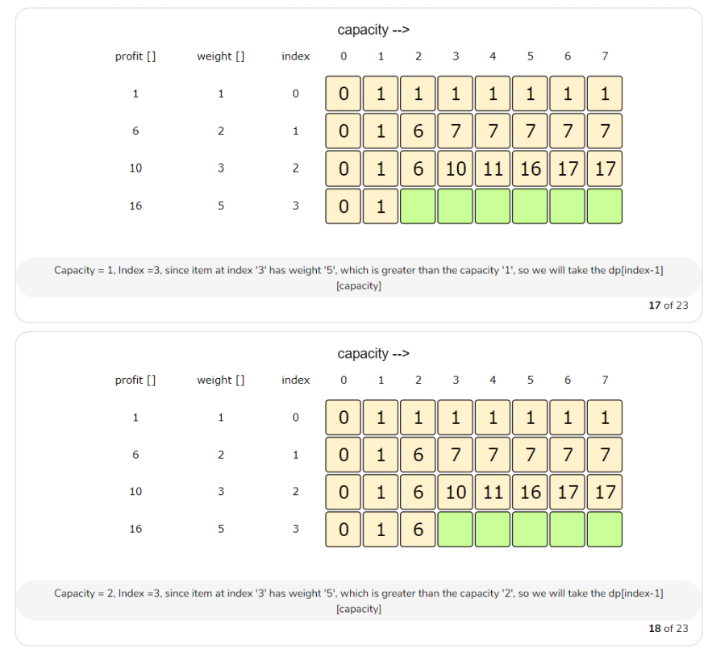

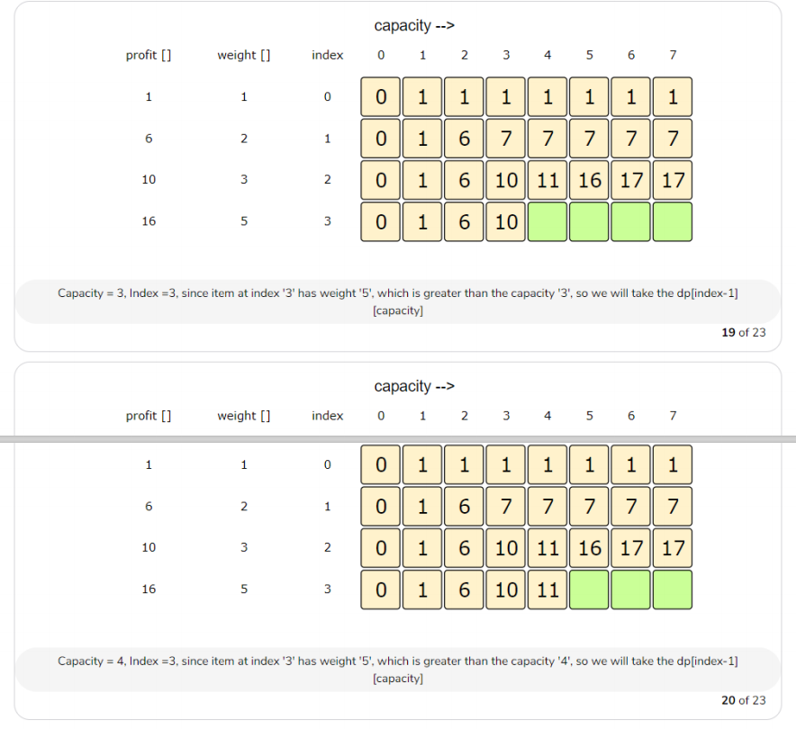

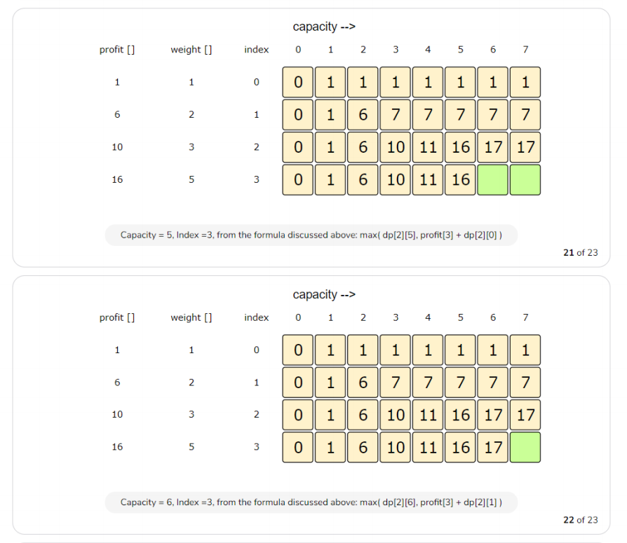

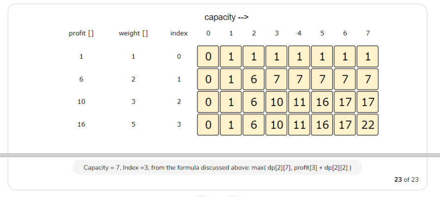


```c++
int knapsack3(const vector<int> &weight, const vector<int> &profits, int capacity) {
    if (capacity <= 0 || profits.empty() || profits.size() != weight.size()) {
        return 0;
    }

    int n = profits.size();
    vector<vector<int>> dp(n, vector<int>(capacity + 1));

    for (int i = 0; i < n; i++) {
        dp[i][0] = 0;
    }

    //如果第一个物品小于物品重量，放置
    for (int j = 0; j <= capacity; j++) {
        if (weight[0] <= j) {
            dp[0][j] = profits[0];
        }
    }

    //之后的物品
    for (int i = 1; i < n; i++) {
        for (int j = 1; j <= capacity; j++) {
            int profit1 = 0, profit2 = 0;

            if (weight[i] <= j) {
                profit1 = profits[i] + dp[i - 1][j - weight[i]];
            }
            profit2 = dp[i - 1][j];
            dp[i][j] = max(profit1, profit2);
        }
    }
	
    return dp[n - 1][capacity];
}
```

Time Complexity : *O*(*N \* C*)

Space Complexity : *O*(*N \* C*)

输出选择的物品：

> 当某个物品不选择时，dp的值来源于正上方，且相等。若不相等，则此物品被选中。

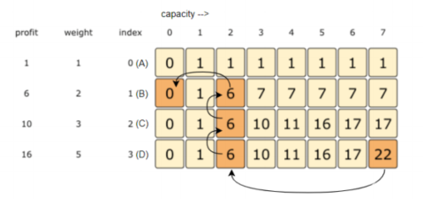


```c++
void printSelectElements(const vector<int> &weight, const vector<int> &profits, int capacity, vector<vector<int>> &dp) {
    int n = weight.size();
    int totalProfit = dp[n - 1][capacity];
    cout << "--------";
    //不能等于0，会越界
    for (int i = n - 1; i > 0; i--) {
        //最值与正上方比较,选中
        if (totalProfit != dp[i - 1][capacity]) {

            cout << weight[i] << " ";
            cout << "index=" << i << " ";
            capacity -= weight[i];
            totalProfit -= profits[i];
        }
    }
    //判断第一个元素是否被选中
    if (totalProfit != 0) {
        cout << weight[0];
        cout << "index=" << 0 << " ";
    }
    cout << "--------";
}
```

优化一：

```c++
int knapsack4(const vector<int> &weight, const vector<int> &profits, int capacity) {
    if (capacity <= 0 || profits.empty() || profits.size() != weight.size()) {
        return 0;
    }

    int n = profits.size();
    //当前dp的值，只与上一行有关，两行就行，覆盖即可，
    vector<vector<int>> dp(2, vector<int>(capacity + 1));


    //如果第一个物品小于物品重量，放置
    for (int j = 0; j <= capacity; j++) {
        if (weight[0] <= j) {
            dp[0][j] = dp[1][j] = profits[0];
        }
    }

    //之后的物品
    for (int i = 1; i < n; i++) {
        for (int j = 1; j <= capacity; j++) {
            int profit1 = 0, profit2 = 0;

            if (weight[i] <= j) {
                profit1 = profits[i] + dp[(i - 1) % 2][j - weight[i]];
            }
            profit2 = dp[(i - 1) % 2][j];
            dp[i % 2][j] = max(profit1, profit2);
        }
    }
    return dp[(n - 1) % 2][capacity];
}
```

Time Complexity : *O*(*N \* C*)

Space Complexity : *O*(*C*)

优化二：

```c++
int knapsack5(const vector<int> &weight, const vector<int> &profits, int capacity) {
    if (capacity <= 0 || profits.empty() || profits.size() != weight.size()) {
        return 0;
    }

    int n = profits.size();
    vector<int> dp(capacity + 1);


    //如果第一个物品小于物品重量，放置
    for (int j = 0; j <= capacity; j++) {
        if (weight[0] <= j) {
            dp[j] = profits[0];
        }
    }

    //之后的物品
    for (int i = 1; i < n; i++) {
        //顺序改变防止覆盖
        for (int j = capacity; j >= 0; j--) {
            int profit1 = 0, profit2 = 0;

            if (weight[i] <= j) {
                profit1 = profits[i] + dp[j - weight[i]];
            }
            profit2 = dp[j];
            dp[j] = max(profit1, profit2);
        }
    }
    return dp[capacity];
}
```

Time Complexity : *O*(*N \* C*)

Space Complexity : *O*(*C*)

## 2、equal subsets sum partition

> 给定正整数数组，是否存在一种分法将数组分为不相交的两部分，使得他们的和相等

> 即求是否存在子数组使得其和为数组和的一半

### 暴力法

```c++
bool partitionRecursive(const vector<int> &nums, int sum, int currentIndex) {
    if (sum == 0) {
        return true;
    }

    if (currentIndex >= nums.size()) {
        return false;
    }
    if (nums[currentIndex] <= sum) {
        if (partitionRecursive(nums, sum - nums[currentIndex], currentIndex + 1)) {
            return true;
        }
    }
    return partitionRecursive(nums, sum, currentIndex + 1);
}

bool equalSubset(const vector<int> &nums) {
    if (nums.empty()) {
        return false;
    }
    
    int sum = 0;
    for (int i = 0; i < nums.size(); i++) {
        sum += nums[i];
    }

    if (sum % 2 != 0) {
        return false;
    }

    return partitionRecursive(nums, sum / 2, 0);
}
```

Time Complexity : *O*(2^*N*)

Space Complexity : *O*(*N*)

### 自顶向下

```c++
bool partitionRecursive2(const vector<int> &nums, int sum, int currentIndex, vector<vector<int>> &dp) {
    if (sum == 0) {
        return true;
    }

    if (currentIndex >= nums.size()) {
        return false;
    }

    if (dp[currentIndex][sum] == -1) {
        if (nums[currentIndex] <= sum) {
            if (partitionRecursive(nums, sum - nums[currentIndex], currentIndex + 1)) {
                dp[currentIndex][sum] = 1;
                return true;
            }
        }
        dp[currentIndex][sum] = partitionRecursive(nums, sum, currentIndex + 1) ? 1 : 0;
    }

    return dp[currentIndex][sum] == 1 ? true : false;
}

bool equalSubset2(const vector<int> &nums) {
    if (nums.empty()) {
        return false;
    }

    int sum = 0;
    for (int i = 0; i < nums.size(); i++) {
        sum += nums[i];
    }

    if (sum % 2 != 0) {
        return false;
    }

    vector<vector<int>> dp(nums.size(), vector<int>(sum / 2 + 1, -1));
    return partitionRecursive2(nums, sum / 2, 0, dp);
}
```

Time Complexity : *O*(*N \* S*) ，S为数组和

Space Complexity : *O*(*N \* S*)

### 自底向上

```c++
bool equalSubset3(const vector<int> &nums) {
    if (nums.empty()) {
        return false;
    }

    int sum = 0;
    for (int i = 0; i < nums.size(); i++) {
        sum += nums[i];
    }

    if (sum % 2 != 0) {
        return false;
    }
    int halfSum = sum / 2;

    vector<vector<bool>> dp(nums.size(), vector<bool>(halfSum + 1));

    //第一列
    for (int i = 0; i < nums.size(); i++) {
        dp[i][0] = true;
    }

    //第一行：第二个到最后一个
    //此行非常重要，值不一定相同，视情况而定
    //当处理nums[0]时，如果其值等于s,表明数组其余的元素和也是s
    for (int s = 1; s <= halfSum; s++) {
        //dp[0][s]= (nums[0]==s? true: false);
        if (nums[0] == s) {
            dp[0][s] = true;
        } else {
            dp[0][s] = false;
        }

    }

    for (int i = 1; i < nums.size(); i++) {
        for (int s = 1; s <= halfSum; s++) {
            //选中nums[i]
            if(dp[i-1][s]) {
                //跳过nums[i]
                dp[i][s] = dp[i - 1][s];
            
            }else if (nums[i] <= s) {
                dp[i][s] = dp[i - 1][s - nums[i]];
            }
        }
    }
    return dp[nums.size() - 1][halfSum];
}
```

Time Complexity : *O*(*N \* S*) ，S为数组和

Space Complexity : *O*(*N \* S*)

拓展：

> 输出和相等的两个分组

```c++
vector<vector<int>> printPartition(const vector<int> &nums, const vector<vector<bool>> &dp) {
    int row = nums.size();
    int halfSum = dp[0].size() - 1;
    //能否分成和相等的两部分
    bool canPartition = dp[row - 1][halfSum];

    vector<vector<int>> result;
    vector<int> part1;
    vector<int> part2;


    for (int i = row - 1; i > 0; i--) {
        //选中，上一行和此行比较
        if (dp[i - 1][halfSum] != canPartition) {
            part1.push_back(nums[i]);

            //跳到选中之前的一步
            halfSum -= nums[i];
            //既然两行的值不一样，下一步比较时，canPartition取反
            canPartition = dp[i - 1][halfSum];
        } else {
            part2.push_back(nums[i]);
            //canPartition = dp[i][halfSum];
        }

    }

    //处理第一行，halfSum==0时，未选中。
    if (halfSum != 0) {
        part1.push_back(nums[0]);
    } else {
        part2.push_back(nums[0]);
    }
    result.push_back(part1);
    result.push_back(part2);
    return result;
}
```

## 3、subset sum

> 给定正整数数组和S值，判断是否存在子数组，使得其和等于S

```c++
input: [1, 2, 3, 7], s=6
    
output:	true
    
explanation:sum(1, 2, 3)=6
```

```c++
input: [1, 2, 7, 1, 5], s=10
    
output:	true
    
explanation:sum(1, 2, 7)=10
```

```c++
input: [1, 3, 4, 8], s=6
    
output:	false
```

### 暴力法

```c++
bool subsetSumRecursive(const vector<int> &nums, int sum, int currentIndex) {
    if (sum == 0) {
        return true;
    }
    if (currentIndex >= nums.size()) {
        return false;
    }
    
    if (nums[currentIndex] <= sum) {
        //一定要加if判断，此分支(及分支的分支···）为假，不代表下一分支假
        //为假时跳到下一步
        if (subsetSumRecursive(nums, sum - nums[currentIndex], currentIndex + 1)) {
            return true;
        }
    }
    //上一分支为假
    return subsetSumRecursive(nums, sum, currentIndex + 1);
}

bool subsetSum(const vector<int> &nums, int sum) {
    if (sum == 0) {
        return true;
    }
    if (nums.empty()) {
        return false;
    }
    return subsetSumRecursive(nums, sum, 0);
}
```

Time Complexity : *O*(2^*N*)

Space Complexity : *O*(*N*)

### 自顶向下

```c++
bool subsetSumRecursive2(const vector<int> &nums, int sum, int currentIndex, vector<vector<int>> &dp) {
    if (sum == 0) {
        return true;
    }

    if (currentIndex >= nums.size()) {
        return false;
    }

    if (dp[currentIndex][sum] == -1) {

        if (nums[currentIndex] <= sum) {
            if (subsetSumRecursive2(nums, sum - nums[currentIndex], currentIndex + 1, dp)) {
                dp[currentIndex][sum] = 1;
                return true;
            }
        }
        dp[currentIndex][sum] = subsetSumRecursive2(nums, sum, currentIndex + 1, dp) ? 1 : 0;

    }

    return dp[currentIndex][sum] == 1 ? true : false;
}

bool subsetSum2(const vector<int> &nums, int sum) {
    if (sum == 0) {
        return true;
    }
    if (nums.empty()) {
        return false;
    }
    int n = nums.size();
    vector<vector<int>> dp(n, vector<int>(sum + 1, -1));
    return subsetSumRecursive2(nums, sum, 0, dp);
}
```

Time Complexity : *O*(*N \* S*) 

Space Complexity : *O*(*N \* S*)

### 自底向上

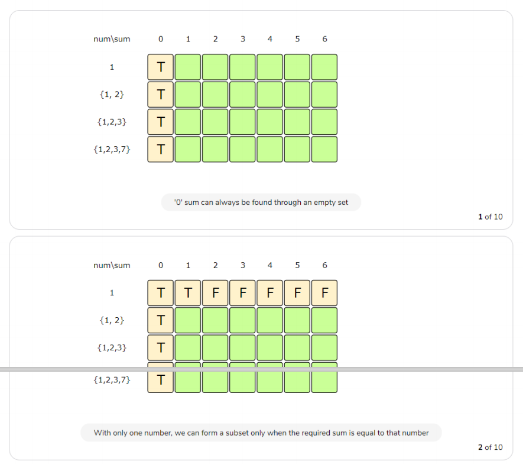

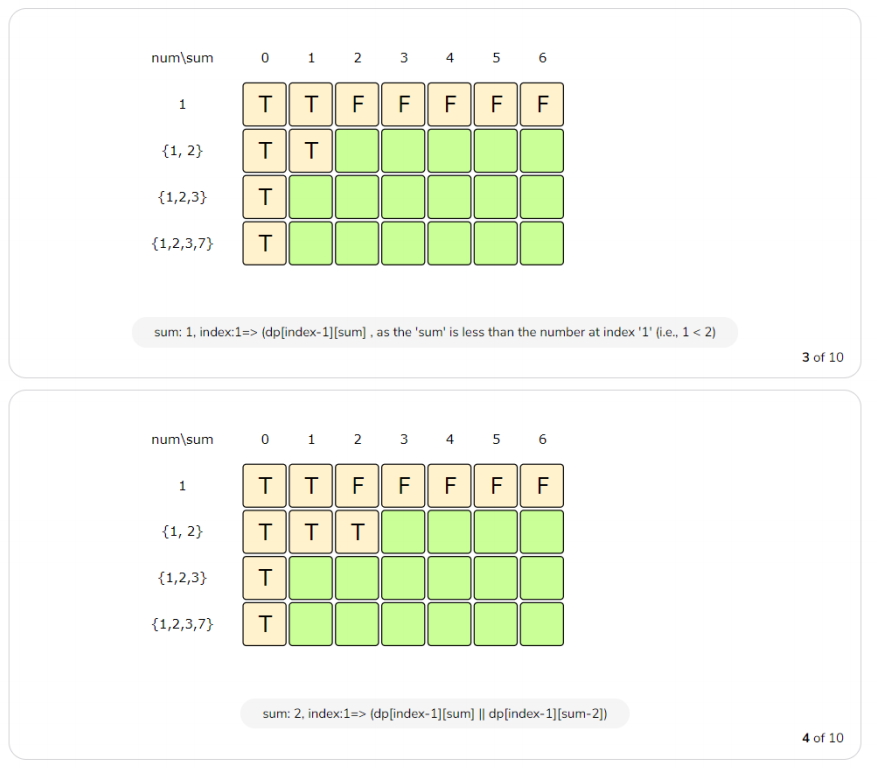

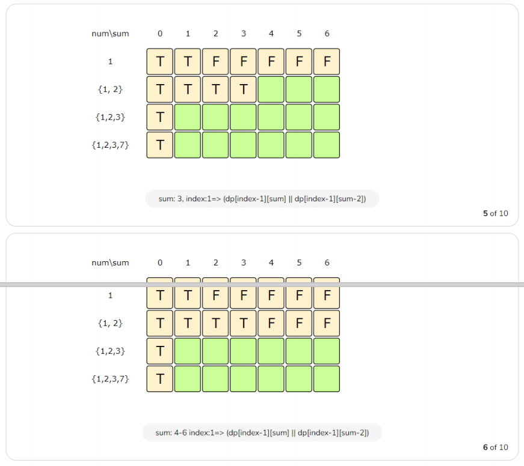

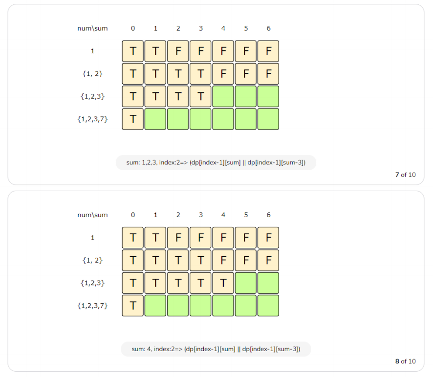

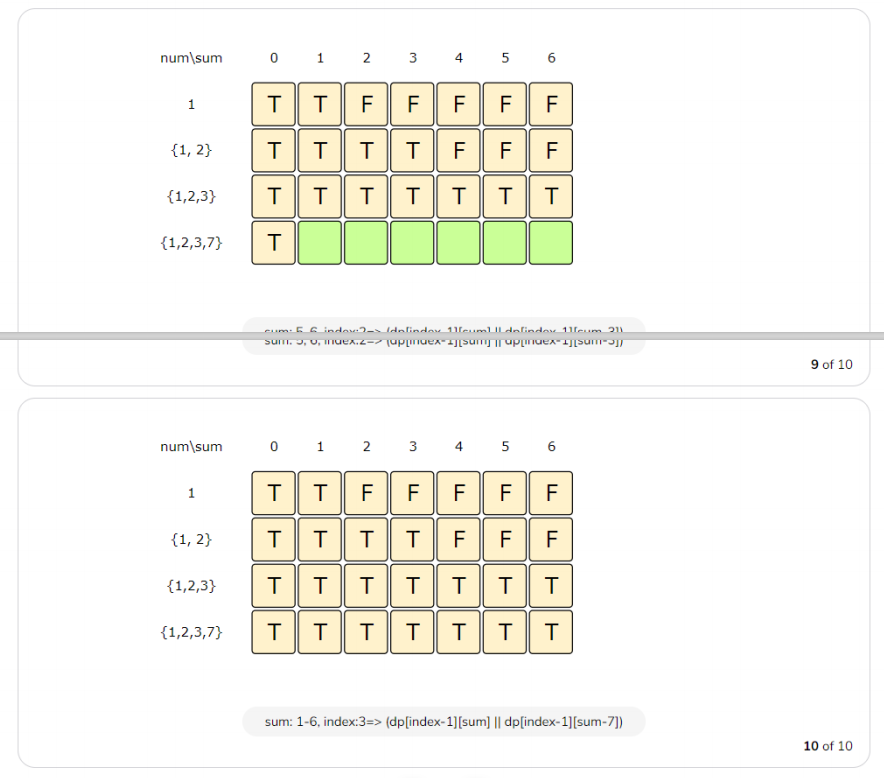

```c++
bool subsetSum3(const vector<int> &nums, int sum) {
    if (sum == 0) {
        return true;
    }
    if (nums.empty()) {
        return false;
    }
    int n = nums.size();
    vector<vector<bool>> dp(n, vector<bool>(sum + 1));

    for (int i = 0; i < n; i++) {
        dp[i][0] = true;
    }
    for (int s = 1; s <= sum; s++) {
        if (nums[0] == s) {
            dp[0][s] = true;
        } else {
            dp[0][s] = false;
        }
    }

    for (int i = 1; i < n; i++) {
        for (int s = 1; s <= sum; s++) {
          	//选中nums[i]
            if(dp[i-1][s]) {
                //跳过nums[i]
                dp[i][s] = dp[i - 1][s];
                
            }else if (nums[i] <= s) {
                dp[i][s] = dp[i - 1][s - nums[i]];
            }
        }
    }
    return dp[n - 1][sum];
}
```

Time Complexity : *O*(*N \* S*) 

Space Complexity : *O*(*N \* S*)

## 4、minimum subset sum different

> 给定正整数组成的数组，将其分为不重合的两个子数组，使得子数组的和 的差的绝对值最小，输出最小的差

```c++
input:	[1, 2, 3, 9]

output:	3
    
explanation：|sum(1,2,3) - sum(9)| = 3
```

```c++
input:	[1, 2, 7, 1, 5]

output:	0
    
explanation：|sum(1,2,5) - sum(7,1)| = 0
```

```c++
input:	[1,  3, 100, 4]

output:	92
    
explanation：|sum(1,3,4) - sum(100)| = 92
```

### 暴力法

```c++
int minSubsetSumDifferentRecursive(const vector<int> &nums, int sum1, int sum2, int currentIndex) {
    if (currentIndex == nums.size()) {
        return abs(sum1 - sum2);
    }
    
    int diff1 = minSubsetSumDifferentRecursive(nums, sum1 + nums[currentIndex], sum2, currentIndex + 1);
    int diff2 = minSubsetSumDifferentRecursive(nums, sum1, sum2 + nums[currentIndex], currentIndex + 1);

    return min(diff1, diff2);
}


int minSubsetSumDifferent(const vector<int> &nums) {
    return minSubsetSumDifferentRecursive(nums, 0, 0, 0);
}
```

Time Complexity : *O*(*2^N* )

Space Complexity : *O*(*N*)

### 自顶向下

```c++
int minSubsetSumDifferentRecursive2(const vector<int> &nums, int sum1, int sum2,
        int currentIndex,vector<vector<int>> &dp) {
    if (currentIndex == nums.size()) {
        return abs(sum1-sum2);
    }
    if(dp[currentIndex][sum1]==-1){
        int diff1 = minSubsetSumDifferentRecursive(nums, sum1 + nums[currentIndex], sum2, currentIndex + 1);
        int diff2 = minSubsetSumDifferentRecursive(nums, sum1, sum2 + nums[currentIndex], currentIndex + 1);

        dp[currentIndex][sum1] = min(diff1,diff2);
    }
    
    return dp[currentIndex][sum1];
}

int minSubsetSumDifferent2(const vector<int> &nums) {
    int sum=0;
    for(int i=0;i<nums.size();i++){
        sum+=nums[i];
    }
    
    vector<vector<int>> dp(nums.size(),vector<int>(sum+1,-1));
    return minSubsetSumDifferentRecursive2(nums, 0, 0, 0,dp);
}
```

Time Complexity : *O*(*N \* S*) 

Space Complexity : *O*(*N \* S*)

### 自底向上

> 子数组和等于Sum/2时，有最小值，如果不等于，求最接近sum/2的子数组。

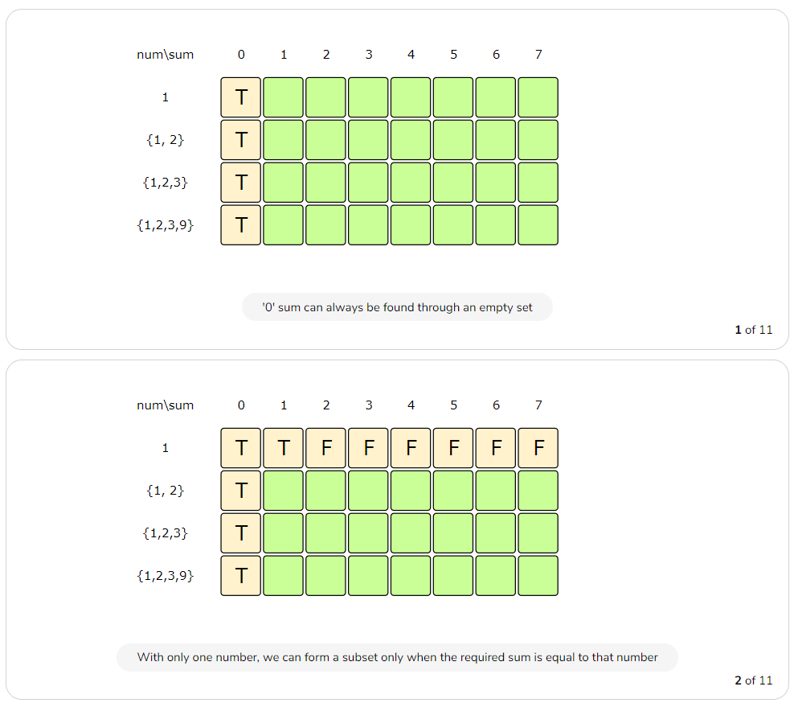


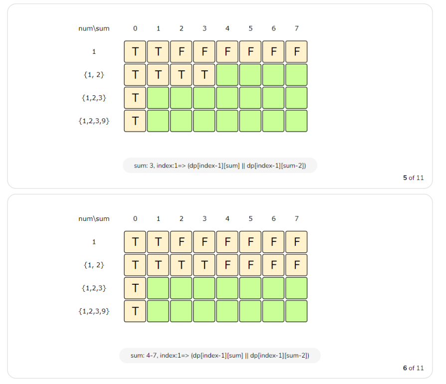

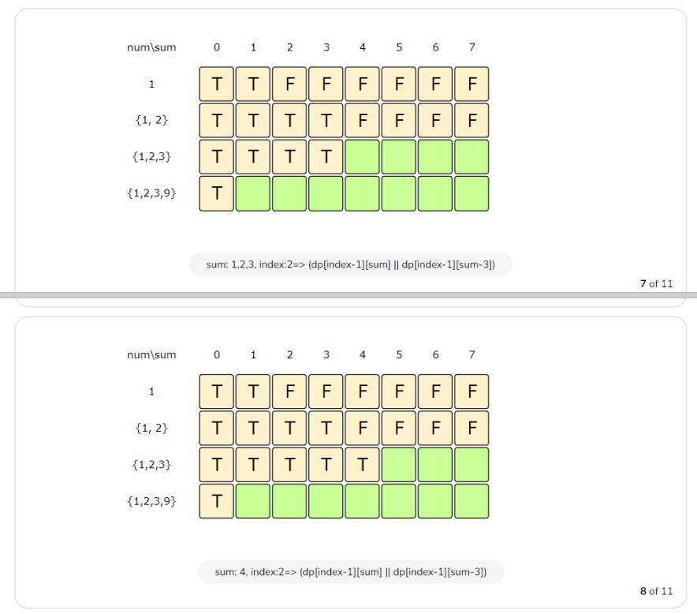

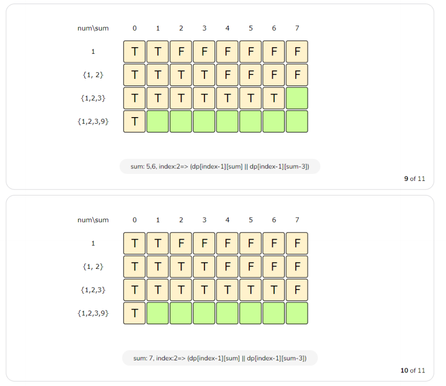

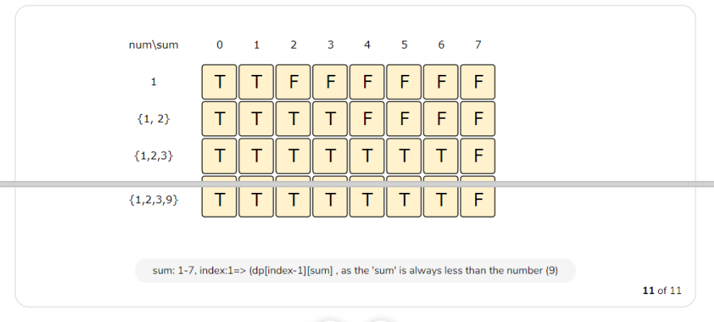

```c++
int minSubsetSumDifferent3(const vector<int> &nums) {
    int sum = 0;
    for (int i = 0; i < nums.size(); i++) {
        sum += nums[i];
    }
    int n = nums.size();
    int halfSum = sum / 2;

    vector<vector<bool>> dp(n, vector<bool>(halfSum + 1));

    for (int i = 0; i < n; i++) {
        dp[i][0] = true;
    }

    for (int s = 1; s <= halfSum; s++) {
        dp[0][s] = (nums[0] == s ? true : false);
    }
    for (int i = 1; i < n; i++) {
        for (int s = 1; s <= halfSum; s++) {
            if(dp[i-1][s]) {
                //跳过nums[i]
                dp[i][s] = dp[i - 1][s];

            }else if (nums[i] <= s) {
                dp[i][s] = dp[i - 1][s - nums[i]];
            }
        }
    }

    int sum1 = 0;

    //最后一行索引最大的值
    for (int i = halfSum; i >= 0; i--) {
        if (dp[n - 1][i] == true) {
            sum1 = i;
            break;
        }
    }
    int sum2 = sum - sum1;
    return abs(sum2 - sum1);
}
```

Time Complexity : *O*(*N \* S*) 

Space Complexity : *O*(*N \* S*)

## 5、count of subset sum

> 给定正整数数组和S值，求满足子数组和等于S的子数组所有个数

```c++
input:	[1, 1, 2, 3], S=4
    
output:	3
    
explanation:[1,1,2], [1,3], [1,3]
```

```c++
input:	[1, 2, 7, 1 , 5], S=9
    
output:	3
    
explanation:[2,7], [1,7,1], [1,2,1,5]
```

### 暴力法

```c++
int countSubsetRecursive(const vector<int> &nums, int sum, int currentIndex) {
    if (sum == 0) {
        return 1;
    }
    if (currentIndex >= nums.size()) {
        return 0;
    }
    int sum1 = 0;
    if (nums[currentIndex] <= sum) {
        sum1 = countSubsetRecursive(nums, sum - nums[currentIndex], currentIndex + 1);

    }
    int sum2 = countSubsetRecursive(nums, sum, currentIndex + 1);

    return sum1 + sum2;
}

int countSubset(const vector<int> &nums, int sum) {
    if (nums.empty()) {
        return 0;
    }

    return countSubsetRecursive(nums, sum, 0);
}
```

Time Complexity : *O*(*2^N* )

Space Complexity : *O*(*N*)

### 自顶向下

```c++

int countSubsetRecursive2(const vector<int> &nums, int sum, int currentIndex, vector<vector<int>> &dp) {
    if (sum == 0) {
        return 1;
    }
    if (currentIndex >= nums.size()) {
        return 0;
    }

    if (dp[currentIndex][sum] == -1) {
        int sum1 = 0;
        if (nums[currentIndex] <= sum) {
            sum1 = countSubsetRecursive(nums, sum - nums[currentIndex], currentIndex + 1);

        }
        int sum2 = countSubsetRecursive(nums, sum, currentIndex + 1);
        dp[currentIndex][sum] = sum1 + sum2;
    }

    return dp[currentIndex][sum];
}

int countSubset2(const vector<int> &nums, int sum) {
    if (nums.empty()) {
        return 0;
    }

    int n = nums.size();
    vector<vector<int>> dp(n, vector<int>(sum + 1, -1));

    return countSubsetRecursive2(nums, sum, 0, dp);
}
```

Time Complexity : *O*(*N \* S*) 

Space Complexity : *O*(*N \* S*)

### 自底向上

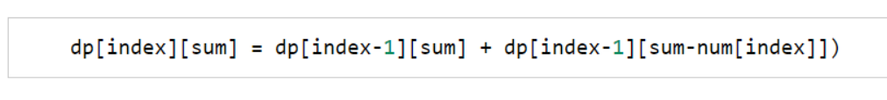

```c++
int countSubset3(const vector<int> &nums, int sum) {
    if (nums.empty()) {
        return 0;
    }

    int n = nums.size();
    vector<vector<int>> dp(n, vector<int>(sum + 1, 0));


    for (int i = 0; i < n; i++) {
        dp[i][0] = 1;
    }

    for (int s = 1; s <= sum; s++) {
        dp[0][s] = (nums[0] == s ? 1 : 0);
    }
    for (int i = 1; i < n; i++) {
        for (int s = 1; s <= sum; s++) {
            //未加入，顺序不能错
            dp[i][s] = dp[i - 1][s];

            //加入
            if (nums[i] <= s) {
                dp[i][s] = dp[i][s] + dp[i - 1][s - nums[i]];
            }
        }
    }
    return dp[n - 1][sum];
}
```

Time Complexity : *O*(*N \* S*) 

Space Complexity : *O*(*N \* S*)

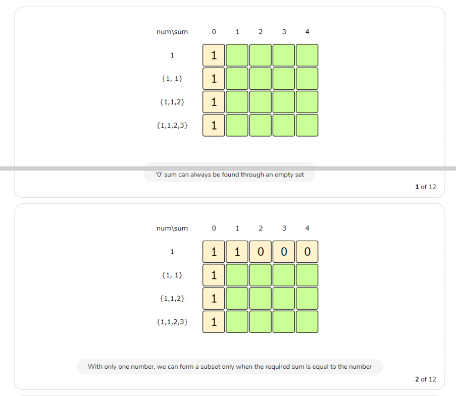

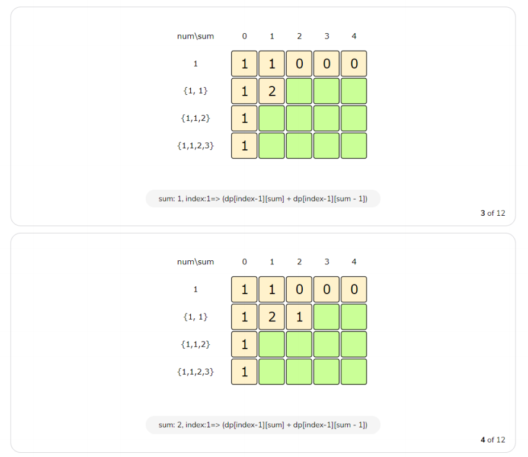

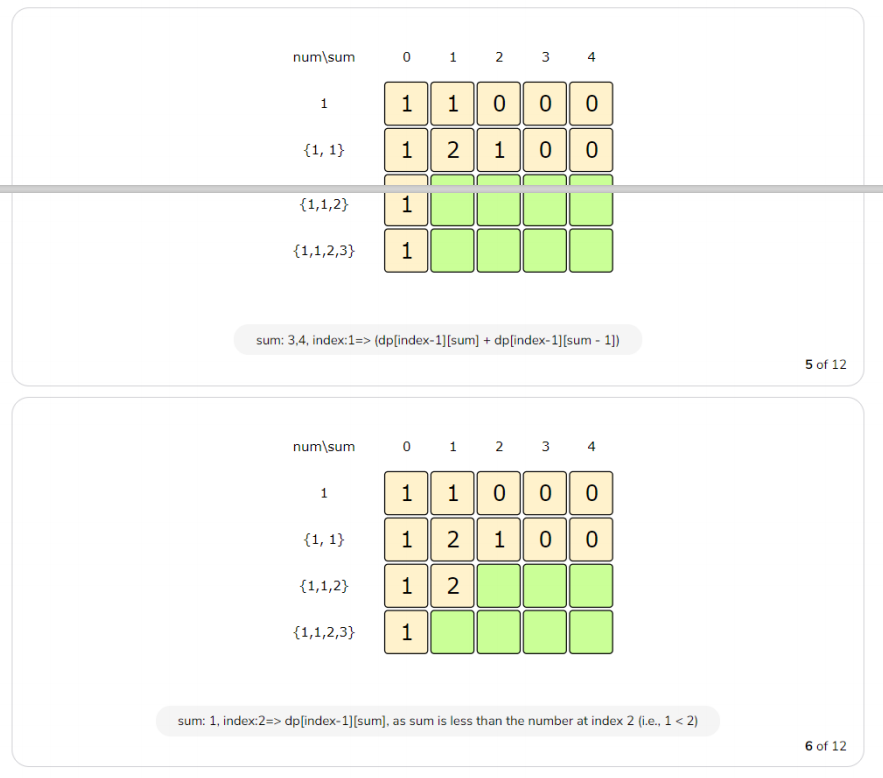

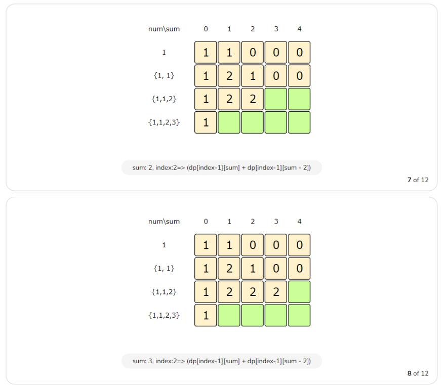

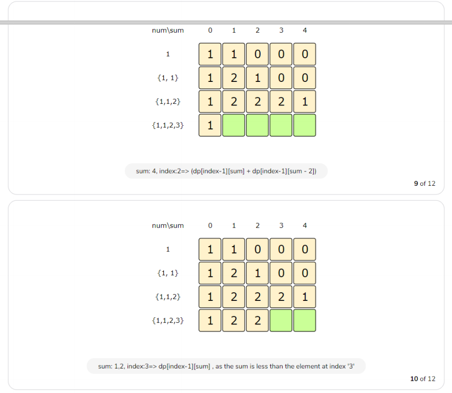

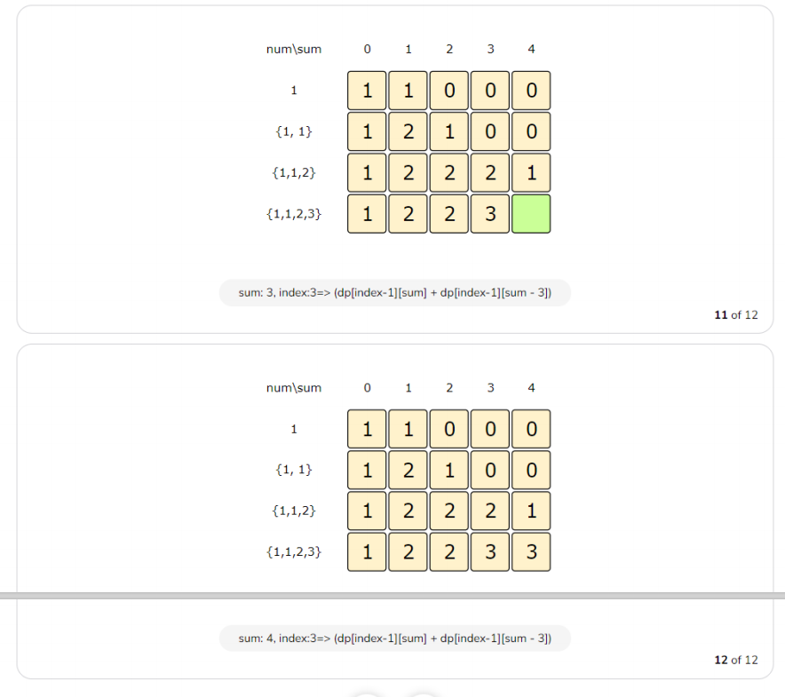

## 6、target sum

> 给定正整数数组和值S，数组每个数前缀"+"或"-"，使得所有数的和为S，求多少种方式

> 即求子数组a1，子数组a2，使得sum(a1) - sum(a2)=S
>
> 且sum(a1) + sum(a2)= S-total
>
> 则：sum(a1)=(S + S-total)/2
>
> 即求子数组，使得其和为(S + S-total)/2

```c++
input:	[1, 2, 2, 3] ,s=1
    
output:	3
   
explanation:+1-1-2+3=1, -1+1-2+3=1, +1+1+2-3=1
```

````c++
input:	[1 ,2 ,7, 1] ,s=9
   
output:	2
    
explanation:+1+2+7-1=9 , -1+2+7+1=2
````

### 自底向上

```c++
int countSubsets(const vector<int> &nums, int sum) {
    int n = nums.size();
    vector<vector<int>> dp(n, vector<int>(sum + 1));
    for (int i = 0; i < n; i++) {
        dp[i][0] = 1;
    }

    for (int s = 1; s <= sum; s++) {
        dp[0][s] = (nums[0] == s ? 1 : 0);
    }

    for (int i = 1; i < n; i++) {
        for (int s = 1; s <= sum; s++) {
            dp[i][s] = dp[i - 1][s];
            if (nums[i] <= s) {
                dp[i][s] = dp[i][s] + dp[i - 1][s - nums[i]];
            }
        }
    }

    return dp[n - 1][sum];
}

int targetSum(const vector<int> &nums, int target) {
    int totalSum = 0;
    for (auto n:nums) {
        totalSum += n;
    }

    if (totalSum < target || (target + totalSum) % 2 == 1) {
        return 0;
    }

    return countSubsets(nums, (target + totalSum) / 2);
    
}
```

Time Complexity : *O*(*N \* S*) 

Space Complexity : *O*(*N \* S*)

