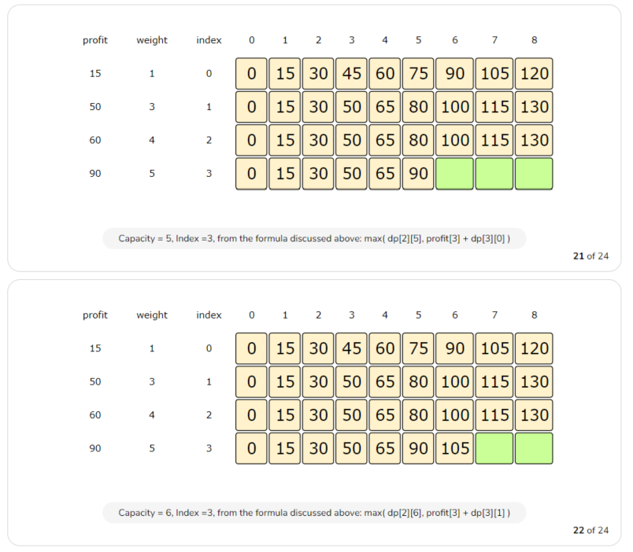
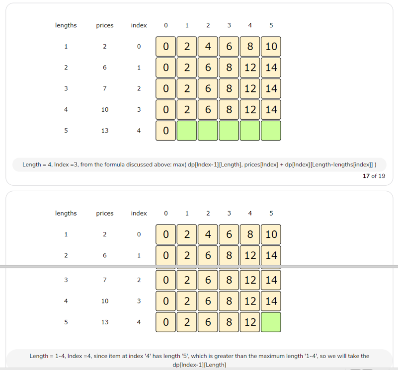
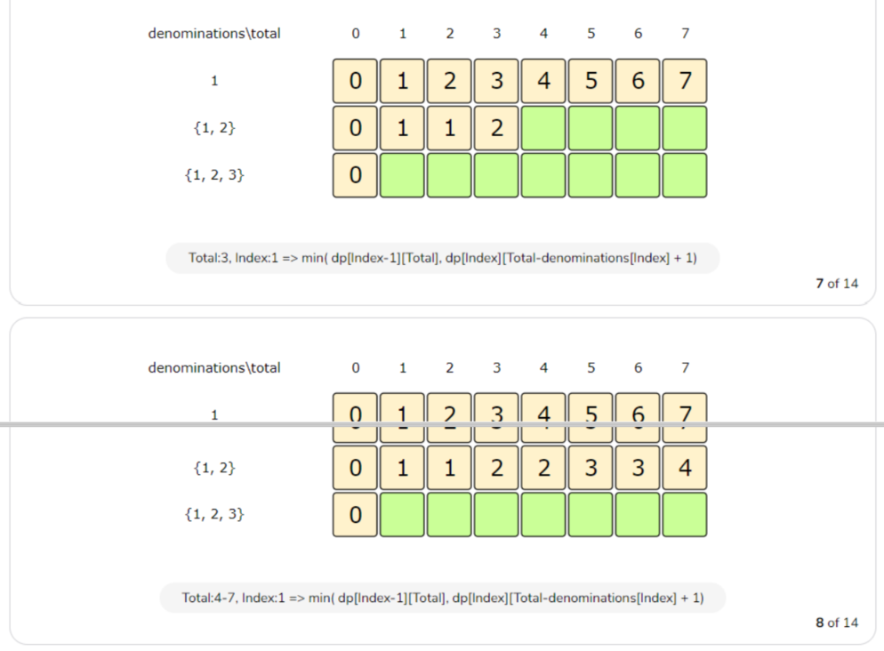

---


# Documentation: https://sourcethemes.com/academic/docs/managing-content/

title: "Dynamic Programming-3 Unbounded Knapsack"
subtitle: ""
summary: "无界限背包"
authors: []
tags: ["Unbounded Knapsack"]
categories: ["Dynamic Programming"]
date: 2020-07-01T16:34:12+08:00
lastmod: 2020-07-01T16:34:12+08:00
featured: false
draft: false
toc: true

# Featured image
# To use, add an image named `featured.jpg/png` to your page's folder.
# Focal points: Smart, Center, TopLeft, Top, TopRight, Left, Right, BottomLeft, Bottom, BottomRight.
image:
  caption: ""
  focal_point: ""
  preview_only: false

# Projects (optional).
#   Associate this post with one or more of your projects.
#   Simply enter your project's folder or file name without extension.
#   E.g. `projects = ["internal-project"]` references `content/project/deep-learning/index.md`.
#   Otherwise, set `projects = []`.
projects: []
---

### 1. unbounded knapsack

> 给定N个物品的价值和重量，一个容量为C的背包。每个物品不限次数且总容量不能超过C，求最大价值

```c++
input:	weights=[1, 2, 3]
    	profits=[15, 20, 50]
    	C=5
    
output:	80
  
explanations:	2*15+50=80
```

```c++
input:	weights=[1, 3, 4, 5]
    	profits=[15, 50, 60, 90]
    	C=8
    
output:	140
  
explanations:	50+90=140
```


#### Brute-force

```c++
int knapsackRecursive(const vector<int> &weight, const vector<int> &profits, int capacity, int currentIndex) {
    if (capacity <= 0 || currentIndex >= weight.size() || weight.size() != profits.size()) {
        return 0;
    }

    int profit1 = 0;
    //选中之后，currentIndex不增加
    if (weight[currentIndex] <= capacity) {
        profit1 = profits[currentIndex] +
                  knapsackRecursive(weight, profits, capacity - weight[currentIndex], currentIndex );
    }

    int profit2 = knapsackRecursive(weight, profits, capacity, currentIndex + 1);

    return max(profit1, profit2);
}

int knapsack(const vector<int> &weight, const vector<int> &profits, int capacity) {
    return knapsackRecursive(weight, profits, capacity, 0);
}
```

Time Complexity : *O*(*2^(N+C)* )

Space Complexity : *O*(*N + C*)

#### Top-down

```c++
int knapsackRecursive2(const vector<int> &weight, const vector<int> &profits, int capacity, vector<vector<int>> &dp,
                      int currentIndex) {
    if (capacity <= 0 || currentIndex >= weight.size()) {
        return 0;
    }

    if (dp[currentIndex][capacity] != -1) {
        return dp[currentIndex][capacity];
    }


    int profit1 = 0;

    if (weight[currentIndex] <= capacity) {
        profit1 = profits[currentIndex] +
                  knapsackRecursive2(weight, profits, capacity - weight[currentIndex], dp, currentIndex );
    }

    int profit2 = knapsackRecursive2(weight, profits, capacity, dp, currentIndex + 1);
    dp[currentIndex][capacity] = max(profit1, profit2);

    return dp[currentIndex][capacity];
}

int knapsack2(const vector<int> &weight, const vector<int> &profits, int capacity) {
    vector<vector<int>> dp(weight.size(), vector<int>(capacity + 1, -1));
    return knapsackRecursive2(weight, profits, capacity, dp, 0);
}
```

Time Complexity : *O*(*N + C*)

Space Complexity : *O*(*N + C*)

#### Bottom-up


```c++
int knapsack3(const vector<int> &weight, const vector<int> &profits, int capacity) {
    if (capacity <= 0 || profits.empty() || profits.size() != weight.size()) {
        return 0;
    }

    int n = profits.size();
    vector<vector<int>> dp(n, vector<int>(capacity + 1));

    for (int i = 0; i < n; i++) {
        dp[i][0] = 0;
    }
    //如果第一个物品小于物品重量，放置,可以重复拿
    for (int j = 0; j <= capacity; j++) {
        if (weight[0] <= j) {
            dp[0][j] = profits[0]+dp[0][j-weight[0]];
        }
    }

    for (int i = 1; i < n; i++) {
        for (int c = 1; c <= capacity; c++) {
            int profit1 = 0, profit2 = 0;

            if (weight[i] <= c) {
                profit1 = profits[i] + dp[i][c - weight[i]];
            }
            profit2 = dp[i - 1][c];

            dp[i][c] = max(profit1, profit2);
        }
    }

    return dp[n - 1][capacity];
}
```

Time Complexity : *O*(*N + C*)

Space Complexity : *O*(*N + C*)





#### selected item

```c++
//有选中的项目，有具体选了几次
void printSelectElements(const vector<int> &weight, const vector<int> &profits, int capacity, vector<vector<int>> &dp) {
    int n = weight.size();
    int totalProfit = dp[n - 1][capacity];
    cout << "--------"<<endl;
    //不能等于0，会越界
    
    //选中，下一次同行
    //未选中，上一行
    int row=n-1;
    while(row>0){
        if (totalProfit != dp[row - 1][capacity]) {

            cout << weight[row] << "  ";
            cout << "index=" << row << " "<<endl;
            capacity -= weight[row];
            totalProfit -= profits[row];
        }else{
            row--;
        }
    }

    //判断第一个元素是否被选中,这个时候跳出来循环，第一个元素不止选了一次
    while(totalProfit != 0) {
        cout << weight[0]<<"  ";
        totalProfit-=profits[0];
        cout << "index=" << 0 << "  "<<endl;
    }
    cout << "--------"<<endl;
}
```


### 2. rod cutting

> 给定长度为N的杆，切成小段，不同长度有不同的价格，求最大收益

> 同上题1

```c++
input:	lengths= [1, 2, 3, 4, 5]
    	prices= [2, 6, 7, 10, 13]
        N=5
    
output:	14
    
explanations:2*(length=2)+1*(length=1)=14
```

#### Bottom-up


```c++
int knapsack(const vector<int> &lengths, const vector<int> &prices, int rodLength) {
    if (rodLength <= 0 || prices.empty() || prices.size() != lengths.size()) {
        return 0;
    }

    int n = prices.size();
    vector<vector<int>> dp(n, vector<int>(rodLength + 1));

    for (int i = 0; i < n; i++) {
        dp[i][0] = 0;
    }
    //如果第一个物品小于物品重量，放置,可以重复拿
    for (int j = 0; j <= rodLength; j++) {
        if (lengths[0] <= j) {
            dp[0][j] = prices[0]+dp[0][j-lengths[0]];
        }
    }

    for (int i = 1; i < n; i++) {
        for (int r = 1; r <= rodLength; r++) {
            int profit1 = 0, profit2 = 0;

            if (lengths[i] <= r) {
                profit1 = prices[i] + dp[i][r - lengths[i]];
            }
            profit2 = dp[i - 1][r];

            dp[i][r] = max(profit1, profit2);
        }
    }

    return dp[n - 1][rodLength];
}
```

Time Complexity : *O*(*N + C*)

Space Complexity : *O*(*N + C*)





#### selected item


### 3. coin change

> 无限量不同面值的零钱和要换的钱N，求有多少种换钱的方式

```c++
input: [1, 2, 3] , amount=5
  
output:	5
    
explanation:{1,1,1,1,1},{1,1,1,2},{1,2,2},{1,1,3},{2,3}
```

#### Brute-force

```c++
int coinChangeRecursive(const vector<int> &nums, int total, int currentIndex) {
    //空集为一种
    if (total == 0) {
        return 1;
    }
    if (currentIndex >= nums.size()) {
        return 0;
    }

    int part1 = 0, part2 = 0;
    if (nums[currentIndex] <= total) {
        part1 = coinChangeRecursive(nums, total - nums[currentIndex], currentIndex);
    }
    part2 = coinChangeRecursive(nums, total, currentIndex + 1);

    return part1 + part2;
}

int coinChange(const vector<int> &nums, int total) {
    if (nums.empty()) {
        return 0;
    }
    return coinChangeRecursive(nums, total, 0);
}
```

Time Complexity : *O*(*2^(N+T)* )

Space Complexity : *O*(*N + T*)

Top-down

```c++
int coinChangeRecursive2(const vector<int> &nums, int total, int currentIndex, vector<vector<int>> dp) {
    if (total == 0) {
        return 1;
    }
    if (currentIndex >= nums.size()) {
        return 0;
    }

    if (dp[currentIndex][total] == -1) {
        int part1 = 0, part2 = 0;
        if (nums[currentIndex] <= total) {
            part1 = coinChangeRecursive2(nums, total - nums[currentIndex], currentIndex, dp);
        }
        part2 = coinChangeRecursive2(nums, total, currentIndex + 1, dp);
        dp[currentIndex][total] = part1 + part2;
    }


    return dp[currentIndex][total];
}

int coinChange2(const vector<int> &nums, int total) {
    if (nums.empty()) {
        return 0;
    }
    int n = nums.size();
    vector<vector<int>> dp(n, vector<int>(total + 1, -1));
    return coinChangeRecursive2(nums, total, 0, dp);
}
```

Time Complexity : *O*(*N \* T*)

Space Complexity : *O*(*N \* T*)

#### Bottom-up


```c++
int coinChange3(const vector<int> &nums, int total) {
    if (nums.empty()) {
        return 0;
    }
    int n = nums.size();
    vector<vector<int>> dp(n, vector<int>(total + 1));

    //第一列，空集算一种
    for (int i = 0; i < n; i++) {
        dp[i][0] = 1;
    }

    //只有nums[0]一个元素,当t整除nums[0]时，一种
    for (int t = 1; t <= total; t++) {
        dp[0][t] = (t % nums[0] == 0 ? 1 : 0);
    }

    for (int i = 1; i < n; i++) {
        for (int t = 1; t <= total; t++) {
            dp[i][t] = dp[i - 1][t];
            if (nums[i] <= t) {
                dp[i][t] = dp[i][t] + dp[i][t - nums[i]];
            }
        }
    }

    return dp[n - 1][total];
}
```

Time Complexity : *O*(*N \* T*)

Space Complexity : *O*(*N \* T*)


### 4. minimum coin change

> 无限量不同面值的硬币和要换的总钱N，求硬币总数最小值

```c++
input: [1, 2, 3] , amount=5
  
output:	2
    
explanation:{2,3}
```

```c++
input: [1, 2, 3] , amount=11
  
output:	4
    
explanation:{2,3,3,3}
```

#### Brute-force

```c++
int countCoinChangeRecursive(const vector<int> &nums, int total, int currentIndex) {
    if (total == 0) {
        return 0;
    }
    if (currentIndex >= nums.size()) {
        return -1;
    }

    int count1 = INT_MAX;
    if (nums[currentIndex] <= total) {
        if (INT_MAX != countCoinChangeRecursive(nums, total - nums[currentIndex], currentIndex)) {
            count1 = 1 + countCoinChangeRecursive(nums, total - nums[currentIndex], currentIndex);
        }
    }
    int count2 = countCoinChangeRecursive(nums, total, currentIndex + 1);

    return min(count1, count2);
}

int countCoinChange(const vector<int> &nums, int total) {
    if (nums.empty()) {
        return INT_MAX;
    }
    int result = countCoinChangeRecursive(nums, total, 0);
    return result == INT_MAX ? -1 : result;
}
```

Time Complexity : *O*(*2^(N+T)* )

Space Complexity : *O*(*N + T*)

#### Top-down

```c++
int countCoinChangeRecursive2(const vector<int> &nums, int total, int currentIndex, vector<vector<int>> dp) {
    if (total == 0) {
        return 0;
    }
    if (currentIndex >= nums.size()) {
        return INT_MAX;
    }

    if (dp[currentIndex][total] != INT_MAX) {
        int count1 = INT_MAX;
        if (nums[currentIndex] <= total) {
            if (INT_MAX != countCoinChangeRecursive2(nums, total - nums[currentIndex], currentIndex, dp)) {
                count1 = 1 + countCoinChangeRecursive2(nums, total - nums[currentIndex], currentIndex, dp);
            }
        }
        int count2 = countCoinChangeRecursive2(nums, total, currentIndex + 1, dp);
        dp[currentIndex][total] = min(count1, count2);
    }


    return dp[currentIndex][total];
}

int countCoinChange2(const vector<int> &nums, int total) {
    if (nums.empty()) {
        return -1;
    }

    vector<vector<int>> dp(nums.size(), vector<int>(total + 1, INT_MAX));
    int result = countCoinChangeRecursive(nums, total, 0);
    return result == INT_MAX ? -1 : result;
}
```

Time Complexity : *O*(*N \* T*)

Space Complexity : *O*(*N \* T*)

#### Bottom-up


```c++
int countCoinChange3(const vector<int> &nums, int total) {
    if (nums.empty()) {
        return -1;
    }
    if (total == 0) {
        return 0;
    }
    int n = nums.size();
    vector<vector<int>> dp(n, vector<int>(total + 1));

    for (int i = 0; i < n; i++) {
        dp[i][0] = 0;
    }
    //只有nums[0]时，最小个数为t/nums[0];
    for (int t = 1; t <= total; t++) {
        dp[0][t] = (t % nums[0] == 0 ? t / nums[0] : INT_MAX);
    }

    for (int i = 1; i < n; i++) {
        for (int t = 1; t <= total; t++) {
            dp[i][t] = dp[i - 1][t];
            //选中
            if (nums[i] <= t) {
                if (dp[i][t - nums[i]] != INT_MAX) {
                    dp[i][t] = min(dp[i - 1][t], 1 + dp[i][t - nums[i]]);
                }
            }

        }
    }

    return (dp[n - 1][total] == INT_MAX) ? -1 : dp[n - 1][total];
}
```

Time Complexity : *O*(*N \* T*)

Space Complexity : *O*(*N \* T*)





### 5. maximum ribbon cut

> 相当于：无限量不同面值的硬币和要换的总钱N，求硬币总数最大值

```c++
input:	[2,3,5] ,total=5
    
output:	2
    
explanation: {2,3}
```

```c++
input:	[2,3] ,total=7
    
output:	3
    
explanation: {2,2,3}
```

```c++
input:	[3, 5,7] ,total=13
    
output:	3
    
explanation: {3,3,7}
```

#### Brute-force

```c++
int countCoinChangeRecursive(const vector<int> &nums, int total, int currentIndex) {
    if (total == 0) {
        return 0;
    }
    if (currentIndex >= nums.size()) {
        return INT_MIN;
    }

    int count1 = INT_MIN;
    if (nums[currentIndex] <= total) {
        if (INT_MIN != countCoinChangeRecursive(nums, total - nums[currentIndex], currentIndex)) {
            count1 = 1 + countCoinChangeRecursive(nums, total - nums[currentIndex], currentIndex);
        }
    }
    int count2 = countCoinChangeRecursive(nums, total, currentIndex + 1);

    return max(count1, count2);
}

int countCoinChange(const vector<int> &nums, int total) {
    if (nums.empty()) {
        return -1;
    }

    int result = countCoinChangeRecursive(nums, total, 0);
    return result == INT_MIN ? -1 : result;
}
```

Time Complexity : *O*(*2^(N+T)* )

Space Complexity : *O*(*N + T*)

#### Bottom-up


```c++
int countCoinChange3(const vector<int> &nums, int total) {
    if (nums.empty()) {
        return -1;
    }
    if (total == 0) {
        return 0;
    }
    int n = nums.size();
    vector<vector<int>> dp(n, vector<int>(total + 1));

    for (int i = 0; i < n; i++) {
        dp[i][0] = 0;
    }
    //只有nums[0]时，最小个数为t/nums[0];
    for (int t = 1; t <= total; t++) {
        dp[0][t] = (t % nums[0] == 0 ? t / nums[0] : INT_MIN);
    }

    for (int i = 1; i < n; i++) {
        for (int t = 1; t <= total; t++) {
            dp[i][t] = dp[i - 1][t];
            //选中
            if (nums[i] <= t) {
                if (dp[i][t - nums[i]] != INT_MIN) {
                    dp[i][t] = max(dp[i - 1][t], 1 + dp[i][t - nums[i]]);
                }
            }

        }
    }

    return (dp[n - 1][total] == INT_MIN) ? -1 : dp[n - 1][total];
}
```

Time Complexity : *O*(*N \* T*)

Space Complexity : *O*(*N \* T*)