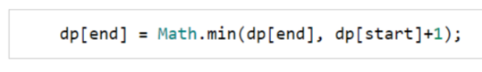

## 1. fibonacci numbers

> 斐波那契数列

### Brute-force

```c++
int fib(int n) {
    if (n < 2) {
        return n;
    }

    return fib(n - 1) + fib(n - 2);
}
```

Time Complexity : *O*(*2^N* )

Space Complexity : *O*(*N*)

### Top-down

```c++

int fibRecursive(vector<int> &memoize, int n) {
    if (n < 2) return n;

    if (memoize[n] == -1) {
        memoize[n] = fibRecursive(memoize, n - 1) + fibRecursive(memoize, n - 2);
        return memoize[n];
    }

    return memoize[n];
}

int fib2(int n) {
    vector<int> memoize(n + 1, -1);
    return fibRecursive(memoize, n );
}
```

Time Complexity : *O*(*N*)

Space Complexity : *O*(*N*)

### Bottom-up

```c++
int fib3(int n) {
    if (n == 0) return 0;
    vector<int> dp(n + 1);
    dp[0] = 0;
    dp[1] = 1;
    for (int i = 2; i <= n; i++) {
        dp[i] = dp[i - 1] + dp[i - 2];
    }

    return dp[n];
}
```

Time Complexity : *O*(*N*)

Space Complexity : *O*(*N*)

## 2. staircase

> n阶台阶，每次只允许走1步、2步或3步，求有多少种方式

```c++
intput:	n=3
    
output:	4
    
explanation:{1,1,1},{1,2},{2,1},{3}
```

```c++
intput:	n=4
    
output:	7
    
explanation:{1,1,1,1},{1,2,1},{2,1,1},{1,1,2},{3,1},{1,3},{2,2}
```

### Brute-force

```c++
int staircase(int n) {
    //可以往后推到n=3,结果：4
    if (n == 0) {
        return 1;
    }
    if (n == 1) {
        return 1;
    }
    if (n == 2) {
        return 2;
    }
    return staircase(n - 1) + staircase(n - 2) + staircase(n - 3);
}
```

Time Complexity : *O*(*3^N* )

Space Complexity : *O*(*N*)

### Top-down

```c++
int staircaseRecursive2(vector<int> &dp, int n) {
    if (n == 0) {
        return 1;
    }
    if (n == 1) {
        return 1;
    }
    if (n == 2) {
        return 2;
    }
    if (dp[n] == -1) {
        dp[n] = staircaseRecursive2(dp, n - 1) + staircaseRecursive2(dp, n - 2) + staircaseRecursive2(dp, n - 3);;
        return dp[n];
    }

    return dp[n];
}

int staircase2(int n) {
    vector<int> dp(n + 1, -1);
    return staircaseRecursive2(dp, n);
}

```

Time Complexity : *O*(*N*)

Space Complexity : *O*(*N*)

### Bottom-up

```c++
int staircase3(int n) {
    vector<int> dp(n + 1);
    dp[0] = 1;
    dp[1] = 1;
    dp[2] = 2;
    for (int i = 3; i <= n; i++) {
        dp[i] = dp[i - 1] + dp[i - 2] + dp[i - 3];
    }

    return dp[n];
}
```

Time Complexity : *O*(*N*)

Space Complexity : *O*(*N*)

## 3. number factor

> 给定n,求有多少方式使得n等于{1,3,4}的和

```c++
intput:	n=4
    
output:	4
    
explanation:{1,1,1,1},{1,3},{4},{3,1}
```

```c++
intput:	n=5
    
output:	6
    
explanation:{1,1,1,1,1},{1,1,3},{4,1},{1,4},{1,3,1},{3,1,1}
```

### Brute-force

```c++
int fib(int n) {
    if (n == 0) {
        return 1;
    }
    if (n == 1) {
        return 1;
    }
    if (n == 2) {
        return 1;
    }
    if (n == 3) {
        return 2;
    }
    return fib(n - 1) + fib(n - 3) + fib(n - 4);
}
```

Time Complexity : *O*(*3^N* )

Space Complexity : *O*(*N*)

### Top-down

```c++

int fibRecursive(vector<int> &dp, int n) {
    if (n == 0) {
        return 1;
    }
    if (n == 1) {
        return 1;
    }
    if (n == 2) {
        return 1;
    }
    if (n == 3) {
        return 2;
    }
    if (dp[n] == -1) {
        dp[n] = fibRecursive(dp, n - 1) + fibRecursive(dp, n - 3) + fibRecursive(dp, n - 4);
        return dp[n];
    }

    return dp[n];
}

int fib2(int n) {
    vector<int> dp(n + 1, -1);
    return fibRecursive(dp, n);
}
```

Time Complexity : *O*(*N*)

Space Complexity : *O*(*N*)

### Bottom-up


```c++
int fib3(int n) {
    vector<int> dp(n + 1);
    dp[0] = 1;
    dp[1] = 1;
    dp[2] = 1;
    dp[3] = 2;
    for (int i = 4; i <= n; i++) {
        dp[i] = dp[i - 1] + dp[i - 3] + dp[i - 4];
    }

    return dp[n];
}
```

Time Complexity : *O*(*N*)

Space Complexity : *O*(*N*)

## 4. minimum jumps to reach the end

> 给定一组整数（>=0）,每个数代表可以往右跳的最大步数，求最小跳几次到达数组最后
>
> 元素为0时，不能跳

```c++
input:	[2, 1, 1, 1, 4]

output:	3
    
explanation:0-index(2) -> 2-index(1) -> 3-index(1) -> 4-index
```

```c++
input:	[ 1,1, 3, 6, 9, 3, 0, 1, 3]

output:	4
    
explanation:0-index(1) -> 1-index(1) -> 2-index(1) -> 3-index(6)->8-index
```

### Brute-force

```c++
int countMinJumpsRecursive(const vector<int> &jumps, int currentIndex) {
    if (currentIndex == jumps.size() - 1) {
        return 0;
    }

    if (jumps[currentIndex] == 0) {
        return INT_MAX;
    }

    int totalJumps = INT_MAX;
    int start = currentIndex + 1;
    int end = currentIndex + jumps[currentIndex];

    while (start < jumps.size() && start <= end) {
        int minJumps = countMinJumpsRecursive(jumps, start);
        start++;
        if (minJumps != INT_MAX) {
            totalJumps = min(totalJumps, minJumps + 1);
        }
    }
    return totalJumps;
}

int countJumps(const vector<int> &jumps) {
    return countMinJumpsRecursive(jumps, 0);
}
```

Time Complexity : *O*(*2^N* )

Space Complexity : *O*(*N*)

### Top-down

```c++
int countMinJumpsRecursive2(const vector<int> &jumps, int currentIndex, vector<int> &dp) {
    if (currentIndex == jumps.size() - 1) {
        return 0;
    }

    if (jumps[currentIndex] == 0) {
        return INT_MAX;
    }

    if (dp[currentIndex] == INT_MAX) {
        int totalJumps = INT_MAX;
        int start = currentIndex + 1;
        int end = currentIndex + jumps[currentIndex];

        while (start < jumps.size() && start <= end) {
            int minJumps = countMinJumpsRecursive2(jumps, start, dp);
            start++;
            if (minJumps != INT_MAX) {
                totalJumps = min(totalJumps, minJumps + 1);
            }
        }
        dp[currentIndex] = totalJumps;
    }

    return dp[currentIndex];
}

int countJumps2(const vector<int> &jumps) {
    vector<int> dp(jumps.size(), INT_MAX);
    return countMinJumpsRecursive2(jumps, 0, dp);
}
```

Time Complexity : *O*(*N^2*)

Space Complexity : *O*(*N*)

### Bottom-up



```c++
//dp[currenIndex]代表以当前位置为起点到达终点的最小跳
int countJumps3(const vector<int> &jumps) {
    vector<int> dp(jumps.size());

    //除了jumps[0]都为INT_MAX
    for (int i = 1; i < jumps.size(); i++) {
        dp[i] = INT_MAX;
    }

    for (int start = 0; start < jumps.size() - 1; start++) {
        for (int end = start + 1; end <= start + jumps[start] && end < jumps.size(); end++) {
            //dp[start]到达 其能达到 的范围内的跳数  等于dp[start]+1
            //比较这俩值
            dp[end] = min(dp[end], dp[start] + 1);
        }
    }

    return dp[jumps.size() - 1];
}
```

Time Complexity : *O*(*N^2*)

Space Complexity : *O*(*N*)