### 1. longest common substring

> 求最长公共子串的长度

```c++
input:	s1="abdca", s2="cbda"
    
ouput:	2
   
explanation: "bd"
```

```c++
input:	s1="passport", s2="ppsspt"
    
ouput:	3
   
explanation: "ssp"
```

#### brute-force

```c++
int LCSRecursive(string &s1, string &s2, int s1CurrentIndex, int s2CurrentIndex, int count) {
    if (s1CurrentIndex >= s1.length() || s2CurrentIndex >= s2.length()) {
        return count;
    }

    if (s1[s1CurrentIndex] == s2[s2CurrentIndex]) {
        count =  LCSRecursive(s1, s2, s1CurrentIndex + 1, s2CurrentIndex + 1, count+1);
    }
    //count清零
    int c1 = LCSRecursive(s1, s2, s1CurrentIndex + 1, s2CurrentIndex, 0);
    int c2 = LCSRecursive(s1, s2, s1CurrentIndex, s2CurrentIndex + 1, 0);

    return max(count, max(c1, c2));
}


int LCS(string s1, string s2) {

    return LCSRecursive(s1, s2, 0, 0, 0);
}
```

Time Complexity : *O*(*3^(M+N)* )

Space Complexity : *O*(*N+M*)

```c++
int LCS2(string s1, string s2) {

    int len1 = s1.length();
    int len2 = s2.length();
    int maxlen = 0;
    for (int i = 0; i < len1; i++) {
        for (int j = 0; j < len2; j++) {
            int len = 0;
            while (i + len < len1 && j + len < len2 && s1[i + len] == s2[j + len]) {
                len++;//暴力匹配
            }
            if (len > maxlen) {
                maxlen = len;
            }
        }
    }
    return maxlen;
}
```

#### bottom-up

```c++
int LCSLength(string s1, string s2) {

    int len1 = s1.length();
    int len2 = s2.length();
    int maxLength = 0;

    //使用 d[i][j] 表示以 X[0,i-1]长度为i 与Y[0,j-1] 长度为j 最长公共子串的长度
    vector<vector<int>> dp(len1 + 1, vector<int>(len2 + 1));
    for (int i = 0; i <= len1; i++) {
       //可不要
        dp[0][i] = 0;
        dp[i][0] = 0;
    }
    for (int i = 1; i <= len1; i++) {
        for (int j = 1; j <= len2; j++) {
            if (s1[i - 1] == s2[j - 1]) {
                dp[i][j] = 1 + dp[i - 1][j - 1];
                maxLength = max(maxLength, dp[i][j]);
            }
        }
    }
    return maxLength;
}
```

Time Complexity : *O*(*M \* N*)

Space Complexity : *O*(*N \* M*)

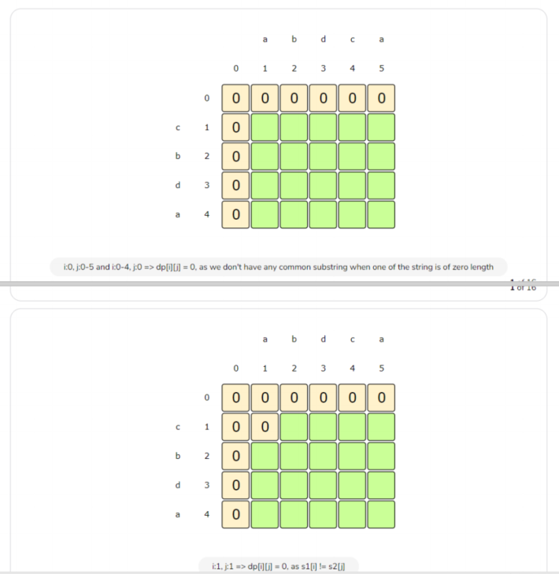

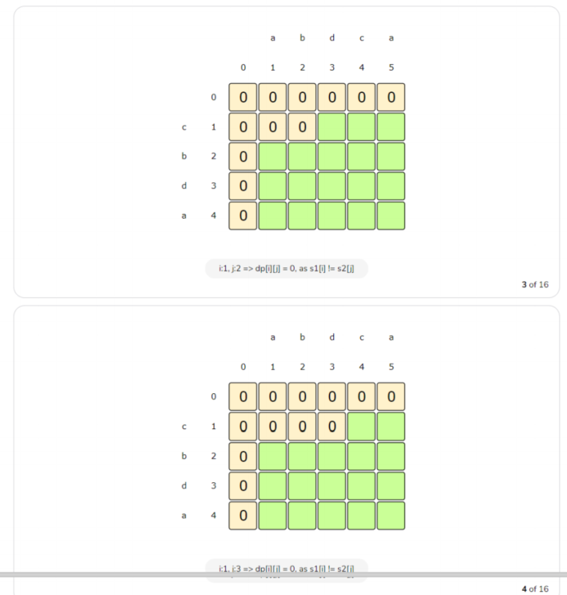

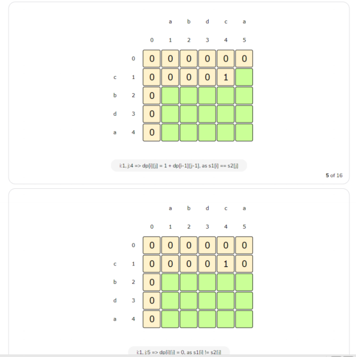

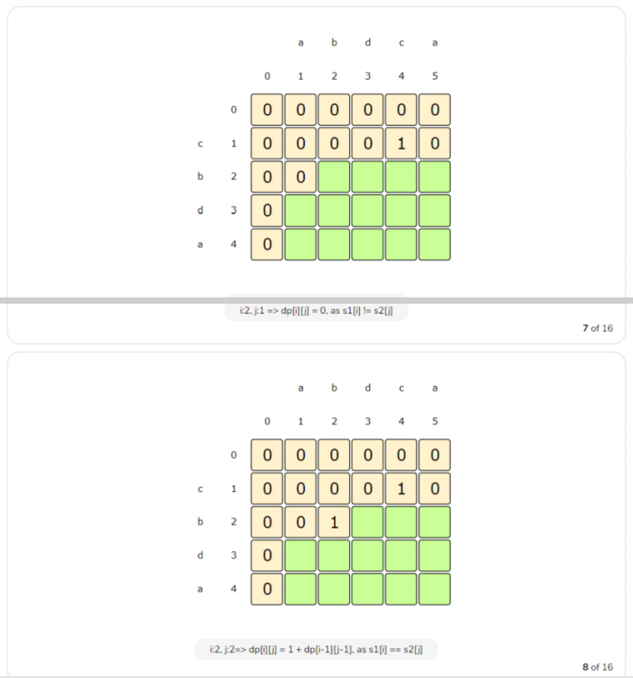

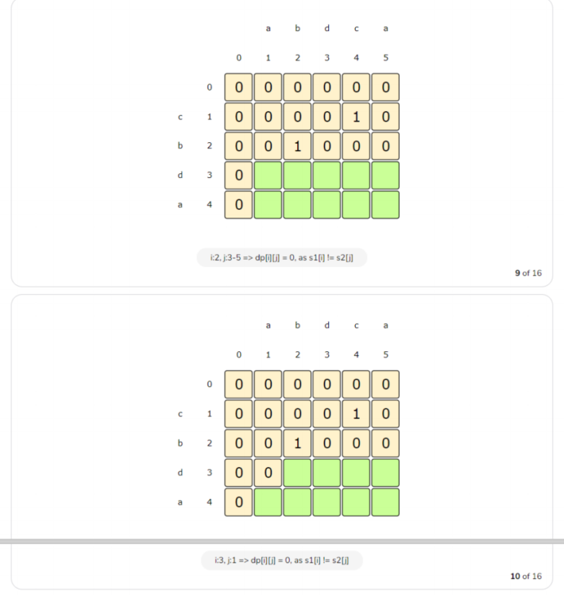

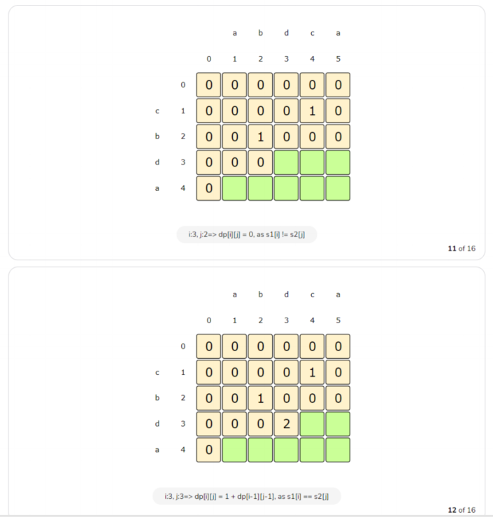

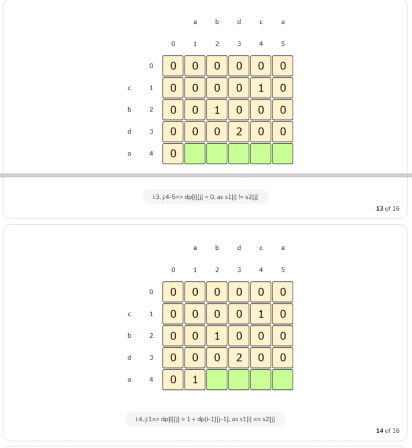

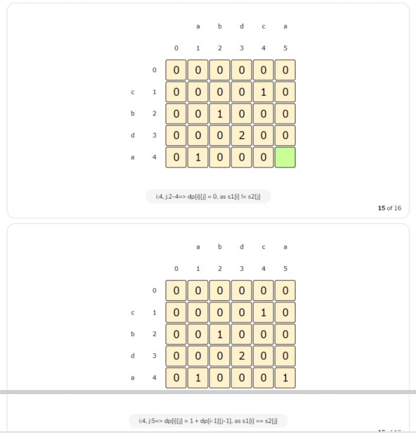

### 2. longest common subsequence

> 求最长公共子序列

```c++
input:	s1="abdca", s2="cbda"
    
ouput:	3
   
explanation: "bda"
```

```c++
input:	s1="passport", s2="ppsspt"
    
ouput:	3
   
explanation: "ssp"
```

#### brute-force

```c++
int LCSRecursive(string &s1, string &s2, int s1CurrentIndex, int s2CurrentIndex) {
    if (s1CurrentIndex >= s1.length() || s2CurrentIndex >= s2.length()) {
        return 0;
    }

    if (s1[s1CurrentIndex] == s2[s2CurrentIndex]) {
        return 1 + LCSRecursive(s1, s2, s1CurrentIndex + 1, s2CurrentIndex + 1);
    }
    //count清零
    int c1 = LCSRecursive(s1, s2, s1CurrentIndex + 1, s2CurrentIndex);
    int c2 = LCSRecursive(s1, s2, s1CurrentIndex, s2CurrentIndex + 1);

    return max(c1, c2);
}

```

Time Complexity : *O*(*2^(M+N)* )

Space Complexity : *O*(*N+M*)

#### top-down

```c++
int LCS(string s1, string s2) {

    return LCSRecursive(s1, s2, 0, 0);
}

int LCSRecursive2(string &s1, string &s2, int s1CurrentIndex, int s2CurrentIndex, vector<vector<int>> &dp) {
    if (s1CurrentIndex >= s1.length() || s2CurrentIndex >= s2.length()) {
        return 0;
    }

    if (dp[s1CurrentIndex][s2CurrentIndex] == -1) {
        if (s1[s1CurrentIndex] == s2[s2CurrentIndex]) {
            dp[s1CurrentIndex][s2CurrentIndex] = 1 + LCSRecursive2(s1, s2, s1CurrentIndex + 1, s2CurrentIndex + 1, dp);
        } else {
            int c1 = LCSRecursive2(s1, s2, s1CurrentIndex + 1, s2CurrentIndex, dp);
            int c2 = LCSRecursive2(s1, s2, s1CurrentIndex, s2CurrentIndex + 1, dp);

            dp[s1CurrentIndex][s2CurrentIndex] = max(c1, c2);
        }
    }
    return dp[s1CurrentIndex][s2CurrentIndex];
}

int LCS2(string s1, string s2) {
    vector<vector<int>> dp(s1.length(), vector<int>(s2.length(), -1));
    return LCSRecursive2(s1, s2, 0, 0, dp);
}

```

Time Complexity : *O*(*M \* N*)

Space Complexity : *O*(*N \* M*)

#### bottom-up

```c++
int LCS3(string s1, string s2) {
    int len1 = s1.length();
    int len2 = s2.length();
    int maxLength = 0;

    //使用 d[i][j] 表示以 X[0,i-1]长度为i 与Y[0,j-1] 长度为j 最长公共子序列的长度
    vector<vector<int>> dp(len1 + 1, vector<int>(len2 + 1));
    for (int i = 0; i <= len1; i++) {
        //可不要
        dp[0][i] = 0;
        dp[i][0] = 0;
    }
    for (int i = 1; i <= len1; i++) {
        for (int j = 1; j <= len2; j++) {
            if (s1[i - 1] == s2[j - 1]) {
                dp[i][j] = 1 + dp[i - 1][j - 1];
            } else {
                dp[i][j] = max(dp[i - 1][j], dp[i][j - 1]);
            }
            maxLength = max(maxLength, dp[i][j]);
        }
    }
    return maxLength;
}
```

Time Complexity : *O*(*M \* N*)

Space Complexity : *O*(*N \* M*)

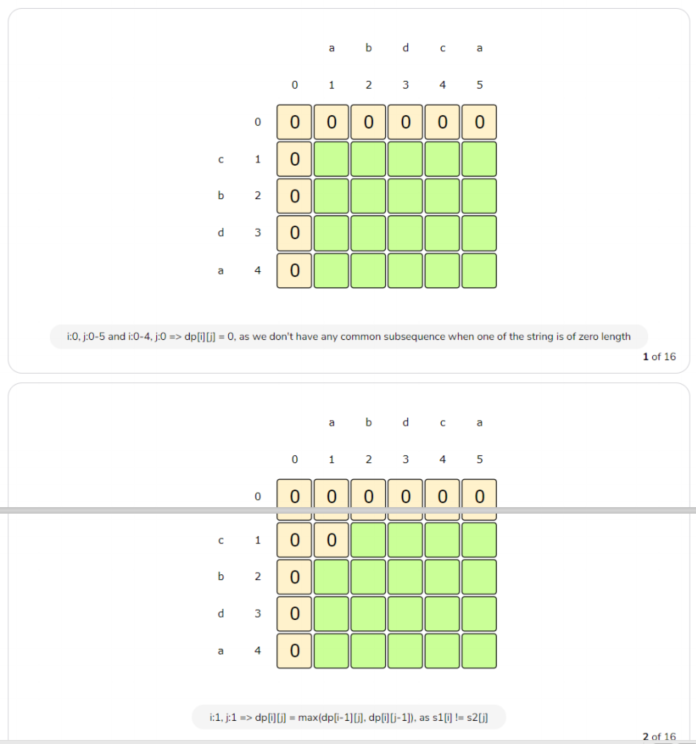

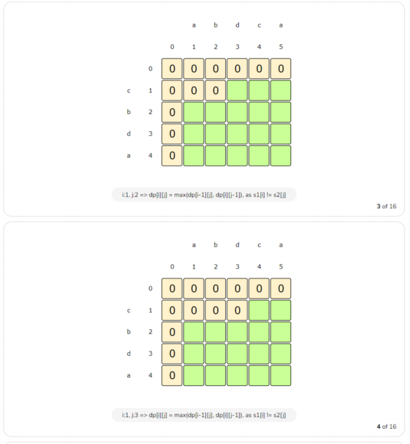

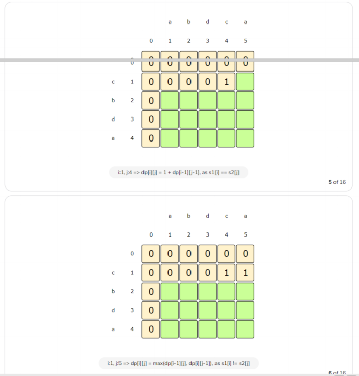

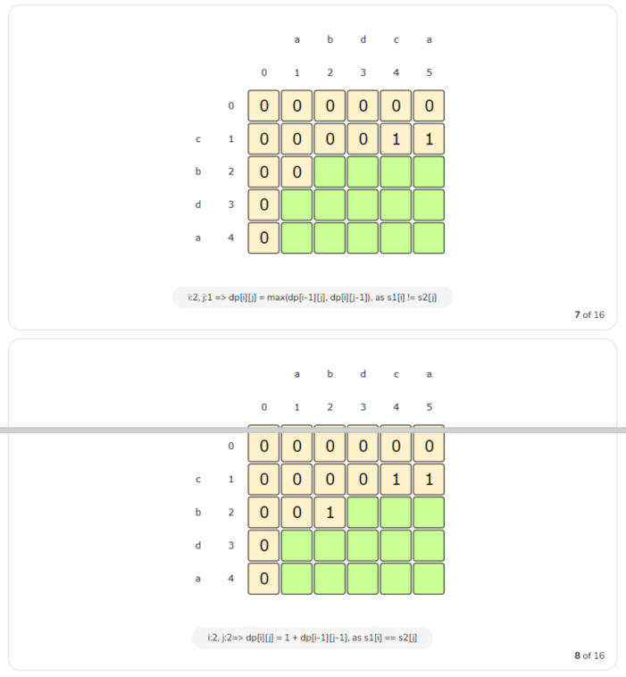

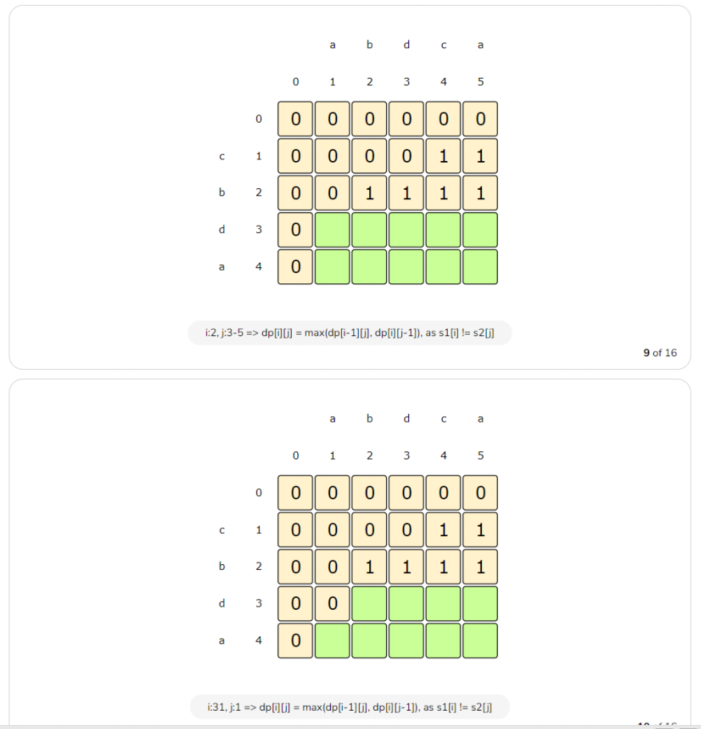

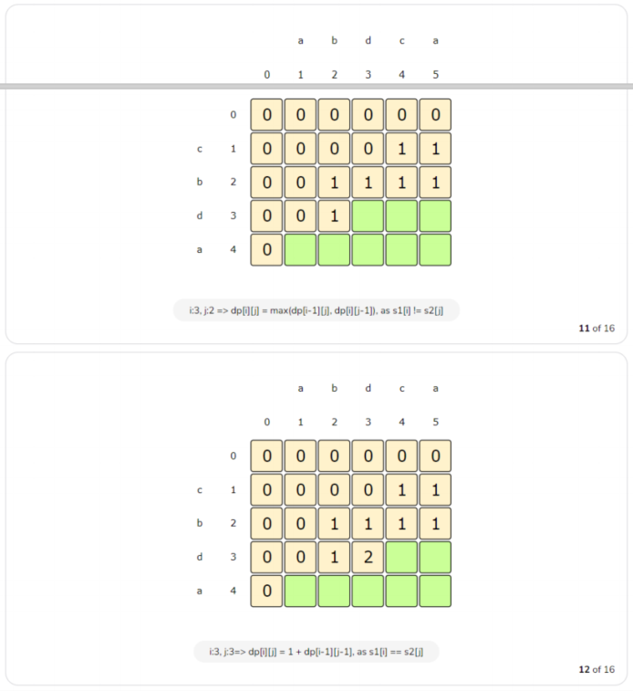

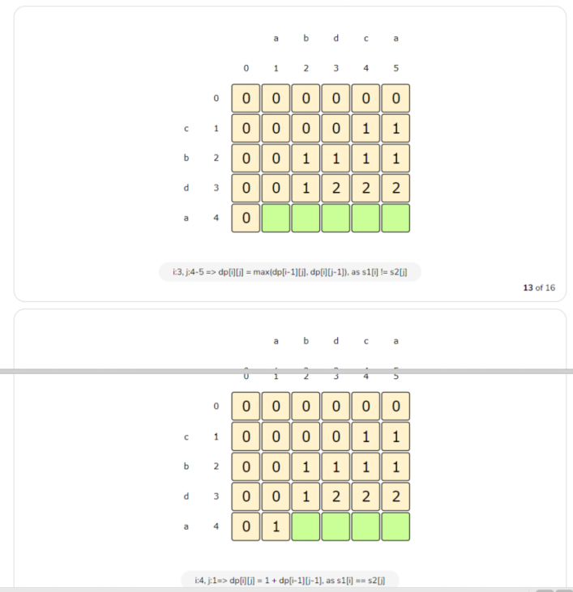

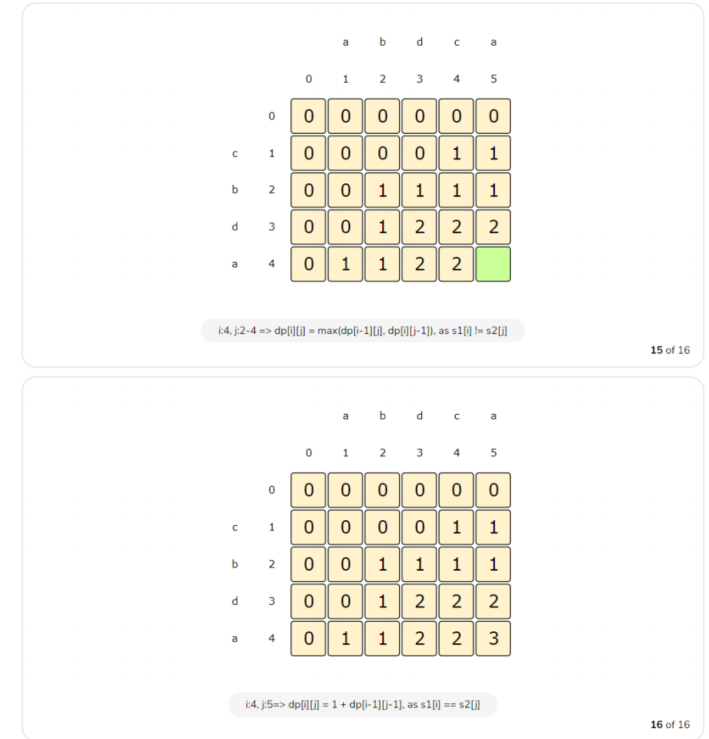

###  3. minimum deletions or insertions to transform a string into another

> 给定字符串S1,S2,通过删除插入字符使得S1变成S2，求最小的删除插入数

```c++
input:	s1="abc",s2="fbc"
    
output:	1 deletions ,1 insertions
   
explanation: s1:delete(a),insert(f) ->s2
```

```c++
input:	s1="abdca",s2="cbda"
    
output:	2 deletions ,1 insertions
   
explanation: s1:delete(a,c),insert(c) ->s2
```

#### bottom-up

```c++
int LCS3(string s1, string s2) {
    int len1 = s1.length();
    int len2 = s2.length();
    int maxLength = 0;

    //使用 d[i][j] 表示以 X[0,i-1]长度为i 与Y[0,j-1] 长度为j 最长公共子序列的长度
    vector<vector<int>> dp(len1 + 1, vector<int>(len2 + 1));
    for (int i = 0; i <= len1; i++) {
        //可不要
        dp[0][i] = 0;
        dp[i][0] = 0;
    }
    for (int i = 1; i <= len1; i++) {
        for (int j = 1; j <= len2; j++) {
            if (s1[i - 1] == s2[j - 1]) {
                dp[i][j] = 1 + dp[i - 1][j - 1];
            } else {
                dp[i][j] = max(dp[i - 1][j], dp[i][j - 1]);
            }
            maxLength = max(maxLength, dp[i][j]);
        }
    }
    return maxLength;
}

pair<int, int> minDeleteInsert(string s1, string s2) {
    int len1 = s1.length();
    int len2 = s2.length();
    int c = LCS3(s1, s2);
    return make_pair(len1 - c, len2 - c);
}
```

Time Complexity : *O*(*M \* N*)

Space Complexity : *O*(*N \* M*)

### 4. longest increasing subsequence

> 求最长递增子序列的长度

```c++
input:	[4, 2, 3, 6, 10, 1, 12]

output:	5
    
explanation:[2, 3, 6, 10, 12]
```

```c++
input:	[-4, 10, 3, 7, 15]

output:	4
    
explanation:[-4, 3, 7, 15]
```

#### brute-force

```c++
int LISLengthRecursive(vector<int> &nums, int currentIndex, int previousIndex) {
    if (currentIndex >= nums.size()) {
        return 0;
    }
    int c1 = 0;

    //大于先前元素，包含在内
    if (previousIndex == -1 || nums[currentIndex] > nums[previousIndex]) {
        c1 = 1 + LISLengthRecursive(nums, currentIndex + 1, currentIndex);
    }

    //不包含
    int c2 = LISLengthRecursive(nums, currentIndex + 1, previousIndex);

    return max(c1, c2);
}

int LIS(vector<int> nums) {
    return LISLengthRecursive(nums, 0, -1);
}
```

Time Complexity : *O*(*2^N* )

Space Complexity : *O*(*N*)

#### top-down

```c++
int LISLengthRecursive2(vector<int> &nums, int currentIndex, int previousIndex, vector<vector<int>> &dp) {
    if (currentIndex >= nums.size()) {
        return 0;
    }
    //previousIndex的取值范围为[-1,n-1]转变为[0,n]
    if (dp[currentIndex][previousIndex + 1] == -1) {
        int c1 = 0;

        //大于先前元素，包含在内
        if (previousIndex == -1 || nums[currentIndex] > nums[previousIndex]) {
            c1 = 1 + LISLengthRecursive2(nums, currentIndex + 1, currentIndex, dp);
        }
        //不包含
        int c2 = LISLengthRecursive2(nums, currentIndex + 1, previousIndex, dp);

        dp[currentIndex][previousIndex + 1] = max(c1, c2);
    }
    return dp[currentIndex][previousIndex + 1];
}

int LIS2(vector<int> nums) {
    vector<vector<int>> dp(nums.size(), vector<int>(nums.size() + 1, -1));
    return LISLengthRecursive2(nums, 0, -1, dp);
}
```

Time Complexity : *O*(*N^2* )

Space Complexity : *O*(*N^2*)

#### bottom-up

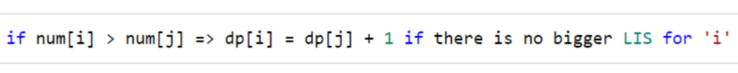

```c++
int LIS3(vector<int> nums) {
    vector<int> dp(nums.size());
    dp[0] = 1;
    int maxLength = 1;
    for (int i = 0; i < nums.size(); i++) {
        dp[i] = 1;
        for (int j = 0; j < i; j++) {
            if (nums[i] > nums[j] && dp[i] <= dp[j]) {
                dp[i] = dp[j] + 1;
                maxLength = max(maxLength, dp[i]);
            }
        }
    }
    return maxLength;
}
```

Time Complexity : *O*(*N^2* )

Space Complexity : *O*(*N*)

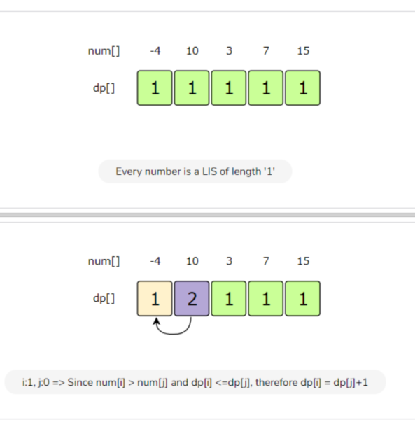

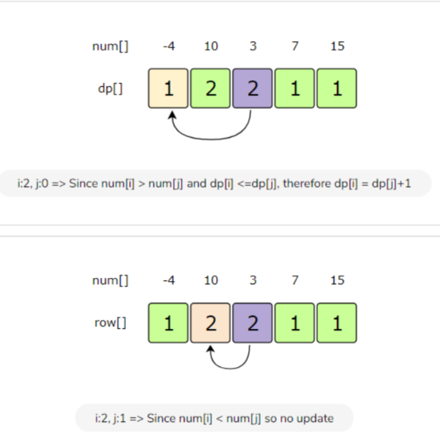

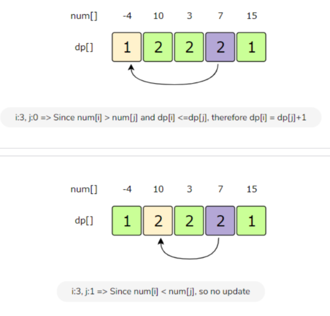

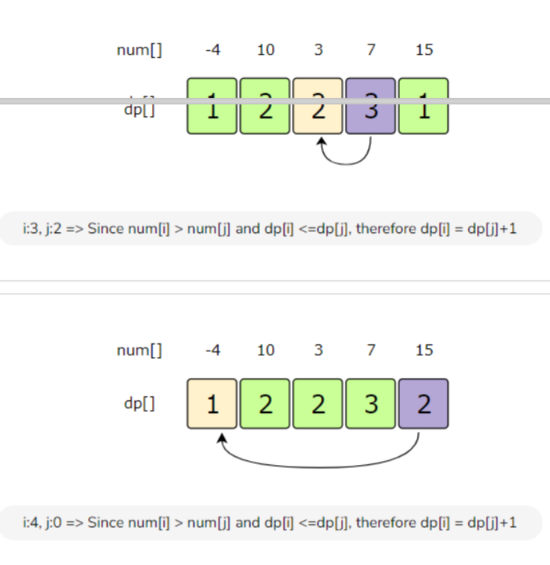

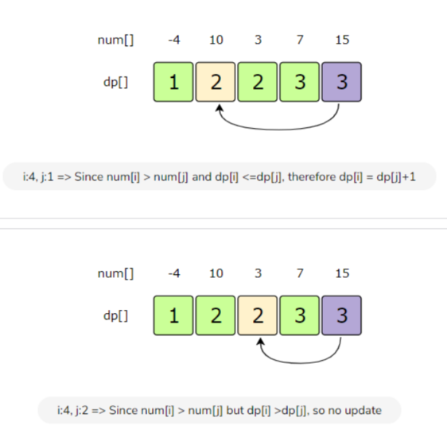

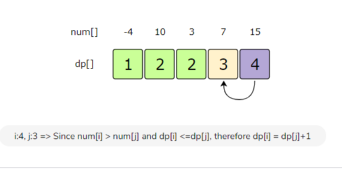

### 5. max sum increasing subsequence

> 求 和最大的递增子序列
>
> 不同于题4

```c++
input:	[4, 1, 2, 6, 10, 1, 12]

output:	32
    
explanation:sum[4, 6, 10, 12]=32
    LIS：sum[1,2,6,10,12]=31,两者和不同
```

```c++
input:	[-4, 10, 3, 7, 15]

output:	25
    
explanation:sum[10, 15]=sum[3,7,5]=25
```

#### brute-force

```c++
int maxSumISRecursive(const vector<int> &nums, int currentIndex, int previousIndex, int sum) {
    if (currentIndex >= nums.size()) {
        return sum;
    }
    int s1 = sum;

    if (previousIndex == -1 || nums[currentIndex] > nums[previousIndex]) {
        s1 = maxSumISRecursive(nums, currentIndex + 1, currentIndex, sum + nums[currentIndex]);
    }

    int s2 = maxSumISRecursive(nums, currentIndex + 1, previousIndex, sum);

    return max(s1, s2);
}

int maxSumIS(const vector<int> &nums) {
    return maxSumISRecursive(nums, 0, -1, 0);
}

```

Time Complexity : *O*(*2^N* )

Space Complexity : *O*(*N*)

#### top-down

> 三维表或哈希表

#### bottom-up

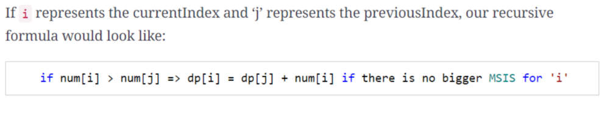

```c++

int maxSumIS2(const vector<int> &nums) {
    vector<int> dp(nums.size());
    dp[0] = nums[0];

    int maxSum = nums[0];
    for (int i = 0; i < nums.size(); i++) {
        dp[i] = nums[i];
        for (int j = 0; j < i; j++) {
            if (nums[i] > nums[j] && dp[i] < nums[j] + dp[j]) {
                dp[i] = dp[j] + nums[i];
                maxSum = max(maxSum, dp[i]);
            }
        }
    }
    return maxSum;
}
```

Time Complexity : *O*(*N^2* )

Space Complexity : *O*(*N*)

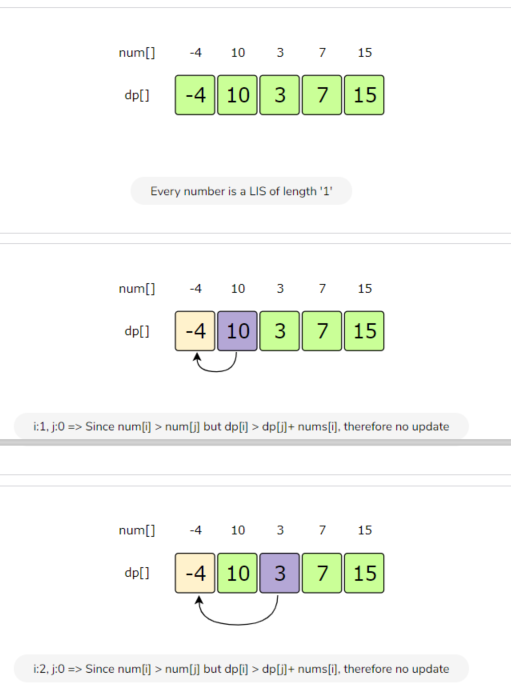

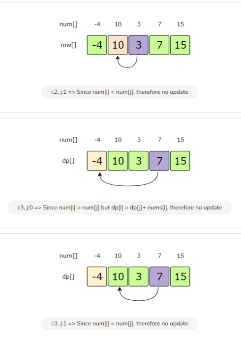

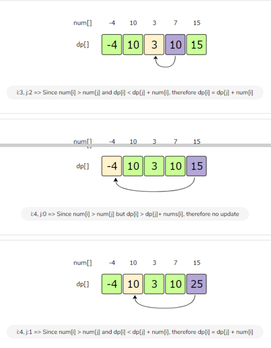

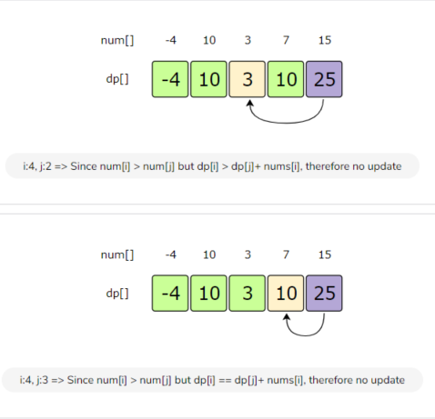

### 6. shortest common super-sequence

> 给定字符串S1,S2,求最短的公共超级序列的长度，使得S1和S2都是其子序列

```c++
input:	s1="abcf" ,s2="bdcf"
    
output:	5
    
explanation: "abdcf"
```

```c++
input:	s1="dynamic", s2="programming"
    
output: 15
    
explanation: "dynprogramming"
```

#### brute-force

```c++
int SCSLengthRecursive(const string &s1, const string &s2, int s1CurrentIndex, int s2CurrentIndex) {
    if (s1CurrentIndex >= s1.length()) {
        return s2.length() - s2CurrentIndex;
    }
    if (s2CurrentIndex >= s2.length()) {
        return s1.length() - s1CurrentIndex;
    }

    if (s1[s1CurrentIndex] == s2[s2CurrentIndex]) {
        return 1 + SCSLengthRecursive(s1, s2, s1CurrentIndex + 1, s2CurrentIndex + 1);

    }
    int length1 = 1 + SCSLengthRecursive(s1, s2, s1CurrentIndex + 1, s2CurrentIndex);
    int length2 = 1 + SCSLengthRecursive(s1, s2, s1CurrentIndex, s2CurrentIndex + 1);

    return min(length1, length2);
}

int SCSLength(const string &s1, const string &s2) {
    return SCSLengthRecursive(s1, s2, 0, 0);
}
```

Time Complexity : *O*(*2^(M+N)* )

Space Complexity : *O*(*N+M*)

#### top-down

```c++
int SCSLengthRecursive2(const string &s1, const string &s2, int s1CurrentIndex, int s2CurrentIndex,
                        vector<vector<int>> &dp) {
    if (s1CurrentIndex >= s1.length()) {
        return s2.length() - s2CurrentIndex;
    }
    if (s2CurrentIndex >= s2.length()) {
        return s1.length() - s1CurrentIndex;
    }

    if (dp[s1CurrentIndex][s2CurrentIndex] == -1) {
        if (s1[s1CurrentIndex] == s2[s2CurrentIndex]) {
            dp[s1CurrentIndex][s2CurrentIndex] = 1 + SCSLengthRecursive(s1, s2, s1CurrentIndex + 1, s2CurrentIndex + 1);

        }
        int length1 = 1 + SCSLengthRecursive(s1, s2, s1CurrentIndex + 1, s2CurrentIndex);
        int length2 = 1 + SCSLengthRecursive(s1, s2, s1CurrentIndex, s2CurrentIndex + 1);

        dp[s1CurrentIndex][s2CurrentIndex] = min(length1, length2);
    }
    return dp[s1CurrentIndex][s2CurrentIndex];
}

int SCSLength2(const string &s1, const string &s2) {
    vector<vector<int>> dp(s1.length(), vector<int>(s2.length(), -1));
    return SCSLengthRecursive2(s1, s2, 0, 0, dp);
}

```

Time Complexity : *O*(*M \* N*)

Space Complexity : *O*(*N \* M*)

#### bottom-up

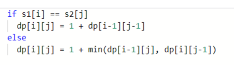

```c++
int SCSLength3(const string &s1, const string &s2) {
    //长度
    vector<vector<int>> dp(s1.length() + 1, vector<int>(s2.length() + 1));

    for (int i = 0; i <= s1.length(); i++) {
        dp[i][0] = i;
    }

    for (int j = 1; j <= s2.length(); j++) {
        dp[0][j] = j;
    }

    for (int i = 1; i <= s1.length(); i++) {
        for (int j = 1; j <= s2.length(); j++) {
            //长度为i，索引为i-1
            if (s1[i - 1] == s2[j - 1]) {
                dp[i][j] = 1 + dp[i - 1][j - 1];
            } else {
                dp[i][j] = min(1 + dp[i - 1][j], 1 + dp[i][j - 1]);
            }
        }
    }
    return dp[s1.length()][s2.length()];

}
```

Time Complexity : *O*(*M \* N*)

Space Complexity : *O*(*N \* M*)

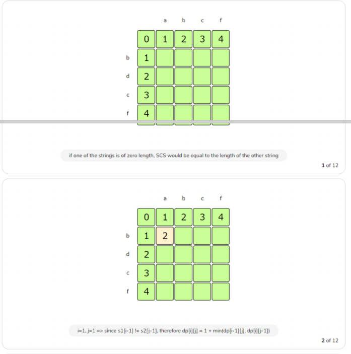

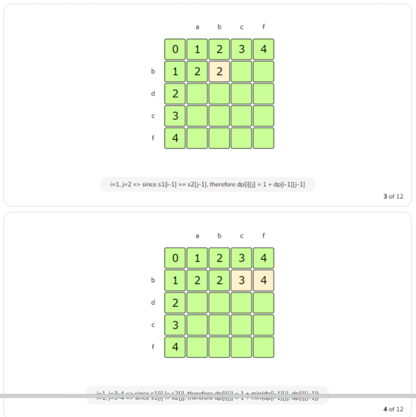

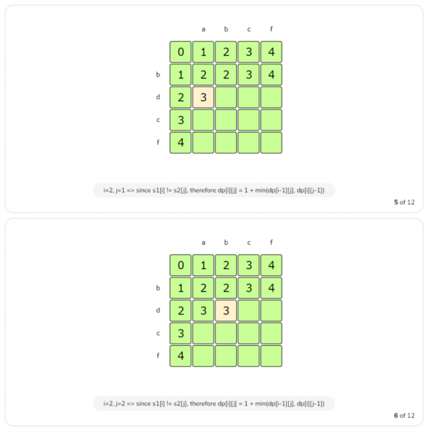

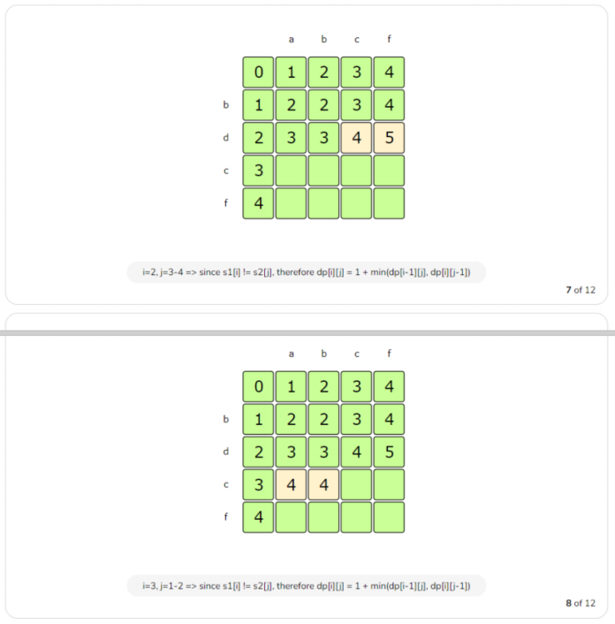

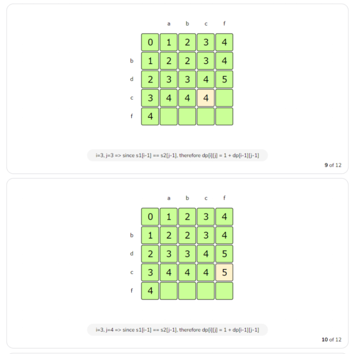

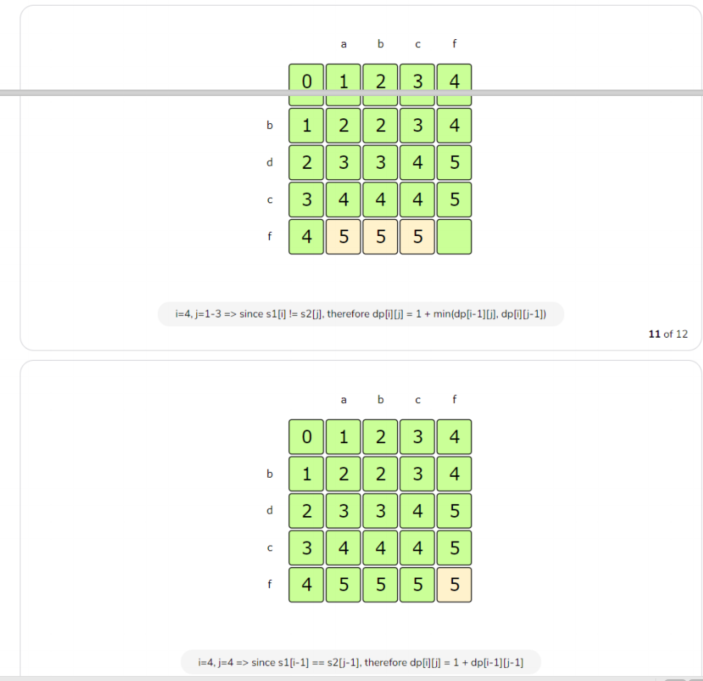

### 7. minimum deletions to make a sequence sorted

> 给定数字序列，删除一些数，使得剩下的增序，求最小的删除数
>
> 同题4

```c++
input:	[4, 2, 3, 6, 10, 1, 12]

output: 2
    
explanation: delete [4,1]
```

```c++
input:	[-4, 10, 3, 7, 15]

output: 1
    
explanation: delete [10]
```

```c++
input:	[3, 2, 1, 0]

output: 3
    
explanation: 只剩下一个即可
```

#### brute-force

```c++
int LIS(vector<int> nums) {
    vector<int> dp(nums.size());
    dp[0] = 1;
    int maxLength = 1;
    for (int i = 0; i < nums.size(); i++) {
        dp[i] = 1;
        for (int j = 0; j < i; j++) {
            if (nums[i] > nums[j] && dp[i] <= dp[j]) {
                dp[i] = dp[j] + 1;
                maxLength = max(maxLength, dp[i]);
            }
        }
    }
    return maxLength;
}

int minDelete(vector<int> &nums){
    return nums.size() - LIS(nums);
}
```

Time Complexity : *O*(*N^2* )

Space Complexity : *O*(*N*)

### 8. longest repeating subsequence

> 求最长重复子序列，此子序列出现超过两次，索引位置不重复

```c++
input:	"tomorrow"

output:	2
    
explanation: or,or
```

```c++
input:	"aabdbcec"
    
output:	3
 
explanation: abc, abc
```

```c++
input: "fmff"
    
output: 2
    
explanation: ff,ff,索引不重复
```

#### brute-force

```C++
int LRSRecursive(const string &s, int i1, int i2) {
    if (i1 >= s.length() || i2 >= s.length()) {
        return 0;
    }
    if (i1 != i2 && s[i1] == s[i2]) {
        return 1 + LRSRecursive(s, i1 + 1, i2 + 1);
    }

    int c1 = LRSRecursive(s, i1 + 1, i2);
    int c2 = LRSRecursive(s, i1, i2 + 1);

    return max(c1, c2);
}

int LRSLength(const string &s) {
    return LRSRecursive(s, 0, 0);
}
```

Time Complexity : *O*(*2^N* )

Space Complexity : *O*(*N*)

#### top-down

```c++
int LRSRecursive2(const string &s, int i1, int i2, vector<vector<int>> &dp) {
    if (i1 >= s.length() || i2 >= s.length()) {
        return 0;
    }
    if (dp[i1][i2] == -1) {
        if (i1 != i2 && s[i1] == s[i2]) {
            dp[i1][i2] = 1 + LRSRecursive2(s, i1 + 1, i2 + 1, dp);
        } else {
            int c1 = LRSRecursive2(s, i1 + 1, i2, dp);
            int c2 = LRSRecursive2(s, i1, i2 + 1, dp);
            dp[i1][i2] = max(c1, c2);
        }
    }

    return dp[i1][i2];

}

int LRSLength2(const string &s) {
    vector<vector<int>> dp(s.length(), vector<int>(s.length(), -1));
    return LRSRecursive2(s, 0, 0, dp);
}
```

Time Complexity : *O*(*N^2* )

Space Complexity : *O*(*N^2*)

#### bottom-up

```c++
int LRSLength3(const string &s) {
    vector<vector<int>> dp(s.length() + 1, vector<int>(s.length() + 1));

    for (int i = 0; i <= s.length(); i++) {
        dp[i][0] = 0;
        dp[0][i] = 0;
    }
    int maxLen = 0;
    for (int i1 = 1; i1 <= s.length(); i1++) {
        for (int i2 = 1; i2 <= s.length(); i2++) {
            //长度为i，索引为i-1
            if (i1 != i2 && s[i1 - 1] == s[i2 - 1]) {
                dp[i1][i2] = 1 + dp[i1 - 1][i2 - 1];
            } else {
                dp[i1][i2] = max(dp[i1 - 1][i2], dp[i1][i2 - 1]);
            }
            //没必要maxlen，就是右下角
            maxLen = max(maxLen, dp[i1][i2]);
        }
    }
    //return  dp[i1][i2] 
    return maxLen;
}
```

Time Complexity : *O*(*N^2* )

Space Complexity : *O*(*N^2*)

### 9. subsequence pattern matching

> 给定字符串S1，模式串S2，求S1中出现S2(作为序列)的次数

```c++
input:	s="baxmx" p="ax"
    
output:	2
    
explanation: bAXmx, bAxmX
```

````c++
input: s="tomorrow" ,p="tor"
    
output:4
    
explanation: TOmoRrow ,TomORrow,TOmorRow ,TomOrRow,
````

#### brute-force

```c++
int countPatternMatchRecursive(const string &s, const string &p, int sCurrentIndex, int pCurrentIndex) {
    //模式串比完
    if (pCurrentIndex >= p.length()) {
        return 1;
    }

    if (sCurrentIndex >= s.length()) {
        return 0;
    }

    int c1 = 0;
    if (s[sCurrentIndex] == p[pCurrentIndex]) {
        c1 = countPatternMatchRecursive(s, p, sCurrentIndex + 1, pCurrentIndex + 1);
    }
    //只有s索引增加
    int c2 = countPatternMatchRecursive(s, p, sCurrentIndex + 1, pCurrentIndex);

    return c1 + c2;
}

int patternMatch(const string &s, const string &p) {
    return countPatternMatchRecursive(s, p, 0, 0);
}
```

Time Complexity : *O*(*2^N* ) ,N为S的长度

Space Complexity : *O*(*N*)

#### top-down

```c++

int countPatternMatchRecursive2(const string &s, const string &p, int sCurrentIndex, int pCurrentIndex,
                                vector<vector<int>> &dp) {
    //模式串比完
    if (pCurrentIndex >= p.length()) {
        return 1;
    }

    if (sCurrentIndex >= s.length()) {
        return 0;
    }


    if (dp[sCurrentIndex][pCurrentIndex] == -1) {
        int c1 = 0;
        if (s[sCurrentIndex] == p[pCurrentIndex]) {
            c1 = countPatternMatchRecursive2(s, p, sCurrentIndex + 1, pCurrentIndex + 1, dp);
        }
        //只有s索引增加
        int c2 = countPatternMatchRecursive2(s, p, sCurrentIndex + 1, pCurrentIndex, dp);

        dp[sCurrentIndex][pCurrentIndex] = c1 + c2;
    }
    return dp[sCurrentIndex][pCurrentIndex];
}

int patternMatch2(const string &s, const string &p) {
    vector<vector<int> > dp(s.length(), vector<int>(p.length(), -1));
    return countPatternMatchRecursive2(s, p, 0, 0, dp);
}
```

#### bottom-up

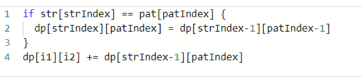

```c++
int patternMatch3(const string &s, const string &p) {
    vector<vector<int> > dp(s.length() + 1, vector<int>(p.length() + 1));

    //模式串为0，有一个
    for (int i = 0; i <= s.length(); i++) {
        dp[i][0] = 1;
    }
    //第一行为0

    for (int i = 1; i <= s.length(); i++) {
        for (int j = 1; j <= p.length(); j++) {

            if (s[i - 1] == p[j - 1]) {
                dp[i][j] = dp[i - 1][j - 1] + dp[i - 1][j];
            } else {
                dp[i][j] = dp[i - 1][j];
            }
        }
    }
    return dp[s.length()][p.length()];
}
```

Time Complexity : *O*(*M \* N*)

Space Complexity : *O*(*N \* M*)

### 10. longest bitonic subsequence

> 求最长的双调子序列的长度
>
> 双调：先单调递增，再单调递减

```c++
input: [4, 2, 3, 6, 10, 1, 12]

output:	5
    
explanation: [2, 3, 6, 10, 1]
```

```c++
input: [4, 2, 5, 9, 7, 6, 10, 3, 1]

output:	7
    
explanation: [4, 5, 9, 7, 6, 3, 1]
```

#### brute-force

```c++
//从currentIndex到end最长递减序列
int LISLengthRecursive(const vector<int> &nums, int currentIndex, int previousIndex) {
    if (currentIndex >= nums.size()) {
        return 0;
    }
    int c1 = 0;

    //大于先前元素，包含在内
    if (previousIndex == -1 || nums[currentIndex] < nums[previousIndex]) {
        c1 = 1 + LISLengthRecursive(nums, currentIndex + 1, currentIndex);
    }

    //不包含
    int c2 = LISLengthRecursive(nums, currentIndex + 1, previousIndex);

    return max(c1, c2);
}

//从currentIndex到start最长递减序列
int LISLengthRecursiveReverse(const vector<int> &nums, int currentIndex, int previousIndex) {
    if (currentIndex < 0) {
        return 0;
    }
    int c1 = 0;

    //大于先前元素，包含在内
    if (previousIndex == -1 || nums[currentIndex] < nums[previousIndex]) {
        c1 = 1 + LISLengthRecursiveReverse(nums, currentIndex - 1, currentIndex);
    }

    //不包含
    int c2 = LISLengthRecursiveReverse(nums, currentIndex - 1, previousIndex);

    return max(c1, c2);
}

int LBSLength(const vector<int> &nums) {
    int maxLen = 0;

    for (int i = 0; i < nums.size(); i++) {
        int length1 = LISLengthRecursive(nums, i, -1);
        int length2 = LISLengthRecursiveReverse(nums, i, -1);
        maxLen = max(maxLen, length1 + length2 - 1);
    }

    return maxLen;
}
```

Time Complexity : *O*(*2^N* )

Space Complexity : *O*(*N*)

#### bottom-up

```c++
有误，待看
```

Time Complexity : *O*(*N^2* )

Space Complexity : *O*(*N*)

### 11. longest alternating subsequence

> 求最长交替子序列的长度
>
> 模式：a> b <c  ,a< b >c

```c++
input:	[1, 2 ,3 , 4]

output: 2
    
explanation: [1,2] [3,4],[1,3],[1,4]
```

```c++
input: [3, 2, 1, 4]

output: 3
    
explanation: [3, 2, 4] [2,1,4]
```

```c++
input: [1, 3, 2, 4]

output: 4
    
explanation: [1, 3, 2, 4]
```

#### 待看

### 12. edit distance

> 给定字符串S1,S2,通过删除,插入,替换字符使得S1变成S2，求最小的操作数

```c++
input: s1="bat",s2="but"
    
output: 1
    
explanation : replace a->u
```

```c++
input: s1="abdca",s2="cbda"
    
output: 2
    
explanation : replace a->c,delete second c
```

```c++
input: s1="passpot",s2="ppsspqrt"
    
output: 3
    
explanation : replace a->p,o->q,insert r
```

#### brute-force

```c++
int minOperationRecursive(const string &s1, const string &s2, int s1CurrentIndex, int s2CurrentIndex) {
    if (s1CurrentIndex >= s1.length()) {
        return s2.length() - s2CurrentIndex;
    }
    if (s2CurrentIndex >= s2.length()) {
        return s1.length() - s1CurrentIndex;
    }

    if (s1[s1CurrentIndex] == s2[s2CurrentIndex]) {
        return minOperationRecursive(s1, s2, s1CurrentIndex + 1, s2CurrentIndex + 1);

    }

    //分别为删除，插入，取代
    int length1 = 1 + minOperationRecursive(s1, s2, s1CurrentIndex + 1, s2CurrentIndex);
    int length2 = 1 + minOperationRecursive(s1, s2, s1CurrentIndex, s2CurrentIndex + 1);
    int length3 = 1 + minOperationRecursive(s1, s2, s1CurrentIndex + 1, s2CurrentIndex + 1);
    return min(length1, min(length2, length3));
}

int minOperation(const string &s1, const string &s2) {
    return minOperationRecursive(s1, s2, 0, 0);
}
```

Time Complexity : *O*(*3^(N+M)* )

Space Complexity : *O*(*N+M*)

#### top-down

```c++

int minOperationRecursive2(const string &s1, const string &s2, int s1CurrentIndex, int s2CurrentIndex,
                           vector<vector<int>> dp) {
    if (s1CurrentIndex >= s1.length()) {
        return s2.length() - s2CurrentIndex;
    }
    if (s2CurrentIndex >= s2.length()) {
        return s1.length() - s1CurrentIndex;
    }

    if (dp[s1CurrentIndex][s2CurrentIndex] == -1) {
        if (s1[s1CurrentIndex] == s2[s2CurrentIndex]) {
            dp[s1CurrentIndex][s2CurrentIndex] = minOperationRecursive(s1, s2, s1CurrentIndex + 1, s2CurrentIndex + 1);

        } else {
            int length1 = 1 + minOperationRecursive(s1, s2, s1CurrentIndex + 1, s2CurrentIndex);
            int length2 = 1 + minOperationRecursive(s1, s2, s1CurrentIndex, s2CurrentIndex + 1);
            int length3 = 1 + minOperationRecursive(s1, s2, s1CurrentIndex + 1, s2CurrentIndex + 1);
            dp[s1CurrentIndex][s2CurrentIndex] = min(length1, min(length2, length3));
        }

    }
    return dp[s1CurrentIndex][s2CurrentIndex];
}

int minOperation(const string &s1, const string &s2) {
    vector<vector<int>> dp(s1.length(), vector<int>(s2.length(), -1));
    return minOperationRecursive2(s1, s2, 0, 0, dp);
}
```

Time Complexity : *O*(*N \* M* )

Space Complexity : *O*(*N \* M* )

#### bottom-up

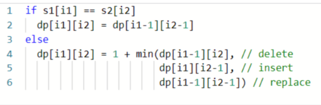

```c++
int minOperation(const string &s1, const string &s2) {
    //长度
    vector<vector<int>> dp(s1.length() + 1, vector<int>(s2.length() + 1));

    for (int i = 0; i <= s1.length(); i++) {
        dp[i][0] = i;
    }

    for (int j = 1; j <= s2.length(); j++) {
        dp[0][j] = j;
    }

    for (int i = 1; i <= s1.length(); i++) {
        for (int j = 1; j <= s2.length(); j++) {
            //长度为i，索引为i-1
            if (s1[i - 1] == s2[j - 1]) {
                dp[i][j] = dp[i - 1][j - 1];
            } else {
                dp[i][j] = min(1 + dp[i - 1][j], min(1 + dp[i][j - 1], 1 + dp[i - 1][j - 1]));
            }
        }
    }
    return dp[s1.length()][s2.length()];

}
```

Time Complexity : *O*(*N \* M* )

Space Complexity : *O*(*N \* M* )

### 13. strings interleaving

#### 待看待看