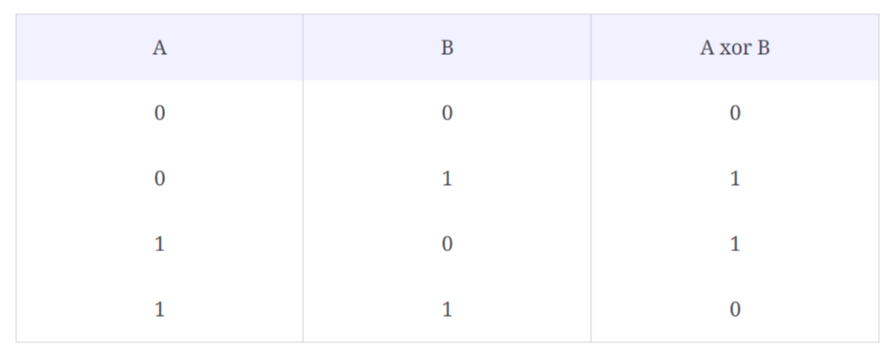

## 1、introduction

异或操作



```c++
异或性质：
    
1、自身异或为0：
    1 ^ 1 = 0, 29 ^ 29 = 0
 
2、与0异或为自身：
    1 ^ 0 = 1, 29 ^ 0 = 29  
    
3、交换律和结合律：
    (a ^ b) ^ c = a ^ (b ^ c)
    
    a ^ b = b ^ a
```


## 2、missing number and single number

>给定数组（元素为n-1个），范围（1-n），求缺失的数

code:

```c++
int findMissingNumber(const vector<int> &arr) {
    int n = arr.size() + 1;
    int s1 = 1;
    for (int i = 2; i <= n; i++) {
        s1 ^= i;
    }

    int s2 = arr[0];
    for (int j = 1; j < n - 1; j++) {
        s2 ^= arr[j];
    }

    return s1 ^ s2;
}
```

Time Complexity : *O*(*N*)

Space Complexity : *O*(1)

相似问题：

> 非空数组，只有1个元素出现1次，其余出现2次，求出现一次的那个数

```c++
input: [1, 4, 2, 1, 3, 2, 3]

output: 4
```

```c++
input: [7, 9, 7]

output: 9
```

code:

```c++
int singleNumber(const vector<int> &arr) {
    int result = arr[0];
    //int result1=0; for循环：i=0
    for (int i = 1; i < arr.size(); i++) {
        result ^= arr[i];
    }
    return result;
}
```

Time Complexity : *O*(*N*)

Space Complexity : *O*(1)

## 3、two single number

> 非空数组，有2个元素出现1次，其余出现2次，求出现1次的那2个数

```c++
input: [1, 4, 2, 1, 3, 5, 6, 2,3, 5]

output: [4, 6]
```

```c++
input: [2, 1, 3, 2]

output: [1, 3]
```

code:

```c++
vector<int> twoSingleNumber(const vector<int> &nums) {
    int n1xn2 = 0;
    for (auto num: nums) {
        n1xn2 ^= num;
    }

    int rightMostSetBit = 1;
    while ((rightMostSetBit & n1xn2) == 0) {
        rightMostSetBit = rightMostSetBit << 1;
    }

    int num1 = 0, num2 = 0;
    for (int num: nums) {
        if ((num & rightMostSetBit) != 0) {
            num1 ^= num;
        } else {
            num2 ^= num;
        }
    }
    return vector<int>{num1, num2};
}
```

Time Complexity : *O*(*N*)

Space Complexity : *O*(1)

## 4、complement of base 10 number

> 10进制的正整数，转换为二进制，按位取反后，转化为10进制

```c++
input: 8

output: 7
    
explanations: 8 -> 1000 -> 0111 -> 7
```

```c++
input: 10

output: 5
    
explanations: 10 -> 1010 -> 0101 -> 5
```

code:

```c++
int bitwiseComplement(int num) {
    int bitCount = 0;
    int n = num;
    while (n > 0) {
        bitCount++;
        n = n >> 1;
    }

    int all_bits_set = pow(2, bitCount) - 1;
    return num ^ all_bits_set;
}
```

Time Complexity : *O*(*b*)，b:整数二进制的位数

Space Complexity : *O*(1)

## 5、flip matrix

> 没看懂