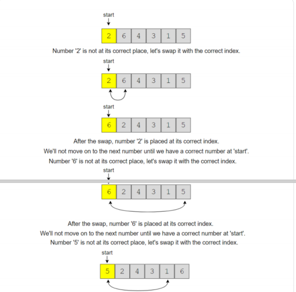
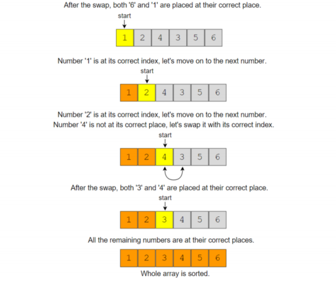

## 1、introduction

> 常用来解决数组元素的值在**一定范围**内的问题

## 2、cyclic sort

> 给定长度为n，所有元素的值在[1,n]内，不重复。原地排序

```c++
input:	[3, 1, 5, 4, 2]

output:	[1, 2, 3, 4, 5]
```

```c++
input:	[2, 6, 4, 3, 1, 5]

output:	[1, 2, 3, 4, 5, 6]
```

code:

```c++
void mySwap(vector<int> &arr,int i,int j){
    int temp=arr[i];
    arr[i]=arr[j];
    arr[j]=temp;
}
void sort(vector<int> &nums) {
    int i = 0;
    //如果nums[i]不在正确位置上，将交换到正确位置上
    while (i < nums.size()) {
        //j代表num[i]的正确索引位置
        int j = nums[i] - 1;
        if (nums[i] != nums[j]) {
            mySwap(nums,j,i);
            //swap(nums[j], nums[i]);
        } else {
            i++;
        }
    }
}
```





Time Complexity :	*O*(N) 

Space Complexity :	*O*(1)

## 3、find the Missing number

> 给定长度为n的数组，元素值的范围在[0,n], 不重复，求未包含在其中的数字

```c++
input:	[4, 0, 3, 1]

output:	2
```

```c++
input:	[8, 3, 5, 2, 4, 6, 0, 1]

output:	7
```

code:

```c++
void mySwap(vector<int> &arr, int i, int j) {
    int temp = arr[i];
    arr[i] = arr[j];
    arr[j] = temp;
}

int findMissingNumber(vector<int> &nums) {
    int i = 0;
    while (i < nums.size()) {
        //把nums[i]放到到索引为nums[i]的位置上，
        //如 nums[6] -> index=nums[6]
        // 忽略n
        if (nums[i] < nums.size() && nums[i] != nums[nums[i]]) {
            //交换索引位置上的值
            //也就是swap(nums[i], nums[nums[i]]);
            mySwap(nums, i, nums[i]);
        } else {
            i++;
        }
    }

    for (int i = 0; i < nums.size(); i++) {
        if (nums[i] != i) {
            return i;
        }
    }
    return nums.size();
}
```

Time Complexity :	*O*(N) 

Space Complexity :	*O*(1)

## 4、find all missing numbers

> 给定长度为n的数组，元素值的范围在[1,n], 有重复，求所有未包含在其中的数字

```c++
input:	[2, 3, 1, 8, 2, 3, 5, 1]

output:	[4, 6, 7]
```

```c++
input:	[2, 4, 1, 2]

output:	[3]
```


```c++
void mySwap(vector<int> &arr, int i, int j) {
    int temp = arr[i];
    arr[i] = arr[j];
    arr[j] = temp;
}

vector<int> findMissingNumbers(vector<int> &nums) {
    int i = 0;
    vector<int> missingNumbers;

    while (i < nums.size()) {
        //nums[i] - 1 代表num[i]的正确索引位置
        if (nums[i] != nums[nums[i] - 1]) {
            mySwap(nums, i, nums[i] - 1);
            //swap(nums[i],nums[nums[i] - 1]);
        } else {
            i++;
        }
    }

    for (int i = 0; i < nums.size(); i++) {
        if (nums[i] != i + 1) {
            missingNumbers.push_back(i + 1);
        }
    }
    return missingNumbers;
}
```

Time Complexity :	*O*(N) 

Space Complexity :	*O*(1)

## 5、find the duplicate number

> 给定长度为n+1的数组，元素值的范围在[1,n], 只有一个元素有重复，可多次重复，求重复的数字

```c++
input:	[1, 4, 4, 3, 2]

output:	4
```

```c++
input:	[2, 4, 4, 1, 4]

output:	4
```

code:

```c++
void mySwap(vector<int> &arr, int i, int j) {
    int temp = arr[i];
    arr[i] = arr[j];
    arr[j] = temp;
}

int findNUmber(vector<int> &nums) {
    int i = 0;

    while (i < nums.size()) {
        if (nums[i] != i + 1) {
            if (nums[i] != nums[nums[i] - 1]) {
                mySwap(nums, i, nums[i] - 1);
                //swap(nums[i],nums[nums[i] - 1]);
            } else {
                //在交换了一次重复值后，再次碰到，一定是重复的元素
                return nums[i];
            }
        } else {
            i++;
        }
    }
    return -1;
}
```

Time Complexity :	*O*(N) 

Space Complexity :	*O*(1)

相似问题：

> 上述问题，不能改变数组，且要求*O*(1)空间

> 用快慢指针

code：

```c++
int findStart(const vector<int> &arr, int cycleLenghth) {
    int pointer1 = arr[0];
    int pointer2 = arr[0];
    while (cycleLenghth > 0) {
        pointer2 = arr[pointer2];
        cycleLenghth--;
    }

    while (pointer1 != pointer2) {
        pointer1 = arr[pointer1];
        pointer2 = arr[pointer2];
    }
    return pointer1;
}


int findDuplicate(const vector<int> &arr) {
    int fast = 0;
    int slow = 0;
    do {
        slow = arr[slow];
        fast = arr[arr[fast]];
    } while (slow != fast);

    int current = arr[slow];
    int cycleLength = 0;
    do {
        current = arr[current];
        cycleLength++;
    } while (current != arr[slow]);
    
    return findStart(arr, cycleLength);
}
```

Time Complexity :	*O*(N) 

Space Complexity :	*O*(1)

## 6、find all duplicate numbers

> 给定长度为n的数组，元素值的范围在[1,n], 有多个有重复，求所有重复的数字，不使用额外空间

```c++
input:	[3, 4, 4, 5, 5]

output:	[5, 4]
```

```c++
input:	[5, 4, 7, 2, 3, 5, 3]

output:	[3, 5]
```

code:

```c++
void mySwap(vector<int> &arr, int i, int j) {
    int temp = arr[i];
    arr[i] = arr[j];
    arr[j] = temp;
}

vector<int> findNumbers(vector<int> &nums) {
    int i = 0;
    vector<int> duplicates;

    while (i < nums.size()) {
        if (nums[i] != nums[nums[i] - 1]) {
            mySwap(nums, i, nums[i] - 1);
            //swap(nums[i],nums[nums[i] - 1]);
        } else {
            i++;
        }
    }
    for (int i = 0; i < nums.size(); i++) {
        if (nums[i] != i + 1) {
            duplicates.push_back(nums[i]);
        }
    }
    return duplicates;
}
```

Time Complexity :	*O*(N) 

Space Complexity :	*O*(1)

## 7、find the corrupt pair

> 给定长度为n的数组，元素值的范围在[1,n], 一个元素有重复且重复一次，求重复的数字和缺失的数字

```c++
input:	[3, 1, 2, 5, 2]

output:	[2, 4]

explanation: 2重复，4缺失
```

```c++
input:	[3, 1, 2, 3, 6, 4]

output:	[3, 5]

explanation: 3重复，5缺失
```

code:

```c++
vector<int> findNumbers(vector<int> &nums) {
    int i = 0;

    while (i < nums.size()) {
        if (nums[i] != nums[nums[i] - 1]) {
            mySwap(nums, i, nums[i] - 1);
            //swap(nums[i],nums[nums[i] - 1]);
        } else {
            i++;
        }
    }
    for (int i = 0; i < nums.size(); i++) {
        if (nums[i] != i + 1) {
            return vector<int>{nums[i], i + 1};
        }
    }
    return vector<int>{-1, -1};
}

```

Time Complexity :	*O*(N) 

Space Complexity :	*O*(1)

## 8、find the smallest missing positive number

> 给定整数数组，元素值无范围限制，求最小缺失的正整数

```c++
input:	[-3, 1, 5, 4, 2]

output:	3
```

```c++
input:	[3, -2, 0, 1, 2]

output:	4
```

```c++
input:	[3, 2, 5, 1]

output:	4
```

code:

```c++
void mySwap(vector<int> &arr, int i, int j) {
    int temp = arr[i];
    arr[i] = arr[j];
    arr[j] = temp;
}

int findNumber(vector<int> &nums) {
    int i = 0;

    while (i < nums.size()) {
        if (nums[i] > 0 && nums[i] <= nums.size() &&
            nums[i] != nums[nums[i] - 1]) {

            mySwap(nums, i, nums[i] - 1);
            //swap(nums[i],nums[nums[i] - 1]);
        } else {
            i++;
        }
    }
    for (int i = 0; i < nums.size(); i++) {
        if (nums[i] != i + 1) {
            return i + 1;
        }
    }
    return nums.size() + 1;
}
```

Time Complexity :	*O*(N) 

Space Complexity :	*O*(1)

## 9、find the first k missing positive numbers

> 给定整数数组和K值，元素值无范围限制，求最小的前K个缺失的正整数

```c++
input:	[3, -1, 4, 5, 5] ,K=3

output:	[1, 2, 6]
```

```c++
input:	[2, 3 ,4] ,K=3

output:	[1, 5, 6]
```

```c++
input:	[-2, -3 ,4] ,K=2

output:	[1, 2]
```

code:

```c++
void mySwap(vector<int> &arr, int i, int j) {
    int temp = arr[i];
    arr[i] = arr[j];
    arr[j] = temp;
}

vector<int> findNumbers(vector<int> &nums, int k) {
    int i = 0;
    vector<int> missingNUmbers;
    unordered_set<int> extraNumbers;

    while (i < nums.size()) {
        if (nums[i] > 0 && nums[i] <= nums.size() &&
            nums[i] != nums[nums[i] - 1]) {

            mySwap(nums, i, nums[i] - 1);
            //swap(nums[i],nums[nums[i] - 1]);
        } else {
            i++;
        }
    }
    for (int i = 0; i < nums.size() && missingNUmbers.size() < k; i++) {
        if (nums[i] != i + 1) {
            missingNUmbers.push_back(i + 1);
            extraNumbers.insert(nums[i]);
        }
    }

    for (int i = 1; missingNUmbers.size() < k; i++) {
        int candidateNumber = i + nums.size();
        if (extraNumbers.find(candidateNumber) == extraNumbers.end()) {
            missingNUmbers.push_back(candidateNumber);
        }
    }
    return missingNUmbers;
}
```

Time Complexity :	*O*(N + K] 

Space Complexity :	*O*(K)