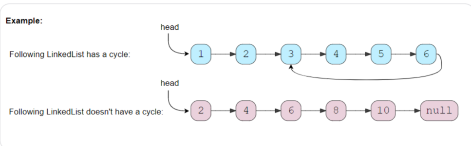

## 1、introduction

移动两个速度不同的指针，常在环形数组和链表问题中使用。

## 2、linkedlist cycle

> 判断链表是否有环



code:

```c++
bool hasCycle(ListNode *head) {
    ListNode *fast = head;
    ListNode *slow = head;
    
    while (fast != NULL && fast->next != NULL) {
        fast = fast->next->next;
        slow = slow->next;
        if (slow == fast) {
            return true;
        }
    }
    return false;
}
```

Time Complexity :	*O*(N) 

Space Complexity :	*O*(1)

相似问题：

> 求带环链表环的长度

code：

```c++
int calculateLength(ListNode *slow) {
    ListNode *current = slow;
    int cycleLength = 0;
    do {
        current = current->next;
        cycleLength++;
    } while (current != slow);
    return cycleLength;
}

int findCycleLength(ListNode *head) {
    ListNode *fast = head;
    ListNode *slow = head;
    while (fast != NULL && fast->next != NULL) {
        fast = fast->next->next;
        slow = slow->next;
        if (slow == fast) {
            return calculateLength(slow);
        }
    }
    return 0;
}
```

Time Complexity :	*O*(N) 

Space Complexity :	*O*(1)

## 3、start of linkedlist cycle

> 求带环链表的起点


code:

```c++
ListNode *findStart(ListNode *head, int cycleLenghth) {
    ListNode *pointer1 = head;
    ListNode *pointer2 = head;
    while (cycleLenghth > 0) {
        pointer2 = pointer2->next;
        cycleLenghth--;
    }

    while (pointer1 != pointer2) {
        pointer1 = pointer1->next;
        pointer2 = pointer2->next;
    }
    return pointer1;
}

int calculateLength(ListNode *slow) {
    ListNode *current = slow;
    int cycleLength = 0;
    do {
        current = current->next;
        cycleLength++;
    } while (current != slow);
    return cycleLength;
}

ListNode *findCycleStart(ListNode *head) {
    int cycleLength = 0;
    ListNode *fast = head;
    ListNode *slow = head;
    while (fast != NULL && fast->next != NULL) {
        fast = fast->next->next;
        slow = slow->next;
        if (slow == fast) {
            cycleLength = calculateLength(slow);
            break;
        }
    }
    return findStart(head, cycleLength);
}
```


Time Complexity :	*O*(N) 

Space Complexity :	*O*(1)

## 4、happy number

> 判断整数是否是happy number

> 快乐数（happy number）有以下的特性：在给定的进位制下，该数字所有数位(digits)的平方和，得到的新数再次求所有数位的平方和，如此重复进行，最终结果必为1

```c++
input:	23
 
output:	true

explanations:  2*2 + 3*3 = 4 + 9 = 13
    		  1*1 + 3*3 = 1 + 9 = 10
    		  1*1 + 0*0 = 1 + 0 = 1
```

```c++
input:	12
 
output:	false

explanations: 5->25->29->85->89->145->42->20->4->16->37->58->89  89重复
```


code：

```c++
int findSquareSum(int num) {
    int sum = 0;
    int digit;
    while (num > 0) {
        digit = num % 10;
        sum += digit * digit;
        num /= 10;
    }
    return sum;
}

int find(int num) {
    //如果不是happy number，在不断生成新数中，定有重复
    int slow = num;
    int fast = num;
    do {
        slow = findSquareSum(slow);
        fast = findSquareSum(findSquareSum(fast));
    } while (slow != fast);

    return slow == 1;
}
```

Time Complexity :	*O*(log N) 

Space Complexity :	*O*(1)

## 5、middle of the linkedlist

> 求链表的中间节点

```c++
input:	1 -> 2 -> 3 -> 4 -> 5-> NULL
 
output:	3
```

```c++
input:	1 -> 2 -> 3 -> 4 -> 5-> 6 -> NULL
 
output:	4
```

code:

```c++
ListNode *findMiddle(ListNode *head) {
    ListNode *fast = head;
    ListNode *slow = head;

    while (fast != NULL && fast->next != NULL) {
        fast = fast->next->next;
        slow = slow->next;
    }
    return slow;
}
```

Time Complexity :	*O*(N) 

Space Complexity :	*O*(1)

## 6、palindrome linkedlist

> 判断链表是否对称

```c++
input:	2 -> 4 -> 6 -> 4 -> 2-> NULL
 
output:	true
```

```c++
input:	2 -> 4 -> 6 -> 4 -> 2 -> 2 -> NULL
 
output:	false
```

code:

```c++
ListNode *reverse(ListNode *head) {
    ListNode *prev = NULL;
    while (head != NULL) {
        ListNode *next = head->next;
        head->next = prev;
        prev = head;
        head = next;
    }
    return prev;
}

bool isPalindrome(ListNode *head) {
    if (head == NULL || head->next == NULL) {
        return true;
    }
    ListNode *fast = head;
    ListNode *slow = head;
    while (fast != NULL && fast->next != NULL) {
        fast = fast->next->next;
        slow = slow->next;
    }

    ListNode *headSecondHalf = reverse(slow);
    ListNode *copyHeadSecondHalf = headSecondHalf;

    while (head != NULL && headSecondHalf != NULL) {
        if (head->val != headSecondHalf->val) {
            break;
        }
        head = head->next;
        headSecondHalf = headSecondHalf->next;
    }


    reverse(copyHeadSecondHalf);
    if (head == NULL || headSecondHalf == NULL) {
        return true;
    }
    return false;
}
```

Time Complexity :	*O*(N) 

Space Complexity :	*O*(1)

## 7、rearrange a linkedlist

> 给定一个单链表 L：L0→L1→…→Ln-1→Ln ，
> 将其重新排列后变为： L0→Ln→L1→Ln-1→L2→Ln-2→…
>
> 你不能只是单纯的改变节点内部的值，而是需要实际的进行节点交换。
>

```c++
input:	2 -> 4 -> 6 -> 8 -> 10-> 12 -> NULL
 
output:	2 -> 12 -> 4 -> 10-> 6 -> 8 -> NULL
```

```c++
input:	2 -> 4 -> 6 -> 8 -> 10 -> NULL
 
output:	2 -> 10 -> 4 -> 8 -> 6 -> NULL
```

code:

```c++
ListNode *reverse(ListNode *head) {
    ListNode *prev = NULL;
    while (head != NULL) {
        ListNode *next = head->next;
        head->next = prev;
        prev = head;
        head = next;
    }
    return prev;
}

void reOrder(ListNode *head) {
    if (head == NULL || head->next == NULL) {
        return;
    }
    ListNode *fast = head;
    ListNode *slow = head;
    while (fast != NULL && fast->next != NULL) {
        fast = fast->next->next;
        slow = slow->next;
    }

    ListNode *headSecondHalf = reverse(slow);
    ListNode *headFirstHalf = head;

    while (headFirstHalf != NULL && headSecondHalf != NULL) {
        ListNode *temp = headFirstHalf->next;
        headFirstHalf->next = headSecondHalf;
        headFirstHalf = temp;

        temp = headSecondHalf->next;
        headSecondHalf->next = headFirstHalf;
        headSecondHalf = temp;
    }

    if (headFirstHalf != NULL) {
        headFirstHalf->next = NULL;
    }

}
```

Time Complexity :	*O*(N) 

Space Complexity :	*O*(1)

## 8、cycle in a Circular array

> 没看懂题目

