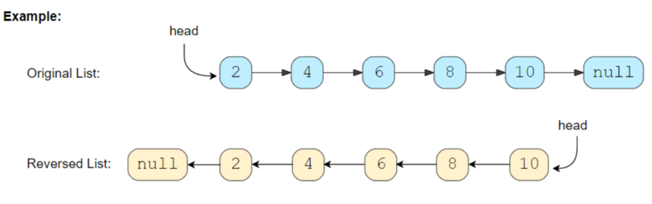
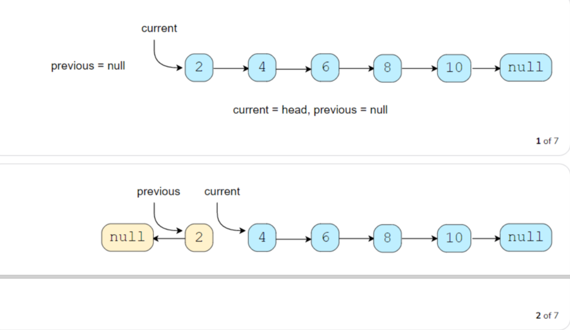
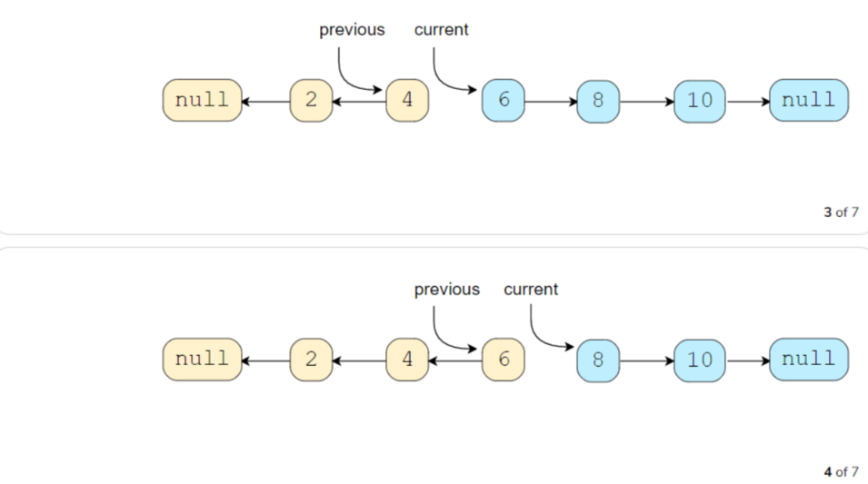
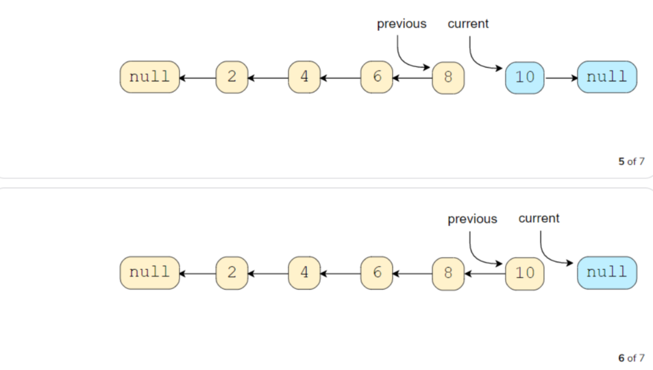
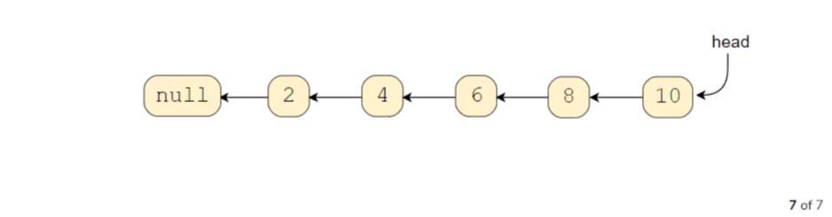
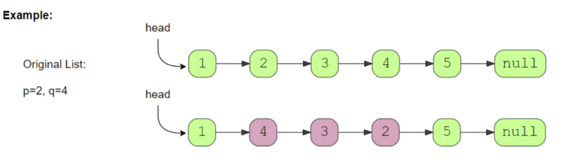
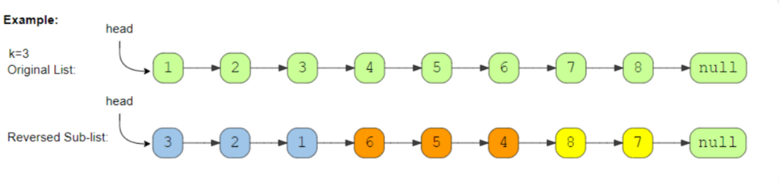
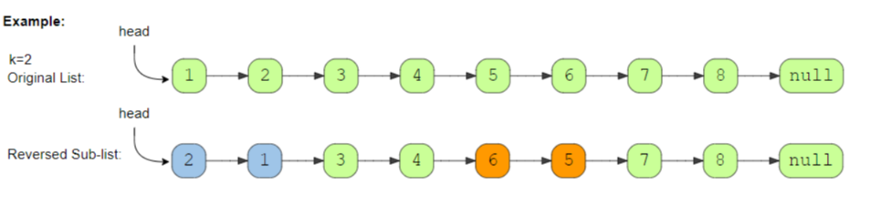
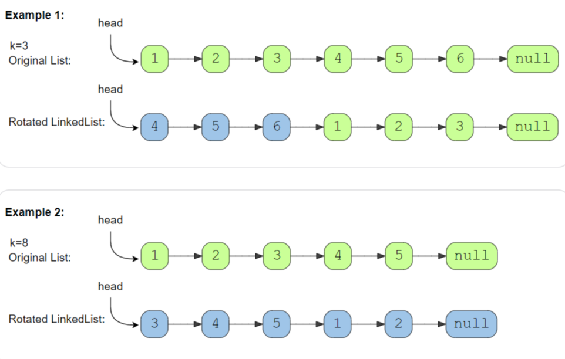

## 1、introduction

解决原地逆转链表的问题

## 2、reverse a linkedlist

> 逆转链表



code:

```c++

ListNode *reverse(ListNode *head) {
    ListNode *current = head;
    ListNode *prev = NULL;
    ListNode *next = NULL;
    while (current != NULL) {
        next = current->next;
        current->next = prev;
        prev = current;
        current = next;
    }
    return prev;
}
```









Time Complexity : *O*(N)

Space Complexity : *O*(1)

## 3、reverse a sub-list

> 逆转链表第p个至第q个之间的元素



code:

```c++
ListNode *reverse(ListNode *head, int p, int q) {
    if (p == q) {
        return head;
    }

    ListNode *current = head;
    ListNode *prev = NULL;

    //让current指向pth Node
    for (int i = 0; current != NULL && i < p - 1; i++) {
        prev = current;
        current = current->next;
    }

    //第p-1个元素
    ListNode *lastNodeOfFirstPart = prev;
    //逆转部分最后一个
    ListNode *lastNodeOfSubList = current;
    ListNode *next = NULL;


    for (int i = 0; current != NULL && i < q - p + 1; i++) {
        next = current->next;
        current->next = prev;
        prev = current;
        current = next;
    }

    //链接第一部分
    if (lastNodeOfFirstPart != NULL) {
        lastNodeOfFirstPart->next = prev;

    } else {
        head = prev;
    }
    //链接后一部分
    lastNodeOfSubList->next = current;
    return head;
}

```

Time Complexity : *O*(N)

Space Complexity : *O*(1)

相似问题1

> 逆转前k个元素

code：

```c++
reverse(head, 1 ,n)
```

相似问题2

> 偶数个元素，逆转前1/2，后1/2；
>
> 奇数个元素，逆转前1/2，后1/2，中间不变；

```c++
偶数
reverse(head, 1 ,n/2)
reverse(head, 1/2 + 1 ,n)   
  
奇数
reverse(head, 1 ,n/2)
reverse(head, 1/2 + 2 ,n)    
```

## 4、reverse every  k-element sub-list

> 给定链表和整数K，每次逆转K个元素



code：

```c++
ListNode *reverse(ListNode *head, int k) {
    if (k <= 1 || head == NULL) {
        return head;
    }

    ListNode *current = head;
    ListNode *prev = NULL;

    while (true) {
        ListNode *lastNodeOfPreviousPart = prev;
        ListNode *lastNodeOfSubList = current;
        ListNode *next = NULL;

        for (int i = 0; current != NULL && i < k; i++) {
            next = current->next;
            current->next = prev;
            prev = current;
            current = next;
        }

        //链接第一部分
        if (lastNodeOfPreviousPart != NULL) {
            lastNodeOfPreviousPart->next = prev;

        } else {
            head = prev;
        }
        //链接后一部分
        lastNodeOfSubList->next = current;
        if (current == NULL) {
            break;
        }
        prev = lastNodeOfSubList;

    }
    return head;
}
```

Time Complexity : *O*(N)

Space Complexity : *O*(1)

## 5、reverse alternating k-element sub-list

> 给定链表和整数K，每次交替逆转K个元素，如果最后要逆转的部分小于k，也要逆转



code:

```c++
ListNode *reverse(ListNode *head, int k) {
    if (k <= 1 || head == NULL) {
        return head;
    }

    ListNode *current = head;
    ListNode *prev = NULL;

    while (true) {
        ListNode *lastNodeOfPreviousPart = prev;
        ListNode *lastNodeOfSubList = current;
        ListNode *next = NULL;


        for (int i = 0; current != NULL && i < k; i++) {
            next = current->next;
            current->next = prev;
            prev = current;
            current = next;
        }

        if (lastNodeOfPreviousPart != NULL) {
            lastNodeOfPreviousPart->next = prev;

        } else {
            head = prev;
        }

        lastNodeOfSubList->next = current;

        for (int i = 0; current != NULL && i < k; i++) {
            prev = current;
            current = current->next;
        }

        if (current == NULL) {
            break;
        }
    }
    return head;
}
```

Time Complexity : *O*(N)

Space Complexity : *O*(1)

## 6、rotate a linkedlist

> 给定链表和整数K，循环将前k元素移到后面



code:

```c++
ListNode *rotate(ListNode *head, int rotations) {
    if (head == NULL || head->next == NULL || rotations <= 0) {
        return head;
    }
    ListNode *lastNode = head;
    int listLength = 1;
    while (lastNode->next != NULL) {
        lastNode = lastNode->next;
        listLength++;
    }
    lastNode->next = head;
    rotations %= listLength;
    int skipLength = listLength - rotations;
    ListNode *lastNodeOfRotatedList = head;
    
    for (int i = 0; i < skipLength - 1; i++) {
        lastNodeOfRotatedList = lastNodeOfRotatedList->next;
    }

    head = lastNodeOfRotatedList->next;
    lastNodeOfRotatedList->next = NULL;
    return head;
}
```

Time Complexity : *O*(N)

Space Complexity : *O*(1)