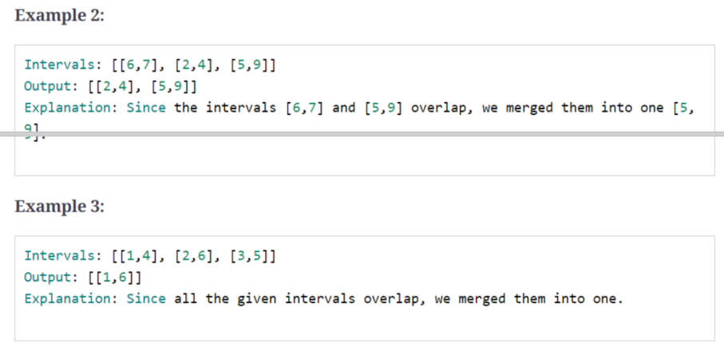

## 1、introduction

常用来解决重叠区间问题，如求重叠的区间或合并有重叠的区间

区间 a , b 的6种重叠方式


## 2、merge interval

> 给定一组区间，合并重叠的区间




code:

```c++
vector<vector<int>> merge(const vector<vector<int>> &intervals) {
    if (intervals.size() < 1) {
        return intervals;
    }

    vector<vector<int>> mergedResult;
    mergedResult.push_back(intervals[0]);

    for (int i = 1; i < intervals.size(); i++) {
        if (intervals[i][0] <= mergedResult.back()[1]) {

            mergedResult.back()[1] = max(mergedResult.back()[1], intervals[i][1]);
        } else {
            mergedResult.push_back(intervals[i]);
        }
    }
    return mergedResult;
}
```

Time Complexity : *O*(*N* *  log *N* )

Space Complexity : *O*(*N*)

相似问题：

> 判断一组区间是否重合

```c++
input:	[[1, 4], [2, 5], [7, 9]]

output:	true
```

code：

```c++
bool isMerge(const vector<vector<int>> &intervals) {
    if (intervals.size() < 1) {
        return false;
    }

    vector<int> temp=intervals[0];

    for (int i = 1; i < intervals.size(); i++) {
        if (intervals[i][0] <= temp[1]) {
            return true;
        } else {
            temp=intervals[i];
        }
    }
    return false;
}
```

## 3、insert interval

> 给定一组不重叠区间（按照起始位置排序）和一个区间，合并，生成新的不重叠的区间


code:

```c++
vector<vector<int>> insertInterval(vector<vector<int>> intervals, vector<int> newInterval) {
    if (intervals.empty()) {
        return vector<vector<int>>{newInterval};
    }

    vector<vector<int>> result;
    int i = 0;
    while (i < intervals.size() && intervals[i][1] < newInterval[0]) {
        result.push_back(intervals[i]);
        i++;
    }

    while (i < intervals.size() && intervals[i][0] <= newInterval[1]) {
        newInterval[0] = min(intervals[i][0], newInterval[0]);
        newInterval[1] = max(intervals[i][1], newInterval[1]);
        i++;
    }

    result.push_back(newInterval);

    while (i < intervals.size()) {
        result.push_back(intervals[i]);
        i++;
    }

    return result;
}
```

Time Complexity : *O*(*N*)

Space Complexity : *O*(*N*)

## 4、intervals intersection

> 给定两组区间（每组不重叠，按起始位置排序），求其相交区间


code:

```c++
vector<vector<int>> merge(const vector<vector<int>> &arr1, const vector<vector<int>> &arr2) {
    vector<vector<int>> result;

    int i = 0, j = 0;

    while (i < arr1.size() && j < arr2.size()) {

        if ((arr1[i][0] >= arr2[j][0] && arr1[i][0] <= arr2[j][1]) ||
            (arr2[j][0] >= arr1[i][0] && arr2[j][0] <= arr1[i][1])) {

            result.push_back({max(arr1[i][0], arr2[j][0]), min(arr1[i][1], arr2[j][1])});
        }

        if (arr1[i][1] < arr2[j][1]) {
            i++;
        } else {
            j++;
        }
    }
    return result;
}
```

Time Complexity : *O*(*N* + *M*)

Space Complexity : *O*(*1*)

## 5、conflicting appointments

> 给定一组区间代表一组会议持续时间，判断某人是否能够参加所有的会议

```c++
input:	[[1, 4], [2, 5], [7, 9]]

output:	false
```

```c++
input:	[[6, 7], [2, 4], [8, 12]]

output:	true
```

```c++
input:	[[4, 5], [2, 3], [3, 6]]

output:	false
```

code:

```c++
bool canAttendAllAppointments(vector<vector<int>> &nums) {
    sort(nums.begin(), nums.end());

    for (int i = 1; i < nums.size(); i++) {
        if (nums[i][0] < nums[i - 1][1]) {
            return false;
        }
    }
    return true;
}
```

Time Complexity : *O*(*N* *  log *N* )

Space Complexity : *O*(*N*)

相似问题

> 给定一组区间代表一组会议持续时间，求所有冲突的会议

```c++
待写
```

## 6、minimum meeting rooms

>给定一组区间代表一些会议，求能举办这些会议的最小会议室


code:

```c++
struct cmp_greater {
    bool operator()(const vector<int> &x, const vector<int> &y) {
        return x[1] > y[1];
    }
};


int minimumMeetingRooms(vector<vector<int>> &meetings) {
    if (meetings.empty()) {
        return 0;
    }
    sort(meetings.begin(), meetings.end());
    int minRooms = 0;
    priority_queue<vector<int>, vector<vector<int>>, cmp_greater> minHeap;

    for (auto m: meetings) {
        while (!minHeap.empty() && m[0] >= minHeap.top()[1]) {
            minHeap.pop();
        }
        minHeap.push(m);
        minRooms = max(minRooms, (int) minHeap.size());
    }

    return minRooms;
}
```

Time Complexity : *O*(*N* *  log *N* )

Space Complexity : *O*(*N*)

## 7、maximum cpu load

> 没看懂

## 8、employee free time

> 待看