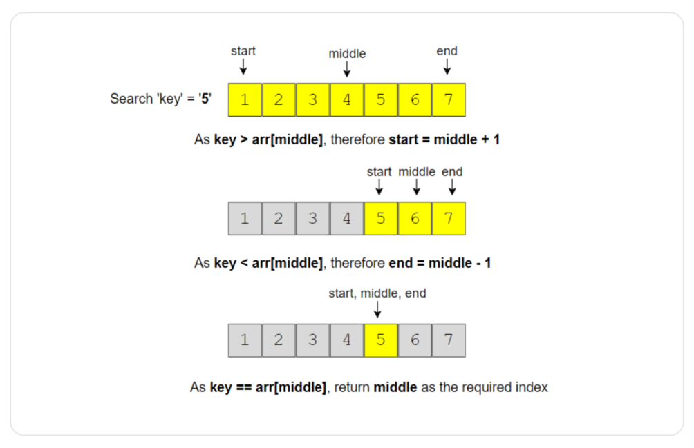
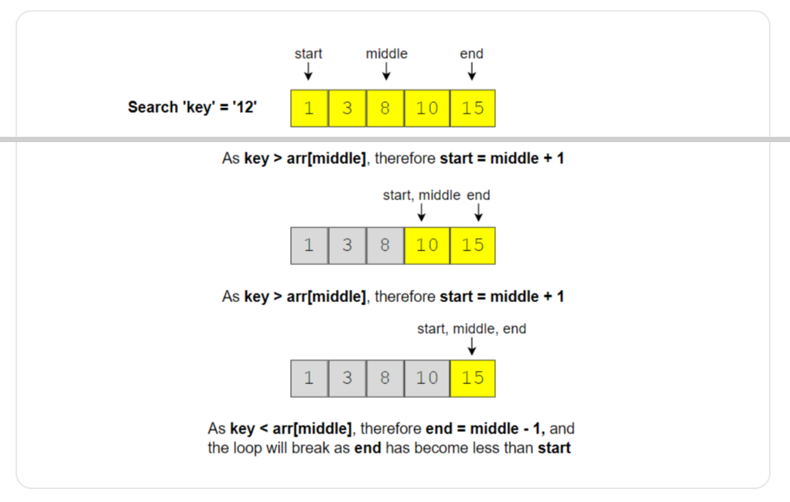
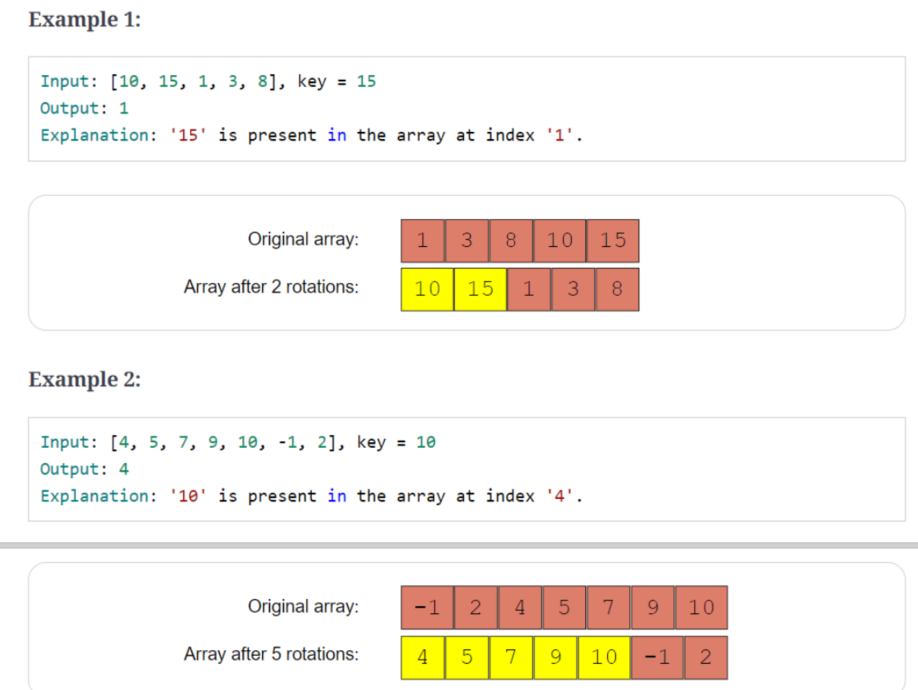
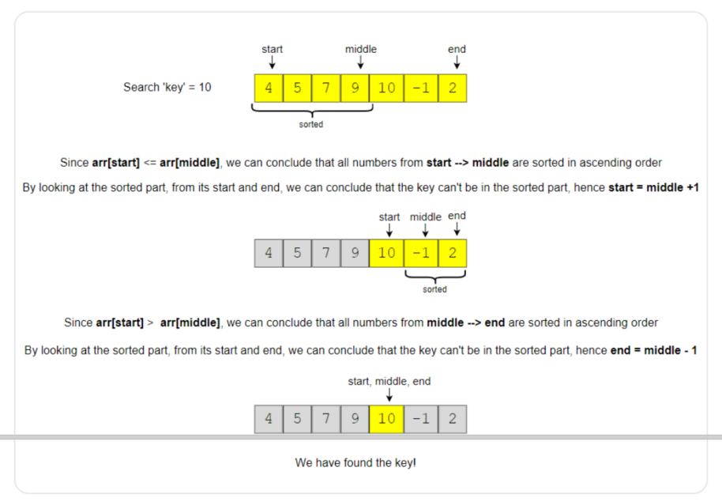
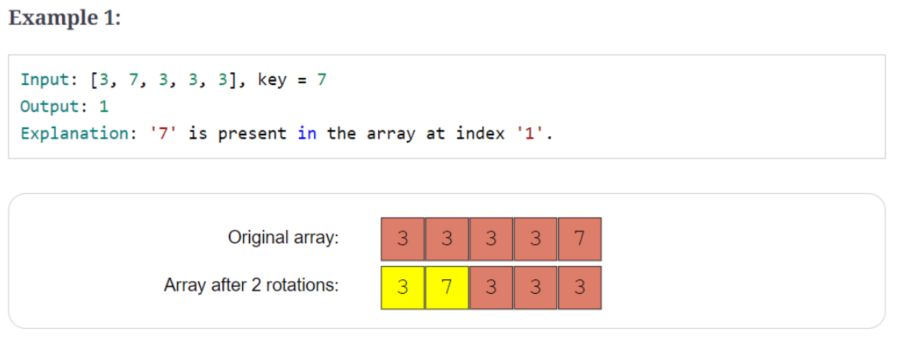
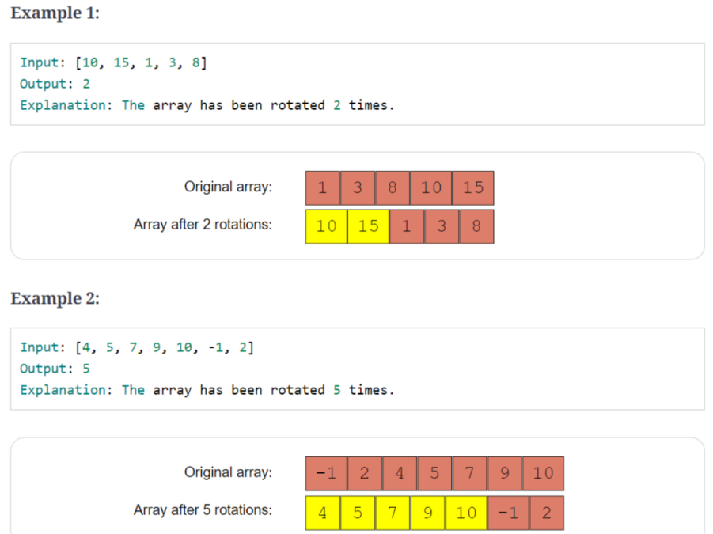
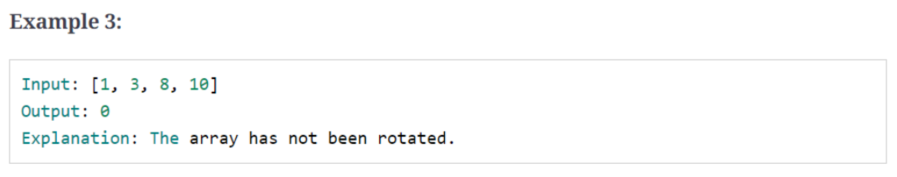
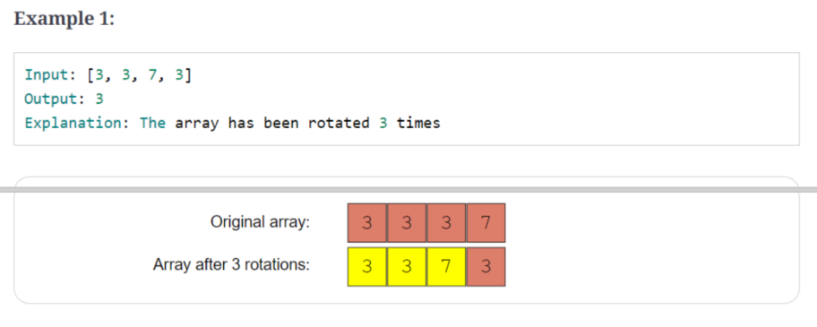

## 1、introduction

在数组，链表，矩阵中查找特定的值

## 2、order-agnostic binary search

>  给定有序数组（不知升序，降序，有可能有重复）和Key值，判断key是否在数组中，返回其索引

```c++
input:	[4, 6, 10] ,key=10
    
output: 2
```

```c++
input:	[1, 2, 3, 4, 6] ,key=4
    
output: 3
```

code:

```c++
int search(const vector<int> &arr, int key) {
    int start = 0;
    int end = arr.size()-1;
    bool isAscending = arr[start] < arr[end];

    while (start <= end) {
        int mid = start + (end - start) / 2;

        if (key == arr[mid]) {
            return mid;
        }
        if (isAscending) {
            if (key < arr[mid]) {
                end = mid - 1;
            } else {
                start = mid + 1;
            }
        } else {
            if (key > arr[mid]) {
                end = mid - 1;
            } else {
                start = mid + 1;
            }
        }
    }
    return -1;
}
```



Time Complexity : *O*(log*N*)

Space Complexity : *O*(1)

## 3、ceiling of a number

> 给定升序序列和key值，求ceiling of key（数组中最小的大于等于key的数），返回其索引

```c++
input:	[4, 6, 10] ,key=6
 
output:	1

explanations:	6->index=1
```

```c++
input:	[1, 3, 8, 10, 15] ,key=12
 
output:	4

explanations:	15->index=4
```

code:

```c++
int searchCeilingOfANumber(const vector<int> &arr, int key) {
    if (key > arr[arr.size() - 1]) {
        return -1;
    }

    int start = 0;
    int end = arr.size() - 1;
    while (start <= end) {
        int mid = start + (end - start) / 2;
        if (key < arr[mid]) {
            end = mid - 1;
        } else if (key > arr[mid]) {
            start = mid + 1;
        } else {
            return mid;
        }
    }
    //当循环结束时，start=end+1,没有找到等于key的元素，此时arr[start]
    //就是最小的大于等于key的值，
    //等同于 return end+1;
    return start;
}
```



Time Complexity : *O*(log*N*)

Space Complexity : *O*(1)

## 4、next letter

> 给定包含小写字母的升序序列和key，寻找最小的字母使得大于key，假定序列为循环序列（当key大于等于arr[arr.size()-1]时，返回arr[0]

```c++
input:	['a','c','f','h'] ,key='f'
 
output:	'h'

explanations:	'h' > 'f'
```

```c++
input:	['a','c','f','h'] ,key='m'
 
output:	'a'

explanations:循环后	'a' > 'm'
```

code：

```c++
char searchNextLetter(const vector<char> &letter, char key) {
    int n = letter.size();

    if (key < letter[0] || key >= letter[n - 1]) {
        return letter[0];
    }

    int start = 0;
    int end = n - 1;
    while (start <= end) {
        int mid = start + (end - start) / 2;
        if (key < letter[mid]) {
            end = mid - 1;
        } else {
            start = mid + 1;
        }
    }
    //start=end+1
    return letter[start];
}
```

Time Complexity : *O*(log*N*)

Space Complexity : *O*(1)

## 5、number range

> 给定升序序列和key值，求key值得范围（key出现在序列中起始结束的索引）

code：

```c++
input:	[4, 6 ,6 ,6 ,9] ,key=6
 
output:	[1 ,3]
```

```c++
input:	[1, 3, 8, 10, 15] ,key=10
 
output:	[3 ,3]
```

```c++
input:	[1, 3, 8, 10, 15] ,key=112
 
output:	[-1 ,-1]
```

code:

```c++
int search(const vector<int> &arr, int key, bool findMaxIndex) {
    //findMaxIndex:是否找最大索引，每次search 只能找最大索引或最小索引
    int keyIndex = -1;
    int start = 0;
    int end = arr.size() - 1;
    while (start <= end) {
        int mid = start + (end - start) / 2;
        if (key < arr[mid]) {
            end = mid - 1;
        } else if (key > arr[mid]) {
            start = mid + 1;
        } else {
            //记录最大索引或最小索引
            keyIndex = mid;
            if (findMaxIndex) {
                //向后找最大索引
                start = mid + 1;
            } else {
                //向前找最大索引
                end = mid - 1;
            }
        }
    }
    return keyIndex;
}

pair<int, int> findRange(const vector<int> &arr, int key) {
    pair<int, int> result(-1, -1);
    result.first = search(arr, key, false);
    if (result.first != -1) {
        result.second = search(arr, key, true);
    }
    return result;
}
```

Time Complexity : *O*(log*N*)

Space Complexity : *O*(1)

## 6、search in a sorted infinite array

> 给定未知个数的升序序列和key，判断key是否在其中

> 待看

## 7、minimum difference element

> 给定升序序列和key，求序列中与key 的差的绝对值差距最小的数

```c++
input:	[4, 6 ,10] ,key=7
 
output:	6
    
explanations:|6-7|=1
```

```c++
input:	[4, 6 ,10] ,key=4
 
output:	4
    
explanations:|4-4|=0
```

code:

```c++
int searchMinimumDifference(const vector<int> &arr, int key) {
    if (key < arr[0]) {
        return arr[0];
    }
    if (key > arr[arr.size() - 1]) {
        return arr[arr.size() - 1];
    }

    int start = 0;
    int end = arr.size() - 1;
    while (start <= end) {
        int mid = start + (end - start) / 2;
        if (key < arr[mid]) {
            end = mid - 1;
        } else if (key > arr[mid]) {
            start = mid + 1;
        } else {
            return arr[mid];
        }
    }
    if ((arr[start] - key) < (key - arr[end])) {
        return arr[start];
    }
    return arr[end];
}
```

Time Complexity : *O*(log*N*)

Space Complexity : *O*(1)

## 8、bitonic array maximum

> 求bitonic数组中的最大值
>
> bitonic array：先单调递增，在单调递减，arr[i] != arr[i+1]

```c++
input: [1, 3, 8, 12, 4, 2]

output:	12
```

```c++
input: [3, 8, 3, 1]

output:	8
```

```c++
input: [1, 3, 8, 12]

output:	12
```

```c++
input: [10, 9 , 8]

output:	10
```

code:

```c++
int finMax(const vector<int> &arr) {
    int start = 0;
    int end = arr.size() - 1;
    while (start < end) {
        int mid = start + (end - start) / 2;
        //当arr[mid]>arr[mid+1]，位于后半段，最大值在mid前面
        if (arr[mid] > arr[mid + 1]) {
            end = mid;
        } else {
            //位于前半段，最大值在mid+1后面
            start = mid + 1;
        }
    }
    //循环结束start==end
    return arr[start];
}
```

Time Complexity : *O*(log*N*)

Space Complexity : *O*(1)

## 9、search bitonic array

> 给定bitonic数组和key值，判断key是否在其中，返回索引
>
> bitonic array：先单调递增，在单调递减，arr[i] != arr[i+1]

```c++
input: [1, 3, 8, 4, 3],key=4

output:	3
```

```c++
input: [3, 8, 3, 1],key=8

output:	1
```

```c++
input: [1, 3, 8, 12],key=12

output:	3
```

```c++
input: [10, 9 , 8],key=10

output:	0
```

code:

```c++
int binarySearch(const vector<int> &arr, int key, int start, int end) {

    bool isAscending = arr[start] < arr[end];

    while (start <= end) {
        int mid = start + (end - start) / 2;

        if (key == arr[mid]) {
            return mid;
        }
        if (isAscending) {
            if (key < arr[mid]) {
                end = mid - 1;
            } else {
                start = mid + 1;
            }
        } else {
            if (key > arr[mid]) {
                end = mid - 1;
            } else {
                start = mid + 1;
            }
        }
    }
    return -1;
}

//返回最大值得索引
int finMax(const vector<int> &arr) {
    int start = 0;
    int end = arr.size() - 1;
    while (start < end) {
        int mid = start + (end - start) / 2;
        //当arr[mid]>arr[mid+1]，位于后半段，最大值在mid前面
        if (arr[mid] > arr[mid + 1]) {
            end = mid;
        } else {
            //位于前半段，最大值在mid+1后面
            start = mid + 1;
        }
    }
    //循环结束start==end
    return start;
}

int search(const vector<int> &arr, int key) {
    int maxIndex = finMax(arr);
    //前半段
    int keyIndex = binarySearch(arr, key, 0, maxIndex);
    if (keyIndex != -1) {
        return keyIndex;
    }
    //后半段
    return binarySearch(arr, key, maxIndex + 1, arr.size() - 1);
}
```

Time Complexity : *O*(log*N*)

Space Complexity : *O*(1)

## 10、search in rotated array

> 给定rotated array(不含重复)和key，判断key是否在其中，返回索引
>
> rotated array：旋转数组，有序数组旋转了有理数个位置，生成两段递增子数组



code：

```c++
int search(const vector<int> &arr, int key) {
    int start = 0;
    int end = arr.size() - 1;

    while (start <= end) {
        int mid = start + (end - start) / 2;
        if (arr[mid] == key) {
            return mid;
        }
        //左开左开右闭区间
        //[start,mid]之间有序，较长段有序序列在前
        if (arr[start] <= arr[mid]) {
            //判断key在[start,mid]之间，还是在之后
            if (key >= arr[start] && key < arr[mid]) {
                end = mid - 1;
            } else {
                start = mid + 1;
            }
            //[mid，end]之间有序，较长段有序序列在后
        } else {
            if (key > arr[mid] && key <= arr[end]) {
                //判断key在[mid，end]之间，还是在之后
                start = mid + 1;
            } else {
                end = mid - 1;
            }
        }
    }
    return -1;
}
```



Time Complexity : *O*(log*N*)

Space Complexity : *O*(1)

相似问题：

> 给定rotated array(含重复)和key，判断key是否在其中，返回索引
>
> rotated array：旋转数组，有序数组旋转了有理数个位置，生成两段递增子数组



code:

```c++
int searchDuplicate(const vector<int> &arr, int key) {
    int start = 0;
    int end = arr.size() - 1;

    while (start <= end) {
        int mid = start + (end - start) / 2;
        if (arr[mid] == key) {
            return mid;
        }
        //左开左开右闭区间

        //当arr[start]=arr[mid]==arr[end]时，无法分辨数组那一部分是有序的
        if((arr[start]==arr[mid])&&(arr[end]==arr[mid])){
            //跳过一位
            start++;
            end--;

            //[start,mid]之间有序，较长段有序序列在前
        }else if (arr[start] <= arr[mid]) {
            //判断key在[start,mid]之间，还是在之后
            if (key >= arr[start] && key < arr[mid]) {
                end = mid - 1;
            } else {
                start = mid + 1;
            }
            
            //[mid，end]之间有序，较长段有序序列在后
        } else {
            if (key > arr[mid] && key <= arr[end]) {
                //判断key在[mid，end]之间，还是在之后
                start = mid + 1;
            } else {
                end = mid - 1;
            }
        }
    }
    return -1;
}
```

Time Complexity : *O*(log*N*)，最坏： *O*(*N*)

Space Complexity : *O*(1)

## 11、rotation count

> 求旋转数组(无重复)旋转了几个位置

> 等同于求最小值的索引





code:

```c++
int countRotations(const vector<int> &arr) {
    int start = 0;
    int end = arr.size() - 1;

    while (start < end) {
        int mid = start + (end - start) / 2;

        //最小值前面全是比它大的元素
        if (mid < end && arr[mid] > arr[mid + 1]) {
            return mid +1;
        }
        if (mid > start && arr[mid - 1] > arr[mid]) {
            return mid;
        }

        //左侧有序，最小值在右面
        if (arr[start] < arr[mid]) {
            start = mid + 1;
        } else {
            end = mid - 1;
        }
    }
    return 0;
}
```

Time Complexity : *O*(log*N*)

Space Complexity : *O*(1)

相似问题：

> 求旋转数组(有重复)旋转了几个位置



code:

```c++
int countRotationsDuplicate(const vector<int> &arr) {
    int start = 0;
    int end = arr.size() - 1;

    while (start < end) {
        int mid = start + (end - start) / 2;

        //最小值前面全是比它大的元素
        if (mid < end && arr[mid] > arr[mid + 1]) {
            return mid + 1;
        }
        if (mid > start && arr[mid - 1] > arr[mid]) {
            return mid;
        }

        //arr[start] = arr[end] =arr[mid]，挑一步
        if (arr[start] == arr[end] && arr[end] == arr[mid]) {
            if (arr[start] > arr[start + 1]) {
                return start + 1;
            }
            start++;
            if (arr[end - 1] > arr[end]) {
                return end;
            }
            end--;

            //左侧有序，最小值在右面
        } else if (arr[start] < arr[mid] || (arr[start] == arr[mid]) && (arr[mid] > arr[end])) {
            start = mid + 1;
        } else {
            end = mid - 1;
        }
    }
    return 0;
}
```

Time Complexity : *O*(log*N*)，最坏： *O*(*N*)

Space Complexity : *O*(1)