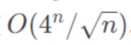
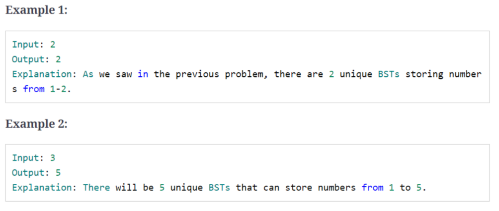

## 1、introduction

解决排列和组合问题，使用广度优先算法

## 2、subsets

>给定不含重复元素的集合，求其所有不同的子集

```c++
input:	[1, 3]

output:	[], [1], [3], [1, 3]
```

````c++
input:	[1, 5, 3]

output:	[], [1], [3], [5] ,[1, 3], [1, 5], [3 ,5],[1 ,3 ,5]
````

code:

```c++
vector<vector<int>> findSubsets(const vector<int>&nums){
    vector<vector<int>> subsets;
    subsets.push_back(vector<int>());
	//取已经有的子集，插入新的元素，生成新的子集
    for(auto currentNumber: nums){
        int n=subsets.size();
        for(int i=0;i<n;i++){
            vector<int> set(subsets[i]);
            set.push_back(currentNumber);
            subsets.push_back(set);
        }
    }
    return subsets;
}
```

Time Complexity : *O*(2^*N*)

Space Complexity : *O*(2^*N*)

## 3、subsets with Duplicates

>  给定含重复元素的集合，求其所有不同的子集

```c++
input:	[1, 3, 3]

output:	[], [1], [3], [1, 3], [3, 3], [1, 3, 3]
```

```c++
input:	[1, 5, 3, 3]

output:	[], [1], [3], [5], [1, 5] ,[1, 3], [1, 5, 3], [3, 3], [1, 3, 3],[5 ,3], [3,3,5],[1, 5, 3, 3]
```

code:

```c++
vector<vector<int>> findSubsets(vector<int> &nums) {
    sort(nums.begin(), nums.end());
    vector<vector<int>> subsets;
    subsets.push_back(vector<int>());
    int startIndex = 0;
    int endIndex = 0;
    
    //当遇到重复的元素时，取上一步生成的子集，插入新的元素，生成新的子集
    for (int i = 0; i < nums.size(); i++) {
        startIndex = 0;
        if (i > 0 && nums[i] == nums[i - 1]) {
            startIndex = endIndex + 1;
        }
        endIndex = subsets.size() - 1;
        for (int j = startIndex; j <= endIndex; j++) {
            vector<int> set(subsets[j]);
            set.push_back(nums[i]);
            subsets.push_back(set);
        }
    }
    return subsets;
}
```


Time Complexity : *O*(2^*N*)

Space Complexity : *O*(2^*N*)

## 4、permutations

> 给定不含重复元素的集合，求其所有排列

```c++
input:	[1, 3, 5]

output:	[1, 3, 5], [1 ,5, 3], [3, 5, 1], [3, 1, 5], [5, 1, 3], [5, 3, 1]
```

code:

```c++
vector<vector<int>> findPermutations(vector<int> &nums) {
    vector<vector<int>> result;
    queue<vector<int>> permutations;

    permutations.push(vector<int>());
    for (auto currentNumber:nums) {
        int n = permutations.size();
        for (int i = 0; i < n; i++) {
            vector<int> oldPermutation = permutations.front();
            permutations.pop();
            
            //添加currentNumber ，到所有的position
            for (int j = 0; j <= oldPermutation.size(); j++) {
                vector<int> newPermutations(oldPermutation);
                newPermutations.insert(newPermutations.begin() + j, currentNumber);

                if (newPermutations.size() == nums.size()) {
                    result.push_back(newPermutations);
                } else {
                    permutations.push(newPermutations);
                }
            }
        }
    }
    return result;
}
```


递归的方法：

```c++
void generatePermutationsRecursive(vector<int> &nums, int numsIndex,
                                   vector<int> &currentPermutation, vector<vector<int>> &result) {
    if (numsIndex == nums.size()) {
        result.push_back(currentPermutation);
    } else {
        for (int i = 0; i <= currentPermutation.size(); i++) {
            vector<int> newPermutation(currentPermutation);
            newPermutation.insert(newPermutation.begin() + i, nums[numsIndex]);
            generatePermutationsRecursive(nums, numsIndex + 1, newPermutation, result);

        }
    }
}

vector<vector<int>> generatePermutation(vector<int> &nums) {
    vector<vector<int>> result;
    vector<int> currentPermutation;
    
    generatePermutationsRecursive(nums, 0, currentPermutation, result);
    return result;
}
```


Time Complexity : *O*(*N* * *N !*)

Space Complexity : *O*(*N* * *N !*)

## 5、string permutation by changing case

> 给定字符串，保留原序列，只改变字母的大小写，求所有排列

```c++
input:	"ad52"
  
ouput:	"ad52" ,"Ad52", "aD52", "AD52"
```

```c++
input:	"ab7c"
  
ouput:	"ab7c", "Ab7c","aB7c","ab7C","AB7c","Ab7C","aB7C","AB7C"
```

code:

```c++
vector<string> findLetterCaseStringPermutation(const string &str) {
    vector<string> permutations;
    if (str == "") {
        return permutations;
    }
    permutations.push_back(str);

    for (int i = 0; i < str.length(); i++) {
        if (isalpha(str[i])) {
            int n = permutations.size();
            for (int j = 0; j < n; j++) {
                vector<char> chs(permutations[j].begin(), permutations[j].end());
                if (isupper(chs[i])) {
                    chs[i] = tolower(chs[i]);
                } else {
                    chs[i] = toupper(chs[i]);
                }

                permutations.push_back(string(chs.begin(), chs.end()));
            }
        }
    }
    return permutations;
}
```


Time Complexity : *O*(*N* * 2^ *N* )

Space Complexity : *O*(*N* * 2^ *N* )

## 6、balanced parentheses

> 给定N，求n对（）的合理的组合

```c++
input: N=2
    
output:	(()) ,()()
```

```c++
input: N=3
    
output:	((())) ,()()(), (())(), ()(()), ((),())
```

code:

```c++
struct Parenthesese {
    string str;
    int openCount;
    int closeCount;

    Parenthesese(const string &str, int openCount, int closeCount) : str(str), openCount(openCount),
                                                                     closeCount(closeCount) {};
};

vector<string> generateValidParentheses(int num) {
    vector<string> result;
    queue<Parenthesese> queue;
    queue.push({"", 0, 0});

    while (!queue.empty()) {
        Parenthesese ps = queue.front();
        queue.pop();

        if (ps.openCount == num && ps.closeCount == num) {
            result.push_back(ps.str);
        } else {
            if (ps.openCount < num) {
                queue.push({ps.str + "(", ps.openCount + 1, ps.closeCount});
            }
            if (ps.openCount > ps.closeCount) {
                queue.push({ps.str + ")", ps.openCount, ps.closeCount + 1});
            }
        }
    }
    return result;
}
```

Time Complexity :

Space Complexity : *O*(*N* * 2^ *N* )

递归方法

```c++
void generateValidParenthesesRecursive(int num, int openCount, int closeCount, int stringIndex,
                                       vector<char> &parenthesesString, vector<string> &result) {
    if (openCount == num && closeCount == num) {
        result.push_back(string(parenthesesString.begin(), parenthesesString.end()));

    } else {
        if (openCount < num) {
            parenthesesString[stringIndex] = '(';
            generateValidParenthesesRecursive(num, openCount+1, closeCount , stringIndex + 1, parenthesesString,
                                              result);
        }
        if (openCount > closeCount) {
            parenthesesString[stringIndex] = ')';
            generateValidParenthesesRecursive(num, openCount, closeCount + 1, stringIndex + 1, parenthesesString,
                                              result);
        }
    }
}

vector<string> generateValidParentheses2(int num) {
    vector<string> result;
    vector<char> parenthesesString(2 * num);
    generateValidParenthesesRecursive(num, 0, 0, 0, parenthesesString, result);
    return result;

}
```

## 7、unique generalized abbreviations

> 没看懂题目

## 8、evaluate expression

> 给定只包含0-9和+ - *的表达式，计算表达式加上括号后所有合理的运算结果

```c++
input:	"1+2*3"
   
output:	7,9
  
explanations: 1+(2*3)=7, (1+2)*3=9
```

```c++
input:	"2*3-4-5"
   
output:	8, -12, 7 ,-7 ,-3
  
explanations: 2*(3-(4-5)=8, 2*(3-4-5)=-12, 2*3-(4-5)=7, 2*(3-4)-5=-7, (2*3)-4-5=-3
```

code:

```c++
vector<int> diffWaysToEvaluateExpression(const string &input) {
    vector<int> result;
    //有两个字符串a、b, 判断a字符串是否包含b字符串，用到string库中的find函数与npos参数。
    //string::npos参数：npos 是一个常数，用来表示不存在的位置
    if (input.find('+', 0) == string::npos &&
        input.find("-") == string::npos && input.find("*") == string::npos) {

    }
    if (input.find("+") == string::npos &&
        input.find("-") == string::npos && input.find("*") == string::npos) {

        result.push_back(stoi(input));
    } else {

        for (int i = 0; i < input.length(); i++) {
            char chr = input[i];
            if (!isdigit(chr)) {
                vector<int> leftParts = diffWaysToEvaluateExpression(input.substr(0, i));
                vector<int> rightParts = diffWaysToEvaluateExpression(input.substr(i + 1));
                for (auto part1:leftParts) {
                    for (auto part2:rightParts) {
                        if (chr == '+') {
                            result.push_back(part1 + part2);
                        } else if (chr == '-') {
                            result.push_back(part1 - part2);
                        } else if (chr == '*') {
                            result.push_back(part1 * part2);
                        }
                    }
                }
            }

        }
    }
    return result;
}
```

Time Complexity : 实际：  估计：*O*(*N* * 2^ *N* )

Space Complexity : 实际：估计：O*( 2^ *N* )

节省空间的方法：

有大量重复计算的值，用哈希表存储中间值

```c++
unordered_map<string, vector<int>> map = unordered_map<string, vector<int>>();

vector<int> diffWaysToEvaluateExpression2(const string &input) {
    if (map.find(input) != map.end()) {
        return map[input];
    }
    vector<int> result;
    if (input.find("+") == string::npos &&
        input.find("-") == string::npos && input.find("*") == string::npos) {

        result.push_back(stoi(input));
    } else {

        for (int i = 0; i < input.length(); i++) {
            char chr = input[i];
            if (!isdigit(chr)) {
                vector<int> leftParts = diffWaysToEvaluateExpression(input.substr(0, i));
                vector<int> rightParts = diffWaysToEvaluateExpression(input.substr(i + 1));
                for (auto part1:leftParts) {
                    for (auto part2:rightParts) {
                        if (chr == '+') {
                            result.push_back(part1 + part2);
                        } else if (chr == '-') {
                            result.push_back(part1 - part2);
                        } else if (chr == '*') {
                            result.push_back(part1 * part2);
                        }
                    }
                }
            }
        }
    }
    map[input] = result;
    return result;
}
```

## 9、structurally unique binary search trees

> 给定N，求节点值为1-n的二叉查找树


code:

```c++
vector<TreeNode *> findUniqueTreeRecursive(int start, int end) {
    vector<TreeNode *> result;

    if (start > end) {
        result.push_back(NULL);
        return result;
    }
    for (int i = start; i <= end; i++) {
        vector<TreeNode *> leftSubsets = findUniqueTreeRecursive(start, i - 1);
        vector<TreeNode *> rightSubsets = findUniqueTreeRecursive(i + 1, end);
        for (auto leftTree:leftSubsets) {
            for (auto rightTree :rightSubsets) {
                TreeNode *root = new TreeNode(i);
                root->left = leftTree;
                root->right = rightTree;
                result.push_back(root);
            }
        }
    }
    return result;
}

vector<TreeNode *> findUniqueTrees(int n) {
    if (n <= 0) {
        return vector<TreeNode *>();

    } else {
        return findUniqueTreeRecursive(1, n);
    }
}
```

Time Complexity : 实际：  估计：*O*(*N* * 2^ *N* )

Space Complexity : 实际：估计：O*( 2^ *N* )

## 10、count of structurally unique binary search tree

> 给定N，求节点值为1-n的二叉查找树的个数



```c++
int countTrees(int n) {
    if (n <= 1) return 1;
    int count = 0;
    for (int i = 1; i <= n; i++) {
        int countOfLeftSubtrees = countTrees(i - 1);
        int countOfRightSubtrees = countTrees(n - i);
        count += countOfLeftSubtrees * countOfRightSubtrees;
    }
    return count;
}
```

Time Complexity : 实际：  估计：*O*(*N* * 2^ *N* )

Space Complexity : 实际：估计：O*( 2^ *N* )

节省空间的方法：

code：

```c++
unordered_map<int, int> map = unordered_map<int, int>();

int countTrees2(int n) {
    if (map.find(n) != map.end()) {
        return map[n];
    }
    if (n <= 1) return 1;
    int count = 0;
    for (int i = 1; i <= n; i++) {
        int countOfLeftSubtrees = countTrees(i - 1);
        int countOfRightSubtrees = countTrees(n - i);
        count += countOfLeftSubtrees * countOfRightSubtrees;
    }
    map[n] = n;
    return count;
}
```

Time Complexity : O*(* *N* ^ 2) 

Space Complexity : *O*(*N*)