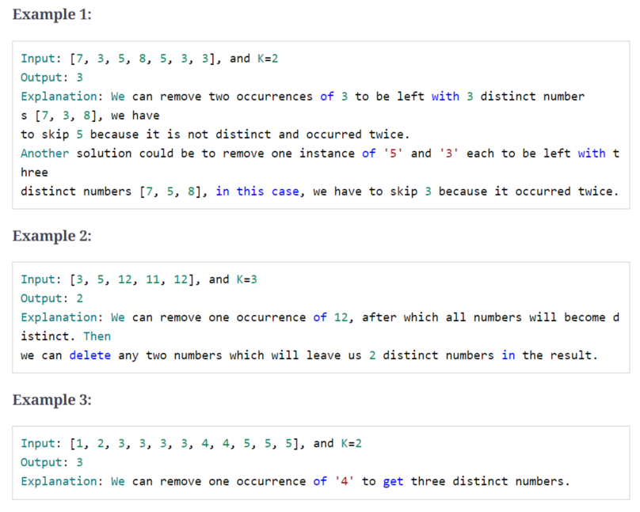
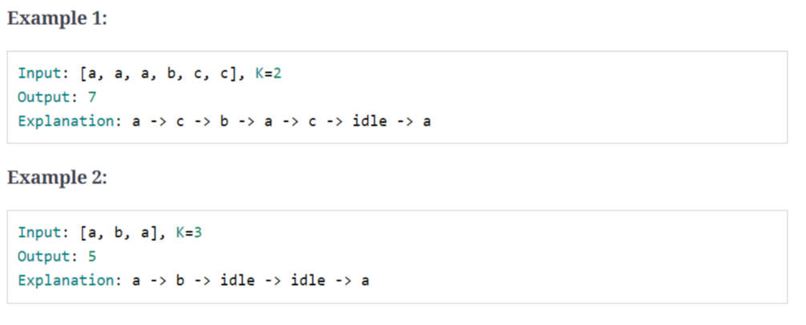

### 1、introduction

最大/最小/出现次数 的 第/前 K个元素，常用heap。

### 2、top k numbers

> 给定未排序数组和K值，求前K个大的元素

```c++
input:	[3, 1, 5, 12, 2, 11] ,K=3
    
output: [5, 12, 11]
```

```c++
input:	[5, 12, 11, -1, 12] ,K=3
    
output: [5, 12, 12]
```

```c++
vector<int> findLargestNumbers(const vector<int> &nums, int k) {
    priority_queue<int, vector<int>, greater<int>> minHeap;
    vector<int> result;
    for (int i = 0; i < k; i++) {
        minHeap.push(nums[i]);
    }

    for (int i = k; i < nums.size(); i++) {
        if (nums[i] > minHeap.top()) {
            minHeap.pop();
            minHeap.push(nums[i]);
        }
    }
    for (int i = 0; i < k; i++) {
        result.push_back(minHeap.top());
        minHeap.pop();
    }
    return result;
}

```

Time Complexity : *O*(*N*  * log *K*)

Space Complexity : *O*(*K*)

### 3、kth smallest number

> 给定未排序数组和K值，求第K个小的元素

```c++
input:	[1, 5, 12, 2, 11, 5] ,K=3
    
output: 5
    
explanations: 1 2 5 5 11 12
```

```c++
input:	[1, 5, 12, 2, 11, 5] ,K=4
    
output: 5
    
explanations: 1 2 5 5 11 12
```

```c++
input:	[5, 11, 12, -1, 12] ,K=3
    
output: 11
    
explanations: -1 5  11 12 12
```

code:

```c++
int kthSmallestNumber(const vector<int> &nums, int k) {
    priority_queue<int> maxHeap;
    for (int i = 0; i < k; i++) {
        maxHeap.push(nums[i]);
    }

    for (int i = k; i < nums.size(); i++) {
        if (nums[i] < maxHeap.top()) {
            maxHeap.pop();
            maxHeap.push(nums[i]);
        }
    }
    return maxHeap.top();
}
```

Time Complexity : *O*(*N*  * log *K*)

Space Complexity : *O*(*K*)

使用小顶堆：

code：

```c++
int kthSmallestNumberUseMinHeap(const vector<int> &nums, int k) {
    priority_queue<int, vector<int>, greater<int>> minHeap;
    
    for (int i = 0; i < nums.size(); i++) {
        minHeap.push(nums[i]);
    }

    for (int i = 0; i < k - 1; i++) {
        minHeap.pop();
    }
    
    return minHeap.top();
}
```

Time Complexity : *O*(*N*  + *K* log *N*)

Space Complexity : *O*(*N*)

### 4、k closest points to the origin

> 给定一组二位坐标点和K值，求前K个离原点最近的的点

```c++
input:	[[1, 2], [1, 3]], k=1
    
output:	[[1, 2]]
```

```c++
input:	[[1, 3], [3, 4], [2, -1]], k=2
    
output:	[[1, 3],[2, -1]]
```

code:

```c++
struct Point {
    int x, y;

    Point(int _x, int _y) : x(_x), y(_y) {};
};

int distance(Point p) {
    return p.x * p.x + p.y + p.y;
}

bool operator<(Point a, Point b) {
    //return a.x*a.x +a.y*a.y > b.x*b.x+b.y+b.y;
    return distance(a) < distance(b);
}


vector<Point> findKthClosestPoints(const vector<Point> &Points, int k) {
    priority_queue<Point> maxHeap;

    vector<Point> result;
    for (int i = 0; i < k; i++) {
        maxHeap.push(Points[i]);
    }

    for (int i = k; i < Points.size(); i++) {
        if (distance(Points[i]) < distance(maxHeap.top())) {
            maxHeap.pop();
            maxHeap.push(Points[i]);
        }
    }
    for (int i = 0; i < k; i++) {
        result.push_back(maxHeap.top());
        maxHeap.pop();
    }
    return result;
}

```

Time Complexity : *O*(*N*  * log *K*)

Space Complexity : *O*(*K*)

### 5、connect ropes

> 把N段不同绳子连接成一段长绳子，使得cost最小

> 连接两段绳子的cost= 两段绳子的长度和

```c++
input: [1, 3, 11, 5]

output: 33
    
explanations: cost1: 1 + 3 = 4; cost2: 4 + 5 = 9 ; cost3 :9 + 11 =20 ;totalcost: 4 + 9 + 20 = 33
```

```c++
input: [3, 4, 5, 6]

output: 36
    
explanations: cost1: 3 + 4 = 7; cost2: 5 + 6 = 11 ; cost3 :7 + 11 =18 ;totalcost: 7 + 11 + 18 = 36
```

```c++
input: [1, 3, 11, 5, 2]

output: 42
    
explanations: cost1: 1 + 2 = 3; cost2: 3 + 3 = 6 ; cost3 :6 + 5 =11 ;cost4 :11 + 11 =22 ; totalcost: 3 +6  + 11 + 12 = 42
```

code:

```c++
int minimumCostConnectRopes(const vector<int> &nums) {

    int result = 0;
    int temp = 0;

    priority_queue<int, vector<int>, greater<int>> minHeap;

    for (int i = 0; i < nums.size(); i++) {
        minHeap.push(nums[i]);
    }

    while (minHeap.size() > 1) {
        temp = minHeap.top();
        minHeap.pop();
        temp += minHeap.top();
        minHeap.pop();
        result += temp;
        minHeap.push(temp);
    }
    return result;
}
```

Time Complexity : *O*(*N*  * log *N*)

Space Complexity : *O*(*N*)

### 6、top k frequent numbers

> 给定未排序数组和K值，求出现次数前K的数

```c++
input: [1, 3, 5, 12, 11, 12, 11], k=2
    
output:	[12, 11]

explanations: 12(2), 11(2) , 其他1次
```

```c++
input: [5, 12, 11, 3, 11], k=2
    
output:	[11, 5] 或[11, 12] 或[11, 3]

explanations: 11(2), 其他1次
```

```c++
struct cmp_greater {
    bool operator()(const pair<int, int> &x, const pair<int, int> &y) {
        return x.second > y.second;
    }
};

vector<int> findTopKFrequencyNumbers(const vector<int> &nums, int k) {
    unordered_map<int, int> numFrequencyMap;
    for (auto n:nums) {
        numFrequencyMap[n]++;
    }

    priority_queue<pair<int, int>, vector<pair<int, int>>, cmp_greater> minHeap;

    for (auto entry: numFrequencyMap) {
        minHeap.push(entry);
        if (minHeap.size() > k) {
            minHeap.pop();
        }
    }

    vector<int> topNumbers;
    while (!minHeap.empty()) {
        topNumbers.push_back(minHeap.top().first);
        minHeap.pop();
    }

    return topNumbers;
}
```

Time Complexity : *O*(*N* + *N*  * log *K*)

Space Complexity : *O*(*N*)

### 7、frequency sort

> 给定字符串，按照字符出现的次数降序排列

```c++
input:	"Programming"
    
output:	"rrggmmPiano"
```

```c++
input:	"abcbab"
    
output:	"bbbaac"
```

code:

```c++
struct cmp_smaller {
    bool operator()(const pair<char, int> &x, const pair<char, int> &y) {
        return x.second < y.second;
    }
};

string sortCharacterByFrequency(const string &str) {
    unordered_map<char, int> characterFrequencyMap;
    for (char chr:str) {
        characterFrequencyMap[chr]++;
    }

    priority_queue<pair<int, int>, vector<pair<int, int>>, cmp_smaller> maxHeap;
    for (auto entry :characterFrequencyMap) {
        maxHeap.push(entry);
    }

    string sortedString = "";
    while (!maxHeap.empty()) {
        auto entry = maxHeap.top();
        maxHeap.pop();
        for (int i = 0; i < entry.second; i++) {
            sortedString += entry.first;
        }
    }

    return sortedString;
}

```

Time Complexity : *O*(*N*  * log *N*)

Space Complexity : *O*(*N*)

### 8、kth largest number in a stream

> 设计一个类，求数据流中的最大值

### 9、k closest numbers

> 给定排序的数组，及整数K和X。求数组中K个接近X的数，将返回的数排序，X不一定在原数组中。

```c++
input:	[5, 6, 7, 8, 9] , k=3 ,x=7
    
output:	[6, 7 , 8]
```

```c++
input:	[2 ,4 ,5 ,6 ,9] ,k=3 ,x=6
    
output:	[4, 5, 6]
```

```c++
input:	[2, 4, 5, 6, 9] ,k=3 ,x=10
    
output:	[5, 6, 9]
```

code:

```c++
struct cmp_greater {
    bool operator()(const pair<int, int> &x, const pair<int, int> &y) {
        return x.first > y.first;
    }
};

int binarySearch(const vector<int> &arr, int target) {

    int low = 0;
    int high = arr.size() - 1;

    while (low <= high) {

        int mid = low + (high - low) / 2;
        if (target = arr[mid]) {
            return mid;
        } else if (target > arr[mid]) {
            low = mid + 1;
        } else {
            high = mid - 1;
        }
    }

    if (low > 0) {
        return low - 1;
    }
    return low;
}

vector<int> findClosestElements(const vector<int> &arr, int k, int x) {
    int index = binarySearch(arr, x);
    int low = index - k;
    int high = index + k;
    low = max(low, 0);
    high = min((int) arr.size() - 1, high);

    priority_queue<pair<int, int>, vector<pair<int, int>>, cmp_greater> minHeap;

    for (int i = low; i <= high; i++) {
        minHeap.push(make_pair(abs(arr[i] - x), i));
    }

    vector<int> result;
    for (int i = 0; i < k; i++) {
        result.push_back(arr[minHeap.top().second]);
        minHeap.pop();
    }

    sort(result.begin(), result.end());
    return result;
}
```

Time Complexity : *O*( log *N* + *K*  * log *K*)

Space Complexity : *O*(*K*)

双指针法：

```c++
int binarySearch(const vector<int> &arr, int target) {
    int low = 0;
    int high = arr.size() - 1;

    while (low <= high) {

        int mid = low + (high - low) / 2;
        if (target = arr[mid]) {
            return mid;
        } else if (target > arr[mid]) {
            low = mid + 1;
        } else {
            high = mid - 1;
        }
    }

    if (low > 0) {
        return low - 1;
    }
    return low;
}


vector<int> findClosestElements2(const vector<int> &arr, int k, int x) {
    deque<int> result;
    int index = binarySearch(arr, x);
    int leftPointer = index;
    int rightPointer = index + 1;
    for (int i = 0; i < k; i++) {
        if (leftPointer >= 0 && rightPointer < (int) arr.size()) {
            int diff1 = abs(x - arr[leftPointer]);
            int diff2 = abs(x - arr[rightPointer]);
            if (diff1 <= diff2) {
                result.push_back(arr[leftPointer]);
                leftPointer--;
            } else {
                result.push_back(arr[rightPointer++]);
            }
        } else if (leftPointer >= 0) {
            result.push_back(arr[leftPointer--]);
        } else if (rightPointer < (int) arr.size()) {
            result.push_back(arr[rightPointer++]);
        }
    }
    
    vector<int> resultvec;
    move(begin(result), end(result), back_inserter(resultvec));
    sort(resultvec.begin(), resultvec.end());
    return resultvec;
}
```

Time Complexity : *O*(*K*  + log *N*)

Space Complexity : *O*(*1*)

### 10、maximum distinct elements

> 给定数组和K值，删除K个数后，求剩余的不重复的数的最大个数



code:

```c++
struct cmp_greater {
    bool operator()(const pair<int, int> &x, const pair<int, int> &y) {
        return x.second > y.second;
    }
};

int maximumDistinctElements(const vector<int> &nums, int k) {
    int distinctElementsCount = 0;
    if (nums.size() <= k) {
        return distinctElementsCount;
    }

    unordered_map<int, int> numFrequencyMap;
    for (auto num:nums) {
        numFrequencyMap[num]++;
    }

    priority_queue<pair<int, int>, vector<pair<int, int>>, cmp_greater> minHeap;
    for (auto entry:numFrequencyMap) {
        if (entry.second == 1) {
            distinctElementsCount++;
        } else {
            minHeap.push(entry);
        }
    }

    while (k > 0 && !minHeap.empty()) {
        auto entry = minHeap.top();
        minHeap.pop();
        k -= entry.second - 1;
        if (k >= 0) {
            distinctElementsCount++;
        }
    }

    if (k > 0) {
        distinctElementsCount -= k;
    }

    return distinctElementsCount;
}
```

Time Complexity : *O*( *N* * log *N* + *K*  * log *K*)

Space Complexity : *O*(*N*)

### 11、sum of elements

> 给定数组和K1、K2值，求第k1小和第k2小之间元素和

```c++
input:	[1 ,3 ,12 ,5 ,15 ,11] , k1= 3, k2 = 6
    
output:	23
    
explanations:3th->5,6th->15   ,11(4th) + 12(5th) = 23
```

```c++
input:	[3, 5, 8, 7] , k1=1, k2 = 4
    
output:	12
    
explanations:1th->3,4th->8   ,5(2th) + 7(3th) = 12
```

code:

```c++
int sumOfElements(const vector<int> &nums, int k1, int k2) {
    int sum = 0;
    priority_queue<int, vector<int>, greater<int>> minHeap;
    for (auto num:nums) {
        minHeap.push(num);
    }

    for (int i = 0; i < k1; i++) {
        minHeap.pop();
    }

    for (int i = 0; i < k2 - k1 - 1; i++) {
        sum += minHeap.top();
        minHeap.pop();
    }

    return sum;
}
```

Time Complexity : *O*(*N*  * log *N*)

Space Complexity : *O*(*N*)

大顶堆方法：

```c++
int sumOfElements2(const vector<int> &nums, int k1, int k2) {
    int sum = 0;
    priority_queue<int> maxHeap;
    for (int i = 0; i < nums.size(); i++) {
        if (i < k2 - 1) {
            maxHeap.push(nums[i]);
        } else if (nums[i] < maxHeap.top()) {
            maxHeap.pop();
            maxHeap.push(nums[i]);
        }
    }
    
    for (int i = 0; i < k2 - k1 - 1; i++) {
        sum += maxHeap.top();
        maxHeap.pop();
    }

    return sum;
}
```

Time Complexity : *O*(*N*  * log *K2*)

Space Complexity : *O*(*K2*)

### 12、rearrange string

> 给定字符串，重新排列，使得相同字符不在一起

```c++
input:	"aappp"
    
output:	"papap"
```

```c++
input:	"Programming"
    
output:	"rgmrgmPiano",或"gmringmrPoa",等等
```

```c++
input:	"aapa"
    
output:	""
```

code:

```c++
struct cmp_smaller {
    bool operator()(const pair<char, int> &x, const pair<char, int> &y) {
        return x.second < y.second;
    }
};

string rearrangeString(const string &str) {
    unordered_map<char, int> charFrequencyMap;
    priority_queue<pair<char, int>, vector<pair<char, int>>, cmp_smaller> maxHeap;
    string resultString = "";
    pair<char, int> previousEntry(-1, -1);

    for (auto chr:str) {
        charFrequencyMap[chr]++;
    }

    for (auto entry:charFrequencyMap) {
        maxHeap.push(entry);
    }

    while (!maxHeap.empty()) {
        pair<char, int> currentEntry = maxHeap.top();
        maxHeap.pop();
        if (previousEntry.second > 0) {
            maxHeap.push(previousEntry);
        }

        resultString += currentEntry.first;
        currentEntry.second--;
        previousEntry = currentEntry;
    }

    return resultString.length() == str.length() ? resultString : "";
}
```

Time Complexity : *O*(*N*  * log *N*)

Space Complexity : *O*(*N*)

### 13、rearrange string k distance apart

> 给定字符串和K值，重新排列字符串，使得相同字符至少相隔k个字符

```c++
input:	"mmpp", k=2
    
output:	"mpmp" 或 "pmpm"
```

```c++
input:	"aappa", k=3
    
output:	""
```

```c++
input:	"Programming", k=3
    
output:	"rgmPrgmiano" 或 "gmrPagimnor" 等等
```

code：

```c++
struct cmp_smaller {
    bool operator()(const pair<char, int> &x, const pair<char, int> &y) {
        return x.second < y.second;
    }
};

string reorganizeString(const string &str, int k) {
    unordered_map<char, int> charFrequencyMap;
    priority_queue<pair<char, int>, vector<pair<char, int>>, cmp_smaller> maxHeap;
    string resultString = "";

    queue<pair<char, int>> queue;

    if (k <= 1) {
        return str;
    }

    for (auto chr:str) {
        charFrequencyMap[chr]++;
    }

    for (auto entry:charFrequencyMap) {
        maxHeap.push(entry);
    }

    while (!maxHeap.empty()) {
        pair<char, int> currentEntry = maxHeap.top();
        maxHeap.pop();

        resultString += currentEntry.first;
        currentEntry.second--;
        queue.push(currentEntry);
        if (queue.size() == k) {
            auto entry = queue.front();
            queue.pop();
            if (entry.second > 0) {
                maxHeap.push(entry);
            }
        }
    }
    return resultString.length() == str.length() ? resultString : "";
}
```

Time Complexity : *O*(*N*  * log *N*)

Space Complexity : *O*(*N*)

### 14、scheduling tasks

> 任务调度，给定一组任务和K值，一个任务执行后必须间隔K 段时间，求完成调度最小总时间，当任务不能调度时用idle



code:

```c++
struct cmp_smaller {
    bool operator()(const pair<char, int> &x, const pair<char, int> &y) {
        return x.second < y.second;
    }
};

int scheduleTask(const vector<char> &task, int k) {
    int intervalCount = 0;
    unordered_map<char, int> charFrequencyMap;
    priority_queue<pair<char, int>, vector<pair<char, int>>, cmp_smaller> maxHeap;


    for (auto chr:task) {
        charFrequencyMap[chr]++;
    }

    for (auto entry:charFrequencyMap) {
        maxHeap.push(entry);
    }

    while (!maxHeap.empty()) {
        vector<pair<char, int>> waitList;
        int n = k + 1;
        for (; n > 0 && !maxHeap.empty(); n--) {
            intervalCount++;
            auto currentEntry = maxHeap.top();
            maxHeap.pop();

            if (currentEntry.second > 1) {
                currentEntry.second--;
                waitList.push_back(currentEntry);
            }
        }

        for (auto w:waitList) {
            maxHeap.push(w);
        }

        if (!maxHeap.empty()) {
            intervalCount += n;
        }
    }
    return intervalCount;
}
```

Time Complexity : *O*(*N*  * log *N*)

Space Complexity : *O*(*N*)

### 15、frequency stack

> 设计类