### 1、introduction

广度遍历，树的一种遍历方式，常用来解决需要一层一层遍历的问题

### 2、binary tree level order Traversal

> 层序遍历，每层单独放进数组，每层自顶向下，自左向右

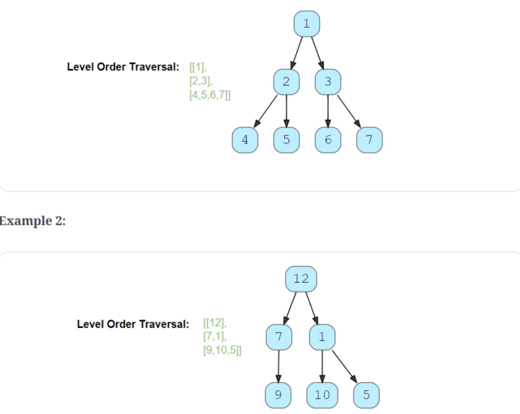

code:

```c++
//struct TreeNode {
//    int val;
//    TreeNode *left;
//    TreeNode *right;

//    TreeNode(int x) : val(x), left(NULL), right(NULL) {}
//};
vector<vector<int>> traverse(TreeNode *root) {
    vector<vector<int>> result;
    queue<TreeNode *> queue;
    
    if (root == NULL) {
        return result;
    }
    queue.push(root);
    while (!queue.empty()) {
        int levelSize = queue.size();
        vector<int> currentLevel;
        
        for (int i = 0; i < levelSize; i++) {
            TreeNode *currentNode = queue.front();
            queue.pop();
            currentLevel.push_back(currentNode->val);
            
            if (currentNode->left != NULL) {
                queue.push(currentNode->left);
            }
            if (currentNode->right != NULL) {
                queue.push(currentNode->right);
            }
        }
        result.push_back(currentLevel);
    }
    return result;
}

```

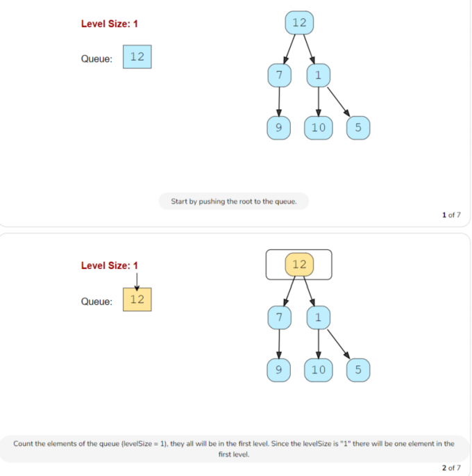

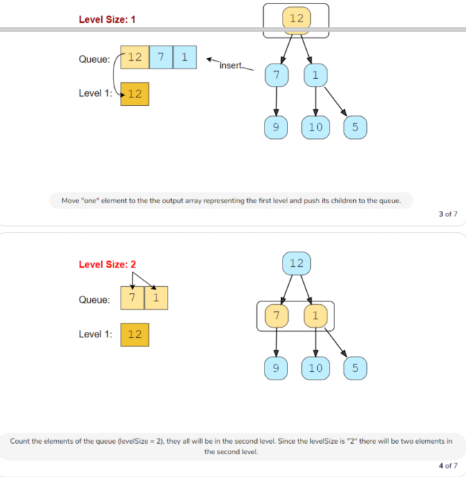

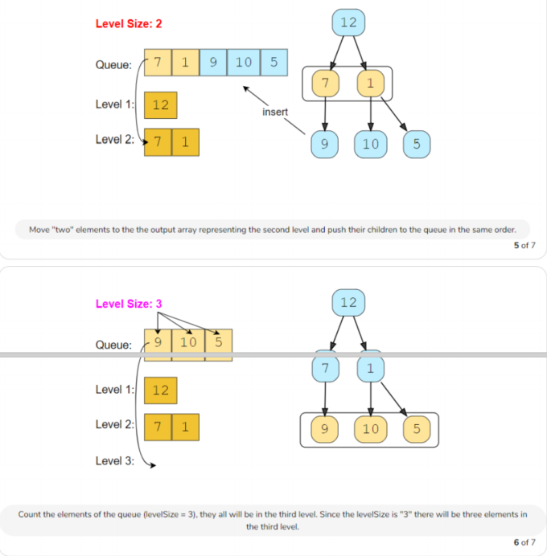

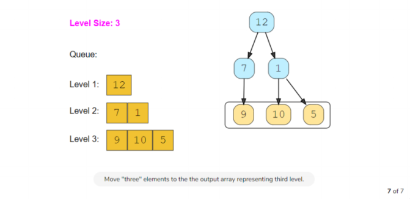

Time Complexity : *O*(N)

Space Complexity : *O*(N)

### 3、reverse level order traversal

> 层序遍历，每层单独放进数组，每层自底向上，自左向右

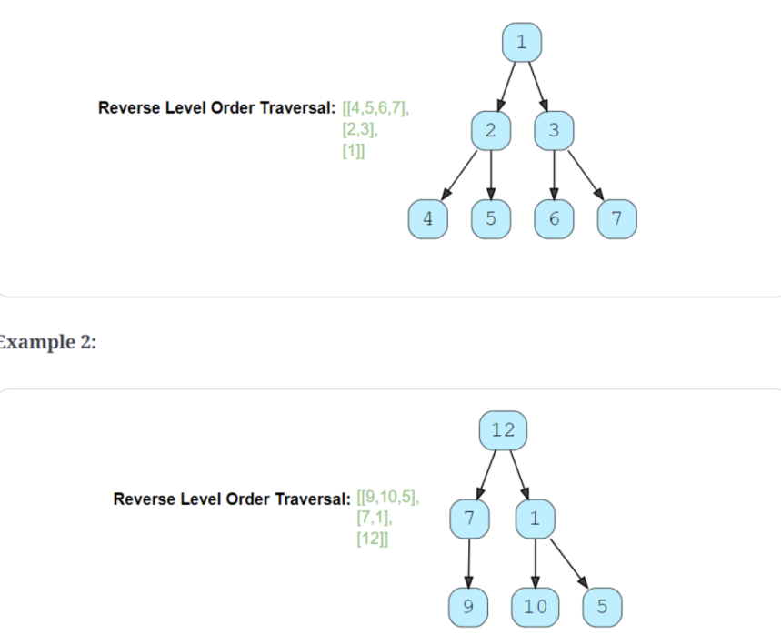

code:

```c++
deque<vector<int>> traverse(TreeNode *root) {
    deque<vector<int>> result;
    queue<TreeNode *> queue;

    if (root == NULL) {
        return result;
    }

    queue.push(root);
    while (!queue.empty()) {
        int levelSize = queue.size();
        vector<int> currentLevel;

        for (int i = 0; i < levelSize; i++) {
            TreeNode *currentNode = queue.front();
            queue.pop();
            currentLevel.push_back(currentNode->val);

            if (currentNode->left != NULL) {
                queue.push(currentNode->left);
            }
            if (currentNode->right != NULL) {
                queue.push(currentNode->right);
            }
        }
        result.push_front(currentLevel);
    }
    return result;
}
```

Time Complexity : *O*(N)

Space Complexity : *O*(N)

### 4、zigzag traversal

> 层序遍历，每层单独放进数组，每层自顶向下，自左向右和自右向左交替进行


code:

```c++
vector<vector<int>> traverse(TreeNode *root) {
    vector<vector<int>> result;
    queue<TreeNode *> queue;
    bool leftToRight = true;

    if (root == NULL) {
        return result;
    }

    queue.push(root);
    while (!queue.empty()) {
        int levelSize = queue.size();
        vector<int> currentLevel(levelSize);

        for (int i = 0; i < levelSize; i++) {
            TreeNode *currentNode = queue.front();
            queue.pop();
            if (leftToRight) {
                currentLevel[i] = currentNode->val;
            } else {
                currentLevel[levelSize - 1 - i] = currentNode->val;
            }


            if (currentNode->left != NULL) {
                queue.push(currentNode->left);
            }
            if (currentNode->right != NULL) {
                queue.push(currentNode->right);
            }
        }
        result.push_back(currentLevel);
        leftToRight = !leftToRight;
    }
    return result;
}
```

Time Complexity : *O*(N)

Space Complexity : *O*(N)

### 5 、level averages in a binary tree

> 层序遍历，计算每一层的平均值

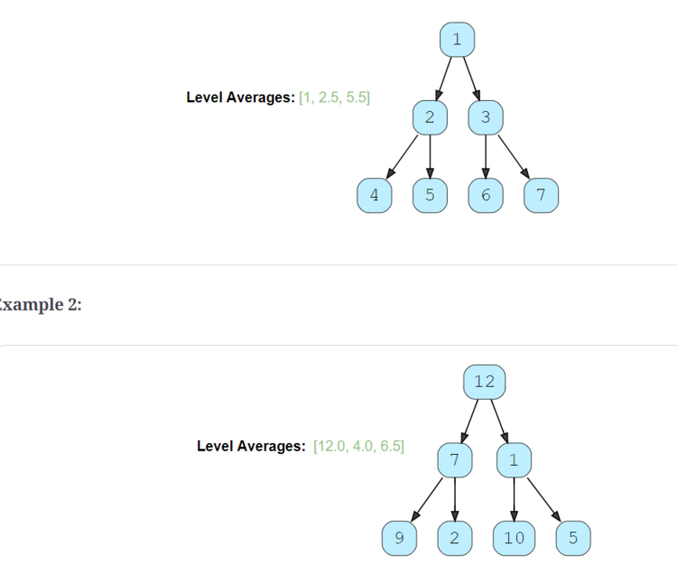

code:

```c++
vector<double> findLevelAverages(TreeNode *root) {
    vector<double> result;
    queue<TreeNode *> queue;

    if (root == NULL) {
        return result;
    }

    queue.push(root);
    while (!queue.empty()) {
        int levelSize = queue.size();
        vector<int> currentLevel(levelSize);
        double levelSum = 0;

        for (int i = 0; i < levelSize; i++) {
            TreeNode *currentNode = queue.front();
            queue.pop();
            
            levelSum += currentNode->val;

            if (currentNode->left != NULL) {
                queue.push(currentNode->left);
            }
            if (currentNode->right != NULL) {
                queue.push(currentNode->right);
            }
        }
        result.push_back(levelSum / levelSize);
    }
    return result;
}
```

Time Complexity : *O*(N)

Space Complexity : *O*(N)

相似问题1：

> 求每一层的最大值,和最小值

code：

```c++
vector<vector<int>> findLevelLargestAndSmallest(TreeNode *root) {
    vector<vector<int>> result;
    queue<TreeNode *> queue;

    if (root == NULL) {
        return result;
    }

    queue.push(root);
    while (!queue.empty()) {
        int levelSize = queue.size();
        vector<int> currentLevel(levelSize);
        int maxValue = INT_MIN;
        int minValue = INT_MAX;
        for (int i = 0; i < levelSize; i++) {
            TreeNode *currentNode = queue.front();
            queue.pop();

            maxValue = max(maxValue, currentNode->val);
            minValue = min(minValue, currentNode->val);
            if (currentNode->left != NULL) {
                queue.push(currentNode->left);
            }
            if (currentNode->right != NULL) {
                queue.push(currentNode->right);
            }
        }
        result.push_back({maxValue, minValue});
    }
    return result;
}
```

Time Complexity : *O*(N)

Space Complexity : *O*(N)

### 6、minimum depth of a binary tree

> 求二叉树最小深度

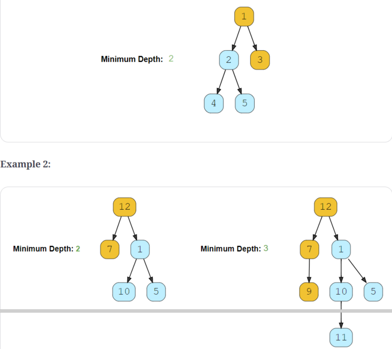

code:

```c++
int  findMinDepth(TreeNode *root) {
    if (root == NULL) {
        return 0;
    }

    int minimumTreeDepth=0;
    queue<TreeNode*> queue;

    queue.push(root);
    while (!queue.empty()) {
        minimumTreeDepth++;
        int levelSize = queue.size();
        
        for (int i = 0; i < levelSize; i++) {
            TreeNode *currentNode = queue.front();
            queue.pop();

            if(currentNode->left==NULL&&currentNode->right==NULL){
                //一旦遇到叶子节点，结束
                return minimumTreeDepth;
            }

            if (currentNode->left != NULL) {
                queue.push(currentNode->left);
            }
            if (currentNode->right != NULL) {
                queue.push(currentNode->right);
            }
        }
    }
    return minimumTreeDepth;
}
```

Time Complexity : *O*(N)

Space Complexity : *O*(N)

相似问题：

> 求二叉树最大深度

code:

```c++
int findMaxDepth(TreeNode *root) {
    if (root == NULL) {
        return 0;
    }

    int maximumTreeDepth = 0;
    queue<TreeNode *> queue;

    queue.push(root);
    while (!queue.empty()) {
        
        maximumTreeDepth++;
        int levelSize = queue.size();

        for (int i = 0; i < levelSize; i++) {
            TreeNode *currentNode = queue.front();
            queue.pop();
			//一直遍历
            if (currentNode->left != NULL) {
                queue.push(currentNode->left);
            }
            if (currentNode->right != NULL) {
                queue.push(currentNode->right);
            }
        }
    }
    return maximumTreeDepth;
}
```

Time Complexity : *O*(N)

Space Complexity : *O*(N)

### 7、level order successor

> 求层序遍历某一节点的后继

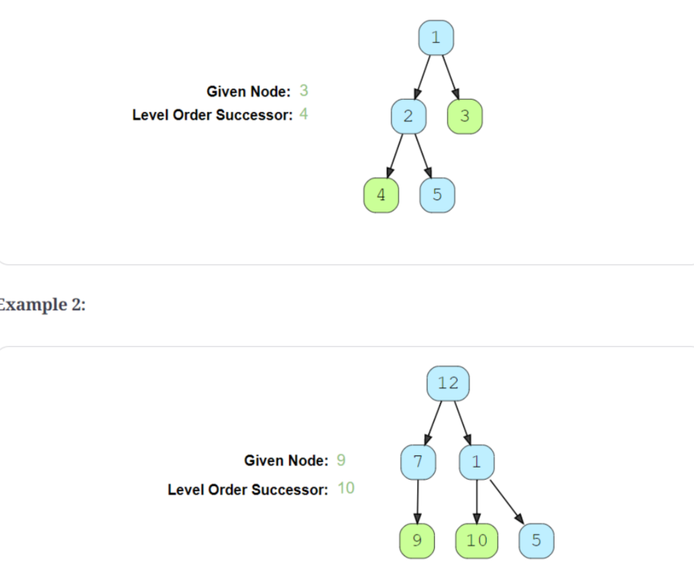

code:

```c++
TreeNode *findSuccessor(TreeNode *root, int key) {
    if (root == NULL) {
        return NULL;
    }

    queue<TreeNode *> queue;

    queue.push(root);
    while (!queue.empty()) {

        TreeNode *currentNode = queue.front();
        queue.pop();

        if (currentNode->left != NULL) {
            queue.push(currentNode->left);
        }
        if (currentNode->right != NULL) {
            queue.push(currentNode->right);
        }
        if (currentNode->val == key) {
            break;
        }
    }
    return queue.front();
}
```

Time Complexity : *O*(N)

Space Complexity : *O*(N)

### 8、connect level order siblings

> 让所有节点指向其层序遍历的后继，每一层最后一个节点指向NULL

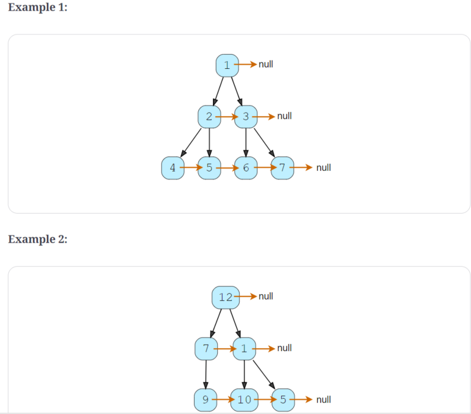

code:

```c++
struct TreeNode {
    int val;
    TreeNode *left;
    TreeNode *right;
    TreeNode *next;

    TreeNode(int x) : val(x), left(NULL), right(NULL), next(NULL) {}
};

void connect(TreeNode *root) {
    if (root == NULL) {
        return;
    }

    queue<TreeNode *> queue;

    queue.push(root);
    while (!queue.empty()) {
        TreeNode *previousNode = NULL;
        int levelSize = queue.size();

        for (int i = 0; i < levelSize; i++) {
            TreeNode *currentNode = queue.front();
            queue.pop();

            if (previousNode != NULL) {
                previousNode->next = currentNode;
            }

            previousNode = currentNode;

            if (currentNode->left != NULL) {
                queue.push(currentNode->left);
            }
            if (currentNode->right != NULL) {
                queue.push(currentNode->right);
            }
        }
    }
}
```

Time Complexity : *O*(N)

Space Complexity : *O*(N)

### 9、connect all level order siblings

> 连接层序遍历的后继节点

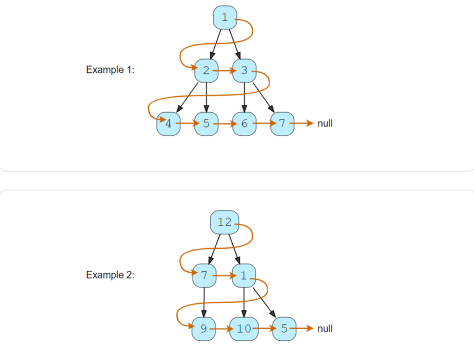

code:

```c++
struct TreeNode {
    int val;
    TreeNode *left;
    TreeNode *right;
    TreeNode *next;

    TreeNode(int x) : val(x), left(NULL), right(NULL), next(NULL) {}
};

void connect(TreeNode *root) {
    if (root == NULL) {
        return;
    }

    queue<TreeNode *> queue;

    queue.push(root);
    TreeNode *previousNode = NULL;
    TreeNode *currentNode = NULL;
    while (!queue.empty()) {

        int levelSize = queue.size();

        for (int i = 0; i < levelSize; i++) {
            currentNode = queue.front();
            queue.pop();

            if (previousNode != NULL) {
                previousNode->next = currentNode;
            }
            previousNode = currentNode;

            if (currentNode->left != NULL) {
                queue.push(currentNode->left);
            }
            if (currentNode->right != NULL) {
                queue.push(currentNode->right);
            }
        }
    }
}
```

Time Complexity : *O*(N)

Space Complexity : *O*(N)

### 10、right view of a binary tree

> 求二叉树从右侧看到的所有节点

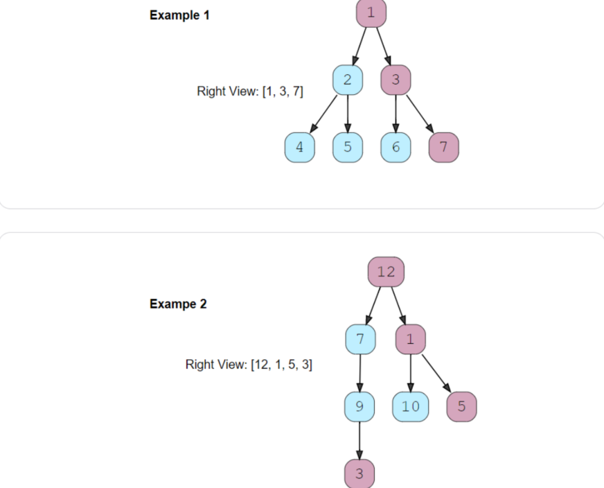

code:

```c++
vector<TreeNode *> traverse(TreeNode *root) {
    vector<TreeNode *> result;
    queue<TreeNode *> queue;

    if (root == NULL) {
        return result;
    }

    queue.push(root);
    while (!queue.empty()) {
        int levelSize = queue.size();
        vector<int> currentLevel(levelSize);


        for (int i = 0; i < levelSize; i++) {
            TreeNode *currentNode = queue.front();
            queue.pop();

            //如果是这一层的最后一个节点放入result;
            if (i == levelSize - 1) {
                result.push_back(currentNode);
            }

            if (currentNode->left != NULL) {
                queue.push(currentNode->left);
            }
            if (currentNode->right != NULL) {
                queue.push(currentNode->right);
            }
        }
    }
    return result;
}
```

Time Complexity : *O*(N)

Space Complexity : *O*(N)

相似问题：

> 求二叉树从左侧看到的所有节点

```c++
vector<TreeNode *> traverse(TreeNode *root) {
    vector<TreeNode *> result;
    queue<TreeNode *> queue;

    if (root == NULL) {
        return result;
    }

    queue.push(root);
    while (!queue.empty()) {
        int levelSize = queue.size();
        vector<int> currentLevel(levelSize);


        for (int i = 0; i < levelSize; i++) {
            TreeNode *currentNode = queue.front();
            queue.pop();

            //如果是这一层的第一个节点放入result;
            if (i == 0) {
                result.push_back(currentNode);
            }

            if (currentNode->left != NULL) {
                queue.push(currentNode->left);
            }
            if (currentNode->right != NULL) {
                queue.push(currentNode->right);
            }
        }
    }
    return result;
}
```

Time Complexity : *O*(N)

Space Complexity : *O*(N)

### 11、tree boundary

> 逆时针输出二叉树的所有边界节点

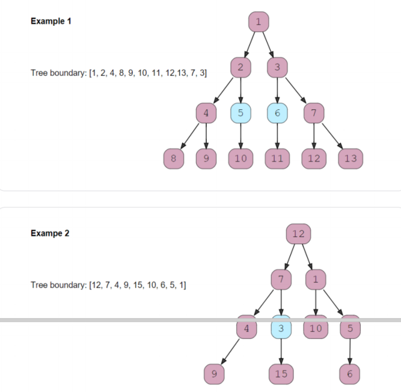

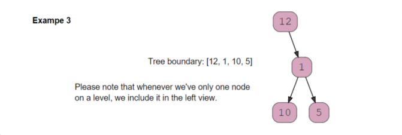

code:

```c++
vector<TreeNode *> findLeavesDFS(TreeNode *root) {
    vector<TreeNode *> leaves;
    stack<TreeNode *> stack;
    stack.push(root);
    while (!stack.empty()) {
        TreeNode *currentNode = stack.top();
        stack.pop();
        if (currentNode->left == NULL && currentNode->right == NULL) {
            leaves.push_back(currentNode);

        }
        if (currentNode->right != NULL) {
            stack.push(currentNode->right);
        }
        if (currentNode->left != NULL) {
            stack.push(currentNode->left);
        }

    }
    return leaves;

}

vector<TreeNode *> findBoundary(TreeNode *root) {
    if (root == NULL) {
        return vector<TreeNode *>();
    }
    vector<TreeNode *> result;
    vector<TreeNode *> leftView;
    deque<TreeNode *> rightView;

    queue<TreeNode *> queue;
    queue.push(root);
    while (!queue.empty()) {
        int levelSize = queue.size();
        vector<int> currentLevel(levelSize);


        for (int i = 0; i < levelSize; i++) {
            TreeNode *currentNode = queue.front();
            queue.pop();

            //如果是这一层的最后一个节点放入result;
            if (currentNode->left == NULL && currentNode->right == NULL) {
                continue;
            } else if (i == 0) {
                leftView.push_back(currentNode);
            } else if (i == levelSize - 1) {
                rightView.push_front(currentNode);
            }

            if (currentNode->left != NULL) {
                queue.push(currentNode->left);
            }
            if (currentNode->right != NULL) {
                queue.push(currentNode->right);
            }
        }
    }
    vector<TreeNode *> leaves = findLeavesDFS(root);

    result.insert(result.end(), leftView.begin(), leftView.end());
    result.insert(result.end(), leaves.begin(), leaves.end());
    copy(begin(rightView), end(rightView), back_inserter(result));

    return result;
}
```

Time Complexity : *O*(N)

Space Complexity : *O*(N)