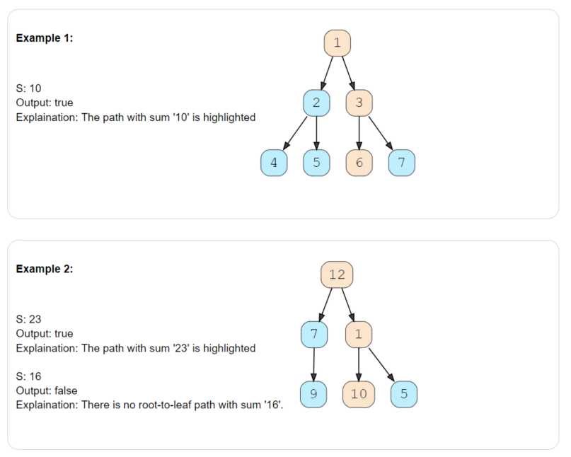
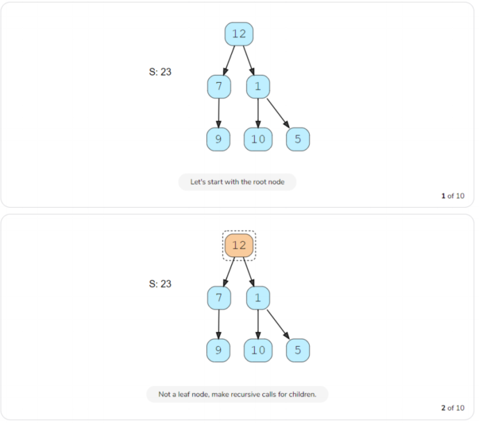
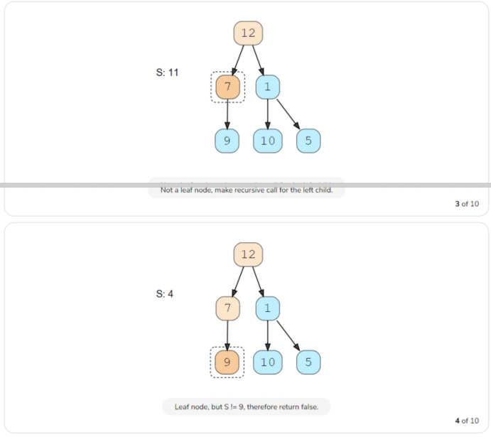
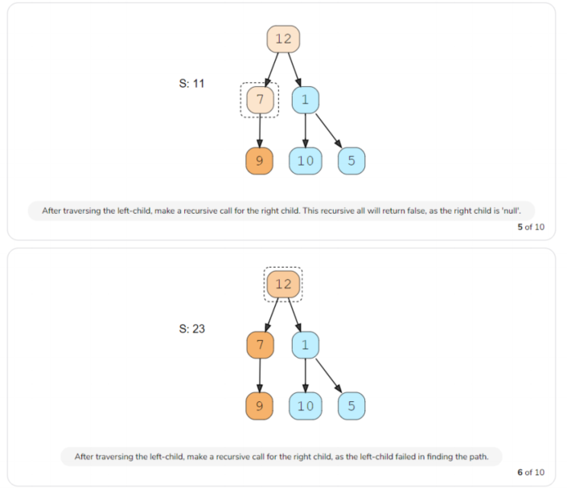
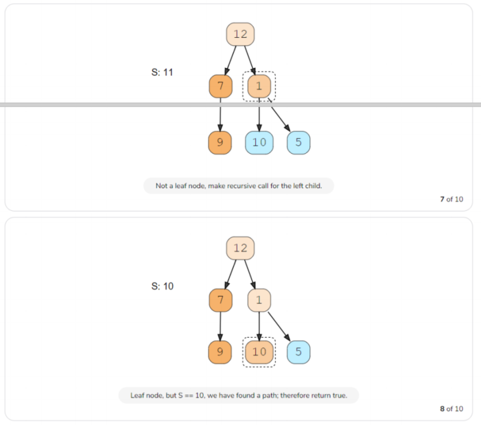
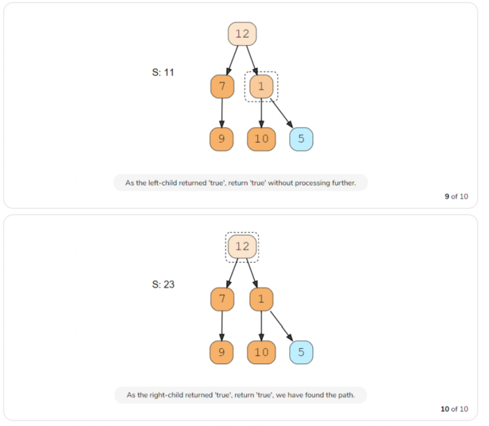
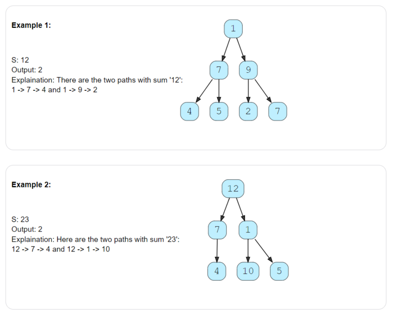
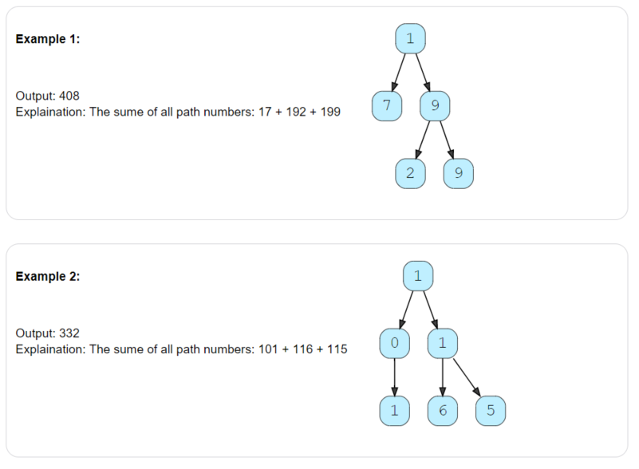
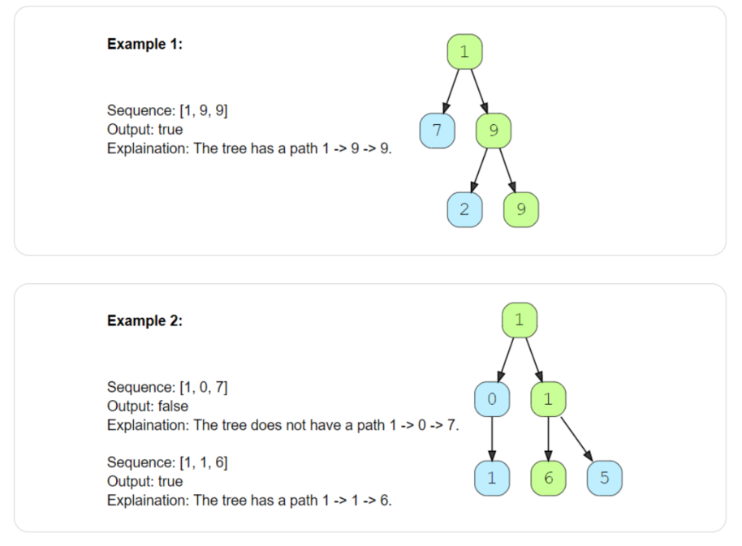
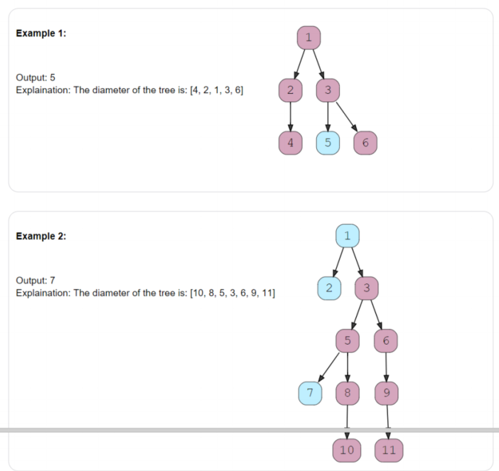

## 1、introduction

> 深度遍历，树的一种遍历方式，在遍历过程中用递归或栈记录所有父节点

## 2、binary tree path sum

> 给定二叉树和数S，判断是否有从根到叶子的路径，使得此路径所有节点的和等于S



code:

```c++
bool hasPath(TreeNode *root, int sum) {
    if (root == NULL) {
        return false;
    }
    if (root->val == sum && root->left == NULL && root->right == NULL) {
        return true;
    }

    return hasPath(root->left, sum - root->val) || 
           hasPath(root->right, sum - root->val);
}
```











Time Complexity : *O*(N)

Space Complexity : *O*(N)

## 3、all Paths for a sum

> 给定二叉树和数S，求所有从根到叶子的路径，路径所有节点的和等于S



code:

```c++

void findPathRecursive(TreeNode *currentNode, int sum,
           vector<int> &currentPath, vector<vector<int>> &allPaths) {

    if (currentNode == NULL) {
        return;
    }

    currentPath.push_back(currentNode->val);
    if (currentNode->val == sum && currentNode->left == NULL && currentNode->right == NULL) {
        allPaths.push_back(vector<int>(currentPath));

    } else {
        findPathRecursive(currentNode->left, sum - currentNode->val, currentPath, allPaths);
        
        findPathRecursive(currentNode->right, sum - currentNode->val, currentPath, allPaths);
    }
    //为了回溯,删除currentNode
    currentPath.pop_back();
}

vector<vector<int>> findPaths(TreeNode *root, int sum) {
    vector<vector<int>> allPaths;
    vector<int> currentPath;

    findPathRecursive(root, sum, currentPath, allPaths);
    
    return allPaths;
}
```

Time Complexity : *O*(*N*^2)

Space Complexity : *O*(*N* log*N*)

相似问题1：

> 求所有根到叶子的路径

```c++
void findAllPathRecursive(TreeNode *currentNode,
                       vector<int> &currentPath, vector<vector<int>> &allPaths) {

    if (currentNode == NULL) {
        return;
    }
    currentPath.push_back(currentNode->val);

    if ( currentNode->left == NULL && currentNode->right == NULL) {
        allPaths.push_back(vector<int>(currentPath));

    }else{
        findAllPathRecursive(currentNode->left,  currentPath, allPaths);
        findAllPathRecursive(currentNode->right, currentPath, allPaths);
    }
    
    //为了回溯，删除currentNode,
    currentPath.pop_back();
}

vector<vector<int>> findAllPaths(TreeNode *root) {
    vector<vector<int>> allPaths;
    vector<int> currentPath;

    findAllPathRecursive(root,currentPath, allPaths);

    return allPaths;
}
```


相似问题2：

> 和最大的路径

```c++
void findMaxPathRecursive(TreeNode *currentNode,
                          int &currentSum, int &maxPathSum) {

    if (currentNode == NULL) {
        return;
    }
    currentSum += currentNode->val;

    if (currentNode->left == NULL && currentNode->right == NULL) {
        maxPathSum = max(maxPathSum, currentSum);

    } else {
        findMaxPathRecursive(currentNode->left, currentSum, maxPathSum);
        findMaxPathRecursive(currentNode->right, currentSum, maxPathSum);
    }

    //为了回溯，删除currentNode-val,
    currentSum -= currentNode->val;
}

int findMaxPath(TreeNode *root) {
    int maxPathSum = INT_MIN;
    int currentSum = 0;

    findMaxPathRecursive(root, currentSum, maxPathSum);

    return maxPathSum;
}
```


## 4、sum of path numbers

> 给定二叉树，节点值在 0 - 9，从根到叶子节点的代表一个整数，求所有路径之和



code:

```c++
int findRootToLeafPathNumbers(TreeNode *currentNode, int pathSum) {

    if (currentNode == NULL) {
        return 0;
    }

    pathSum = 10 * pathSum + currentNode->val;

    if (currentNode->left == NULL && currentNode->right == NULL) {
        return pathSum;

    }

    return findRootToLeafPathNumbers(currentNode->left, pathSum) +
           findRootToLeafPathNumbers(currentNode->right, pathSum);
}

int findSumOfPathNUmbers(TreeNode *root) {

    return findRootToLeafPathNumbers(root, 0);
}
```

Time Complexity : *O*(*N*)

Space Complexity : *O*(*N*)

## 5、path with given sequence

> 给定二叉树和序列，序列代表从根到叶子节点的路径，判断序列代表的路径是否在树上



code:

```c++

bool findPathRecursive(TreeNode *currentNode, const vector<int> &sequence, int sequenceIndex) {
    if (currentNode == NULL) {
        return false;
    }
    

    if (sequenceIndex >= sequence.size() || currentNode->val != sequence[sequenceIndex]) {
        return false;
    }
    if (currentNode->left == NULL && currentNode->right == NULL && sequenceIndex == sequence.size() - 1) {
        return true;
    }

    return findPathRecursive(currentNode->left, sequence, sequenceIndex + 1) ||
           findPathRecursive(currentNode->right, sequence, sequenceIndex + 1);

}

bool findPath(TreeNode *root, const vector<int> &sequence) {
    if (root == NULL) {
        return sequence.empty();
    }

    return findPathRecursive(root, sequence, 0);
}
```

Time Complexity : *O*(*N*)

Space Complexity : *O*(*N*)

## 6、tree diameter

> 给定二叉树，求其diameter(直径)：两叶子结点之间的最长路径。最长直径可能不经过根节点。



code:

```c++
int calculateHeight(TreeNode *currentNode, int &treeDiameter) {
    if (currentNode == NULL) {
        return 0;
    }

    int leftTreeHeight = calculateHeight(currentNode->left, treeDiameter);
    int rightTreeHeight = calculateHeight(currentNode->right, treeDiameter);
    //currentNode的直径是左子树的高度+右子树的高度+1
    int diameter = leftTreeHeight + rightTreeHeight + 1;

    //更新整个树的最大直径
    treeDiameter = max(treeDiameter, diameter);

    return max(leftTreeHeight, rightTreeHeight) + 1;
}

int findDiameter(TreeNode *root) {
    int treeDiameter = 0;
    calculateHeight(root, treeDiameter);
    return treeDiameter;
}
```

Time Complexity : *O*(*N*)

Space Complexity : *O*(*N*)

## 7、path with max sum

> 给定二叉树， 求任意两节点之间路径的最大和，不必经过根节点


code:

```c++
int findMaximumPathSumRecursive(TreeNode *currentNode, int &globalMaximumSum) {
    if (currentNode == NULL) {
        return 0;
    }

    int maxPathSumFromLeft = findMaximumPathSumRecursive(currentNode->left, globalMaximumSum);
    int maxPathSumFromRight = findMaximumPathSumRecursive(currentNode->right, globalMaximumSum);

    //忽略sum=0 的path
    maxPathSumFromLeft = max(maxPathSumFromLeft, 0);
    maxPathSumFromRight = max(maxPathSumFromRight, 0);

    //当前节点的maximumPathSum
    int localMaximumSum = maxPathSumFromLeft + maxPathSumFromRight + currentNode->val;

    //更新全局maximum Sum
    globalMaximumSum = max(globalMaximumSum, localMaximumSum);

    //经过当前节点所有路径中最大的Sum
    return max(maxPathSumFromLeft, maxPathSumFromRight) + currentNode->val;

}

int findMaximumPathSum(TreeNode *root) {
    int globalMaximum = INT_MIN;
    findMaximumPathSumRecursive(root, globalMaximum);
    return globalMaximum;
}
```

Time Complexity : *O*(*N*)

Space Complexity : *O*(*N*)