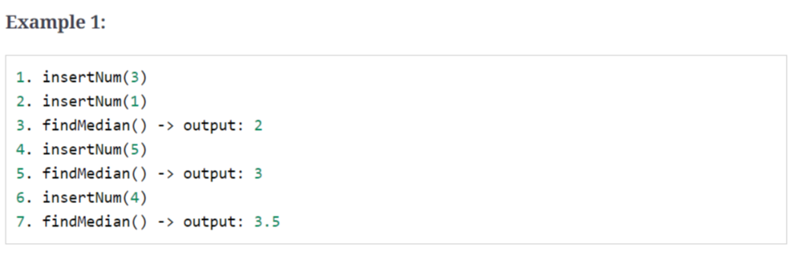

## 1、introduction

给定一组可以划分成两个部分的元素，要求我们求一部分的最小元素，另一部分的最大元素，用two heaps ：Min Heap和Max Heap，可以解决这类的问题，。

## 2、find the median of a number stream

> 设计一个类，能够计算数据流中的中位数，类必须包含两个函数：
>
> insertNum(int num) :存储数据
>
> findMedian() : 返回所有存储进类的数据流的中位数

> 如果数据为奇数个，则中位数为中间两个数之和



code:

```c++
class MedianOfStream{
    priority_queue<int> maxHeap;
    priority_queue<int,vector<int>,greater<int>> minHeap;

    void insertNum(int num){
        //小数存储在大顶堆，大数存储在小顶堆
        //大顶堆个数==[小顶堆，小顶堆+1]
        if(maxHeap.empty()||maxHeap.top()>=num){
            maxHeap.push(num);
        } else{
            minHeap.push(num);
        }


        if(maxHeap.size()>minHeap.size()+1){
            minHeap.push(maxHeap.top());
            maxHeap.pop();
        }else if(maxHeap.size()<minHeap.size()){
            maxHeap.push(minHeap.top());
            minHeap.pop();
        }
    }

    double findMedian(){
        if(maxHeap.size()==minHeap.size()){
            return (maxHeap.top()+minHeap.top())/2.0
        }
        return maxHeap.top()
    }
};
```


## 3、sliding window median

> 给定数组和K值，求所有长度为k的连续子数组的中位数

```c++
input:	[1, 2, -1, 3, 5]， k=2
    
output:	[1.5, 0.5, 1.0, 4.0]
```

```c++
input:	[1, 2, -1, 3, 5]， k=3
    
output:	[1.0, 2.0, 3.0]
```

code:

```c++
同上 + 滑动窗口 + 增加queue删除特定的值？
```

Time Complexity : *O*(*N \* K*)

Space Complexity : *O*(*K*)

## 4、maximun capital

> 给定一组投资项目，已知项目所需投资资金，项目盈利、初始资金、投资的项目个数，求最大剩余的资金

> 先前投资的（盈利+本钱）可作为后续投资的资金 , 

```c++
input:	project capitals:[0, 1 ,2]
		project profits:[1, 2, 3]
		initial capital:1
		number of project:2
            
output:	6
    
explanations：
    1、先投资第2个(所需资金1，盈利2)项目。得到1+2=3(本金+盈利)投资基金
    2、再投资第3个(所需资金2，盈利3)项目。得到3+3=6(本金+盈利)投资基金
```

```c++
input:	project capitals:[0, 1 ,2, 3]
		project profits:[1, 2, 3, 5]
		initial capital:0
		number of project:3
            
output:	8
    
explanations：
    1、先投资第1个(所需资金0，盈利1)项目。得到0+1=1(本金+盈利)投资基金
    2、再投资第2个(所需资金1，盈利2)项目。得到1+2=3(本金+盈利)投资基金
    3、再投资第4个(所需资金3，盈利5)项目。得到3+5=8(本金+盈利)投资基金
```

code:

```c++
struct cmp_greater_capital {
    bool operator()(const pair<int, int> &x, const pair<int, int> &y) {
        return x.first > y.first;
    }
};

struct cmp_smaller_profit {
    bool operator()(const pair<int, int> &x, const pair<int, int> &y) {
        return x.first < y.first;
    }
};

int maximumCapitals(const vector<int> &capital, const vector<int> &profits, int numOfProject, int initialCapital) {
    int n = profits.size();
    priority_queue<pair<int, int>, vector<pair<int, int>>, cmp_greater_capital> minCapitalHeap;

    priority_queue<pair<int, int>, vector<pair<int, int>>, cmp_smaller_profit> maxProfitHeap;


    for (int i = 0; i < n; i++) {
        minCapitalHeap.push(make_pair(capital[i], i));
    }

    int result = initialCapital;

    for (int i = 0; i < numOfProject; i++) {
        while (!minCapitalHeap.empty() && minCapitalHeap.top().first <= result) {
            auto capitalIndex = minCapitalHeap.top().second;
            minCapitalHeap.pop();
            maxProfitHeap.push({profits[capitalIndex], capitalIndex});
        }

        if (maxProfitHeap.empty()) {
            break;
        }

        result += maxProfitHeap.top().first;
        maxProfitHeap.pop();
    }
    return result;
}
```

Time Complexity : *O*(*N log N* + *K log K*)

Space Complexity : *O*(*N*)

## 5、next interval

> 没看懂