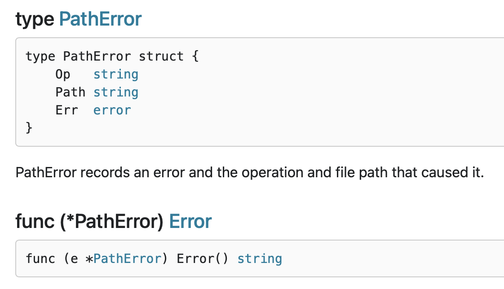
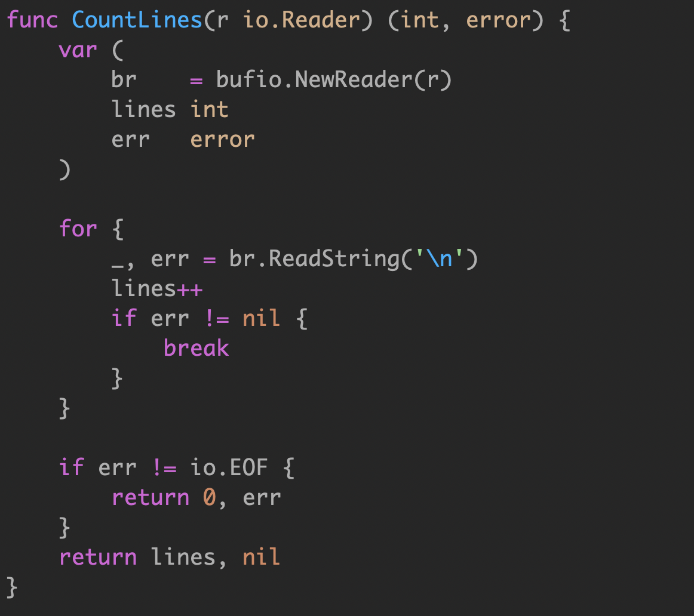
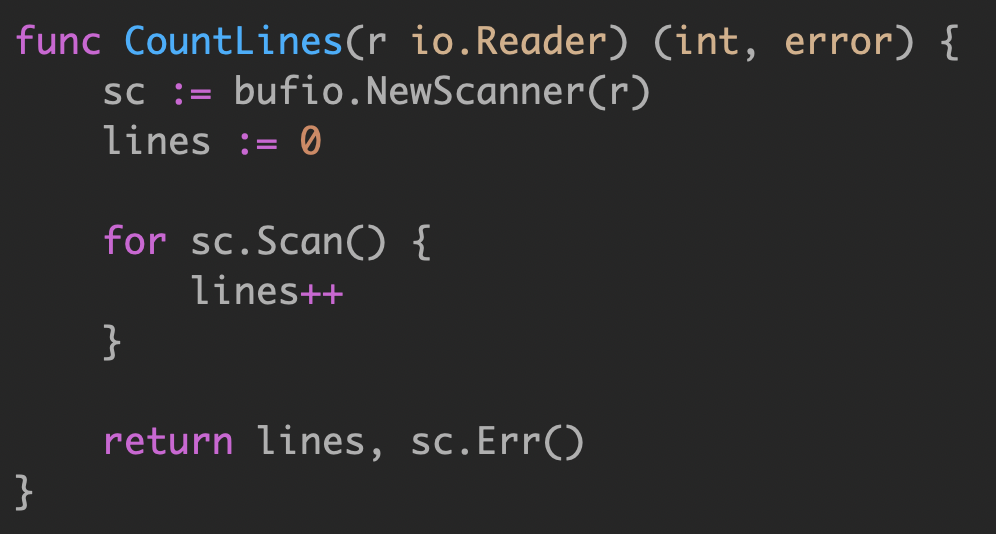
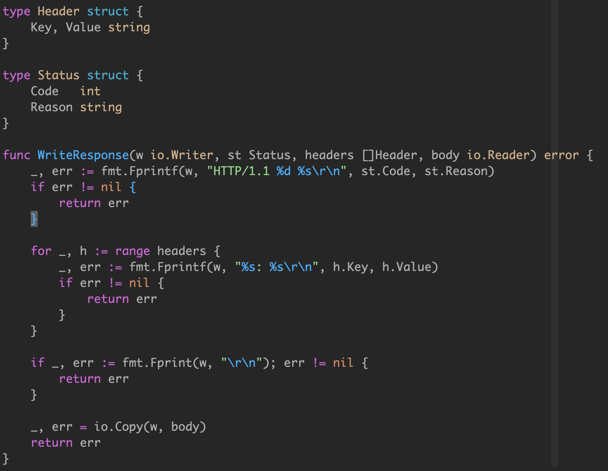
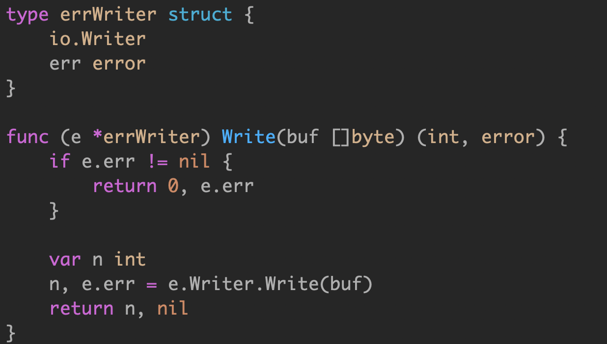
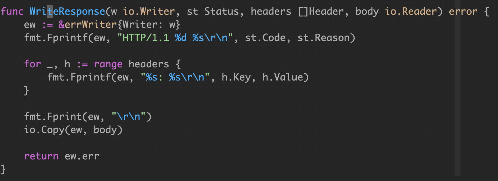

### 0. error vs exception

各个语言的演进历史：

C：单返回值，一般通过传递指针作为入参，返回值为 int 表示成功还是失败。

```c
  ngx_int_t ngx_create_path(ngx_file_t *file, ngx_path_t *path);
```

C++：引入了 exception，但是无法知道被调用方会抛出什么异常。

Java：

```java
catch (e Exception) { // ignore }
```

引入了 checked exception，方法的所有者必须申明，调用者必须处理。在启动时抛出大量的异常是司空见惯的事情，并在它们的调用堆栈中尽职地记录下来。Java 异常不再是异常，而是变得司空见惯了。它们从良性到灾难性都有使用，异常的严重性由函数的调用者来区分。

<br>

Go 的处理异常逻辑是不引入 exception，支持多参数返回，所以你很容易的在函数签名中带上实现了 error interface 的对象，交由调用者来判定。

> 如果一个函数返回了 value, error，你不能对这个 value 做任何假设，必须先判定 error。唯一可以忽略 error 的是，如果你连 value 也不关心。

Go 中有 panic 的机制，如果你认为和其他语言的 exception 一样，那你就错了。当我们抛出异常的时候，相当于你把 exception 扔给了调用者来处理。

> 比如，你在 C++ 中，把 string 转为 int，如果转换失败，会抛出异常。或者在 java 中转换 string 为 date 失败时，会抛出异常。

Go panic 意味着 fatal error(就是挂了)。不能假设调用者来解决 panic，意味着代码不能继续运行。


> 使用多个返回值和一个简单的约定，Go 解决了让程序员知道什么时候出了问题，并为真正的异常情况保留了 panic。因此panic只在特殊情况下使用，即您的代码不可能继续使用的情况。

<br>

野生goroutine：待查找资料

对于真正意外的情况，那些表示不可恢复的程序错误，例如索引越界、不可恢复的环境问题、栈溢出，我们才使用 panic。对于其他的错误情况，我们应该是期望使用 error 来进行判定。

panic 使用的情形：毛剑老师：如：main函数强依赖服务未初始化成功、配置文件信息未配置成功

<br>

go语言 `errror `哲学

> 简单。
>
> 考虑失败，而不是成功(Plan for failure, not success)。
>
> 没有隐藏的控制流。
>
> 完全交给你来控制 error。
>
> Error are values。

#### panic 处理

常出现panic的地方就是,开了`goroutinue`，其内部出现panic，从而导致整个进程挂掉。

```go
package main

import (
	"fmt"
	"time"
)

func main()  {

	fmt.Println("main start")
	go func() {

		fmt.Println("goroutine start")
		panic("一路向西")
		fmt.Println("goroutine end")
	}()

	time.Sleep(4*time.Second)

	fmt.Println("main end")
}
```

output：

```go
main start
goroutine start
panic: 一路向西

goroutine 6 [running]:
main.main.func1()
        I:/Go/GeekTime/week2/6.painc.go:14 +0xa5
created by main.main
        I:/Go/GeekTime/week2/6.painc.go:11 +0x9d
exit status 2

```

**解决**

不会挂掉

```go
import (
	"fmt"
	"time"
)

func main()  {
	fmt.Println("main start")

	gohandlepanic(func() {

		fmt.Println("goroutine start")
		panic("一路向西")
		fmt.Println("goroutine end")
	})

	time.Sleep(4*time.Second)
	
	fmt.Println("main end")
}

func gohandlepanic(x func())  {
	go func() {
		defer func() {
			if err:=recover();err!=nil{
				fmt.Println(err)
				// handle err
			}
		}()

		x()

	}()
}
```

output:

```go
main start
goroutine start
一路向西
main end
```

### 1. error 接口

go语言中`error`是个接口

```go
// http://golang.org/pkg/buildin/#error

// The error built-in interface type is the conventional interface for
// representing an error condition, with the nil value representing no error.
type error interface {
	Error() string
}
```

我们经常使用` errors.New()` 来返回一个 error 对象。`errors.New() `返回的是 内部` errorString` 对象的指针。

```go
// http://golang.org/src/pkg/errors/errors.go

// New returns an error that formats as the given text.
// Each call to New returns a distinct error value even if the text is identical.
// 返回指针类型，确保每次error的结果都不同
func New(text string) error {
	return &errorString{text}
}

// errorString is a trivial implementation of error.
// 实现了error这个接口
type errorString struct {
	s string
}

func (e *errorString) Error() string {
	return e.s
}
```

值类型和指针类型

```go
// 自定义的errorString
type errorString struct {
	s string
}

func New(text string) error {
	return errorString{text}
}


func (e errorString) Error() string {
	return e.s
}

var ErrType =New("EOF")

func main()  {
	if ErrType==New("EOF"){
		fmt.Println("Error",ErrType)
	}
}
```

output:

```go
Error EOF
```

意味着只要New()传入的text文本一致，error就会相等。如果某些情况下自定义的error和其他库的error相等(瞎猫碰上死耗子)，导致错误。因此New()必须返回指针类型的结构体。

<br>

```go
// 自定义的errorString

type errorString string

// 值类型
func New(text string) error {
	return errorString(text)
}

func (s errorString) Error() string {
	return string(s)
}

var ErrNamedType =New("EOF")

//标准库的error
var ErrStructType =errors.New("EOF")


func main()  {

	if ErrNamedType==New("EOF"){
		fmt.Println("Named type Error")
	}

	if ErrStructType==errors.New("EOF"){
		fmt.Println("Struct Type Error")
	}
}
```

output：

```go
Named Type Error
```


### 2. Sentinel Error

预定义的特定错误，我们叫为 sentinel error，这个名字来源于计算机编程中使用一个特定值来表示不可能进行进一步处理的做法。所以对于 Go，我们使用特定的值来表示错误。

```go
if err == ErrSomething {
    
}
```

如

```go
// https://golang.org/src/bufio/bufio.go

// 错误信息：包名加上错误信息
// 首字母大写，外部包可以用
var (
	ErrInvalidUnreadByte = errors.New("bufio: invalid use of UnreadByte")
	ErrInvalidUnreadRune = errors.New("bufio: invalid use of UnreadRune")
	ErrBufferFull        = errors.New("bufio: buffer full")
	ErrNegativeCount     = errors.New("bufio: negative count")
)


// https://golang.org/src/io/io.go

// ErrShortWrite means that a write accepted fewer bytes than requested
// but failed to return an explicit error.
var ErrShortWrite = errors.New("short write")

// ErrShortBuffer means that a read required a longer buffer than was provided.
var ErrShortBuffer = errors.New("short buffer")

// EOF is the error returned by Read when no more input is available.
// Functions should return EOF only to signal a graceful end of input.
// If the EOF occurs unexpectedly in a structured data stream,
// the appropriate error is either ErrUnexpectedEOF or some other error
// giving more detail.
var EOF = errors.New("EOF")

// ErrUnexpectedEOF means that EOF was encountered in the
// middle of reading a fixed-size block or data structure.
var ErrUnexpectedEOF = errors.New("unexpected EOF")

// ErrNoProgress is returned by some clients of an io.Reader when
// many calls to Read have failed to return any data or error,
// usually the sign of a broken io.Reader implementation.
var ErrNoProgress = errors.New("multiple Read calls return no data or error")

```

使用 sentinel 值是最不灵活的错误处理策略，因为调用方必须使用 == 将结果与预先声明的值进行比较。当您想要提供更多的上下文时,比如预先声明的值发生改变，调用方也需要改变，返回一个不同的错误将破坏相等性检查。

甚至是一些有意义的 `fmt.Errorf `携带一些上下文，也会破坏调用者的 == ，调用者将被迫查看 `error.Error() `方法的输出，以查看它是否与特定的字符串匹配。


不依赖检查 error.Error 的输出。

> 不应该依赖检测 error.Error 的输出，Error 方法存在于 error 接口主要用于方便程序员使用，但不是程序(编写测试可能会依赖这个返回)。这个输出的字符串用于记录日志、输出到 stdout 等。


Sentinel errors 成为你 API 公共部分。

> 如果您的公共函数或方法返回一个特定值的错误，那么该值必须是公共的，当然要有文档记录，这会增加 API 的表面积。
>
> 如果 API 定义了一个返回特定错误的 interface，则该接口的所有实现都将被限制为仅返回该错误，即使它们可以提供更具描述性的错误。
>
>  比如 io.Reader。像 io.Copy 这类函数需要 reader 的实现者比如返回 io.EOF 来告诉调用者没有更多数据了，但这又不是错误。


Sentinel errors 在两个包之间创建了依赖。

> sentinel errors 最糟糕的问题是它们在两个包之间创建了源代码依赖关系。
>
> 例如，检查错误是否等于 io.EOF，您的代码必须导入 io 包。这个特定的例子听起来并不那么糟糕，因为它非常常见，但是想象一下，当项目中的许多包导出错误值时，存在耦合，项目中的其他包必须导入这些错误值才能检查特定的错误条件(in the form of an import loop)。

结论: 尽可能避免 sentinel errors。

> 我的建议是避免在编写的代码中使用 sentinel errors。在标准库中有一些使用它们的情况，但这不是一个您应该模仿的模式。

### 3.自定义的Error

Error type 是实现了 error 接口的自定义类型。例如 MyError 类型记录了文件和行号以展示发生了什么。

```go
package main

import "fmt"

type MyError struct {
	Msg string
	File string
	Line int
}

func (e *MyError) Error()string  {
	return fmt.Sprintf("%s:%d: %s",e.File,e.Line,e.Msg)
}

func test()error  {
	return &MyError{"Something happened", "server.go",42}
}

func main()  {
	err:=test()

	switch merr:=err.(type) {
	case *MyError:
		// call succeed ,nothing to do
		fmt.Println("err occurred on line:",merr.Line)
	default:
		// unknown error
	}
}
```

因为` MyError` 是一个 type，调用者可以使用断言转换成这个类型，来获取更多的上下文信息。 

与错误值相比，错误类型的一大改进是它们能够包装底层错误以提供更多上下文。

一个不错的例子就是` os.PathError `他提供了底层执行了什么操作、那个路径出了什么问题。



调用者要使用类型断言和类型 switch，就要让自定义的 error 变为 public。这种模型会导致和调用者产生强耦合，从而导致 API 变得脆弱。

结论是尽量避免使用 error types，虽然错误类型比 sentinel errors 更好，因为它们可以捕获关于出错的更多上下文，但是 error types 共享 error values 许多相同的问题。

因此，我的建议是避免错误类型，或者至少避免将它们作为公共 API 的一部分。

### 4. Opaque Error

不透明错误，在我看来，这是最灵活的错误处理策略，因为它要求代码和调用者之间的耦合最少。

因为虽然您知道发生了错误，但您没有能力看到错误的内部。作为调用者，只知道操作的结果，您所知道的就是它起成功了还是失败了。

这就是不透明错误处理的全部功能：**只需返回错误而不假设其内容**。

```go
func demo()  {
	res,err := testfunc()
	if err !=nil{
        handle(err)
	}
	
	handle(res)
}
```

在少数情况下，这种二分错误处理方法是不够的。例如，与进程外的世界进行交互(如网络活动)，**需要调用方调查错误的性质，以确定重试该操作是否合理**。

在这种情况下，我们可以**断言错误实现了特定的行为，而不是断言错误是特定的类型或值**。考虑这个例子：

```go
// https://golang.org/src/net/net.go

// An Error represents a network error.
type Error interface {
    error  //接口 Error()string
	Timeout() bool   // Is the error a timeout?
	Temporary() bool // Is the error temporary?
}

// OpError is the error type usually returned by functions in the net
// package. It describes the operation, network type, and address of
// an error.
type OpError struct {
	Op string
	Net string
	Source Addr
	Addr Addr
	Err error
}

// 实现接口
func (e *OpError) Error() string {
    .....
	return s
}

// 超时接口
type timeout interface {
	Timeout() bool
}

func (e *OpError) Timeout() bool {
	if ne, ok := e.Err.(*os.SyscallError); ok {
		t, ok := ne.Err.(timeout)
		return ok && t.Timeout()
	}
	t, ok := e.Err.(timeout)
	return ok && t.Timeout()
}
// 暂时接口
type temporary interface {
	Temporary() bool
}

func (e *OpError) Temporary() bool {
	// Treat ECONNRESET and ECONNABORTED as temporary errors when
	// they come from calling accept. See issue 6163.
	if e.Op == "accept" && isConnError(e.Err) {
		return true
	}

	if ne, ok := e.Err.(*os.SyscallError); ok {
		t, ok := ne.Err.(temporary)
		return ok && t.Temporary()
	}
	t, ok := e.Err.(temporary)
	return ok && t.Temporary()
}

```

**一般处理逻辑**

客户端代码可以遇到错误，使用类型断言判断错误类型，然后将暂时态网络错误与永久网络错误区分开来。例如，当遇到临时错误时，web爬虫可能会休眠并重试，否则就放弃。

```go
err:=networkhandle()
// err.(net.Error) 此句 我们需要导入Net包，也要了解Error的结构和方法，耦合严重
if nerr, ok := err.(net.Error); ok && nerr.Temporary() {
    time.Sleep(1e9)
    continue
}
if err != nil {
    log.Fatal(err)
}
```

**建议处理逻辑**

我们可以断言错误实现了特定的行为，而不是断言错误是特定的类型或值

```go
type temporary interface {
        Temporary() bool
}
 
// IsTemporary returns true if err is temporary.
func IsTemporary(err error) bool {
        te, ok := err.(temporary)
        return ok && te.Temporary()
}
```

我们可以将任何错误传递给`IsTemporary`函数，以此判断此错误是否是可返回的。

如果错误没有实现`temporary`接口 ,错误就不是临时的。

如果错误确实是临时错误，那么如果返回true，调用者可能可以重试操作。

这里的关键是，这个逻辑可以在不导入定义错误的包的（不导入opError struct 所在包）情况下实现，也不需要真正了解opError的底层类型。

我们只是对其行为感兴趣。

<br>

https://dave.cheney.net/2016/04/27/dont-just-check-errors-handle-them-gracefully

**待看**

### 5. Error 处理

#### 缩进

无错误的正常流程代码，将成为一条直线，而不是缩进的代码

```go
if err!=nil{
    
    //handle error
}

// do stuff


// 产生大量缩进代码
if err==nil{
    
    //do stuff
    if err==nil{
        //do stuff
    }
    //handle error
}
// handle error
```

#### 无用的error 处理

```go
func AuthenticateRequest(r *Request) error{
    err:= authenticate(r.User)
    if err!=nil{
        return err
    }
    
    return nil
}

func AuthenticateRequest(r *Request) error{
    return authenticate(r.User)
}   
```

**统计 io.Reader 读取内容的行数**



改进




**WriteResponse**



改进






### 参考链接

https://dave.cheney.net/2012/01/18/why-go-gets-exceptions-right

https://dave.cheney.net/2015/01/26/errors-and-exceptions-redux

https://dave.cheney.net/2014/11/04/error-handling-vs-exceptions-redux

https://rauljordan.com/2020/07/06/why-go-error-handling-is-awesome.html

https://morsmachine.dk/error-handling

https://blog.golang.org/error-handling-and-go

https://www.ardanlabs.com/blog/2014/10/error-handling-in-go-part-i.html

https://www.ardanlabs.com/blog/2014/11/error-handling-in-go-part-ii.html

https://dave.cheney.net/2016/04/27/dont-just-check-errors-handle-them-gracefully

https://commandcenter.blogspot.com/2017/12/error-handling-in-upspin.html

https://blog.golang.org/errors-are-values

https://dave.cheney.net/2016/06/12/stack-traces-and-the-errors-package

https://www.ardanlabs.com/blog/2017/05/design-philosophy-on-logging.html

https://crawshaw.io/blog/xerrors

https://blog.golang.org/go1.13-errors

https://medium.com/gett-engineering/error-handling-in-go-53b8a7112d04

https://medium.com/gett-engineering/error-handling-in-go-1-13-5ee6d1e0a55c