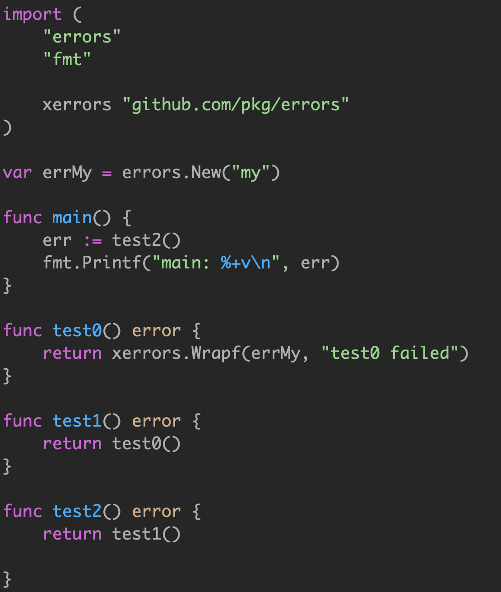

### 0. error vs exception

各个语言的演进历史：

C：单返回值，一般通过传递指针作为入参，返回值为 int 表示成功还是失败。

```c
  ngx_int_t ngx_create_path(ngx_file_t *file, ngx_path_t *path);
```

C++：引入了 exception，但是无法知道被调用方会抛出什么异常。

Java：

```java
catch (e Exception) { // ignore }
```

引入了 checked exception，方法的所有者必须申明，调用者必须处理。在启动时抛出大量的异常是司空见惯的事情，并在它们的调用堆栈中尽职地记录下来。Java 异常不再是异常，而是变得司空见惯了。它们从良性到灾难性都有使用，异常的严重性由函数的调用者来区分。

<br>

Go 的处理异常逻辑是不引入 exception，支持多参数返回，所以你很容易的在函数签名中带上实现了 error interface 的对象，交由调用者来判定。

> 如果一个函数返回了 value, error，你不能对这个 value 做任何假设，必须先判定 error。唯一可以忽略 error 的是，如果你连 value 也不关心。

Go 中有 panic 的机制，如果你认为和其他语言的 exception 一样，那你就错了。当我们抛出异常的时候，相当于你把 exception 扔给了调用者来处理。

> 比如，你在 C++ 中，把 string 转为 int，如果转换失败，会抛出异常。或者在 java 中转换 string 为 date 失败时，会抛出异常。

Go panic 意味着 fatal error(就是挂了)。不能假设调用者来解决 panic，意味着代码不能继续运行。


> 使用多个返回值和一个简单的约定，Go 解决了让程序员知道什么时候出了问题，并为真正的异常情况保留了 panic。因此panic只在特殊情况下使用，即您的代码不可能继续使用的情况。

<br>

野生goroutine：待查找资料

对于真正意外的情况，那些表示不可恢复的程序错误，例如索引越界、不可恢复的环境问题、栈溢出，我们才使用 panic。对于其他的错误情况，我们应该是期望使用 error 来进行判定。

panic 使用的情形：毛剑老师：如：main函数强依赖服务未初始化成功、配置文件信息未配置成功

<br>

go语言 `errror `哲学

> 简单。
>
> 考虑失败，而不是成功(Plan for failure, not success)。
>
> 没有隐藏的控制流。
>
> 完全交给你来控制 error。
>
> Error are values。

#### 区别

**1) `checked exception`实质是“错误”，而 panic 是“异常”**

 Java 中`checked exception`的“**有意而为之**”相反，在 Go 中，panic 则是“**不得已而为之**”，即所有引发 panic 的情形，无论是显式的（我们主动调用 panic 函数引发的），还是隐式的（Go 运行时检测到违法情况而引发的）都是我们不期望看到的。对这些引发的 panic，我们很少有“预案”应对，更多的是让程序快速崩溃掉。因此一旦发生 panic，就意味着我们的代码很大可能出现了 bug。因此，Go 中的 panic 更接近于 Java 的`RuntimeException`+`Error`，而不是`checked exception`。


**2) API 调用者没有义务必须去处理 panic**

前面提到过 Java 的`checked exception`是必须要被上层代码处理的，要么捕获处理，要么重新抛给更上层。但是在 Go 中，我们通常会导入大量第三方包，这些第三方包 API 中是否会引发`panic`是不知道的（目前也没有现成的工具去发现），因此上层代码，即 API 调用者根本不会去逐一了解 API 是否会引发`panic`，也没有义务去处理引发的 panic。一旦你像`checked exception`那样使用 panic 作为正常错误处理的手段在你编写的 API 中将引发的`panic`当作错误，那么你就会给你的 API 使用者带去大麻烦！


**3) 未被 recover 的 panic 意味着“游戏结束”(Game Over)**

如果 API 抛出`checked exception`，那么 Java 编译器将严格要求上层代码对这个`checked exception`进行处理。但一旦你在 Go API 中引发`panic`，就像上面提到的，API 的调用者并没有义务处理该 panic，因此该 panic 会就会沿着调用函数栈向下“蔓延”，直到所有函数都返回，调用该 API 的 goroutine 将携带着 panic 信息退出。但事情并没有就此打住，一旦 panic 没有被 recover，它导致的可不是一个 goroutine 的退出，而是整个 Go 程序的“游戏结束” - 崩溃退出！

综上，我们看到 Go panic 不应被当做 Java 的`checked exception`用来进行正常的错误处理。使用错误 (error) 和多返回值的显式错误处理方式才是符合 Go 设计哲学的。


#### panic的典型应用

如果你的业务代码中没有自行调用 panic 引发异常，那么至少说明除了 Go 运行时 panic 外，你的代码对任何“**不正常**”的情况都是可以明确告知上层代码准备处理预案的(即有准备的正常错误处理逻辑)。我们要**尽可能少用 panic**，避免给上层带去它们也无法处理的情况。不过，少用不代表不用！关于如何更好地使用 panic，Go 标准库对 panic 的使用可以给我们一些启示。

**充当断言角色，提示潜在 bug**

使用 C 编写代码时，我们经常在一些代码执行路径上使用断言(assert 宏)来表达这段执行路径上某种条件一定为真的信心。断言为真，则程序处于正确运行状态，否则就是出现了意料之外的问题，而这个问题很可能就是一个潜在的 bug，这时我们可以借助断言信息快速定位到问题所在。

Go 语言标准库没有提供 assert（虽然可以自己实现一个），我们可以使用 panic 来部分模拟断言的潜在 bug 提示的功能。在 Go 标准库中，**大多数 panic 的使用都是充当类似断言的作用的**。


**用于简化错误处理控制结构**

panic 的语义机制决定了它可以在函数栈间游走，直到被某函数栈上的 defer 函数中的 recover 捕获。因此在一定程度上可以用于简化错误处理的控制结构。在上一篇“优化反复出现的`if err != nil`”中，我们在介绍`check/handle`风格化这个方法时就利用了 panic 的这个**特性**，这里再回顾一下：

```go
// go-if-error-check-optimize-2.go
func check(err error) {
        if err != nil {
                panic(err)
        }
}

func CopyFile(src, dst string) (err error) {
        var r, w *os.File

        // error handler
        defer func() {
                if r != nil {
                        r.Close()
                }
                if w != nil {
                        w.Close()
                }
                if e := recover(); e != nil {
                        if w != nil {
                                os.Remove(dst)
                        }
                        err = fmt.Errorf("copy %s %s: %v", src, dst, err)
                }
        }()

        r, err = os.Open(src)
        check(err)

        w, err = os.Create(dst)
        check(err)

        _, err = io.Copy(w, r)
        check(err)

        return nil
}
```

在 Go 标准库中，我们也看到了这种利用 panic 辅助简化错误处理控制结构，减少`if err != nil`重复出现的例子。


 **使用 recover 捕获 panic，防止 goroutine 意外退出**

前面提到了 panic 的“危害”：**无论在哪个 goroutine 中发生未被 recover 的 panic，整个程序都将崩溃退出**。在有些场景下我们必须抑制这种“危害”，保证程序的健壮性。在这方面，标准库中的 http server 就是一个典型的代表：

```go
// $GOROOT/src/net/http/server.go

// Serve a new connection.
func (c *conn) serve(ctx context.Context) {
        c.remoteAddr = c.rwc.RemoteAddr().String()
        ctx = context.WithValue(ctx, LocalAddrContextKey, c.rwc.LocalAddr())
        defer func() {
                if err := recover(); err != nil && err != ErrAbortHandler {
                        const size = 64 << 10
                        buf := make([]byte, size)
                        buf = buf[:runtime.Stack(buf, false)]
                        c.server.logf("http: panic serving %v: %v\n%s", c.remoteAddr, err, buf)
                }
                if !c.hijacked() {
                        c.close()
                        c.setState(c.rwc, StateClosed)
                }
        }()
... ...
}
```

针对每个连接，http.Server 会启动一个单独的 goroutine 运行用户传入的 handler 函数。如果处理某个连接的 goroutine 引发 panic，我们需要保证 http Server 本身以及处理其他连接的 goroutine 仍然是可正常运行的。因此，标准库在每个连接对应的 goroutine 处理函数(serve)中使用 recover 来捕获该 goroutine 可能引发的 panic，使其“破坏”不会蔓延到整个程序。

**课堂例子**

常出现panic的地方就是,开了`goroutinue`，其内部出现panic，从而导致整个进程挂掉。还有http router。

```go
package main

import (
	"fmt"
	"time"
)

func main()  {

	fmt.Println("main start")
	go func() {

		fmt.Println("goroutine start")
		panic("一路向西")
		fmt.Println("goroutine end")
	}()

	time.Sleep(4*time.Second)

	fmt.Println("main end")
}
```

output：

```go
main start
goroutine start
panic: 一路向西

goroutine 6 [running]:
main.main.func1()
        I:/Go/GeekTime/week2/6.painc.go:14 +0xa5
created by main.main
        I:/Go/GeekTime/week2/6.painc.go:11 +0x9d
exit status 2

```

**解决**

不会挂掉

```go
import (
	"fmt"
	"time"
)

func main()  {
	fmt.Println("main start")

	gohandlepanic(func() {

		fmt.Println("goroutine start")
		panic("一路向西")
		fmt.Println("goroutine end")
	})

	time.Sleep(4*time.Second)
	
	fmt.Println("main end")
}

func gohandlepanic(x func())  {
	go func() {
		defer func() {
			if err:=recover();err!=nil{
				fmt.Println(err)
				// handle err
			}
		}()

		x()

	}()
}
```

output:

```go
main start
goroutine start
一路向西
main end
```

### 1. error 接口

go语言中`error`是个接口。

```go
// http://golang.org/pkg/buildin/#error

// The error built-in interface type is the conventional interface for
// representing an error condition, with the nil value representing no error.
type error interface {
	Error() string
}
```


在标准库中，Go 提供了构造错误值的两种基本方法：`errors.New`和`fmt.Errorf`：

Go 1.13 版本之前，这两种方法实际上返回的是同一个实现了 error 接口的类型的实例，这个未导出的类型就是`errors.errorString`：

```go
err := errors.New("your first demo error")
errWithCtx = fmt.Errorf("index %d is out of bounds", i)
wrapErr = fmt.Errorf("wrap error: %w", err) // 仅Go 1.13及后续版本可用
```


#### errors.New()

我们经常使用` errors.New()` 来返回一个 error 对象。`errors.New() `返回的是 内部` errorString` 对象的指针。

```go
// http://golang.org/src/pkg/errors/errors.go

// New returns an error that formats as the given text.
// Each call to New returns a distinct error value even if the text is identical.
// 返回指针类型，确保每次error的结果都不同
func New(text string) error {
	return &errorString{text}
}

// errorString is a trivial implementation of error.
// 实现了error这个接口
type errorString struct {
	s string
}

func (e *errorString) Error() string {
	return e.s
}
```

#### fmt.Errorf()

也返回一个error。

```go
fmt.Errorf()
// example
fmt.Errorf("logic wrong :%v",err)

// Errorf formats according to a format specifier and returns the string as a
// value that satisfies error.
//
// If the format specifier includes a %w verb with an error operand,
// the returned error will implement an Unwrap method returning the operand. It is
// invalid to include more than one %w verb or to supply it with an operand
// that does not implement the error interface. The %w verb is otherwise
// a synonym for %v.
func Errorf(format string, a ...interface{}) error {
	p := newPrinter()
	p.wrapErrs = true
	p.doPrintf(format, a)
	s := string(p.buf)
	var err error
	if p.wrappedErr == nil {
		err = errors.New(s)
	} else {
		err = &wrapError{s, p.wrappedErr}
	}
	p.free()
	return err
}
```

Go 1.13 及后续版本中，当我们在格式化字符串中使用`%w`时，`fmt.Errorf`返回的错误值的底层类型为`fmt.wrapError`：

```go
// $GOROOT/src/fmt/errors.go (go 1.13及后续版本)

type wrapError struct {
        msg string
        err error
}

func (e *wrapError) Error() string {
        return e.msg
}

func (e *wrapError) Unwrap() error {
        return e.err
}
```

和`errorString`相比，`wrapError`还实现了`Unwrap`方法，这使得被`wrapError`类型包装的错误值在**包装错误链**中被检视(inspect)到：

```go
var ErrFoo = errors.New("the underlying error")

err := fmt.Errorf("wrap err: %w", ErrFoo)
errors.Is(err, ErrFoo) // true (仅适用于Go 1.13及后续版本)
```


#### 值类型和指针类型

```go
// 自定义的errorString
type errorString struct {
	s string
}

func New(text string) error {
	return errorString{text}
}


func (e errorString) Error() string {
	return e.s
}

var ErrType =New("EOF")

func main()  {
	if ErrType==New("EOF"){
		fmt.Println("Error",ErrType)
	}
}
```

output:

```go
Error EOF
```

意味着只要New()传入的text文本一致，error就会相等。如果某些情况下自定义的error和其他库的error相等(瞎猫碰上死耗子)，导致错误。因此New()必须返回指针类型的结构体。

<br>

```go
// 自定义的errorString

type errorString string

// 值类型
func New(text string) error {
	return errorString(text)
}

func (s errorString) Error() string {
	return string(s)
}

var ErrNamedType =New("EOF")

//标准库的error
var ErrStructType =errors.New("EOF")


func main()  {

	if ErrNamedType==New("EOF"){
		fmt.Println("Named type Error")
	}

	if ErrStructType==errors.New("EOF"){
		fmt.Println("Struct Type Error")
	}
}
```

output：

```go
Named Type Error
```

### 2. 自定义的Error

标准库中提供的构建错误值的方法方便有余，但给错误处理者提供的错误上下文(error context)则仅限于以字符串形式呈现的信息(Error 方法返回的信息)。

在一些场景下，错误处理者需要从错误值中提取出更多信息以帮助其选择错误处理路径，我们可以自定义错误类型来满足这一需求。

比如：标准库中的 net 包就定义了一种携带额外错误上下文的错误类型：

```go
// $GOROOT/src/net/net.go
type OpError struct {
        Op string
        Net string
        Source Addr
        Addr Addr
        Err error
}
```

这样错误处理者便可以根据这个类型的错误值提供的额外上下文信息做出错误处理路径的选择，比如下面的代码：

```go
// $GOROOT/src/net/http/server.go
func isCommonNetReadError(err error) bool {
        if err == io.EOF {
                return true
        }
        if neterr, ok := err.(net.Error); ok && neterr.Timeout() {
                return true
        }
        if oe, ok := err.(*net.OpError); ok && oe.Op == "read" {
                return true
        }
        return false
}
```

#### 优点：

- error 接口是错误值的提供者与错误值的检视者之间的契约。

- error 接口的实现者负责提供错误上下文供负责错误处理的代码使用。

- 这种错误上下文与 error 接口类型的分离也体现了 Go 设计哲学中“正交”的理念。

#### 缺点：

- 调用者要使用类型断言和类型 switch，就要让自定义的 error 变为 public。这种模型会导致和调用者产生强耦合，从而导致 API 变得脆弱。


- 尽量避免使用 error types，虽然错误类型比 sentinel errors 更好，因为它们可以捕获关于出错的更多上下文，但是 error types 共享 error values 许多相同的问题。


因此，我的建议是避免错误类型，或者至少避免将它们作为公共 API 的一部分。

### 3. Opaque Error

**不透明错误**。

Go 语言中的错误处理就是根据函数/方法返回的 error 类型变量中携带的错误值信息做决策并选择后续代码执行路径的过程。

这样最简单的错误策略莫过于完全不关心返回错误值携带的具体上下文信息，只要发生错误就进入唯一的错误处理执行路径，这也是 Go 语言中**最常见的错误处理策略**，80%以上的 Go 错误处理情形都可以归类到这种策略下。

这就是不透明错误处理的全部功能：**只需返回错误而不假设其内容**。

```go
err := doSomething()
if err != nil {
	// 不关心err变量底层错误值所携带的具体上下文信息
	// 执行简单错误处理逻辑并返回
	... ...
	return err
}
```

这种策略下由于错误处理方并不关心错误值的上下文，因此，错误值的构造方(如上面的函数`doSomething`)可以直接使用 Go 标准库提供的两个基本错误值构造方法`errors.New`和`fmt.Errorf`构造错误值。这样构造出的错误值对错误处理方是不透明的，因此这种策略被称为 **“不透明错误处理策略”**。

```go
func doSomething(...) error {
	... ...
	return errors.New("some error occurred")
}
```

#### 优点：

- 不透明错误处理策略最大程度地减少了错误处理方与错误值构造方之间的耦合关系，它们之间唯一的耦合就是 error 接口变量所规定的“契约”。

#### 缺点：

- 错误处理方不能仅根据“不透明的错误值”就做出正确错误处理

- 在少数情况下，这种二分错误处理方法是不够的。例如，与进程外的世界进行交互(如网络活动)，需要调用方调查错误的性质，以确定重试该操作是否合理。


### 4. Sentinel Error

**哨兵错误**

#### 原因：

当错误处理方不能仅根据“不透明的错误值”就做出错误处理路径的选取的情况下，错误处理方会尝试对返回的错误值进行检视，于是就有可能出现下面的**反模式**：

```go
data, err := b.Peek(1)
if err != nil {
    switch err.Error() {
    case "bufio: negative count":
        // ... ...
        return
    case "bufio: buffer full":
        // ... ...
        return
    case "bufio: invalid use of UnreadByte":
        // ... ...
        return
    default:
        // ... ...
        return
    }
}
```

错误处理方以不透明错误值所能提供的唯一上下文信息作为错误处理路径选择的依据，这种“反模式”会造成严重的**隐式耦合**：

错误值构造方不经意间的一次错误描述字符串的改动，都会造成错误处理方处理行为的变化，并且这种通过字符串比较的方式对错误值进行检视的性能也很差。

#### 解决：

Go 标准库采用了定义导出的(exported)“哨兵”错误值的方式来辅助错误处理方检视(inspect)错误值并做出错误处理分支的决策：

```go
// $GOROOT/src/bufio/bufio.go

// 错误信息：包名加上错误信息
// 首字母大写，外部包可以用
var (
        ErrInvalidUnreadByte = errors.New("bufio: invalid use of UnreadByte")
        ErrInvalidUnreadRune = errors.New("bufio: invalid use of UnreadRune")
        ErrBufferFull        = errors.New("bufio: buffer full")
        ErrNegativeCount     = errors.New("bufio: negative count")
)

// 我们的错误处理代码
data, err := b.Peek(1)
if err != nil {
    switch err {
    case bufio.ErrNegativeCount:
        // ... ...
        return
    case bufio.ErrBufferFull:
        // ... ...
        return
    case bufio.ErrInvalidUnreadByte:
        // ... ...
        return
    default:
        // ... ...
        return
    }
}

或者:

if err := doSomething(); err == bufio.ErrBufferFull {
	// 处理缓冲区满的错误情况
	... ...
}
```

一般“哨兵”错误值变量以 ErrXXX 格式命名。

#### 优点：

- 和不透明错误策略相比，“哨兵”策略让错误处理方在有检视错误值的需求时候可以“有的放矢”了。

从 Go 1.13 版本开始，标准库 errors 包提供了`Is`方法用于错误处理方对错误值进行检视。`Is`方法类似于将一个 error 类型变量与“哨兵”错误值的比较：

```go
// 类似 if err == ErrOutOfBounds{ … }
if errors.Is(err, ErrOutOfBounds) {
    // 越界的错误处理
}
```

不同的是如果 error 类型变量的底层错误值是一个包装错误(wrap error)，`errors.Is`方法会沿着该包装错误所在错误链(error chain)，与链上所有被包装的错误(wrapped error)进行比较，直至找到一个匹配的错误。下面是`Is`函数应用的一个例子：

```go
package main

import (
	"errors"
	"fmt"
)

var ErrSentinel = errors.New("the underlying sentinel error")

func main() {
	err1 := fmt.Errorf("wrap err1: %w", ErrSentinel)
	err2 := fmt.Errorf("wrap err2: %w", err1)
	if errors.Is(err2, ErrSentinel) {
		println("err is ErrSentinel")
		return
	}

	println("err is not ErrSentinel")
}
```

运行上述代码：

```plain
err is ErrSentinel
```

我们看到`errors.Is`函数沿着 err2 所在错误链向上找到了被包装到最深处的“哨兵”错误值`ErrSentinel`。

因此，如果您使用的是 Go 1.13 及后续版本，请尽量使用`errors.Is`方法去检视某个错误值是否是某特定的“哨兵”错误值。

#### 缺点：

- 不过对于 API 的开发者而言，暴露“哨兵”错误值也意味着这些错误值和包的公共函数/方法一起成为了 API 的一部分。

- 一旦发布出去，开发者就要对其进行很好的维护。而“哨兵”错误值也让使用这些值的错误处理方对其产生了依赖。

#### 建议：

使用 sentinel 值是最不灵活的错误处理策略，因为调用方必须使用 == 将结果与预先声明的值进行比较。当您想要提供更多的上下文时，比如预先声明的值发生改变，调用方也需要改变，返回一个不同的错误将破坏相等性检查。

甚至是一些有意义的 `fmt.Errorf `携带一些上下文，也会破坏调用者的 == ，调用者将被迫查看 `error.Error() `方法的输出，以查看它是否与特定的字符串匹配。

- 不依赖检查 error.Error 的输出。


> 不应该依赖检测 error.Error 的输出，Error 方法存在于 error 接口主要用于方便程序员使用，但不是程序(编写测试可能会依赖这个返回)。这个输出的字符串用于记录日志、输出到 stdout 等。


Sentinel errors 成为你 API 公共部分。

> 如果您的公共函数或方法返回一个特定值的错误，那么该值必须是公共的，当然要有文档记录，这会增加 API 的表面积。
>
> 如果 API 定义了一个返回特定错误的 interface，则该接口的所有实现都将被限制为仅返回该错误，即使它们可以提供更具描述性的错误。
>
>  比如 io.Reader。像 io.Copy 这类函数需要 reader 的实现者比如返回 io.EOF 来告诉调用者没有更多数据了，但这又不是错误。

Sentinel errors 在两个包之间创建了依赖。

> sentinel errors 最糟糕的问题是它们在两个包之间创建了源代码依赖关系。
>
> 例如，检查错误是否等于 io.EOF，您的代码必须导入 io 包。这个特定的例子听起来并不那么糟糕，因为它非常常见，但是想象一下，当项目中的许多包导出错误值时，存在耦合，项目中的其他包必须导入这些错误值才能检查特定的错误条件(in the form of an import loop)。

结论: 尽可能避免 sentinel errors。

> 我的建议是避免在编写的代码中使用 sentinel errors。在标准库中有一些使用它们的情况，但这不是一个您应该模仿的模式。

###  5. 错误值类型检视策略

“哨兵”错误值除了让错误处理方可以“有的放矢”的进行值比较之外，并未提供其他有效的错误上下文信息。如果错误处理方需要错误值提供更多的“错误上下文”，上面的错误处理策略和错误值构造方式将无法满足。

我们需要通过自定义错误类型的构造错误值的方式来提供更多的“错误上下文”信息，并且由于错误值均通过 error 接口变量统一呈现，要得到底层错误类型携带的错误上下文信息，错误处理方需要使用 Go 提供的**类型断言机制（type assertion）或类型选择机制（type switch）**，这种错误处理我称之为**错误值类型检视策略**。我们来看一个标准库中的例子：

json 包中自定义了一个`UnmarshalTypeError`的错误类型：

```go
// $GOROOT/src/encoding/json/decode.go
type UnmarshalTypeError struct {
        Value  string       // description of JSON value - "bool", "array", "number -5"
        Type   reflect.Type // type of Go value it could not be assigned to
        Offset int64        // error occurred after reading Offset bytes
        Struct string       // name of the struct type containing the field
        Field  string       // the full path from root node to the field
}
```

错误处理方可以通过错误类型检视策略获得更多错误值的错误上下文信息：

```go
// $GOROOT/src/encoding/json/decode_test.go
// 通过类型断言机制获取
func TestUnmarshalTypeError(t *testing.T) {
        for _, item := range decodeTypeErrorTests {
                err := Unmarshal([]byte(item.src), item.dest)
                if _, ok := err.(*UnmarshalTypeError); !ok {
                        t.Errorf("expected type error for Unmarshal(%q, type %T): got %T",
                                item.src, item.dest, err)
                }
        }
}

// $GOROOT/src/encoding/json/decode.go
// 通过类型选择机制获取
func (d *decodeState) addErrorContext(err error) error {
        if d.errorContext.Struct != nil || len(d.errorContext.FieldStack) > 0 {
                switch err := err.(type) {
                case *UnmarshalTypeError:
                        err.Struct = d.errorContext.Struct.Name()
                        err.Field = strings.Join(d.errorContext.FieldStack, ".")
                        return err
                }
        }
        return err
}
```

和“哨兵”错误处理策略一样，错误值类型检视策略由于暴露了自定义的错误类型给错误处理方，因此这些错误类型也和包的公共函数/方法一起成为了 API 的一部分。一旦发布出去，开发者就要对其进行很好的维护。而它们也让借由这些类型进行检视的错误处理方对其产生了依赖。

从 Go 1.13 版本开始，标准库 errors 包提供了`As`方法用于错误处理方对错误值进行检视。`As`方法类似于通过类型断言判断一个 error 类型变量是否为特定的自定义错误类型：

```go
// 类似 if e, ok := err.(*MyError); ok { … }
var e *MyError
if errors.As(err, &e) {
    // 如果err类型为*MyError，变量e将被设置为对应的错误值
}
```

不同的是如果 error 类型变量的底层错误值是一个包装错误（wrap error），`errors.As`方法会沿着该包装错误所在错误链（error chain），与链上所有被包装的错误（wrapped error）的类型进行比较，直至找到一个匹配的错误类型。下面是`As`函数应用的一个例子：

```go
go-error-handling-strategy-2.go
package main

import (
	"errors"
	"fmt"
)

type MyError struct {
	e string
}

func (e *MyError) Error() string {
	return e.e
}

func main() {
	var err = &MyError{"my error type"}
	err1 := fmt.Errorf("wrap err1: %w", err)
	err2 := fmt.Errorf("wrap err2: %w", err1)
	var e *MyError
	if errors.As(err2, &e) {
		println("err is a variable of MyError type ")
		println(e == err)
		return
	}

	println("err is not a variable of the MyError type ")
}
```

运行上述代码：

```plain
$go run go-error-handling-strategy-2.go 
err is the MyError type 
true
```

我们看到`errors.As`函数沿着 err2 所在错误链向上找到了被包装到最深处的错误值，并将 err2 与其类型`*MyError`成功匹配。

因此，如果您使用的是 Go 1.13 及后续版本，请尽量使用`errors.As`方法去检视某个错误值是否是某自定义错误类型的实例。

### 6. 错误行为特征检视策略

除了“不透明错误处理策略”，我们是否还有手段可以降低错误处理方与错误值构造方的耦合？

在 Go 标准库中，我们发现了这样一种错误处理方式：将某个包中的错误类型归类，统一提取出一些公共的错误行为特征（behaviour），并将这些错误行为特征放入一个公开的接口类型中。

以标准库中的`net包`为例，它将包内的所有错误类型的公共行为特征抽象并放入`net.Error`这个接口中。而错误处理方仅需依赖这个公共接口即可检视具体错误值的错误行为特征信息，并根据这些信息做出后续错误处理分支选择的决策：

```go
// $GOROOT/src/net/net.go
type Error interface {
    error
    Timeout() bool   // 是超时类(timeout)错误吗?
    Temporary() bool // 是临时性(temporary)错误吗?
}
```

下面是 http 包使用错误行为特征检视策略进行错误处理的代码：

```go
// $GOROOT/src/net/http/server.go
func (srv *Server) Serve(l net.Listener) error {
	... ...
	for {
		rw, e := l.Accept()
		if e != nil {
			select {
			case <-srv.getDoneChan():
				return ErrServerClosed
			default:
			}
			if ne, ok := e.(net.Error); ok && ne.Temporary() {
				// 注：这里对临时性(temporary)错误进行处理
				... ...
				time.Sleep(tempDelay)
				continue
			}
			return e
		}
		...
	}
	... ...
}
```

Accept 方法实际上返回的错误类型为`*OpError`，它是 net 包中的一个自定义错误类型，它实现了错误公共特征接口`net.Error`，因此可以被错误处理方通过`net.Error`接口的方法判断其行为是否满足 Temporary 或 Timeout 特征：

```go
// $GOROOT/src/net/net.go
type OpError struct {
    ... ...
    // Err is the error that occurred during the operation.
    Err error
}

type temporary interface {
    Temporary() bool
}

func (e *OpError) Temporary() bool {
  if ne, ok := e.Err.(*os.SyscallError); ok {
      t, ok := ne.Err.(temporary)
      return ok && t.Temporary()
  }
  t, ok := e.Err.(temporary)
  return ok && t.Temporary()
}
```

**一般处理逻辑**

客户端代码可以遇到错误，使用类型断言判断错误类型，然后将暂时态网络错误与永久网络错误区分开来。例如，当遇到临时错误时，web爬虫可能会休眠并重试，否则就放弃。

```go
err:=networkhandle()
// err.(net.Error) 此句 我们需要导入Net包，也要了解Error的结构和方法，耦合严重
if nerr, ok := err.(net.Error); ok && nerr.Temporary() {
    time.Sleep(1e9)
    continue
}
if err != nil {
    log.Fatal(err)
}
```

**建议处理逻辑**

**我们可以断言错误实现了特定的行为，而不是断言错误是特定的类型或值**。

```go
// IsTemporary returns true if err is temporary.
func IsTemporary(err error) bool {
        te, ok := err.(temporary)
        return ok && te.Temporary()
}
```


我们可以将任何错误传递给`IsTemporary`函数，以此判断此错误是否是可返回的。

如果错误没有实现`temporary`接口 ,错误就不是临时的。

如果错误确实是临时错误，那么如果返回true，调用者可能可以重试操作。

这里的关键是，这个逻辑可以在不导入定义错误的包的（不导入opError struct 所在包）情况下实现，也不需要真正了解opError的底层类型。

我们只是对其行为感兴趣。

### 7. 错误处理策略

- 请尽量使用“不透明错误”处理策略降低错误处理方与错误值构造方之间的耦合；
- 如果可以通过错误值类型的特征进行错误检视，那么请尽量使用“错误行为特征检视策略”;
- 在上述两种策略无法实施的情况下，再“哨兵”策略和“错误值类型检视”策略；
- Go 1.13 及后续版本中，尽量用`errors.Is`和`errors.As`方法替换原先的错误检视比较语句。

### 8. if err != nil 重复太多可以这么办

#### 正常流程代码

无错误的正常流程代码，将成为一条直线，而不是缩进的代码

```go
if err!=nil{
    
    //handle error
}

// do stuff


// 产生大量缩进代码
if err==nil{
    
    //do stuff
    if err==nil{
        //do stuff
    }
    //handle error
}
// handle error
```

#### 视觉扁平化

Go 提供了将触发错误处理的语句与错误处理代码放在一行的支持，比如上面的 SomeFunc 函数，我们可以将之等价重写为下面代码：

```go
func SomeFunc() error {
	if err := doStuff1(); err != nil { // handle error... }
	if err := doStuff2(); err != nil { // handle error... }
	if err := doStuff3(); err != nil { // handle error... }
}
```

这虽然并未从本质上消除`if err != nil`代码块过多的问题，也没有降低 SomeFunc 的圈复杂度，但经过这种**视觉呈现上的优化**，多数 Gopher 会觉得代码看起来更舒服了。

不过这种优化显然是有约束的，如果错误处理分支的语句不是简单的`return err`，而是复杂如下面代码中这样：

```go
if _, err = io.Copy(w, r); err != nil {
	return fmt.Errorf("copy %s %s: %v", src, dst, err)
}
```

那么"扁平化"会导致代码行过长，反倒降低了视觉呈现的“优雅度”。另外如果你使用`goimports`或`gofmt`工具对代码进行自动格式化，那么这些格式化工具会自动展开上述代码，这会让你困惑不已。


#### 重构

我们沿着降低复杂度的方向对待优化代码进行重构，以减少`if err != nil`代码片段的重复次数。我们以上面的`CopyFile`为优化对象。 原 CopyFile 函数有 4 个重复出现的`if err != nil`代码段，这里我们将其减至 2 个。下面是一种优化方案的代码实现：

```go
// go-if-error-check-optimize-1.go

func openBoth(src, dst string) (*os.File, *os.File, error) {
	var r, w *os.File
	var err error
	if r, err = os.Open(src); err != nil {
		return nil, nil, fmt.Errorf("copy %s %s: %v", src, dst, err)
	}

	if w, err = os.Create(dst); err != nil {
		r.Close()
		return nil, nil, fmt.Errorf("copy %s %s: %v", src, dst, err)
	}
	return r, w, nil
}

func CopyFile(src, dst string) error {
	var err error
	var r, w *os.File
	if r, w, err = openBoth(src, dst); err != nil {
		return err
	}
	defer func() {
		r.Close()
		w.Close()
		if err != nil {
			os.Remove(dst)
		}
	}()

	if _, err = io.Copy(w, r); err != nil {
		return fmt.Errorf("copy %s %s: %v", src, dst, err)
	}
	return nil
}
```

我们看到：为了减少 CopyFile 函数中的 if 检查的重复次数，我们引入一个中间层：`openBoth`函数。我们将打开源文件和创建目的文件的工作转移到了`openBoth`函数中。这样优化下来，CopyFile 的圈复杂度下降到我们可以接受的范围内，而新增的 openBoth 函数的圈复杂度也在可接受范围内。


#### check/handle 风格化

上面的位于第四象限的重构之法虽然减少了`if err != nil`代码片段的重复次数，但其视觉呈现依旧欠佳。Go2 的[check/handle 技术草案](https://github.com/golang/proposal/blob/master/design/go2draft-error-handling.md)的思路给了我们一些启发，我们可利用 panic 和 recover 封装一套跳转机制，模拟实现一套 check/handle 机制，在降低复杂度的同时，也能在视觉呈现上有所改善。我们仍然以`CopyFile`为例进行优化：

```go
// go-if-error-check-optimize-2.go
func check(err error) {
	if err != nil {
		panic(err)
	}
}

func CopyFile(src, dst string) (err error) {
	var r, w *os.File

	// error handler
	defer func() {
		if r != nil {
			r.Close()
		}
		if w != nil {
			w.Close()
		}
		if e := recover(); e != nil {
			if w != nil {
				os.Remove(dst)
			}
			err = fmt.Errorf("copy %s %s: %v", src, dst, err)
		}
	}()

	r, err = os.Open(src)
	check(err)

	w, err = os.Create(dst)
	check(err)

	_, err = io.Copy(w, r)
	check(err)

	return nil
}
```

看一下这段 check/handle 风格的`CopyFile`代码，无论是从业务代码(Open -> Create -> Copy)的视觉连续性来看，还是从 CopyFile 的圈复杂度来看，这次优化显然都要好于前面的优化。这也再一次证实了现实中的真正好的优化更多是上述两个方向的结合。

不过这一优化方案也具有一定约束，比如：函数必须使用具名的 error 返回值、defer 性能(在 Go 1.14 版本中，与不使用 defer 的性能差异微乎其微，可忽略不计）、panic 和 recover 的性能等。尤其是 panic 和 recover 的性能要比正常函数返回的性能相差好多，下面是一个简单的性能基准对比测试：

```go
// panic_recover_performance_test.go 
package main

import (
	"errors"
	"testing"
)

func check(err error) {
	if err != nil {
		panic(err)
	}
}
func FooWithoutDefer() error {
	return errors.New("foo demo error")
}

func FooWithDefer() (err error) {
	defer func() {
		err = errors.New("foo demo error")
	}()
	return
}

func FooWithPanicAndRecover() (err error) {
	// error handler
	defer func() {
		if e := recover(); e != nil {
			err = errors.New("foowithpanic demo error")
		}
	}()

	check(FooWithoutDefer())
	return nil
}

func FooWithoutPanicAndRecover() error {
	return FooWithDefer()
}

func BenchmarkFuncWithoutPanicAndRecover(b *testing.B) {
	for i := 0; i < b.N; i++ {
		FooWithoutPanicAndRecover()
	}
}

func BenchmarkFuncWithPanicAndRecover(b *testing.B) {
	for i := 0; i < b.N; i++ {
		FooWithPanicAndRecover()
	}
}
```

运行上述性能基准测试：

```go
$ go test -bench . panic_recover_performance_test.go
goos: darwin
goarch: amd64
BenchmarkFuncWithoutPanicAndRecover-8   	39020437	        28.8 ns/op
BenchmarkFuncWithPanicAndRecover-8      	 4442336	       271 ns/op
PASS
ok  	command-line-arguments	2.639s
```

我们看到 panic 和 recover 让函数调用的性能慢了近 10 倍。因此，我们在使用这种方案优化重复代码前，需要全面了解这些约束。


#### 封装：内置 error 状态

在 Go 语言之父 Rob Pike 的["Errors are values"](http://blog.golang.org/errors-are-values)一文中，Rob Pike 为我们呈现了 Go 标准库中使用了避免`if err != nil`反复出现的一种代码设计思路，bufio 包的 Writer 就是使用了这个思路实现的，因此它可以可以像下面这样使用：

```go
b := bufio.NewWriter(fd)
b.Write(p0[a:b])
b.Write(p1[c:d])
b.Write(p2[e:f])
// and so on
if b.Flush() != nil {
        return b.Flush()
    }
}
```

我们看到上述代码中并没有判断三个 b.Write 的返回错误值，错误处理放在哪里了呢？我们打开一下$GOROOT/src/bufio/bufio.go，我们看到下面代码：

```go
// $GOROOT/src/bufio/bufio.go
type Writer struct {
    err error
    buf []byte
    n   int
    wr  io.Writer
}

func (b *Writer) Write(p []byte) (nn int, err error) {
    for len(p) > b.Available() && b.err == nil {
        ... ...
    }
    if b.err != nil {
        return nn, b.err
    }
    ......
    return nn, nil
}
```

我们可以看到，错误状态被封装在 bufio.Writer 结构的内部了，Writer 定义了一个 err 字段作为一个内部错误状态值，它与 Writer 的实例绑定在了一起，并且在每次 Write 入口判断是否为 nil。一旦不为 nil，Write 其实什么都没做就返回了。


#### 例子

```go
func AuthenticateRequest(r *Request) error{
    err:= authenticate(r.User)
    if err!=nil{
        return err
    }
    
    return nil
}

func AuthenticateRequest(r *Request) error{
    return authenticate(r.User)
}   
```

**统计行数**

```go
func CountLines(r io.Reader) (int, error) {
        var (
                br    = bufio.NewReader(r)
                lines int
                err   error
        )

        for {
                _, err = br.ReadString('\n')
                lines++
                if err != nil {
                        break
                }
        }

        if err != io.EOF {
                return 0, err
        }
        return lines, nil
 }
```

改进

```go
func CountLines(r io.Reader) (int, error) {
        sc := bufio.NewScanner(r)
        lines := 0

        for sc.Scan() {
                lines++
        }

        return lines, sc.Err()
}
```

#### 总结：

- Go 使用显式错误结果和显式的错误检查是 Go 语言成功的重要因素，同时也是`if err != nil`反复出现的根本原因；
- 了解关于 Go 错误处理改善的两种观点；
- 了解减少和消除`if err != nil`代码片段的两个优化方向：改善视觉呈现与降低复杂度；
- 掌握错误处理代码优化的四种常见方法(位于三个不同象限中)，并根据所处场景与约束灵活使用。


### 9. errors 处理哲学


```go
func AuthenticateRequest(r *Request) error{
    return authenticate(r.User)
} 
```

如果 authenticate 返回错误，则 AuthenticateRequest 会将错误返回给调用方，调用者可能也会这样做，依此类推。在程序的顶部，程序的主体将把错误打印到屏幕或日志文件中，打印出来的只是：没有这样的文件或目录。

#### fmt.Errorf()

```go
func AuthenticateRequest(r *Request) error{
    err:= authenticate(r.User)
    if err!=nil{
        return fmt.Errorf("authenticate failed:%v", err)
    }
    
    return nil
} 
```

没有生成错误的 file:line 信息。没有导致错误的调用堆栈的堆栈跟踪。这段代码的作者将被迫进行长时间的代码分割，以发现是哪个代码路径触发了文件未找到错误。

这种模式与 sentinel errors 或 type assertions 的使用不兼容，因为将错误值转换为字符串，将其与另一个字符串合并，然后将其转换回 fmt.Errorf 破坏了原始错误，导致等值判定失败。

####  handle errors once

常出现以下代码在错误处理中，带了两个任务: 记录日志并且再次返回错误

```go
if err!=nil{
    log.Println("somthing wrong".err) //写入日志
    return err  //网上抛
}
```

**例子**：

如果在 w.Write 过程中发生了一个错误，那么一行代码将被写入日志文件中，记录错误发生的文件和行，并且错误也会返回给调用者，调用者可能会记录错误并返回它，一直返回到程序的顶部。

在日志文件中出现了一堆重复的日志，但是在程序的顶部，只能获得了没有任何上下文的原始错误。

```go
func Write(w io.Writer, buf []byte) error {
        _, err := w.Write(buf)
        if err != nil {
                // annotated error goes to log file
                log.Println("unable to write:", err)
 
                // unannotated error returned to caller
                return err
        }
        return nil
}

func WriteConfig(w io.Writer ,conf *Conf)error{
    buf ,err :=json.Marshal(conf)
    
    if err!=nil{
        log.PrintF("could not mashal config :%v",err)
        return err
    }
    
    if err:=write(w,buf); err!=nil{
        log.Println("could not write config :%v",err)
        return err
    }
    
    return nil
}
```

output:

```go
unable to write: io.EOF
could not write config: io.EOF
```

**还可能产生一些意想不到的错误**

```go

func WriteConfig(w io.Writer ,conf *Conf)error{
    buf ,err :=json.Marshal(conf)
    
    if err!=nil{
        log.PrintF("could not mashal config :%v",err)
        // 忘记return   要么降级，要么往上抛
    }
    
    if err:=write(w,buf); err!=nil{
        log.Println("could not write config :%v",err)
        return err
    }
    
    return nil
}
```

Go 中的错误处理契约规定，在出现错误的情况下，不能对其他返回值的内容做出任何假设。

由于 JSON 序列化失败，buf 的内容是未知的，可能它不包含任何内容，但更糟糕的是，它可能包含一个半写的 JSON 片段。

由于程序员在检查并记录错误后忘记 return，损坏的缓冲区将被传递给 WriteAll，这可能会成功，因此配置文件将被错误地写入。但是，该函数返回的结果是正确的。

#### 处理哲学

日志记录与错误无关且对调试没有帮助的信息应被视为噪音，应予以质疑。记录的原因是因为某些东西失败了，而日志包含了答案。

- 错误要被日志记录。
- 应用程序处理错误，保证100%完整性。
- 之后不再报告当前错误。

只对`error`进行一次处理，打印日志算一次，往上抛或者直接处理也算一次，存在矛盾。

`github.com/pkg/errors `这个包很好的解决了这个问题，只对错误处理了一次，既保留了日志，也能对error处理。

### 10. github/pkg/errors

通过使用 pkg/errors 包，您可以向错误值添加上下文，这种方式既可以由人也可以由机器检查。

```go
//     %s    print the error. If the error has a Cause it will be
//           printed recursively.
//     %v    see %s
//     %+v   extended format. Each Frame of the error's StackTrace will
//           be printed in detail. 

// github/pkg/errors 中 %+v为 拓展的格式化，可以打印堆栈信息
```


```go
package main

import (

	"io/ioutil"
     "fmt"
	"github.com/pkg/errors"  //不是基础库中的error
	"os"
	"path/filepath"
)

func ReadFile(path string)([]byte,error){
	f,err :=os.Open(path)
	if err!=nil {
		return nil ,errors.Wrap(err,"open file failed")
	}

	defer f.Close()

	buf,err:= ioutil.ReadAll(f)
	if err!=nil{
		return nil, errors.Wrap(err,"read file failed")
	}

	return buf ,nil
}

func ReadConfig()([]byte,error)  {
	home:=os.Getenv("HOME")
	config,err:=ReadFile(filepath.Join(home,".setting.json"))
	return config,errors.WithMessage(err,"could not read config")
}

func main()  {
	_,err:=ReadConfig()
	if err!=nil{
		fmt.Printf("根错误：%T %v\n",errors.Cause(err),errors.Cause(err))
		fmt.Printf("堆栈信息: \n %+v \n",err)
		os.Exit(1)
	}
}
```

output:

```go
I:\Go\GeekTime\week2>go run 9.wrap.go
根错误：*os.PathError open .setting.json: The system cannot find the file specified.
堆栈信息:
 open .setting.json: The system cannot find the file specified.
open file failed
main.ReadFile
        I:/Go/GeekTime/week2/9.wrap.go:15
main.ReadConfig
        I:/Go/GeekTime/week2/9.wrap.go:30
main.main
        I:/Go/GeekTime/week2/9.wrap.go:35
runtime.main
        H:/Go/src/runtime/proc.go:204
runtime.goexit
        H:/Go/src/runtime/asm_amd64.s:1374
could not read config
exit status 1

```

如果将31行 Wrap（）改成WithMessage（）

```go
I:\Go\GeekTime\week2>go run 9.wrap.go
根错误：*os.PathError open .setting.json: The system cannot find the file specified.
堆栈信息:
 open .setting.json: The system cannot find the file specified.
open file failed
main.ReadFile
        I:/Go/GeekTime/week2/9.wrap.go:15
main.ReadConfig
        I:/Go/GeekTime/week2/9.wrap.go:30
main.main
        I:/Go/GeekTime/week2/9.wrap.go:35
runtime.main
        H:/Go/src/runtime/proc.go:204
runtime.goexit
        H:/Go/src/runtime/asm_amd64.s:1374
could not read config  
main.ReadConfig   //多了以下堆栈信息
        I:/Go/GeekTime/week2/9.wrap.go:31
main.main
        I:/Go/GeekTime/week2/9.wrap.go:35
runtime.main
        H:/Go/src/runtime/proc.go:204
runtime.goexit
        H:/Go/src/runtime/asm_amd64.s:1374
exit status 1

```


#### **Wrap()**

```go
// Wrap returns an error annotating err with a stack trace
// at the point Wrap is called, and the supplied message.
// If err is nil, Wrap returns nil.
func Wrap(err error, message string) error {
	if err == nil {
		return nil
	}
	err = &withMessage{ //包裹err，形成新的err，组成了链式结构
		cause: err,
		msg:   message,
	}
	return &withStack{ // 堆栈信息
		err,
		callers(),
	}
}
```

#### **WithMessage()**

WithMessage()，WithMessagef()：只记录err，不记录堆栈信息

```go
// Wrapf returns an error annotating err with a stack trace
// at the point Wrapf is called, and the format specifier.
// If err is nil, Wrapf returns nil.
func Wrapf(err error, format string, args ...interface{}) error {
	if err == nil {
		return nil
	}
	err = &withMessage{
		cause: err,
		msg:   fmt.Sprintf(format, args...),
	}
	return &withStack{
		err,
		callers(),
	}
}

// WithMessage annotates err with a new message.
// If err is nil, WithMessage returns nil.
func WithMessage(err error, message string) error {
	if err == nil {
		return nil
	}
	return &withMessage{
		cause: err,
		msg:   message,
	}
}

// WithMessagef annotates err with the format specifier.
// If err is nil, WithMessagef returns nil.
func WithMessagef(err error, format string, args ...interface{}) error {
	if err == nil {
		return nil
	}
	return &withMessage{
		cause: err,
		msg:   fmt.Sprintf(format, args...),
	}
}
```

#### Cause()

解包，一直解到内部的err。

和标准库error中的Unwrap（）相似

```go
// Cause returns the underlying cause of the error, if possible.
// An error value has a cause if it implements the following
// interface:
//
//     type causer interface {
//            Cause() error
//     }
//
// If the error does not implement Cause, the original error will
// be returned. If the error is nil, nil will be returned without further
// investigation.
func Cause(err error) error {
	type causer interface {
		Cause() error
	}

	for err != nil {
		cause, ok := err.(causer)
		if !ok {
			break
		}
		err = cause.Cause()
	}
	return err
}
```

> 


### 11. before errors 1.13

这里是指标准库

函数在调用栈中添加信息向上传递错误，例如对错误发生时发生的情况的简要描述。

```go
if err!=nil{
    return fmt.Errorf("somthing describe %v,%v",othercontext,err)
}
```

 fmt.Errorf 会丢弃原始错误中除文本外的所有内容。

因此需要定义一个包含底层错误的新错误类型，并将其保存以供代码检查。这里是 QueryError

```go
type QueryError struct {
    Query string // 添加的信息 啥信息都可以，时间戳，文件名，地址等等
    Err   error  // 底层error
}

func (e *QueryError) Error() string { return e.Query + ": " + e.Err.Error() }
 
// 程序可以查看 QueryError 值以根据底层错误做出决策
if e, ok := err.(*QueryError); ok && e.Err == ErrPermission {
    // query failed because of a permission problem
}
```


### 12. after errors 1.13

go1.13为 errors 和 fmt 标准库包引入了新特性，以简化处理包含其他错误的错误。

其中最重要的是: 包含另一个错误的 error 可以实现返回底层错误的 Unwrap 方法。如果 e1.Unwrap() 返回 e2，那么我们说 e1 包装 e2，您可以展开 e1 以获得 e2。

我们可以为上面的 QueryError 类型指定一个 Unwrap 方法，该方法返回其包含的错误:

```go
func (e *QueryError) Unwrap() error {
    return e.Err // 获取底层的错误，这个错误也有Unwrap() 方法
}
```

go1.13 errors 包包含两个用于检查错误的新函数：Is 和 As。

#### **errors.Is**

```go
// Similar to:
//   if err == ErrNotFound { … }
// 像与 sentinel error比较
// 将err一直解包到根错误，再与ErrNotFound比较
if errors.Is(err, ErrNotFound) {
    // something wasn't found
}
```

#### **errors.As**

```go
// Similar to:
//   if e, ok := err.(*QueryError); ok { … }
var e *QueryError
// Note: *QueryError is the type of the error.

// 判断err是否为*QueryError 类型
// 像类型断言
if errors.As(err, &e) {
    // err is a *QueryError, and e is set to the error's value
}
```

**例子**：

```go
if e, ok := err.(*QueryError); ok && e.Err == ErrPermission {
    // query failed because of a permission problem
}
// 等价于
if errors.Is(err, ErrPermission) {
    // err, or some error that it wraps, is a permission problem
}
```

#### errors.Unwrap

解压err。如果err 实现了`interface {Unwrap() error}`接口，返回解压到根错误的错误，否则nil

```go
// Unwrap returns the result of calling the Unwrap method on err, if err's
// type contains an Unwrap method returning error.
// Otherwise, Unwrap returns nil.
func Unwrap(err error) error {
	u, ok := err.(interface {
		Unwrap() error
	})
	if !ok {
		return nil
	}
	return u.Unwrap()
}
```


#### %w 谓词

 fmt.Errorf（）生成的error 自动具有unwrap 方法。w%对应的变量必须是error

```go
if err != nil {
    // Return an error which unwraps to err.
    // 生成的error 自动具有unwrap 方法
    return fmt.Errorf("decompress %v: %w", name, err)
}
```

用 %w 包装错误可使用 errors.Is 以及 errors.As方法:

```go
err := fmt.Errorf("access denied: %w", ErrPermission)
...
if errors.Is(err, ErrPermission) ...
```

#### 自定义的IS, AS

标准库：

```go
func Is(err, target error) bool {
	if target == nil {
		return err == target
	}

	isComparable := reflectlite.TypeOf(target).Comparable()
	for {
		if isComparable && err == target {
			return true
		}
		if x, ok := err.(interface{ Is(error) bool }); ok && x.Is(target) {
			return true
		}
		// TODO: consider supporting target.Is(err). This would allow
		// user-definable predicates, but also may allow for coping with sloppy
		// APIs, thereby making it easier to get away with them.
		if err = Unwrap(err); err == nil {
			return false
		}
	}
}
```

自定义

```go
type Error struct {
    Path string
    User string
}

func (e *Error) Is(target error) bool {
    t, ok := target.(*Error)
    if !ok {
        return false
    }
    return (e.Path == t.Path || t.Path == "") &&
           (e.User == t.User || t.User == "")
}

if errors.Is(err, &Error{User: "someuser"}) {
    // err's User field is "someuser".
}
```

AS类似


### 13. 是否 Wrap总结

#### 使用

- 在你自己的应用代码中，使用 errors.New 或者  errors.Errorf 返回错误。

	```go
	func parseArgs(args []string) error {
	        if len(args) < 3 {
	                return errors.Errorf("not enough arguments, expected at least 3, got %d", len(args))
	        }
	        // ...
	}
	```

	

- 如果调用其他的函数返回了error，通常简单的直接返回。

	```go
	err：=otherfunc()
	if err != nil {
	       return err
	}
	```

	

- 如果和其他库（标准库，公司基础库，第三方库）进行协作，考虑使用 errors.Wrap 或者 errors.Wrapf 保存堆栈信息。

	```go
	f, err := os.Open(path)//标准库
	
	if err != nil {
	        return errors.Wrapf(err, "failed to open %q", path)
	}
	```

- 直接返回错误，而不是每个错误产生的地方到处打日志。

- 在程序的顶部或者是工作的 goroutine 顶部(请求入口)，使用 %+v 把堆栈详情记录。

	```go
	func main() {
	        err := app.Run()
	        if err != nil {
	                fmt.Printf("FATAL: %+v\n", err)
	                os.Exit(1)
	        }
	}
	```

- 使用 `errors.Cause`获取 root error，再进行和 sentinel error 判定。

#### 总结

**Packages that are reusable across many projects only return root error values.**

- 选择 wrap error 是只有 applications 可以选择应用的策略。具有最高可重用性的包只能返回根错误值。此机制与 Go 标准库中使用的相同(kit 库的 sql.ErrNoRows)。


- 如果自己的代码供很多人作为基础库调用，不用wrap，返回根错误就行。

**If the error is not going to be handled, wrap and return up the call stack.**

- 如果函数/方法不打算处理错误（不降级，直接返回），那么用足够的上下文 wrap errors 并将其返回到调用堆栈中。（Wrap()、WithMessage()、 Wrapf()、WithMessagef()）


- Wrap(err error, message string)  message就是上下文信息。例如，额外的上下文可以是使用的输入参数或失败的查询语句。


- 确定您记录的上下文是足够多还是太多的一个好方法是检查日志并验证它们在开发期间是否为您工作。

**Once an error is handled, it is not allowed to be passed up the call stack any longer.**

- 一旦确定函数/方法将处理错误，例如打印错误、对错误进行逻辑处理。那么错误就不再是错误。


- 如果函数/方法仍然需要发出返回，则它不能返回错误值（不能往上层抛）。它应该只返回nil(比如降级处理中，你返回了降级数据，然后需要 return nil)。


#### 例子

```go
// 加入些自定义的信息如name  用wrap
var ErrNotFound = errors.New("not found")

// FetchItem returns the named item.
//
// If no item with the name exists, FetchItem returns an error
// wrapping ErrNotFound.
func FetchItem(name string) (*Item, error) {
    if itemNotFound(name) {
        return nil, fmt.Errorf("%q: %w", name, ErrNotFound)
    }
    // ...
}
```

<br>

```go
// 不想暴露过多底层错误信息，不用wrap
f, err := os.Open(filename)
if err != nil {
    // The *os.PathError returned by os.Open is an internal detail.
    // To avoid exposing it to the caller, repackage it as a new
    // error with the same text. We use the %v formatting verb, since
    // %w would permit the caller to unwrap the original *os.PathError.
    return fmt.Errorf("%v", err)
}
```

<br>

```go
var ErrPermission = errors.New("permission denied")

// 返回ErrPermission
// DoSomething returns an error wrapping ErrPermission if the user
// does not have permission to do something.
func DoSomething() error {
    if !userHasPermission() {
        
        // 若要加入些自定义的上下文信息，不wrap会err == pkg.ErrPermission 出错
        // If we return ErrPermission directly, callers might come
        // to depend on the exact error value, writing code like this:
        //
        //     if err := pkg.DoSomething(); err == pkg.ErrPermission { … }
        //
        // This will cause problems if we want to add additional
        // context to the error in the future. To avoid this, we
        // return an error wrapping the sentinel so that users must
        // always unwrap it:
        //
        //     if err := pkg.DoSomething(); errors.Is(err, pkg.ErrPermission) { ... }
        //不建议直接返回，要wrap一下
        //是强制让调用者使用errors.Is来处理，
        //包装返回方法的作者就可以随意添加/更改附加的error上下文，同时不破坏调用方的判断，
        //不包装调用方可能用==判断，这样方法作者考虑到兼容性不可随意添加error上下文
        return fmt.Errorf("%w", ErrPermission)
    }
    // ...
}
```

### 14. 结合

标准库不支持堆栈信息




### 参考链接

Dave chengy 为github/pkg/errors 作者

https://dave.cheney.net/2012/01/18/why-go-gets-exceptions-right

https://dave.cheney.net/2015/01/26/errors-and-exceptions-redux

https://dave.cheney.net/2014/11/04/error-handling-vs-exceptions-redux

https://rauljordan.com/2020/07/06/why-go-error-handling-is-awesome.html

https://morsmachine.dk/error-handling

https://blog.golang.org/error-handling-and-go

https://www.ardanlabs.com/blog/2014/10/error-handling-in-go-part-i.html

https://www.ardanlabs.com/blog/2014/11/error-handling-in-go-part-ii.html

https://dave.cheney.net/2016/04/27/dont-just-check-errors-handle-them-gracefully

https://commandcenter.blogspot.com/2017/12/error-handling-in-upspin.html

https://blog.golang.org/errors-are-values

https://dave.cheney.net/2016/06/12/stack-traces-and-the-errors-package

https://www.ardanlabs.com/blog/2017/05/design-philosophy-on-logging.html

https://dave.cheney.net/2019/01/27/eliminate-error-handling-by-eliminating-errors

https://crawshaw.io/blog/xerrors

https://blog.golang.org/go1.13-errors

https://medium.com/gett-engineering/error-handling-in-go-53b8a7112d04

https://medium.com/gett-engineering/error-handling-in-go-1-13-5ee6d1e0a55c

go2 error：

https://go.googlesource.com/proposal/+/master/design/29934-error-values.md

imooc 专栏

https://www.imooc.com/read/87/article/2433

