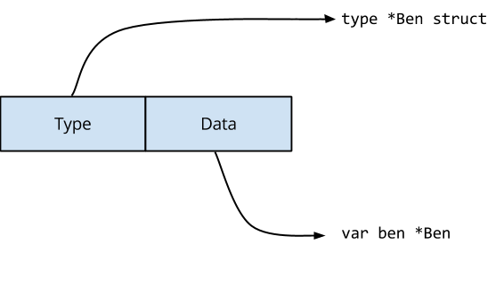
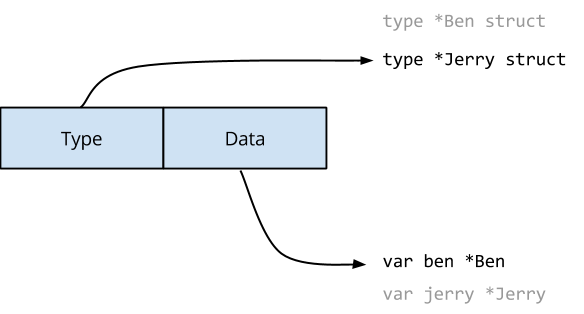

### 1. Data Race

#### 概念

data race 是两个或多个 goroutine 访问同一个资源(如变量或数据结构)，并尝试对该资源进行读写而不考虑其他 goroutine。

这种类型的代码可以创建您见过的最疯狂和最随机的 bug。通常需要大量的日志记录和运气才能找到这些类型的bug。

#### Race Detector

早在6月份的Go 1.1中，Go 工具引入了一个 race detector。竞争检测器是在构建过程中内置到程序中的代码。一旦你的程序运行，它就能够检测并报告它发现的任何竞争条件。

#### 使用

```go
$ go test -race mypkg    // test the package
$ go run -race mysrc.go  // compile and run the program
$ go build -race mycmd   // build the command
$ go install -race mypkg // install the package
```

#### Example

1

```go
package main

import (
	"fmt"
	"sync"
)

var Counter int=0
func main()  {
	wg:=sync.WaitGroup{}

	for gonum:=0;gonum<2;gonum++{
		wg.Add(1)
		go func(num int) {
			for count:=0;count<=20000;count++{
                // 使用timesleep也会实现同样的效果
				// time.Sleep(1*time.Nanosecond)
				Counter++
			}
			wg.Done()
		}(Counter)
	}
	wg.Wait()
	fmt.Println(Counter)
}
```

```go
go run -race 6.go  能检测到data race

WARNING: DATA RACE
Write at 0x000001031b88 by goroutine 7:
  main.main.func1()
      I:/Go/GeekTime/week3/6.data_race.go:17 +0x6a

Previous read at 0x000001031b88 by main goroutine:
  main.main()
      I:/Go/GeekTime/week3/6.data_race.go:20 +0xa4

Goroutine 7 (running) created at:
  main.main()
      I:/Go/GeekTime/week3/6.data_race.go:14 +0xd2

```

```go
go tool compile -S 6.go 会发现Counter不是原子操作，三步
实际上有三行汇编代码在执行以增加计数器。这三行汇编代码看起来很像原始的Go代码。
在这三行汇编代码之后可能有一个上下文切换。尽管程序现在正在运行，但从技术上讲，这个bug 仍然存在。
我们的 Go 代码看起来像是在安全地访问资源，而实际上底层的程序集代码根本就不安全。
```

##### Ice cream make

改变 maker 的值时，没有加锁

```go
package main

import "fmt"

type IceCreamMaker interface {
        // Hello greets a customer
        Hello()
}

type Ben struct {
        name string
}

func (b *Ben) Hello() {
        fmt.Printf("Ben says, \"Hello my name is %s\"\n", b.name)
}

type Jerry struct {
        name string
}

func (j *Jerry) Hello() {
        fmt.Printf("Jerry says, \"Hello my name is %s\"\n", j.name)
}

func main() {
        var ben = &Ben{"Ben"}
        var jerry = &Jerry{"Jerry"}
        var maker IceCreamMaker = ben

        var loop0, loop1 func()

        loop0 = func() {
                maker = ben
                go loop1()
        }

        loop1 = func() {
                maker = jerry
                go loop0()
        }

        go loop0()

        for {
                maker.Hello()
        }
}
```

output:

直接运行

```go
go run 7.go  
go run -race 7.go
 
都会有
Jerry says, "Hello my name is Ben"
Ben says, "Hello my name is Ben"
Jerry says, "Hello my name is Jerry"
Ben says, "Hello my name is Ben"
Jerry says, "Hello my name is Jerry"
Jerry says, "Hello my name is Jerry"
```

改变条件

```go
runtime.GOMAXPROCS(2)

go run 7.go

...
Ben says, "Hello my name is Ben"
Jerry says, "Hello my name is Jerry"
Jerry says, "Hello my name is Jerry"
Ben says, "Hello my name is Jerry" //出错
Ben says, "Hello my name is Ben"
```

原因

interface的结构

```go
type interface struct {
       Type uintptr     // points to the type of the interface implementation
       Data uintptr     // holds the data for the interface's receiver
}
```

Type指针指向实现接口的具体类型，Data指针指向具体的值

以`var maker IceCreamMaker = ben`为例



 `loop1()` 执行 `maker = jerry`之后，必须更新接口值的两个字段。



Go memory model 提到过: 表示写入单个 machine word 将是原子的，但 interface 内部是是两个 machine word 的值。另一个goroutine 可能在更改接口值时观察到它的内容。所以会出现以下情况


在这个例子中，Ben 和 Jerry 内存结构布局是相同的，因此它们在某种意义上是兼容的。

```go
package main


import (
"fmt"
)

type IceCreamMaker interface {
	// Hello greets a customer
	Hello()
}

type Ben struct {

	name string
}

func (b *Ben) Hello() {
	fmt.Printf("Ben says, \"Hello my name is %s\"\n", b.name)
}

//type Jerry struct {
//	name string
//}

type Jerry struct {
   field1 *[5]byte
   field2 int
}

func (j *Jerry) Hello() {
	name := string((*j.field1)[:])
	fmt.Printf("Jerry says, \"Hello my name is %s\"\n",name )
}

func main() {

	//runtime.GOMAXPROCS(2)
	var ben = &Ben{"Ben"}
	var jerry =&Jerry{&[5]byte{'J', 'e','r','r','y'}, 5}
	var maker IceCreamMaker = ben

	var loop0, loop1 func()

	loop0 = func() {
		maker = ben
		go loop1()
	}

	loop1 = func() {
		maker = jerry
		go loop0()
	}

	go loop0()

	for {
		maker.Hello()
	}
}


```

原因：

```go
string 的内部结构就是一个指向字节数组的指针，和一个数组的长度

若Jerry结构如下，那么ben和Jerry的内存布局是不一样的
type Jerry struct {
   field2 int
   field1 *[5]byte
}
```


如果他们有不同的内存布局会发生什么混乱？

```go
package main

import (
	"fmt"
)

type IceCreamMaker interface {
	// Hello greets a customer
	Hello()
}

type Ben struct {
	id int  //增加了这个字段
	name string
}

func (b *Ben) Hello() {
	fmt.Printf("Ben says, \"Hello my name is %s\"\n", b.name)
}

type Jerry struct {
	name string
}

func (j *Jerry) Hello() {
	fmt.Printf("Jerry says, \"Hello my name is %s\"\n", j.name)
}

func main() {

	var ben = &Ben{name: "Ben"}
	var jerry = &Jerry{"Jerry"}
	var maker IceCreamMaker = ben

	var loop0, loop1 func()

	loop0 = func() {
		maker = ben
		go loop1()
	}

	loop1 = func() {
		maker = jerry
		go loop0()
	}

	go loop0()

	for {
		maker.Hello()
	}
}

```

output：

```go
Ben says, "Hello my name is Ben"
Jerry says, "Hello my name is Jerry"
Ben says, "Hello my name is Ben"
panic: runtime error: invalid memory address or nil pointer dereference
[signal 0xc0000005 code=0x0 addr=0x5 pc=0xfc52b3]

一段正常的输出之后。出现panic
```

 

### 2. sync.atomic

为了解决data race，go 提供互斥锁保护内存不受数据竞争的影响。Go还通过`atomic`包内的原子内存原语来提高性能。

例子：模拟读写配置内存

```go
package main

import (
	"fmt"
	"sync"
)

type Config struct {
	a []int
}

func main()  {
	//runtime.GOMAXPROCS(3)
	cfg:=&Config{}
	go func() {
		i:=0
		for{
			i++
			cfg.a=[]int{i,i+1,i+2,i+3,i+4,i+5}

		}
	}()

	var wg sync.WaitGroup
	for n:=0;n<4;n++{
		wg.Add(1)

		go func() {
			for i:=0;i<100;i++{
				fmt.Printf("cfg:%v\n",cfg.a)
			}
			wg.Done()
		}()
	}
	wg.Wait()
}
（数据都是连续的，应该会出现不连续的情况）。。。。
```

output:

```go
[...]
&{[79167 79170 79173 79176 79179 79181]}
&{[79216 79219 79220 79221 79222 79223]}
&{[79265 79268 79271 79274 79278 79281]}
输出数据不连续
```

```go
go run -race 9.go

WARNING: DATA RACE
Read at 0x00c0003aa028 by goroutine 9:
  [...]
  fmt.Printf()
      /usr/local/go/src/fmt/print.go:213 +0xb5
  main.main.func2()
      main.go:30 +0x3b

Previous write at 0x00c0003aa028 by goroutine 7:
  main.main.func1()
      main.go:20 +0xfe
```

#### 2.1 mutex

加锁解决问题，写和读共同使用一把锁

```go

func main()  {
	var wg sync.WaitGroup
	var mu sync.Mutex
	cfg:=&Config{}
	go func() {
		i:=0
		for{
			i++
			mu.Lock()
			cfg.a=[]int{i,i+1,i+2,i+3,i+4,i+5}
			mu.Unlock()

		}
	}()


	for n:=0;n<4;n++{
		wg.Add(1)

		go func() {
			for i:=0;i<100;i++{
				mu.Lock()
				fmt.Printf("cfg:%v\n",cfg.a)
				mu.Unlock()
			}
			wg.Done()
		}()
	}
	wg.Wait()
}
```


output:

```go
[...]
&{[213 214 215 216 217 218]}
&{[214 215 216 217 218 219]}
&{[215 216 217 218 219 220]}
数据连续
```

#### 2.2 atomic

使用atomic

```go
package main

import (
	"fmt"
	"sync"
	"sync/atomic"
)

func main()  {
	var wg sync.WaitGroup
	var v atomic.Value

	cfg:=&Config{}
	go func() {
		i:=0
		for{
			i++

			cfg:=&Config{
				a:[]int{i,i+1,i+2,i+3,i+4,i+5},
			}
			v.Store(cfg)
		}
	}()


	for n:=0;n<4;n++{
		wg.Add(1)

		go func() {
			for i:=0;i<100;i++{
				cfg:=v.Load()
				fmt.Printf("cfg:%v\n",cfg)
			}
			wg.Done()
		}()
	}
	wg.Wait()
}
```

#### 2.3 性能比较

Benchmark 是出结果真相的真理，即便我们知道可能 Mutex vs Atomic 的情况里，Mutex 相对更重。因为涉及到更多的 goroutine 之间的上下文切换 pack blocking goroutine，以及唤醒 goroutine。


待看


#### 2.4 copy-on-write

Copy-On-Write 思路在微服务降级或者 local cache 场景中经常使用。写时复制指的是，写操作时候复制全量老数据到一个新的对象中，携带上本次新写的数据，之后利用原子替换(atomic.Value)，更新调用者的变量。来完成无锁访问共享数据。

待看 重要， redis的cow必考


### 3. mutex

#### 饥饿

```go
// shared state
done := make(chan bool, 1)
var mu sync.Mutex

// goroutine 1
go func() {
    for {
        select {
        case <-done:
            return
        default:
            mu.Lock()
            time.Sleep(100 * time.Microsecond)
            mu.Unlock()
        }
    }
}()

// goroutine 2
for i := 0; i < n; i++ {
    time.Sleep(100 * time.Microsecond)
    mu.Lock()
    mu.Unlock()
}
done <- 1
```


