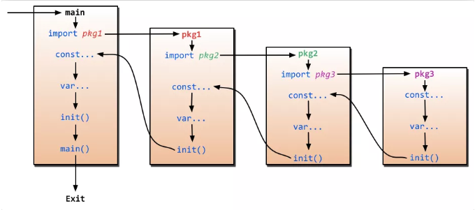
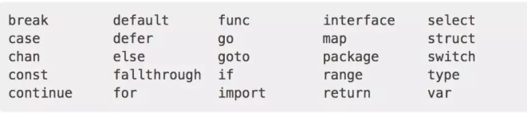
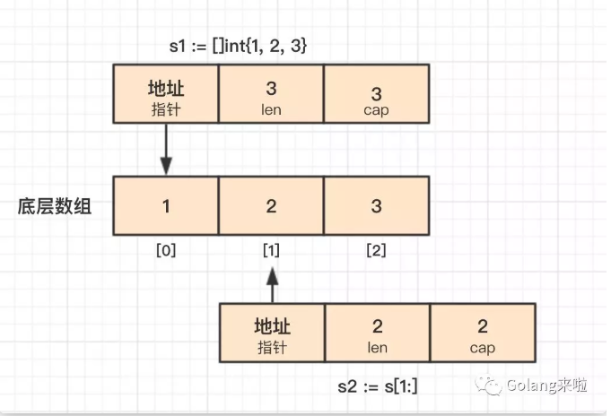

## Day 1. panic 和 defer 顺序

问：下面这段代码的打印顺序

```go
package main

import (
    "fmt"
)

func main() {
    defer_call()
}

func defer_call() {
    defer func() { fmt.Println("打印前") }()
    defer func() { fmt.Println("打印中") }()
    defer func() { fmt.Println("打印后") }()

    panic("触发异常")
}
```

输出：

```go
打印后
打印中
打印前
panic:触发异常
```

> `defer` 的执行顺序是先进后出，当初`panic`语句时，会先按照`defer`的后进先出的顺序执行，最后才执行`panic`

> 若把panic 移动到defer 上 ，则只有 panic("触发异常") 。

## Day 2. for range 创建元素副本，非引用

问：代码的输出

```c++
package main

import "fmt"

func main() {
	slice := []int{0, 1, 2, 3}
	m := make(map[int]*int)

	for key, val := range slice {
		m[key] = &val
	}

	for k, v := range m {
		fmt.Println(k, "->", *v)
	}
}
```

```go
0 -> 3
1 -> 3
2 -> 3
3 -> 3
```

> for range 循环的时候会**创建每个元素的副本，而不是元素的引用**，所以 m[key] = &val 取的都是变量 val 的地址，所以最后 map 中的所有元素的值都是变量 val 的地址，因为最后 val 被赋值为3，所有输出都是3.

```go
package main

import "fmt"

func main() {
	slice := []int{0, 1, 2, 3}

	m := make(map[int]*int)

	for key, val := range slice {
		value := val
		m[key] = &value
		
	}

	for k, v := range m {
		fmt.Println(k, "->", *v)
	}
}

```

```go
2 -> 2
3 -> 3
0 -> 0
1 -> 1
```

## Day 3. append, 命名返回值, new和make区别

问1：代码输出

```go
package main

import "fmt"

func main() {
	s1 := make([]int, 5)
	s1 = append(s1, 1, 2, 3, 4)

	s2 := make([]int, 0)
	s2 = append(s2, 1, 2, 3, 4)

	s3 := make([]int, 2)
	s3 = append(s3, 1, 2, 3, 4)

	fmt.Println("s1: ", s1)
	fmt.Println("s2: ", s2)
	fmt.Println("s3: ", s3)
}
```

```go
s1:  [0 0 0 0 0 1 2 3 4]
s2:  [1 2 3 4]
s3:  [0 0 1 2 3 4]
```

****

问2：代码缺陷错误

```go
func add(x,y int)(sum int, error){
	return x+y,nil
}
```

> 在函数有多个返回值时，只要有一个返回值有命名，其他的也必须命名。
>
> 如果有多个返回值必须加上括号()；
>
> 如果只有一个返回值且命名也必须加上括号()。
>
> 这里的第一个返回值有命名 sum，第二个没有命名，所以错误。

```go
//对
func add(x,y int)(sum int, err error){
	return x+y,nil
}
```

------

问3: make 和 new 的区别

new(T) 和 make(T, args ) 是 Go 语言内建函数，用来分配内存，但适用的类型不同。

new(T) 会为 T 类型的新值分配已置零的内存空间，并返回地址（指针），即类型为 *T 的值。换句话说就是，返回一个指针，该指针指向新分配的、类型为 T 的零值。适用于值类型，如数组、结构体等。

make(T,args) 返回初始化之后的 T 类型的值，这个值并不是 T 类型的零值，也不是指针 *T，是经过初始化之后的 T 的引用。make() 只适用于 slice、map 和 channel.

***

## Day 4. append, :=

问1：能否通过编译

```go
package main
import "fmt"
//否
func main() {
	s1 := new([]int)
	s1 := append(s1, 2)
	fmt.Println(s1)
}
```

不能对指针执行 append 操作,可以使用 make() 初始化之后再用。同样的，map 和 channel建议使用 make() 或字面量的方式初始化，不要用 new() 

***

问2：能否通过编译

```go
package main

import "fmt"
//否
func main() {
	s1 := []int{1, 3, 2}
	s2 := []int{4, 5}
	s1 = append(s1, s2)
	fmt.Println(s1)
}
```

不能，append() 的第二个参数不能直接使用 slice，需使用 … 操作符，将一个切片追加到另一个切片上：append(s1,s2…)。或者直接跟上元素，形如：append(s1,1,2,3)

```go
package main
import "fmt"

func main() {
	
	s1 := []int{1, 3, 2}
	s2 := []int{4, 5}
	s1 = append(s1, s2...)
	fmt.Println(s1)
}
```

```go
[1 3 2 4 5]
```

****

问3：能否通过编译

```go
var (
	size := 1024
	max_size := size*2
)

func main() 
	fmt.Println(size,max_size)
}
```

否，变量声明的简短模式，x := 100。但这种声明方式有限制：

1. 必须使用显示初始化；
2. 不能提供数据类型，编译器会自动推导；
3. 只能在函数内部使用简短模式；

## Day 5. 结构体比较

能否通过编译

```go
package main

import "fmt"

func main() {
	st1 := struct {
		age  int
		name string
	}{age: 3, name: "qq"}
	st2 := struct {
		age  int
		name string
	}{age: 3, name: "qq"}

    //成员属性顺序不一样，也不能比较
	st3 := struct {
		name string
		age  int
	}{age: 3, name: "qq"}

	fmt.Println(st1 == st2)
    
	//fmt.Println(st3 == st1)编译错误

	sm1 := struct {
		age int
		n   map[string]string
	}{age: 5, n: map[string]string{"sd": "sf"}}
	sm2 := struct {
		age int
		n   map[string]string
	}{age: 5, n: map[string]string{"sd": "sf"}}

	//fmt.Println(sm2 == sm1) 编译错误
}
```

1. 结构体只能比较是否相等，但是不能比较大小。
2. 相同类型的结构体才能够进行比较，结构体是否相同不但与属性类型有关，还与属性顺序相关，sn3 与 [sn1](http://mp.weixin.qq.com/s?__biz=MzI2MDA1MTcxMg==&mid=2648466814&idx=1&sn=611ad5be36e7c886126f67da3f11af0e&chksm=f2474311c530ca070cdaa791fbe488b9ecd66667f7d08ee78068c5fbb33db1114c7bdd4a625c&scene=21#wechat_redirect) 就是不同的结构体；
3. 如果 struct 的所有成员都可以比较，则该 struct 就可以**通过 == 或 != 进行比较**是否相等，比较时逐个项进行比较，如果每一项都相等，则两个结构体才相等，否则不相等；

**可比较**： bool、数值型、字符、指针、数组等

**不可比较**：切片、map、函数等。

## Day 6. 指针，类型别名与定义，值传递

问1.通过指针变量 p 访问其成员变量 name，有哪几种方式？

- A.p.name
- B.(&p).name
- C.(*p).name
- D.p->name

答：AC

***

问2：能否通过编译

```go
package main

import "fmt"

type myInt1 int
type myInt2 = int

func main() {
	var i int = 0
	var i1 myInt1 = i
	var i2 myInt2 = i
	fmt.Println(i1, i2)
}
```

```go
.\day-6.go:10:6: cannot use i (type int) as type myInt1 in assignment
```

类型别名与类型定义的区别。

第 5 行代码是基于类型 int 创建了新类型 MyInt1

第 6 行代码是创建了 int 的类型别名 MyInt2，注意类型别名的定义时 = 。

所以，第 10 行代码相当于是将 int 类型的变量赋值给 MyInt1 类型的变量，Go 是强类型语言，编译当然不通过；而 MyInt2 只是 int 的别名，本质上还是 int，可以赋值。

第 10 行代码的赋值可以使用强制类型转化 var i1 MyInt1 = MyInt1(i).

***

问3：输出是什么

```go
package main

import "fmt"

func main() {
	a := []int{7, 8, 9}
	fmt.Printf("%+v\n", a)
	ap(a)
	fmt.Printf("%+v\n", a)
	app(a)
	fmt.Printf("%+v\n", a)

}

func ap(a []int) {
	a = append(a, 10)
}

func app(a []int) {
	a[0] = 1
}
```

```c++
[7 8 9]
[7 8 9]
[1 8 9]
```

 append 导致底层数组重新分配内存了,创建了新切片，ap 中的 a 这个slice 的底层数组和外面的不是一个，并没有改变外面的。app会修改底层数组内容，会改变

## Day 7. 字符串拼接，iota

问1： 关于字符串连接，下面语法正确的是？

- A. str := 'abc' + '123'
- B. str := "abc" + "123"
- C. str := '123' + "abc"
- D. fmt.Sprintf("abc%d", 123)

答：BD。知识点：字符串连接。除了以上两种连接方式，还有 strings.Join()，buffer.WriteString()等。

***

问2：输出什么

```go
package main
import "fmt"

const (
	x = iota
	_
	y
	z = "zz"
	k
	p = iota
)

func main() {
	fmt.Println(x, y, z, k, p)
}
```

```go
0 2 zz zz 5
```

[iota详细](https://www.cnblogs.com/zsy/p/5370052.html)

**1iota是golang语言的常量计数器,只能在常量的表达式中使用。**

**每次 const 出现时，都会让 iota 初始化为0.【自增长】**

```go
const a = iota // a=0
const (
 	b = iota     //b=0
 	c           / /c=1
)
```

**可以使用下划线跳过不想要的值**

**中间插队**

```go
const (
  i = iota
  j = 3.14
  k = iota
  l
)
//那么打印出来的结果是 i=0,j=3.14,k=2,l=3
```


***

问3：下面赋值正确的是()

- A. var x = nil
- B. var x interface{} = nil
- C. var x string = nil
- D. var x error = nil

参考答案及解析：BD。知识点：nil 值。nil 只能赋值给指针、chan、func、interface、map 或 slice 类型的变量。强调下 D 选项的 error 类型，它是一种内置接口类型，看下方贴出的源码就知道，所以 D 是对的。

```go
type error interface {
    Error() string
}
```

## Day 8. init 函数, 类型选择 interface.(type)

问1：关于init函数，下面说法正确的是()

- A. 一个包中，可以包含多个 init 函数；

- B. 程序编译时，先执行依赖包的 init 函数，再执行 main 包内的 init 函数；

- C. main 包中，不能有 init 函数；

- D. init 函数可以被其他函数调用；

	

答：参考答案及解析：AB。关于 init() 函数有几个需要注意的地方：

1. init() 函数是用于程序执行前做包的初始化的函数，比如初始化包里的变量等;		
2. 一个包可以出线多个 init() 函数,一个源文件也可以包含多个 init() 函数；
3. 同一个包中多个 init() 函数的执行顺序没有明确定义，**但是不同包的init函数是根据包导入的依赖关系决定的**（看下图）;
4. init() 函数在代码中不能被显示调用、不能被引用（赋值给函数变量），否则出现编译错误;
5. 一个包被引用多次，如 A import B,C import B,A import C，B 被引用多次，但 B 包只会初始化一次；
6. 引入包，不可出现死循坏。即 A import B,B import A，这种情况编译失败；



***

问2：代码输出什么

```go
package main

import "fmt"

func hello() []string {
	return nil
}
func main() {
	h := hello
	if h == nil {
		fmt.Println(nil)
	} else {
		fmt.Println("not nil")
	}
}
```

- A. nil
- B. not nil
- C. compilation error 

答案及解析：B。这道题目里面，是将 hello() 赋值给变量 h，而不是函数的返回值，所以输出 not nil。

***

问3：能否编译通过

```go
package main

import "fmt"

func getValue() int {
	return 1
}

func main() {
	i := getValue()
	switch i.(type) {
	case int:
		fmt.Println("int")
	case string:
		fmt.Println("string")
	case interface{}:
		fmt.Println("interface")
	default:
		print("default")

	}
}
```

```go
.\day-8.go:23:2: cannot type switch on non-interface value i (type int)
```

类型选择的语法形如：i.(type)，其中 i 是接口，type 是固定关键字，需要注意的是，只有接口类型才可以使用类型选择。看下关于[接口](http://mp.weixin.qq.com/s?__biz=MzI2MDA1MTcxMg==&mid=2648466668&idx=1&sn=adcc1d23efff1047bbe7f6450065081a&chksm=f2474283c530cb9554aa9ee92b4332f3cc374c32bb0b51f0e031880c74641e190b50338fd9bc&scene=21#wechat_redirect)的文章。

## Day 9. channel, 可变函数

​		

问1：关于channel，下面语法正确的是()

- A. var ch chan int
- B. ch := make(chan int)
- C. <- ch
- D. ch <-

参考答案及解析：ABC。A、B都是声明 channel；C 读取 channel；写 channel 是必须带上值，所以 D 错误。

***

问2：代码输出？

```go
package main

import "fmt"

type person struct {
	name string
}

func main() {
	var m map[person]int
	p := person{
		name: "lili",
	}

	fmt.Println(m[p])
}

```

- A. 0
- B. 1
- C. Compilation error 

参考答案及解析：A。打印一个 map 中不存在的值时，返回元素类型的零值。这个例子中，m 的类型是 map[person]int，因为 m 中不存在 p，所以打印 int 类型的零值，即 0。

***

问3：代码输出？

```go
func hello(num ...int) {
	num[0] = 18
}
func main() {
	i := []int{5, 6, 7}
	hello(i...)
	fmt.Println(i[0])
}
```

18。知识点：可变函数。

## day 10. 比较，s[i: j: k]切片

问1：代码输出？

```go
func main() {  
    a := 5
    b := 8.1
    fmt.Println(a + b)
}
```

- A. 13.1  
- B. 13
- C. compilation error  

C。a 的类型是 int，b 的类型是 float，两个不同类型的数值不能相加，编译报错。

***

问2：代码输出

```go
package main

import (  
    "fmt"
)

func main() {  
    a := [5]int{1, 2, 3, 4, 5}
    t := a[3:4:4]
    //t := a[3:4:6]编译错误
    fmt.Println(t[0])
}
```

- A. 3
- B. 4
- C. compilation error  

B。知识点：操作符 [i,j]。基于数组（切片）可以使用操作符 [i,j] 创建新的切片，从索引 i，到索引 j 结束，截取已有数组（切片）的任意部分，返回新的切片，新切片的值包含原数组（切片）的 i 索引的值，但是不包含 j 索引的值。i、j 都是可选的，i 如果省略，默认是 0，j 如果省略，默认是原数组（切片）的长度。i、j 都不能超过这个长度值。

假如底层数组的大小为 k，截取之后获得的切片的长度和容量的计算方法：**长度：j-i，容量：k-i**。

截取操作符还可以有第三个参数，形如 [i,j,k]，第三个参数 k 用来限制新切片的容量，**但不能超过原数组（切片）的底层数组大小**。截取获得的切片的长度和容量分别是：**j-i、k-i。**

所以例子中，切片 t 为 [4]，长度和容量都是 1。

***

问3：代码输出？

```go
func main() {
    a := [2]int{5, 6}
    b := [3]int{5, 6}
    if a == b {
        fmt.Println("equal")
    } else {
        fmt.Println("not equal")
    }
}
```

- A. compilation error  
- B. equal  
- C. not equal 

A。Go 中的数组是值类型，可比较，另外一方面，数组的长度也是数组类型的组成部分，所以 a 和 b 是不同的类型，是不能比较的，所以编译错误。

​		


## Day 11.  cap(), interface, map删除

问1.关于 cap() 函数的适用类型，下面说法正确的是()

- A. array
- B. slice
- C. map
- D. channel

ABD。知识点：cap()，cap() 函数不适用 map。


***

问2：代码输出？

```go
func main() {  
    var i interface{}
    if i == nil {
        fmt.Println("nil")
        return
    }
    fmt.Println("not nil")
}
```

- A. nil
- B. not nil
- C. compilation error  

A。当且仅当接口的动态值和动态类型都为 nil 时，接口类型值才为 nil。[文章](http://mp.weixin.qq.com/s?__biz=MzI2MDA1MTcxMg==&mid=2648466668&idx=1&sn=adcc1d23efff1047bbe7f6450065081a&chksm=f2474283c530cb9554aa9ee92b4332f3cc374c32bb0b51f0e031880c74641e190b50338fd9bc&scene=21#wechat_redirect)。


***

问3：代码输出？

```go
func main() {  
    s := make(map[string]int)
    delete(s, "h")
    fmt.Println(s["h"])
}
```

- A. runtime panic
- B. 0
- C. compilation error 

B。删除 map 不存在的键值对时，不会报错，相当于没有任何作用；获取不存在的减值对时，返回值类型对应的零值，所以返回 0。

## day 12. 关键字，结构体嵌套

问1：下面属于关键字的是（）

- A. func
- B. struct
- C. class
- D. defer

ABD。知识点：Go 语言的关键字。Go 语言有 25 个关键字，看下图：



***

问2：代码输出？

```go
func main() {  
    i := -5
    j := +5
    fmt.Printf("%+d %+d", i, j)
}
```

- A. -5 +5
- B. +5 +5
- C. 0  0

A。`%d`表示输出十进制数字，`+`表示输出数值的符号。这里不表示取反。


***

问3： 代码输出？

```go
type People struct{}

func (p *People) ShowA() {
    fmt.Println("showA")
    p.ShowB()
}
func (p *People) ShowB() {
    fmt.Println("showB")
}

type Teacher struct {
    People
}

func (t *Teacher) ShowB() {
    fmt.Println("teacher showB")
}

func main() {
    t := Teacher{}
    t.ShowB()
}
```

teacher showB。

知识点：结构体嵌套。在嵌套结构体中，People 称为内部类型，Teacher 称为外部类型；通过嵌套，内部类型的属性、方法，可以为外部类型所有，就好像是外部类型自己的一样。此外，外部类型还可以定义自己的属性和方法，甚至可以定义与内部相同的方法，这样内部类型的方法就会被“屏蔽”。这个例子中的 ShowB() 就是同名方法。

关于结构体嵌套可以看下[这篇文章](http://mp.weixin.qq.com/s?__biz=MzI2MDA1MTcxMg==&mid=2648466766&idx=1&sn=02a0221869095c201053957c40395460&chksm=f2474321c530ca377999562f07acf5407e83e574568e71b9ab001c927ed2d715f653192f19da&scene=21#wechat_redirect)。


## Day 13. 全局声明, defer, 结构体嵌套

问1：定义一个包内全局字符串变量，下面语法正确的是（）

- A. var str string
- B. str := ""
- C. str = ""
- D. var str = ""

：AD。B 只支持局部变量声明；C 是赋值，str 必须在这之前已经声明；


***

问2：下面这段代码输出什么?

```go
func hello(i int) {  
    fmt.Println(i)
}
func main() {  
    i := 5
    defer hello(i)
    i = i + 10
}
```

5。这个例子中，hello() 函数的参数在执行 defer 语句的时候会保存一份副本，在实际调用 hello() 函数时用，所以是 5.


***

问3：下面这段代码输出什么？

```go
type People struct{}

func (p *People) ShowA() {
    fmt.Println("showA")
    p.ShowB()
}
func (p *People) ShowB() {
    fmt.Println("showB")
}

type Teacher struct {
    People
}

func (t *Teacher) ShowB() {
    fmt.Println("teacher showB")
}

func main() {
    t := Teacher{}
    t.ShowA()
}
```

showA
showB

结构体嵌套。这道题可以结合第 12 天的第三题一起看，Teacher 没有自己 ShowA()，所以调用内部类型 People 的同名方法，需要注意的是第 5 行代码调用的是 People 自己的 ShowB 方法。


## Day 14. 字符串常量, 可变函数

问1：代码输出？

```go
func main() {
    str := "hello"
    str[0] = 'x'
    fmt.Println(str)
}
```

- A. hello
- B. xello
- C. compilation error

C。知识点：常量，Go 语言中的字符串是只读的


***

问2： 代码输出什么？

```go
func incr(p *int) int {
    *p++
    return *p
}

func main() {
    p :=1
    incr(&p)
    fmt.Println(p)
}
```

- A. 1
- B. 2
- C. 3

B。知识点：指针，incr() 函数里的 p 是 `*int` 类型的指针，指向的是 main() 函数的变量 p 的地址。第 2 行代码是将该地址的值执行一个自增操作，incr() 返回自增后的结果。

参考下[指针](http://mp.weixin.qq.com/s?__biz=MzI2MDA1MTcxMg==&mid=2648466791&idx=2&sn=1834521de50c6af6624d11e34e59a8b2&chksm=f2474308c530ca1e78ce4e6f6e029ffa6f83279333e39aff354799ab6882c1e3813c159388f5&scene=21#wechat_redirect)的文章


***

问3：对 add() 函数调用正确的是（）

```go
func add(args ...int) int {

    sum := 0
    for _, arg := range args {
        sum += arg
    }
    return sum
}
```

- A. add(1, 2)
- B. add(1, 3, 7)
- C. add([]int{1, 2})
- D. add([]int{1, 3, 7}…}

ABD。知识点：[可变函数](http://mp.weixin.qq.com/s?__biz=MzI2MDA1MTcxMg==&mid=2648466706&idx=3&sn=003c213739e51088ad4947e473429775&chksm=f247437dc530ca6bafebe0a5a4090343cbf1eb992e36b6199cf213be6156273179465ed41348&scene=21#wechat_redirect)。


## Day 15. nil 切片和空切片，实现接口

1.下面代码下划线处可以填入哪个选项？

```go
func main() {
    var s1 []int
    var s2 = []int{}
    if __ == nil {
        fmt.Println("yes nil")
    }else{
        fmt.Println("no nil")
    }
}
```

- A. s1
- B. s2
- C. s1、s2 都可以

A。知识点：nil 切片和空切片。nil 切片和 nil 相等，一般用来表示一个不存在的切片；空切片和 nil 不相等，表示一个空的集合。


***

2.下面这段代码输出什么？

```go
func main() {  
    i := 65
    fmt.Println(string(i))
}
```

- A. A
- B. 65
- C. compilation error

A。UTF-8 编码中，十进制数字 65 对应的符号是 A。


***

3.下面这段代码输出什么？

```go
type A interface {
    ShowA() int
}

type B interface {
    ShowB() int
}

type Work struct {
    i int
}

func (w Work) ShowA() int {
    return w.i + 10
}

func (w Work) ShowB() int {
    return w.i + 20
}

func main() {
    c := Work{3}
    var a A = c
    var b B = c
    fmt.Println(a.ShowA())
    fmt.Println(b.ShowB())
}
```

13 23。

接口。一种类型实现多个接口，结构体 Work 分别实现了接口 A、B，所以接口变量 a、b 调用各自的方法 ShowA() 和 ShowB()，输出 13、23


## Day 16. cap(),len(), 接口的静态类型, map初始化

1.切片 a、b、c 的长度和容量分别是多少？

```go
func main() {

    s := [3]int{1, 2, 3}
    a := s[:0]
    b := s[:2]
    c := s[1:2:cap(s)]
}
```

2.下面代码中 A B 两处应该怎么修改才能顺利编译？

```go
func main() {
    var m map[string]int        //A
    m["a"] = 1
    if v := m["b"]; v != nil {  //B
        fmt.Println(v)
    }
}
```

3.下面代码输出什么？

```go
type A interface {
    ShowA() int
}

type B interface {
    ShowB() int
}

type Work struct {
    i int
}

func (w Work) ShowA() int {
    return w.i + 10
}

func (w Work) ShowB() int {
    return w.i + 20
}

func main() {
    c := Work{3}
    var a A = c
    var b B = c
    fmt.Println(a.ShowB())
    fmt.Println(b.ShowA())
}
```

- A. 23 13
- B. compilation error

***


**解析：**

1.参考答案及解析：a、b、c 的长度和容量分别是 0 3、2 3、1 2。

知识点：数组或切片的截取操作。截取操作有带 2 个或者 3 个参数，形如：[i:j] 和 [i:j:k]，假设截取对象的底层数组长度为 l。

在操作符 [i:j] 中，如果 i 省略，默认 0，如果 j 省略，默认底层数组的长度，截取得到的**切片长度和容量计算方法是 j-i、l-i**。操作符 [i:j:k]，

k 主要是用来限制切片的容量，但是不能大于数组的长度 l，截取得到的**切片长度和容量计算方法是 j-i、k-i**。


2.参考答案及解析：

```go
func main() {
    m := make(map[string]int)
    m["a"] = 1
    if v,ok := m["b"]; ok {
        fmt.Println(v)
    }
}
```

在 A 处只声明了map m ,并没有分配内存空间，不能直接赋值，需要使用 make()，都提倡使用 make() 或者字面量的方式直接初始化 map。

B 处，`v,k := m["b"]` 当 key 为 b 的元素不存在的时候，v 会返回值类型对应的零值，k 返回 false。


3.参考答案及解析：B。知识点：接口的静态类型。a、b 具有相同的动态类型和动态值，分别是结构体 work 和 {3}；a 的静态类型是 A，b 的静态类型是 B，接口 A 不包括方法 ShowB()，接口 B 也不包括方法 ShowA()，编译报错。看下编译错误：

```go
a.ShowB undefined (type A has no field or method ShowB)
b.ShowA undefined (type B has no field or method ShowA)
```

更多知识点看下[接口的文章](http://mp.weixin.qq.com/s?__biz=MzI2MDA1MTcxMg==&mid=2648466700&idx=1&sn=25c48d78dcfad6c70330cd36dd749e53&chksm=f2474363c530ca75132454e4e10e40659310a073e2f9d30ad9697d4abf7c2b9e5aa9adee58bf&scene=21#wechat_redirect)。


## Day 18. 变量声明，defer，接口

1.下面代码中，x 已声明，y 没有声明，判断每条语句的对错。

```go
1. x, _ := f()
2. x, _ = f()
3. x, y := f()
4. x, y = f()
```

2.下面代码输出什么？

```go
func increaseA() int {
    var i int
    defer func() {
        i++
    }()
    return i
}

func increaseB() (r int) {
    defer func() {
        r++
    }()
    return r
}

func main() {
    fmt.Println(increaseA())
    fmt.Println(increaseB())
}
```

- A. 1 1
- B. 0 1
- C. 1 0
- D. 0 0

3.下面代码输出什么？

```go
type A interface {
    ShowA() int
}

type B interface {
    ShowB() int
}

type Work struct {
    i int
}

func (w Work) ShowA() int {
    return w.i + 10
}

func (w Work) ShowB() int {
    return w.i + 20
}

func main() {
    var a A = Work{3}
    s := a.(Work)
    fmt.Println(s.ShowA())
    fmt.Println(s.ShowB())
}
```

- A. 13 23
- B. compilation error


**解析：**

1.参考答案及解析：错、对、对、错。知识点：变量的声明。1.错，x 已经声明，不能使用 :=；2.对；3.对，当多值赋值时，:= 左边的变量无论声明与否都可以；4.错，y 没有声明。

2.参考答案及解析：B。知识点：defer、返回值。注意一下，increaseA() 的返回参数是匿名，increaseB() 是具名。

3.参考答案及解析：A。知识点：类型断言。这道题可以和第 15 天的第三题 和第 16 天的第三题结合起来看，具体的解析看[《Go 语言接口详解（二）》](http://mp.weixin.qq.com/s?__biz=MzI2MDA1MTcxMg==&mid=2648466700&idx=1&sn=25c48d78dcfad6c70330cd36dd749e53&chksm=f2474363c530ca75132454e4e10e40659310a073e2f9d30ad9697d4abf7c2b9e5aa9adee58bf&scene=21#wechat_redirect)。


## Day 19. defer

1.下面代码段输出什么？

```go
type Person struct {
    age int
}

func main() {
    person := &Person{28}

    // 1. 
    defer fmt.Println(person.age)

    // 2.
    defer func(p *Person) {
        fmt.Println(p.age)
    }(person)  

    // 3.
    defer func() {
        fmt.Println(person.age)
    }()

    person.age = 29
}
```

29 29 28。变量 person 是一个指针变量 。

1. person.age 此时是将 28 当做 defer 函数的参数，会把 28 缓存在栈中，等到最后执行该 defer 语句的时候取出，即输出 28；

2. defer 缓存的是结构体 Person{28} 的地址，最终 Person{28} 的 age 被重新赋值为 29，所以 defer 语句最后执行的时候，依靠缓存的地址取出的 age 便是 29，即输出 29；

3. 闭包引用，输出 29；

又由于 defer 的执行顺序为先进后出，即 3 2 1，所以输出 29 29 28。

- [『GCTT 出品』Go 中 defer 的 5 个坑 - 第一部分](http://mp.weixin.qq.com/s?__biz=MzAxMTA4Njc0OQ==&mid=2651435212&idx=1&sn=16da319f0b15b65b6a0f29eca2bc3d9d&chksm=80bb6e3eb7cce7289734ba2ed7d903742b7bf7c4b0baa4bcc59cc196bace183e679d0e69b5b5&scene=21#wechat_redirect)
- [『GCTT 出品』Golang 中 defer 的五个坑 - 第二部分](http://mp.weixin.qq.com/s?__biz=MzAxMTA4Njc0OQ==&mid=2651435220&idx=1&sn=ed8f057bbd483590cbe052c1f6395f20&chksm=80bb6e26b7cce730687b22187d2c836d79e2742e6615a61b0201c79909ce4187a70735fbd15b&scene=21#wechat_redirect)
- [Golang 中 defer 的五个坑 - 第三部分](http://mp.weixin.qq.com/s?__biz=MzAxMTA4Njc0OQ==&mid=2651435392&idx=1&sn=bdc2c43ef6273f2b1e5a2a7f7e666db1&chksm=80bb6f72b7cce6643e84ee9e31d14161a7ba07106495bb0915a15d0bb76e151951d38fafced4&scene=21#wechat_redirect)

- [5 年 Gopher 都不知道的 defer 细节，你别再掉进坑里！](http://mp.weixin.qq.com/s?__biz=MzI2MDA1MTcxMg==&mid=2648466918&idx=2&sn=151a8135f22563b7b97bf01ff480497b&chksm=f2474389c530ca9f3dc2ae1124e4e5ed3db4c45096924265bccfcb8908a829b9207b0dd26047&scene=21#wechat_redirect)


## Day 20. defer

1.下面这段代码正确的输出是什么？

```go
func f() {
    defer fmt.Println("D")
    fmt.Println("F")
}

func main() {
    f()
    fmt.Println("M")
}
```

- A. F M D
- B. D F M
- C. F D M

***


2.下面代码输出什么？

```go
type Person struct {
    age int
}

func main() {
    person := &Person{28}

    // 1.
    defer fmt.Println(person.age)

    // 2.
    defer func(p *Person) {
        fmt.Println(p.age)
    }(person)

    // 3.
    defer func() {
        fmt.Println(person.age)
    }()

    person = &Person{29}
}
```


**解析：**

1.参考答案及解析：C。被调用函数里的 defer 语句在返回之前就会被执行，所以输出顺序是 F D M。

2.参考答案及解析：29 28 28。

这道题在第 19 天题目的基础上做了一点点小改动，前一题最后一行代码 `person.age = 29` 是修改引用对象的成员 age，这题最后一行代码 `person = &Person{29}` 是修改引用对象本身，来看看有什么区别。

1处. person.age 这一行代码跟之前含义是一样的，此时是将 28 当做 defer 函数的参数，会把 28 缓存在栈中，等到最后执行该 defer 语句的时候取出，即输出 28；

2处. defer 缓存的是结构体 Person{28} 的地址，这个地址指向的结构体没有被改变，最后 defer 语句后面的函数执行的时候取出仍是 28；

3处. 闭包引用，person 的值已经被改变，指向结构体 `Person{29}`，所以输出 29.

由于 defer 的执行顺序为先进后出，即 3 2 1，所以输出 29 28 28。


## Day 21. 切片声明，接口

1. 下面的两个切片声明中有什么区别？哪个更可取？

```go
A. var a []int
B. a := []int{}
```


2. A、B、C、D 哪些选项有语法错误？

```go
type S struct {
}

func f(x interface{}) {
}

func g(x *interface{}) {
}

func main() {
    s := S{}
    p := &s
    f(s) //A
    g(s) //B
    f(p) //C
    g(p) //D
}
```

3. 下面 A、B 两处应该填入什么代码，才能确保顺利打印出结果？

```go
type S struct {
    m string
}

func f() *S {
    return __  //A
}

func main() {
    p := __    //B
    fmt.Println(p.m) //print "foo"
}
```


解析：

1、参考答案及解析：A 声明的是 nil 切片；B 声明的是长度和容量都为 0 的空切片。第一种切片声明不会分配内存，优先选择。

2、参考答案及解析：BD。函数参数为 interface{} 时可以接收任何类型的参数，包括用户自定义类型等，即使是接收指针类型也用 interface{}，而不是使用 *interface{}。

> 永远不要使用一个指针指向一个接口类型，因为它已经是一个指针。

3.参考答案及解析：

```
A. &S{"foo"} 
B. *f() 或者 f()
```

f() 函数返回参数是指针类型，所以可以用 & 取结构体的指针；B 处，如果填 `*f()`，则 p 是 S 类型；如果填 `f()`，则 p 是 *S 类型，不过都可以使用 `p.m` 取得结构体的成员。


## Day 22. 字符串与nil，defer

1.下面的代码有几处语法问题，各是什么？

```go
package main
import (
    "fmt"
)
func main() {
    var x string = nil
    if x == nil {
        x = "default"
    }
    fmt.Println(x)
}
```

2.return 之后的 defer 语句会执行吗，下面这段代码输出什么？

```go
var a bool = true
func main() {
    defer func(){
        fmt.Println("1")
    }()
    if a == true {
        fmt.Println("2")
        return
    }
    defer func(){
        fmt.Println("3")
    }()
}
```


解析：**

1.参考答案及解析：两个地方有语法问题。golang 的字符串类型是不能赋值 nil 的，也不能跟 nil 比较。


2.参考答案及解析：2 1。defer 关键字后面的函数或者方法想要执行必须先注册，return 之后的 defer 是不能注册的， 也就不能执行后面的函数或方法。


## Day 23. 切片，代码块和变量作用域

1.下面这段代码输出什么？为什么？

```go
func main() {

    s1 := []int{1, 2, 3}
    s2 := s1[1:]
    s2[1] = 4
    fmt.Println(s1)
    s2 = append(s2, 5, 6, 7)
    fmt.Println(s1)
}
```

2.下面选项正确的是？

```go
func main() {
    if a := 1; false {
    } else if b := 2; false {
    } else {
        println(a, b)
    }
}
```

- A. 1 2
- B. compilation error


1.参考答案及解析：

```
[1 2 4]
[1 2 4]
```

我们知道，golang 中切片底层的数据结构是数组。当使用 s1[1:] 获得切片 s2，和 s1 共享同一个底层数组，这会导致 s2[1] = 4 语句影响 s1。

而 append 操作会导致底层数组扩容，生成新的数组，因此追加数据后的 s2 不会影响 s1。

但是为什么对 s2 赋值后影响的却是 s1 的第三个元素呢？这是因为切片 s2 是从数组的第二个元素开始，s2 索引为 1 的元素对应的是 s1 索引为 2 的元素。




2.参考答案及解析：A。知识点：代码块和变量作用域。推荐 TonyBai 老师的一篇[文章](http://mp.weixin.qq.com/s?__biz=MzIyNzM0MDk0Mg==&mid=2247484052&idx=1&sn=eab928ea5b67046f4cdc933634db17cc&chksm=e863e575df146c63710dd1ea180c58b3eff451d0247b3e11cad71b1369e03726fecfca6eeb8f&scene=21#wechat_redirect)，讲的很详细！


## Day 24. map ，defer

1.下面这段代码输出什么？

```go
func main() {
    m := map[int]string{0:"zero",1:"one"}
    for k,v := range m {
        fmt.Println(k,v)
    }
}
```

参考答案及解析：

```go
0 zero
1 one
// 或者
1 one
0 zero
```

map 的输出是无序的。

***


2.下面这段代码输出什么？

```go
func main() {
    a := 1
    b := 2
    defer calc("1", a, calc("10", a, b))
    a = 0
    defer calc("2", a, calc("20", a, b))
    b = 1
}

func calc(index string, a, b int) int {
    ret := a + b
    fmt.Println(index, a, b, ret)
    return ret
}
```

参考答案及解析：

```go
10 1 2 3
20 0 2 2
2 0 2 2
1 1 3 4
```

程序执行到 main() 函数三行代码的时候，会先执行 calc() 函数的 b 参数`calc("10",a,b)`，输出：10 1 2 3，得到值 3，

因为defer 定义的函数是延迟函数，故 calc("1",1,3) 会被延迟执行；

程序执行到第五行的时候，同样先执行 calc("20",a,b) 输出：20 0 2 2 得到值 2，同样将 calc("2",0,2) 延迟执行；

程序执行到末尾的时候，按照栈先进后出的方式依次执行：calc("2",0,2)，calc("1",1,3)，则就依次输出：2 0 2 2，1 1 3 4。


## Day 25. 类的方法，接口

1.下面这段代码输出什么？为什么？

```go
func (i int) PrintInt ()  {
    fmt.Println(i)
}

func main() {
    var i int = 1
    i.PrintInt()
}
```

- A. 1
- B. compilation error

参考答案及解析：B。**基于类型创建的方法必须定义在同一个包内**，上面的代码基于 int 类型创建了 PrintInt() 方法，由于 int 类型和方法 PrintInt() 定义在不同的包内，所以编译出错。

解决的办法可以定义一种新的类型：

```go
type Myint int

func (i Myint) PrintInt ()  {
    fmt.Println(i)
}

func main() {
    var i Myint = 1
    i.PrintInt()
}
```

***

2.下面这段代码输出什么？为什么？

```go
type People interface {
    Speak(string) string
}

type Student struct{}

func (stu *Student) Speak(think string) (talk string) {
    if think == "speak" {
        talk = "speak"
    } else {
        talk = "hi"
    }
    return
}

func main() {
    var peo People = Student{}
    think := "speak"
    fmt.Println(peo.Speak(think))
}
```

- A. speak
- B. compilation error

参考答案及解析：B。编译错误 `Student does not implement People (Speak method has pointer receiver)`，值类型 `Student` 没有实现接口的 `Speak()` 方法，而是指针类型 `*Student` 实现该方法。


## Day 26. iota，接口

1.下面这段代码输出什么？

```go
const (
    a = iota
    b = iota
)
const (
    name = "name"
    c    = iota
    d    = iota
)
func main() {
    fmt.Println(a)
    fmt.Println(b)
    fmt.Println(c)
    fmt.Println(d)
}
```

参考答案及解析：0 1 1 2。知识点：iota 的用法。

iota 是 golang 语言的常量计数器，只能在常量的表达式中使用。

iota 在 const 关键字出现时将被重置为0，const中每新增一行常量声明将使 iota 计数一次。

推荐阅读：
golang 使用 iota：https://studygolang.com/articles/2192

***

2.下面这段代码输出什么？为什么？

```go
type People interface {
    Show()
}

type Student struct{}

func (stu *Student) Show() {

}

func main() {

    var s *Student
    if s == nil {
        fmt.Println("s is nil")
    } else {
        fmt.Println("s is not nil")
    }
    var p People = s
    if p == nil {
        fmt.Println("p is nil")
    } else {
        fmt.Println("p is not nil")
    }
}
```

参考答案及解析：`s is nil` 和 `p is not nil`。这道题会不会有点诧异，我们分配给变量 p 的值明明是 nil，然而 p 却不是 nil。记住一点，**当且仅当动态值和动态类型都为 nil 时，接口类型值才为 nil**。上面的代码，给变量 p 赋值之后，p 的动态值是 nil，但是动态类型却是 *Student，是一个 nil 指针，所以相等条件不成立。

更多细节可以参考[Go 语言接口详解（一）](http://mp.weixin.qq.com/s?__biz=MzI2MDA1MTcxMg==&mid=2648466668&idx=1&sn=adcc1d23efff1047bbe7f6450065081a&chksm=f2474283c530cb9554aa9ee92b4332f3cc374c32bb0b51f0e031880c74641e190b50338fd9bc&scene=21#wechat_redirect)


## Day 27.  iota，map

1.下面这段代码输出什么？

```go
type Direction int

const (
    North Direction = iota
    East
    South
    West
)

func (d Direction) String() string {
    return [...]string{"North", "East", "South", "West"}[d]
}

func main() {
    fmt.Println(South)
}
```

参考答案及解析：South。知识点：iota 的用法、类型的 String() 方法。

根据 iota 的用法推断出 South 的值是 3；另外，如果类型定义了 String() 方法，当使用 `fmt.Printf()`、`fmt.Print()` 和 `fmt.Println()` 会自动使用 String() 方法，实现字符串的打印。

2.下面代码输出什么？

```go
type Math struct {
    x, y int
}

var m = map[string]Math{
    "foo": Math{2, 3},
}

func main() {
    m["foo"].x = 4
    fmt.Println(m["foo"].x)
}
```

- A. 4
- B. compilation error

参考答案及解析：B，编译报错 `cannot assign to struct field m["foo"].x in map`。错误原因：对于类似 `X = Y`的赋值操作，必须知道 `X` 的地址，才能够将 `Y` 的值赋给 `X`，但 go 中的 map 的 value 本身是不可寻址的。

有两个解决办法：

1.**使用临时变量**

```go
type Math struct {
    x, y int
}

var m = map[string]Math{
    "foo": Math{2, 3},
}

func main() {
    tmp := m["foo"]
    tmp.x = 4
    m["foo"] = tmp
    fmt.Println(m["foo"].x)
}
```

2.**修改数据结构**

```go
type Math struct {
    x, y int
}

var m = map[string]*Math{
    "foo": &Math{2, 3},
}

func main() {
    m["foo"].x = 4
    fmt.Println(m["foo"].x)
    fmt.Printf("%#v", m["foo"])   // %#v 格式化输出详细信息
}
```


## Day 28. 比较，变量作用域

1.下面的代码有什么问题？

```go
func main() {
    fmt.Println([...]int{1} == [2]int{1})
    fmt.Println([]int{1} == []int{1})
}
```

参考答案及解析：有两处错误

- go 中不同类型是不能比较的，而数组长度是数组类型的一部分，所以 `[…]int{1}` 和 `[2]int{1}` 是两种不同的类型，不能比较；
- 切片是不能比较的

***

2.下面这段代码输出什么？

```go
var p *int

func foo() (*int, error) {
    var i int = 5
    return &i, nil
}

func bar() {
    //use p
    fmt.Println(*p)
}

func main() {
    p, err := foo()
    if err != nil {
        fmt.Println(err)
        return
    }
    bar()
    fmt.Println(*p)
}
```

- A. 5 5
- B. runtime error

参考答案及解析：B。知识点：变量作用域。问题出在操作符`:=`，对于使用`:=`定义的变量，如果新变量与同名已定义的变量不在同一个作用域中，那么 Go 会新定义这个变量。对于本例来说，main() 函数里的 p 是新定义的变量，会遮住全局变量 p，导致执行到`bar()`时程序，全局变量 p 依然还是 nil，程序随即 Crash。

正确的做法是将 main() 函数修改为：

```go
func main() {
    var err error
    p, err = foo()
    if err != nil {
        fmt.Println(err)
        return
    }
    bar()
    fmt.Println(*p)
}
```

这道题目引自 Tony Bai 老师的一篇文章，原文讲的很详细，推荐。
https://tonybai.com/2015/01/13/a-hole-about-variable-scope-in-golang/


## Day 29. for range

1.下面这段代码能否正常结束？

```go
func main() {
    v := []int{1, 2, 3}
    for i := range v {
        v = append(v, i)
    }
}
```

参考答案及解析：不会出现死循环，能正常结束。
循环次数在循环开始前就已经确定，循环内改变切片的长度，不影响循环次数。


2.下面这段代码输出什么？为什么？

```go
func main() {

    var m = [...]int{1, 2, 3}

    for i, v := range m {
        go func() {
            fmt.Println(i, v)
        }()
    }

    time.Sleep(time.Second * 3)
}
```

参考答案及解析：

```go
2 3
2 3
2 3
```

for range 使用短变量声明(:=)的形式迭代变量，需要注意的是，变量 i、v 在每次循环体中都会被重用，而不是重新声明。

各个 goroutine 中输出的 i、v 值都是 for range 循环结束后的 i、v 最终值，而不是各个goroutine启动时的i, v值。可以理解为闭包引用，使用的是上下文环境的值。

两种可行的 fix 方法:

1.**使用函数传递**

```go
for i, v := range m {
    go func(i,v int) {
        fmt.Println(i, v)
    }(i,v)
}
```

2.**使用临时变量保留当前值**

```go
for i, v := range m {
    i := i           // 这里的 := 会重新声明变量，而不是重用
    v := v
    go func() {
        fmt.Println(i, v)
    }()
}
```

引自：https://tonybai.com/2015/09/17/7-things-you-may-not-pay-attation-to-in-go/


## Day 30. defer ，for range

1.下面这段代码输出什么？

```go
func f(n int) (r int) {
    defer func() {
        r += n
        recover()
    }()

    var f func()

    defer f()
    f = func() {
        r += 2
    }
    return n + 1
}

func main() {
    fmt.Println(f(3))
}
```

参考答案及解析：7。

根据 [5 年 Gopher 都不知道的 defer 细节，你别再掉进坑里！](http://mp.weixin.qq.com/s?__biz=MzI2MDA1MTcxMg==&mid=2648466918&idx=2&sn=151a8135f22563b7b97bf01ff480497b&chksm=f2474389c530ca9f3dc2ae1124e4e5ed3db4c45096924265bccfcb8908a829b9207b0dd26047&scene=21#wechat_redirect) 提到的“三步拆解法”，第一步执行`r = n +1`，接着执行第二个 defer，由于此时 f() 未定义，引发异常，随即执行第一个 defer，异常被 recover()，程序正常执行，最后 return。


2.下面这段代码输出什么？

```go
func main() {
    var a = [5]int{1, 2, 3, 4, 5}
    var r [5]int

    for i, v := range a {
        if i == 0 {
            a[1] = 12
            a[2] = 13
        }
        r[i] = v
    }
    fmt.Println("r = ", r)
    fmt.Println("a = ", a)
}
```

参考答案及解析：

```
r =  [1 2 3 4 5]
a =  [1 12 13 4 5]
```

range 表达式是副本参与循环，就是说例子中参与循环的是 a 的副本，而不是真正的 a。就这个例子来说，假设 b 是 a 的副本，则 range 循环代码是这样的：

```go
for i, v := range b {
    if i == 0 {
        a[1] = 12
        a[2] = 13
    }
    r[i] = v
}
```

因此无论 a 被如何修改，其副本 b 依旧保持原值，并且参与循环的是 b，因此 v 从 b 中取出的仍旧是 a 的原值，而非修改后的值。

如果想要 r 和 a 一样输出，修复办法：

```go
func main() {
    var a = [5]int{1, 2, 3, 4, 5}
    var r [5]int

    for i, v := range &a {
        if i == 0 {
            a[1] = 12
            a[2] = 13
        }
        r[i] = v
    }
    fmt.Println("r = ", r)
    fmt.Println("a = ", a)
}
```

输出：

```go
r =  [1 12 13 4 5]
a =  [1 12 13 4 5]
```

修复代码中，使用 *[5]int 作为 range 表达式，其副本依旧是一个指向原数组 a 的指针，因此后续所有循环中均是 &a 指向的原数组亲自参与的，因此 v 能从 &a 指向的原数组中取出 a 修改后的值。

引自：https://tonybai.com/2015/09/17/7-things-you-may-not-pay-attation-to-in-go/

