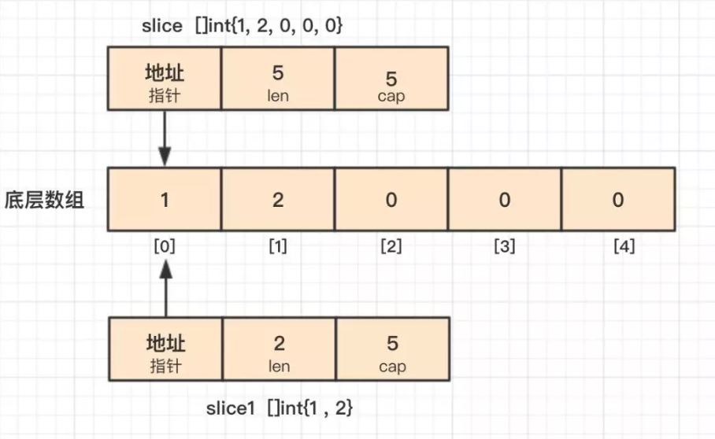

## Day 31. 可变函数、append()

1.下面这段代码输出什么？

```go
func change(s ...int) {
    s = append(s,3)
}

func main() {
    slice := make([]int,5,5)
    slice[0] = 1
    slice[1] = 2
    change(slice...)
    fmt.Println(slice)
    change(slice[0:2]...)
    fmt.Println(slice)
}
```

参考答案及解析：

```go
[1 2 0 0 0]
[1 2 3 0 0]
```

知识点：可变函数、append()操作。

Go 提供的语法糖`...`，可以将 slice 传进可变函数，不会创建新的切片。

第一次调用 change() 时，append() 操作使切片底层数组发生了扩容，原 slice 的底层数组不会改变；

第二次调用change() 函数时，使用了操作符`[i,j]`获得一个新的切片，假定为 slice1，它的底层数组和原切片底层数组是重合的，不过 slice1 的长度、容量分别是 2、5，所以在 change() 函数中对 slice1 底层数组的修改会影响到原切片。



[可变函数](http://mp.weixin.qq.com/s?__biz=MzI2MDA1MTcxMg==&mid=2648466706&idx=3&sn=003c213739e51088ad4947e473429775&chksm=f247437dc530ca6bafebe0a5a4090343cbf1eb992e36b6199cf213be6156273179465ed41348&scene=21#wechat_redirect)

[非懂不可的Slice（一）](http://mp.weixin.qq.com/s?__biz=MzI2MDA1MTcxMg==&mid=2648466739&idx=3&sn=9a1c9599172a532297ef41238450f9af&chksm=f247435cc530ca4ac6d92bd22011b52ae34d25d6e0eddf5b2ba85a15d3846b6674aa8bcf1d07&scene=21#wechat_redirect)

[非懂不可的Slice（二）](http://mp.weixin.qq.com/s?__biz=MzI2MDA1MTcxMg==&mid=2648466739&idx=4&sn=9de0eba9bdb36aa3b67d8a3903c53584&chksm=f247435cc530ca4a98abd9c1b2d58a63c7716e64236076c1296ed2964cd4fb68f7c8a6d44f85&scene=21#wechat_redirect)

<br/>

2.下面这段代码输出什么？

```go
func main() {
    var a = []int{1, 2, 3, 4, 5}
    var r [5]int

    for i, v := range a {
        if i == 0 {
            a[1] = 12
            a[2] = 13
        }
        r[i] = v
    }
    fmt.Println("r = ", r)
    fmt.Println("a = ", a)
}
```

参考答案及解析：

```go
r =  [1 12 13 4 5]
a =  [1 12 13 4 5]
```

这道题是 [第30天](http://mp.weixin.qq.com/s?__biz=MzI2MDA1MTcxMg==&mid=2648467013&idx=1&sn=e9856544b4ef7e02deb62e5839550786&chksm=f247402ac530c93c879f433e88cdd4ab55fcc6b336d342f3a8c1ece6cecb6b131f5acc486264&scene=21#wechat_redirect) 的第二题的一个解决办法，这的 a 是一个切片，那切片是怎么实现的呢？切片在 go 的内部结构有一个指向底层数组的指针，当 range 表达式发生复制时，副本的指针依旧指向原底层数组，所以对切片的修改都会反应到底层数组上，所以通过 v 可以获得修改后的数组元素。

引自：https://tonybai.com/2015/09/17/7-things-you-may-not-pay-attation-to-in-go/

<br/>


## Day 32. for range ,map

1.下面这段代码输出结果正确吗？

```go
type Foo struct {
    bar string
}
func main() {
    s1 := []Foo{
        {"A"},
        {"B"},
        {"C"},
    }
    s2 := make([]*Foo, len(s1))
    for i, value := range s1 {
        s2[i] = &value
    }
    fmt.Println(s1[0], s1[1], s1[2])
    fmt.Println(s2[0], s2[1], s2[2])
}
输出：
{A} {B} {C}
&{A} &{B} &{C}
```

参考答案及解析：s2 的输出结果错误。s2 的输出是 `&{C} &{C} &{C}`，在 [第 30 天](http://mp.weixin.qq.com/s?__biz=MzI2MDA1MTcxMg==&mid=2648467013&idx=1&sn=e9856544b4ef7e02deb62e5839550786&chksm=f247402ac530c93c879f433e88cdd4ab55fcc6b336d342f3a8c1ece6cecb6b131f5acc486264&scene=21#wechat_redirect) 的答案解析第二题，我们提到过，for range 使用短变量声明(:=)的形式迭代变量时，变量 i、value 在每次循环体中都会被重用，而不是重新声明。所以 s2 每次填充的都是临时变量 value 的地址，而在最后一次循环中，value 被赋值为{c}。因此，s2 输出的时候显示出了三个 &{c}。

可行的解决办法如下：

```go
for i := range s1 {
    s2[i] = &s1[i]
}
```

2.下面代码里的 counter 的输出值？

```go
func main() {

    var m = map[string]int{
        "A": 21,
        "B": 22,
        "C": 23,
    }
    counter := 0
    for k, v := range m {
        if counter == 0 {
            delete(m, "A")
        }
        counter++
        fmt.Println(k, v)
    }
    fmt.Println("counter is ", counter)
}
```

- A. 2
- B. 3
- C. 2 或 3

参考答案及解析：C。for range map 是无序的，如果第一次循环到 A，则输出 3；否则输出 2。

<br/>

## Day 33. 协程，循环语句，多重赋值

1.关于协程，下面说法正确是（）

- A. 协程和线程都可以实现程序的并发执行；
- B. 线程比协程更轻量级；
- C. 协程不存在死锁问题；
- D. 通过 channel 来进行协程间的通信；

参考答案及解析：AD。

<br/>

2.关于循环语句，下面说法正确的有（）

- A. 循环语句既支持 for 关键字，也支持 while 和 do-while；
- B. 关键字 for 的基本使用方法与 C/C++ 中没有任何差异；
- C. for 循环支持 continue 和 break 来控制循环，但是它提供了一个更高级的 break，可以选择中断哪一个循环；
- D. for 循环不支持以逗号为间隔的多个赋值语句，必须使用平行赋值的方式来初始化多个变量；

参考答案及解析：CD。

<br/>

3.下面代码输出正确的是？

```go
func main() {
    i := 1
    s := []string{"A", "B", "C"}
    i, s[i-1] = 2, "Z"
    fmt.Printf("s: %v \n", s)
}
```

- A. s: [Z,B,C]
- B. s: [A,Z,C]

参考答案及解析：A。知识点：多重赋值。

多重赋值分为两个步骤，有先后顺序：

- 计算等号左边的索引表达式和取址表达式，接着计算等号右边的表达式；
- 赋值；

所以本例，会先计算 s[i-1]，等号右边是两个表达式是常量，所以赋值运算等同于 `i, s[0] = 2, "Z"`。

<br/>

## Day 34. 强制类型转化,类型断言、方法集

1.关于类型转化，下面选项正确的是？

```go
A.
type MyInt int
var i int = 1
var j MyInt = i

B.
type MyInt int
var i int = 1
var j MyInt = (MyInt)i

C.
type MyInt int
var i int = 1
var j MyInt = MyInt(i)

D.
type MyInt int
var i int = 1
var j MyInt = i.(MyInt)
```

参考答案及解析：C。知识点：强制类型转化。

<br/>

2.关于switch语句，下面说法正确的有?

- A. 条件表达式必须为常量或者整数；
- B. 单个case中，可以出现多个结果选项；
- C. 需要用break来明确退出一个case；
- D. 只有在case中明确添加fallthrough关键字，才会继续执行紧跟的下一个case；

参考答案及解析：BD。参考文章 [条件语句和循环语句](http://mp.weixin.qq.com/s?__biz=MzI2MDA1MTcxMg==&mid=2648467036&idx=2&sn=79bb23c3d1d2eef7e989ecc2643b5f5a&chksm=f2474033c530c925d5accf3633888d783dd3e3137b71a3b963a397d198e2619cd8e32f0ddd4f&scene=21#wechat_redirect)

<br/>

3.如果 Add() 函数的调用代码为：

```go
func main() {
    var a Integer = 1
    var b Integer = 2
    var i interface{} = &a
    sum := i.(*Integer).Add(b)
    fmt.Println(sum)
}
```

则Add函数定义正确的是()

```go
A.
type Integer int
func (a Integer) Add(b Integer) Integer {
        return a + b
}

B.
type Integer int
func (a Integer) Add(b *Integer) Integer {
        return a + *b
}

C.
type Integer int
func (a *Integer) Add(b Integer) Integer {
        return *a + b
}

D.
type Integer int
func (a *Integer) Add(b *Integer) Integer {
        return *a + *b
}
```

参考答案及解析：AC。知识点：类型断言、方法集。

<br/>

## Day 35. bool, 自增和自减, 接口

1.关于 bool 变量 b 的赋值，下面错误的用法是？

- A. b = true
- B. b = 1
- C. b = bool(1)
- D. b = (1 == 2)

参考答案及解析：BC。

<br/>

2.关于变量的自增和自减操作，下面语句正确的是？

```go
A.
i := 1
i++

B.
i := 1
j = i++

C.
i := 1
++i

D.
i := 1
i--
```

参考答案及解析：AD。知识点：自增自减操作。i++ 和 i-- 在 Go 语言中是语句，不是表达式，因此不能赋值给另外的变量。此外没有 ++i 和 --i。

3.关于GetPodAction定义，下面赋值正确的是

```go
type Fragment interface {
        Exec(transInfo *TransInfo) error
}
type GetPodAction struct {
}
func (g GetPodAction) Exec(transInfo *TransInfo) error {
        ...
        return nil
}
```

- A. var fragment Fragment = new(GetPodAction)
- B. var fragment Fragment = GetPodAction
- C. var fragment Fragment = &GetPodAction{}
- D. var fragment Fragment = GetPodAction{}

参考答案及解析：ACD。

<br/>

## Day 36. select, 函数声明，切片初始化

1.关于函数声明，下面语法正确的是？

- A. func f(a, b int) (value int, err error)
- B. func f(a int, b int) (value int, err error)
- C. func f(a, b int) (value int, error)
- D. func f(a int, b int) (int, int, error)

参考答案及解析：ABD。参考文章《[函数](http://mp.weixin.qq.com/s?__biz=MzI2MDA1MTcxMg==&mid=2648466706&idx=4&sn=b296779ff31a98ecc978d2e513328443&chksm=f247437dc530ca6bf646850a498e19e5c7f331e0ef3e38909297da8724223422075d04cd21bf&scene=21#wechat_redirect)》

<br/>

2.关于整型切片的初始化，下面正确的是？

- A. s := make([]int)
- B. s := make([]int, 0)
- C. s := make([]int, 5, 10)
- D. s := []int{1, 2, 3, 4, 5}

参考答案及解析：BCD。参考文章《[非懂不可的Slice（一）](http://mp.weixin.qq.com/s?__biz=MzI2MDA1MTcxMg==&mid=2648466739&idx=3&sn=9a1c9599172a532297ef41238450f9af&chksm=f247435cc530ca4ac6d92bd22011b52ae34d25d6e0eddf5b2ba85a15d3846b6674aa8bcf1d07&scene=21#wechat_redirect)》

<br/>

3.下面代码会触发异常吗？请说明。

```go
func main() {
    runtime.GOMAXPROCS(1)
    int_chan := make(chan int, 1)
    string_chan := make(chan string, 1)
    int_chan <- 1
    string_chan <- "hello"
    select {
    case value := <-int_chan:
        fmt.Println(value)
    case value := <-string_chan:
        panic(value)
    }
}
```

参考答案及解析：`select` 会随机选择一个可用通道做收发操作，所以可能触发异常，也可能不会。具体详看《[Go 并发 -- Select](http://mp.weixin.qq.com/s?__biz=MzI2MDA1MTcxMg==&mid=2648466739&idx=1&sn=bfff10a9eed52a13fb2adb63569b0bca&chksm=f247435cc530ca4ac2eaad9c3879331ec5507f6452e901eb046f7ec46e703a678541e1fa1840&scene=21#wechat_redirect)》


<br/>

## Day 37. 函数返回值类型, channel, 常量

1.关于channel的特性，下面说法正确的是？

- A. 给一个 nil channel 发送数据，造成永远阻塞
- B. 从一个 nil channel 接收数据，造成永远阻塞
- C. 给一个已经关闭的 channel 发送数据，引起 panic
- D. 从一个已经关闭的 channel 接收数据，如果缓冲区中为空，则返回一个零值

参考答案及解析：ABCD。

<br/>


2.下面代码有什么问题？

```go
const i = 100
var j = 123

func main() {
    fmt.Println(&j, j)
    fmt.Println(&i, i)
}
```

参考答案及解析：编译报错`cannot take the address of i`。知识点：常量。常量不同于变量的在运行期分配内存，常量通常会被编译器在预处理阶段直接展开，作为指令数据使用，所以常量无法寻址。

<br/>

3.下面代码能否编译通过？如果通过，输出什么？

```go
func GetValue(m map[int]string, id int) (string, bool) {

    if _, exist := m[id]; exist {
        return "exist", true
    }
    return nil, false
}
func main() {
    intmap := map[int]string{
        1: "a",
        2: "b",
        3: "c",
    }

    v, err := GetValue(intmap, 3)
    fmt.Println(v, err)
}
```

参考答案及解析：不能通过编译。知识点：函数返回值类型。nil 可以用作 interface、function、pointer、map、slice 和 channel 的“空值”。但是如果不特别指定的话，Go 语言不能识别类型，所以会报错:`cannot use nil as type string in return argument`.

<br/>

## Day 38. 异常

1.关于异常的触发，下面说法正确的是？

- A. 空指针解析；
- B. 下标越界；
- C. 除数为0；
- D. 调用panic函数；

参考答案及解析：ABCD。

<br>

2.下面代码输出什么？

```go
func main() {
    x := []string{"a", "b", "c"}
    for v := range x {
        fmt.Print(v)
    }
}
```

参考答案及解析：012。注意区别下面代码段：

```go
func main() {
    x := []string{"a", "b", "c"}
    for _, v := range x {
        fmt.Print(v)     //输出 abc
    }
}
```

<br>

3.下面这段代码能否编译通过？如果通过，输出什么？

```go
 type User struct{}
 type User1 User
 type User2 = User
 
 func (i User1) m1() {
     fmt.Println("m1")
 }
 func (i User) m2() {
     fmt.Println("m2")
}

func main() {
    var i1 User1
    var i2 User2
    i1.m1()
    i2.m2()
}
```

参考答案及解析：能，输出`m1 m2`，第 2 行代码基于类型 User 创建了新类型 User1，第 3 行代码是创建了 User 的类型别名 User2，注意使用 = 定义类型别名。因为 User2 是别名，完全等价于 User，所以 User2 具有 User 所有的方法。但是 i1.m1() 是不能执行的，因为 User1 没有定义该方法。

<br>

## Day 39. channel, go, interface

1.关于无缓冲和有冲突的channel，下面说法正确的是？

- A. 无缓冲的channel是默认的缓冲为1的channel；
- B. 无缓冲的channel和有缓冲的channel都是同步的；
- C. 无缓冲的channel和有缓冲的channel都是非同步的；
- D. 无缓冲的channel是同步的，而有缓冲的channel是非同步的；

参考答案及解析：D。参考文章《[Go 并发 -- 信道](http://mp.weixin.qq.com/s?__biz=MzI2MDA1MTcxMg==&mid=2648466711&idx=1&sn=32b636a8cf9d23a8ed6f0b7c3fbcfc72&chksm=f2474378c530ca6e03c60d793d58283ba3047c645ae55e47c9791e88d7deaac63e1976f4d710&scene=21#wechat_redirect)》

<br>

2.下面代码是否能编译通过？如果通过，输出什么？

```go
 func Foo(x interface{}) {
     if x == nil {
         fmt.Println("empty interface")
         return
    }
     fmt.Println("non-empty interface")
 }
func main() {
    var x *int = nil
    Foo(x)
}
```

参考答案及解析：`non-empty interface` 考点：interface 的内部结构，我们知道接口除了有静态类型，还有动态类型和动态值，当且仅当动态值和动态类型都为 nil 时，接口类型值才为 nil。这里的 x 的动态类型是 `*int`，所以 x 不为 nil。

<br>

3.下面代码输出什么？

```go
func main() {
    ch := make(chan int, 100)
    // A
    go func() {              
        for i := 0; i < 10; i++ {
            ch <- i
       }
    }()
    // B
    go func() {
        for {
            a, ok := <-ch
            if !ok {
               fmt.Println("close")
                return
            }
            fmt.Println("a: ", a)
        }
    }()
    close(ch)
    fmt.Println("ok")
    time.Sleep(time.Second * 10)
}
```

参考答案及解析：程序抛异常。先定义下，第一个协程为 A 协程，第二个协程为 B 协程；当 A 协程还没起时，主协程已经将 channel 关闭了，当 A 协程往关闭的 channel 发送数据时会 panic，`panic: send on closed channel`。

<br>

## Day 40. select, channel

1.关于select机制，下面说法正确的是?

- A. select机制用来处理异步IO问题；
- B. select机制最大的一条限制就是每个case语句里必须是一个IO操作；
- C. golang在语言级别支持select关键字；
- D. select关键字的用法与switch语句非常类似，后面要带判断条件；

参考答案及解析：ABC。参考文章《[Go 并发 -- Select](http://mp.weixin.qq.com/s?__biz=MzI2MDA1MTcxMg==&mid=2648466739&idx=1&sn=bfff10a9eed52a13fb2adb63569b0bca&chksm=f247435cc530ca4ac2eaad9c3879331ec5507f6452e901eb046f7ec46e703a678541e1fa1840&scene=21#wechat_redirect)》

<br>

2.下面的代码有什么问题？

```go
func Stop(stop <-chan bool) {
    close(stop)
}
```

参考答案及解析：有方向的 channel 不可以被关闭。

<br>

3.下面这段代码存在什么问题？

```go
type Param map[string]interface{}

type Show struct {
    *Param

}
func main() {
    s := new(Show)
    s.Param["day"] = 2
}
```

参考答案及解析：存在两个问题：1.map 需要初始化才能使用；2.指针不支持索引。修复代码如下：

```go
func main() {
    s := new(Show)
    // 修复代码
    p := make(Param)
    p["day"] = 2
    s.Param = &p
    tmp := *s.Param
    fmt.Println(tmp["day"])
}
```

<br>

## Day 41. 切片初始化，指针

1.下面代码编译能通过吗？

```go
func main()  
{ 
    fmt.Println("hello world")
}
```

参考答案及解析：编译错误。

```go
syntax error: unexpected semicolon or newline before {
```

Go 语言中，大括号不能放在单独的一行。

正确的代码如下：

```go
func main() {
    fmt.Println("works")
}
```

引自：http://devs.cloudimmunity.com/gotchas-and-common-mistakes-in-go-golang/

2.下面这段代码输出什么？

```go
var x = []int{2: 2, 3, 0: 1}

func main() {
    fmt.Println(x)
}
```

参考答案及解析：输出`[1 0 2 3]`，字面量初始化切片时候，可以指定索引，没有指定索引的元素会在前一个索引基础之上加一，所以输出`[1 0 2 3]`，而不是`[1 3 2]`。

3.下面这段代码输出什么？

```go
func incr(p *int) int {
    *p++
    return *p
}
func main() {
    v := 1
    incr(&v)
    fmt.Println(v)
}
```

参考答案及解析：2。知识点：指针。p 是指针变量，指向变量 v，`*p++`操作的意思是取出变量 v 的值并执行加一操作，所以 v 的最终值是 2。

关于指针的使用可以参考文章《[800 字彻底理解 Go 指针](http://mp.weixin.qq.com/s?__biz=MzI2MDA1MTcxMg==&mid=2648467085&idx=2&sn=c37e20fb2823451498374b79e9630926&chksm=f24740e2c530c9f4afe41620b7b083040f0fb57de51166f32e0554a57077ba0218387a7b0d37&scene=21#wechat_redirect)》。

<br>

## Day 42. 未使用变量, for range ,string

1.请指出下面代码的错误？

```go
package main

var gvar int 

func main() {  
    var one int   
    two := 2      
    var three int 
    three = 3

    func(unused string) {
        fmt.Println("Unused arg. No compile error")
    }("what?")
}
```

参考答案及解析：变量 one、two 和 three 声明未使用。知识点：未使用变量。如果有未使用的变量代码将编译失败。但也有例外，函数中声明的变量必须要使用，但可以有未使用的全局变量。函数的参数未使用也是可以的。

如果你给未使用的变量分配了一个新值，代码也还是会编译失败。你需要在某个地方使用这个变量，才能让编译器愉快的编译。

修复代码：

```go
func main() {
    var one int
    _ = one

    two := 2
    fmt.Println(two)

    var three int
    three = 3
    one = three

    var four int
    four = four
}
```

另一个选择是注释掉或者移除未使用的变量 。

引自：http://devs.cloudimmunity.com/gotchas-and-common-mistakes-in-go-golang/

2.下面代码输出什么？

```go
type ConfigOne struct {
    Daemon string
}

func (c *ConfigOne) String() string {
    return fmt.Sprintf("print: %v", c)
}

 func main() {
    c := &ConfigOne{}
    c.String()
}
```

参考答案及解析：运行时错误。如果类型实现 String() 方法，当格式化输出时会自动使用 String() 方法。上面这段代码是在该类型的 String() 方法内使用格式化输出，导致递归调用，最后抛错。

```go
runtime: goroutine stack exceeds 1000000000-byte limit
fatal error: stack overflow
```

3.下面代码输出什么？

```go
 func main() {
     var a = []int{1, 2, 3, 4, 5}
     var r = make([]int, 0)
 
     for i, v := range a {
         if i == 0 {
             a = append(a, 6, 7)
         }
 
        r = append(r, v)
    }

    fmt.Println(r)
}
```

参考答案及解析：`[1 2 3 4 5]`。a 在 for range 过程中增加了两个元素
，len 由 5 增加到 7，但 for range 时会使用 a 的副本 a' 参与循环，副本的 len 依旧是 5，因此 for range 只会循环 5 次，也就只获取 a 对应的底层数组的前 5 个元素。

<br>

## Day 43. map 赋值, 未使用包, 类型断言

1.下面的代码有什么问题？

```go
import (  
    "fmt"
    "log"
    "time"
)
func main() {  
}
```

参考答案及解析：导入的包没有被使用。如果引入一个包，但是未使用其中如何函数、接口、结构体或变量的话，代码将编译失败。

如果你真的需要引入包，可以使用下划线操作符，`_`，来作为这个包的名字，从而避免失败。下划线操作符用于引入，但不使用。

我们还可以注释或者移除未使用的包。

修复代码：

```go
import (  
    _ "fmt"
    "log"
    "time"
)
var _ = log.Println
func main() {  
    _ = time.Now
}
```

引自：http://devs.cloudimmunity.com/gotchas-and-common-mistakes-in-go-golang/

2.下面代码输出什么？

```go
func main() {
    x := interface{}(nil)
    y := (*int)(nil)
    a := y == x
    b := y == nil
    _, c := x.(interface{})
    println(a, b, c)
}
```

- A. true true true
- B. false true true
- C. true true true
- D. false true false

参考答案及解析：D。知识点：类型断言。类型断言语法：i.(Type)，其中 i 是接口，Type 是类型或接口。编译时会自动检测 i 的动态类型与 Type 是否一致。但是，如果动态类型不存在，则断言总是失败。参考文章《[Go 语言接口详解（二）](http://mp.weixin.qq.com/s?__biz=MzI2MDA1MTcxMg==&mid=2648466700&idx=1&sn=25c48d78dcfad6c70330cd36dd749e53&chksm=f2474363c530ca75132454e4e10e40659310a073e2f9d30ad9697d4abf7c2b9e5aa9adee58bf&scene=21#wechat_redirect)》

3.下面代码有几处错误的地方？请说明原因。

```go
func main() {

    var s []int
    s = append(s,1)

    var m map[string]int
    m["one"] = 1 
}
```

参考答案及解析：有 1 出错误，不能对 nil 的 map 直接赋值，需要使用 make() 初始化。但可以使用 append() 函数对为 nil 的 slice 增加元素。

修复代码：

```go
func main() {
    var m map[string]int
    m = make(map[string]int)
    m["one"] = 1
}
```

<br>

## Day 44. map, nil, :=

1.下面代码有什么问题？

```go
func main() {
    m := make(map[string]int,2)
    cap(m) 
}
```

参考答案及解析：问题：使用 cap() 获取 map 的容量。1.使用 make 创建 map 变量时可以指定第二个参数，不过会被忽略。2.cap() 函数适用于数组、数组指针、slice 和 channel，不适用于 map，可以使用 len() 返回 map 的元素个数。

引自：http://devs.cloudimmunity.com/gotchas-and-common-mistakes-in-go-golang/index.html

2.下面的代码有什么问题？

```go
func main() {  
    var x = nil 
    _ = x
}
```

参考答案及解析：nil 用于表示 interface、函数、maps、slices 和 channels 的“零值”。如果不指定变量的类型，编译器猜不出变量的具体类型，导致编译错误。

修复代码：

```go
func main() {
    var x interface{} = nil
    _ = x
}
```

3.下面代码能编译通过吗？

```go
 type info struct {
   result int
}

func work() (int,error) {
    return 13,nil
}

func main() {
    var data info

    data.result, err := work() 
    fmt.Printf("info: %+v\n",data)
}
```

参考答案及解析：编译失败。

```go
non-name data.result on left side of :=
```

不能使用短变量声明设置结构体字段值，修复代码：

```go
 func main() {
     var data info
 
     var err error
     data.result, err = work() //ok
     if err != nil {
        fmt.Println(err)
         return
     }

    fmt.Println(data)   
}
```

引自：http://devs.cloudimmunity.com/gotchas-and-common-mistakes-in-go-golang/index.html

<br>

## Day 45. :=, 类型别名

1.下面代码有什么错误？

```go
func main() {
    one := 0
    one := 1 
}
```

参考答案及解析：变量重复声明。不能在单独的声明中重复声明一个变量，但在多变量声明的时候是可以的，但必须保证至少有一个变量是新声明的。

修复代码：

```go
func main() {  
    one := 0
    one, two := 1,2
    one,two = two,one
}
```

引自：http://devs.cloudimmunity.com/gotchas-and-common-mistakes-in-go-golang/

2.下面代码有什么问题？

```go
func main() {
    x := []int{
        1,
        2
    }
    _ = x
}
```

参考答案及解析：编译错误，第四行代码没有逗号。用字面量初始化数组、slice 和 map 时，最好是在每个元素后面加上逗号，即使是声明在一行或者多行都不会出错。

修复代码：

```go
 func main() {
     x := []int{    // 多行
         1,
         2,
     }
     x = x
 
     y := []int{3,4,} // 一行 no error
     y = y
}
```

引自：http://devs.cloudimmunity.com/gotchas-and-common-mistakes-in-go-golang/index.html

3.下面代码输出什么？

```go
 func test(x byte)  {
     fmt.Println(x)
 }
 
 func main() {
     var a byte = 0x11 
     var b uint8 = a
     var c uint8 = a + b
     test(c)
}
```

参考答案及解析：34。与 rune 是 int32 的别名一样，byte 是 uint8 的别名，别名类型无序转换，可直接转换。

<br>

## Day 46. 常量

1.下面的代码有什么问题？

```go
func main() {
    const x = 123
    const y = 1.23
    fmt.Println(x)
}
```

参考答案及解析：编译可以通过。知识点：常量。常量是一个简单值的标识符，在程序运行时，不会被修改的量。不像变量，常量未使用是能编译通过的。

2.下面代码输出什么？

```go
const (
     x uint16 = 120
     y
     s = "abc"
     z
)
 
func main() {
    fmt.Printf("%T %v\n", y, y)
    fmt.Printf("%T %v\n", z, z)
}
```

参考答案及解析：知识点：常量。

输出：

```go
uint16 120
string abc
```

常量组中如不指定类型和初始化值，则与上一行非空常量右值相同

3.下面代码有什么问题？

```go
func main() {  
    var x string = nil 

    if x == nil { 
        x = "default"
    }
}
```

参考答案及解析：将 nil 分配给 string 类型的变量。这是个大多数新手会犯的错误。修复代码：

```go
func main() {  
    var x string //defaults to "" (zero value)

    if x == "" {
        x = "default"
    }
}
```

引自：http://devs.cloudimmunity.com/gotchas-and-common-mistakes-in-go-golang/index.html

<br>

## Day 47. 自增、自减

1.下面的代码有什么问题？

```go
func main() {
    data := []int{1,2,3}
    i := 0
    ++i
    fmt.Println(data[i++])
}
```

参考答案及解析：对于自增、自减，需要注意：

- 自增、自减不在是运算符，只能作为独立语句，而不是表达式；
- 不像其他语言，Go 语言中不支持 ++i 和 --i 操作；

表达式通常是求值代码，可作为右值或参数使用。而语句表示完成一个任务，比如 if、for 语句等。表达式可作为语句使用，但语句不能当做表达式。

修复代码：

```go
func main() {  
    data := []int{1,2,3}
    i := 0
    i++
    fmt.Println(data[i])
}
```

2.下面代码最后一行输出什么？请说明原因。

```go
func main() {
    x := 1
    fmt.Println(x)
    {
        fmt.Println(x)
        i,x := 2,2
        fmt.Println(i,x)
    }
   fmt.Println(x)  // print ?
}
```

参考答案及解析：输出`1`。知识点：变量隐藏。使用变量简短声明符号 := 时，如果符号左边有多个变量，只需要保证至少有一个变量是新声明的，并对已定义的变量尽进行赋值操作。但如果出现作用域之后，就会导致变量隐藏的问题，就像这个例子一样。

这个坑很容易挖，但又很难发现。即使对于经验丰富的 Go 开发者而言，这也是一个非常常见的陷阱。

引自：http://devs.cloudimmunity.com/gotchas-and-common-mistakes-in-go-golang/

<br>

## Day 48. ~ , ^,  &

1.下面代码有什么问题？

```go
type foo struct {
    bar int
}

func main() {
    var f foo
    f.bar, tmp := 1, 2
}
```

参考答案及解析：编译错误：

```go
non-name f.bar on left side of :=
```

:= 操作符不能用于结构体字段赋值。

2.下面的代码输出什么？

```go
func main() {  
    fmt.Println(~2) 
}
```

参考答案及解析：编译错误。

```go
invalid character U+007E '~'
```

很多语言都是采用 ~ 作为按位取反运算符，Go 里面采用的是 ^ 。按位取反之后返回一个每个 bit 位都取反的数，对于有符号的整数来说，是按照补码进行取反操作的（快速计算方法：对数 a 取反，结果为 -(a+1) ），对于无符号整数来说就是按位取反。例如：

```go
func main() {
    var a int8 = 3
    var b uint8 = 3
    var c int8 = -3

    fmt.Printf("^%b=%b %d\n", a, ^a, ^a) // ^11=-100 -4
    fmt.Printf("^%b=%b %d\n", b, ^b, ^b) // ^11=11111100 252
    fmt.Printf("^%b=%b %d\n", c, ^c, ^c) // ^-11=10 2
}
```

另外需要注意的是，如果作为二元运算符，^ 表示按位异或，即：对应位相同为 0，相异为 1。例如：

```go
func main() {
    var a int8 = 3
    var c int8 = 5

    fmt.Printf("a: %08b\n",a)
    fmt.Printf("c: %08b\n",c)
    fmt.Printf("a^c: %08b\n",a ^ c)
}
```

给大家重点介绍下这个操作符 &^，按位置零，例如：z = x &^ y，表示如果 y 中的 bit 位为 1，则 z 对应 bit 位为 0，否则 z 对应 bit 位等于 x 中相应的 bit 位的值。

不知道大家发现没有，我们还可以这样理解或操作符 | ，表达式 z = x | y，如果 y 中的 bit 位为 1，则 z 对应 bit 位为 1，否则 z 对应 bit 位等于 x 中相应的 bit 位的值，与 &^ 完全相反。

```go
var x uint8 = 214
var y uint8 = 92
fmt.Printf("x: %08b\n",x)     
fmt.Printf("y: %08b\n",y)       
fmt.Printf("x | y: %08b\n",x | y)     
fmt.Printf("x &^ y: %08b\n",x &^ y)
```

输出：

```go
x: 11010110
y: 01011100
x | y: 11011110
x &^ y: 10000010
```

<br>

## Day 49. 结构体访问控制,channel

1.下面代码输出什么？

```go
func main() {
    var ch chan int
    select {
    case v, ok := <-ch:
        println(v, ok)
    default:
        println("default") 
    }
}
```

参考答案及解析：default。ch 为 nil，读写都会阻塞。

2.下面这段代码输出什么？

```go
type People struct {
    name string `json:"name"`
}

func main() {
    js := `{
        "name":"seekload"
    }`
    var p People
    err := json.Unmarshal([]byte(js), &p)
    if err != nil {
        fmt.Println("err: ", err)
        return
    }
    fmt.Println(p)
}
```

参考答案及解析：输出 {}。知识点：结构体访问控制，因为 name 首字母是小写，导致其他包不能访问，所以输出为空结构体。修复代码：

```go
type People struct {
    Name string `json:"name"`
}
```

<br>

## Day 50. switch

1.下面这段代码输出什么？

```go
type T struct {
    ls []int
}

func foo(t T) {
    t.ls[0] = 100
}

func main() {
    var t = T{
        ls: []int{1, 2, 3},
    }

    foo(t)
    fmt.Println(t.ls[0])
}
```

- A. 1
- B. 100
- C. compilation error

参考答案及解析：B。调用 foo() 函数时虽然是传值，但 foo() 函数中，字段 ls 依旧可以看成是指向底层数组的指针。

2.下面代码输出什么？

```go
func main() {
    isMatch := func(i int) bool {
        switch(i) {
        case 1:
        case 2:
            return true
        }
        return false
    }

    fmt.Println(isMatch(1))
    fmt.Println(isMatch(2))
}
```

参考答案及解析：false true。Go 语言的 switch 语句虽然没有"break"，但如果 case 完成程序会默认 break，可以在 case 语句后面加上关键字 fallthrough，这样就会接着走下一个 case 语句（不用匹配后续条件表达式）。或者，利用 case 可以匹配多个值的特性。

修复代码：

```go
func main() {
    isMatch := func(i int) bool {
        switch(i) {
        case 1:
            fallthrough
        case 2:
            return true
        }
        return false
    }

    fmt.Println(isMatch(1))     // true
    fmt.Println(isMatch(2))     // true

    match := func(i int) bool {
        switch(i) {
        case 1,2:
            return true
        }
        return false
    }

    fmt.Println(match(1))       // true
    fmt.Println(match(2))       // true
}
```

<br>

## Day 51. 比较，struct

1.下面的代码能否正确输出？

```go
func main() {
    var fn1 = func() {}
    var fn2 = func() {}

    if fn1 != fn2 {
        println("fn1 not equal fn2")
    }
}
```

参考答案及解析：编译错误

```go
invalid operation: fn1 != fn2 (func can only be compared to nil)

```

函数只能与 nil 比较。

2.下面代码输出什么？

```go
type T struct {
    n int
}

func main() {
    m := make(map[int]T)
    m[0].n = 1
    fmt.Println(m[0].n)
}
```

- A. 1
- B. compilation error

参考答案及解析：B。编译错误：

```go
cannot assign to struct field m[0].n in map
```

map[key]struct 中 struct 是不可寻址的，所以无法直接赋值。

修复代码：

```go
type T struct {
     n int
}
 
func main() {
     m := make(map[int]T)
 
    t := T{1}
    m[0] = t
    fmt.Println(m[0].n)
}
```

<br>

## Day 52. struct寻址, map

1.下面的代码有什么问题？

```go
type X struct {}

func (x *X) test()  {
    println(x)
}

func main() {

    var a *X
    a.test()

    X{}.test()
}
```

参考答案及解析：X{} 是不可寻址的，不能直接调用方法。知识点：在方法中，指针类型的接收者必须是合法指针（包括 nil）,或能获取实例地址。

修复代码：

```go
func main() {

    var a *X
    a.test()    // 相当于 test(nil)

    var x = X{}
    x.test()
}
```

引自：《Go语言学习笔记》· 方法

2.下面代码有什么不规范的地方吗？

```go
func main() {
    x := map[string]string{"one":"a","two":"","three":"c"}

   if v := x["two"]; v == "" { 
        fmt.Println("no entry")
    }
}
```

参考答案及解析：检查 map 是否含有某一元素，直接判断元素的值并不是一种合适的方式。最可靠的操作是使用访问 map 时返回的第二个值。

修复代码如下：

```go 
func main() {  
    x := map[string]string{"one":"a","two":"","three":"c"}

    if _,ok := x["two"]; !ok {
        fmt.Println("no entry")
    }
}
```

引自：http://devs.cloudimmunity.com/gotchas-and-common-mistakes-in-go-golang/index.html

<br>

## Day 53. channel, struct 寻址，

1.关于 channel 下面描述正确的是？

- A. 向已关闭的通道发送数据会引发 panic；
- B. 从已关闭的缓冲通道接收数据，返回已缓冲数据或者零值；
- C. 无论接收还是接收，nil 通道都会阻塞；

参考答案及解析：ABC。

2.下面的代码有几处问题？请详细说明。

```go
type T struct {
    n int
}

func (t *T) Set(n int) {
    t.n = n
}

func getT() T {
    return T{}
}

func main() {
    getT().Set(1)
}
```

参考答案及解析：有两处问题：

- 1.直接返回的 T{} 不可寻址；
- 2.不可寻址的结构体不能调用带结构体指针接收者的方法；

修复代码：

```go
type T struct {
    n int
}

func (t *T) Set(n int) {
    t.n = n
}

func getT() T {
    return T{}
}

func main() {
    t := getT()
    t.Set(2)
    fmt.Println(t.n)
}
```

<br>

## Day 54. 指针，方法表达式

1.下面的代码有什么问题？

```go
func (n N) value(){
    n++
   fmt.Printf("v:%p,%v\n",&n,n)
}

func (n *N) pointer(){
    *n++
    fmt.Printf("v:%p,%v\n",n,*n)
}


func main() {

    var a N = 25

    p := &a
    p1 := &p

   p1.value()
   p1.pointer()
}
```

参考答案及解析：编译错误：

```go
calling method value with receiver p1 (type **N) requires explicit dereference
calling method pointer with receiver p1 (type **N) requires explicit dereference
```

不能使用多级指针调用方法。

2.下面的代码输出什么？

```go
type N int

func (n N) test(){
    fmt.Println(n)
}

func main()  {
    var n N = 10
    fmt.Println(n)

    n++
    f1 := N.test
    f1(n)

    n++
    f2 := (*N).test
    f2(&n)
}
```

参考答案及解析：10 11 12。知识点：方法表达式。通过类型引用的方法表达式会被还原成普通函数样式，接收者是第一个参数，调用时显示传参。类型可以是 T 或 *T，只要目标方法存在于该类型的方法集中就可以。

还可以直接使用方法表达式调用：

```go
func main()  {
    var n N = 10

    fmt.Println(n)

    n++
    N.test(n)

    n++
    (*N).test(&n)
}
```

<br>

## Day 55. channel, struct

1.关于 channel 下面描述正确的是？

- A. close() 可以用于只接收通道；
- B. 单向通道可以转换为双向通道；
- C. 不能在单向通道上做逆向操作（例如：只发送通道用于接收）；

参考答案及解析：C。

2.下面的代码有什么问题？

```go
type T struct {
    n int
}

func getT() T {
    return T{}
}

func main() {
    getT().n = 1
}
```

参考答案及解析：编译错误：

```go
cannot assign to getT().n
```

直接返回的 T{} 无法寻址，不可直接赋值。

修复代码：

```go
type T struct {
    n int
}

func getT() T {
    return T{}
}

func main() {
    t := getT()
    p := &t.n    // <=> p = &(t.n)
    *p = 1
    fmt.Println(t.n)
}
```

<br>

## Day 56. 切片，方法值

1.下面的代码有什么问题？

```go
package main

import "fmt"

func main() {
    s := make([]int, 3, 9)
    fmt.Println(len(s)) 
    s2 := s[4:8]
    fmt.Println(len(s2)) 
}
```

参考答案及解析：代码没问题，输出 3 4。**从一个基础切片派生出的子切片的长度可能大于基础切片的长度**。假设基础切片是 baseSlice，使用操作符 [low,high]，有如下规则：0 <= low <= high <= cap(baseSlice)，只要上述满足这个关系，下标 low 和 high 都可以大于 len(baseSlice)。


2.下面代码输出什么？

```go
type N int

func (n N) test(){
    fmt.Println(n)
}

func main()  {
    var n N = 10
    p := &n

    n++
    f1 := n.test

    n++
    f2 := p.test

    n++
    fmt.Println(n)

    f1()
    f2()
}
```

参考答案及解析：13 11 12。知识点：方法值。当指针值赋值给变量或者作为函数参数传递时，会立即计算并复制该方法执行所需的接收者对象，与其绑定，以便在稍后执行时，能隐式第传入接收者参数。

<br>

## Day 57. panic,select

1.下面哪一行代码会 panic，请说明原因？

```go
package main

func main() {
  var x interface{}
  var y interface{} = []int{3, 5}
  _ = x == x
  _ = x == y
  _ = y == y
}
```

参考答案及解析：第 8 行。因为两个比较值的动态类型为同一个不可比较类型。

2.下面的代码输出什么？

```go
var o = fmt.Print

func main() {
    c := make(chan int, 1)
    for range [3]struct{}{} {
        select {
        default:
            o(1)
        case <-c:
            o(2)
            c = nil
        case c <- 1:
            o(3)
        }
    }
}
```

参考答案及解析：321。第一次循环，写操作已经准备好，执行 o(3)，输出 3；第二次，读操作准备好，执行 o(2)，输出 2 并将 c 赋值为 nil；第三次，由于 c 为 nil，走的是 default 分支，输出 1。

<br>

## Day 58. 运算符优先级, panic

1.下面的代码输出什么？

```go
type T struct {
    x int
    y *int
}

func main() {

    i := 20
    t := T{10,&i}

    p := &t.x

    *p++
    *p--

    t.y = p

    fmt.Println(*t.y)
}
```

参考答案及解析：10。知识点：运算符优先级。如下规则：递增运算符 ++ 和递减运算符 -- 的优先级低于解引用运算符 * 和取址运算符 &，解引用运算符和取址运算符的优先级低于选择器 . 中的属性选择操作符。

2.下面哪一行代码会 panic，请说明原因？

```go
package main

func main() {
    x := make([]int, 2, 10)
    _ = x[6:10]
    _ = x[6:]
    _ = x[2:]
}
```

参考答案：第 6 行，截取符号 [i:j]，如果 j 省略，默认是原切片或者数组的长度，x 的长度是 2，小于起始下标 6 ，所以 panic。

<br>

## Day 59. panic, 方法值

1.下面的代码输出什么？

```go
type N int
 
func (n *N) test(){
     fmt.Println(*n)
}
 
func main()  {
     var n N = 10
     p := &n

    n++
    f1 := n.test

    n++
    f2 := p.test

    n++
    fmt.Println(n)

   f1()
    f2()
}
```

参考答案及解析：13 13 13。知识点：方法值。当目标方法的接收者是指针类型时，那么被复制的就是指针。

引自：《Go语言学习笔记》· 方法

2.下面哪一行代码会 panic，请说明原因？

```go
package main

func main() {
  var m map[int]bool // nil
  _ = m[123]
  var p *[5]string // nil
for range p {
    _ = len(p)
  }
  var s []int // nil
  _ = s[:]
  s, s[0] = []int{1, 2}, 9
}
```

参考答案及解析：第 12 行。因为左侧的 s[0] 中的 s 为 nil。

<br>

## Day 60. panic,mutex

1.下面哪一行代码会 panic，请说明原因？

```go
package main

type T struct{}

func (*T) foo() {
}

func (T) bar() {
}

type S struct {
  *T
}

func main() {
  s := S{}
  _ = s.foo
  s.foo()
  _ = s.bar
20}
```

参考答案及解析：第 19 行，因为 s.bar 将被展开为 (*s.T).bar，而 s.T 是个空指针，解引用会 panic。

可以使用下面代码输出 s：

```go
func main() {
    s := S{}
    fmt.Printf("%#v",s)   // 输出：main.S{T:(*main.T)(nil)}
}
```

引自：《Go语言101》

2.下面的代码有什么问题？

```go
type data struct {
    sync.Mutex
}

func (d data) test(s string)  {
   d.Lock()
    defer d.Unlock()

    for i:=0;i<5 ;i++  {
        fmt.Println(s,i)
        time.Sleep(time.Second)
    }
}


func main() {

    var wg sync.WaitGroup
    wg.Add(2)
    var d data

    go func() {
        defer wg.Done()
        d.test("read")
    }()

    go func() {
        defer wg.Done()
        d.test("write")
    }()

    wg.Wait()
}
```

参考答案及解析：锁失效。将 Mutex 作为匿名字段时，相关的方法必须使用指针接收者，否则会导致锁机制失效。

修复代码：

```go
func (d *data) test(s string)  {     // 指针接收者
    d.Lock()
    defer d.Unlock()

    for i:=0;i<5 ;i++  {
        fmt.Println(s,i)
        time.Sleep(time.Second)
    }
}
```

或者可以通过嵌入 *Mutex 来避免复制的问题，但需要初始化。

```go
type data struct {
    *sync.Mutex     // *Mutex
}

func (d data) test(s string) {    // 值方法
    d.Lock()
    defer d.Unlock()

    for i := 0; i < 5; i++ {
        fmt.Println(s, i)
        time.Sleep(time.Second)
    }
}

func main() {

    var wg sync.WaitGroup
    wg.Add(2)

    d := data{new(sync.Mutex)}   // 初始化

    go func() {
        defer wg.Done()
        d.test("read")
    }()

   go func() {
        defer wg.Done()
        d.test("write")
    }()

    wg.Wait()
}
```

引自：《Go 语言学习笔记》· 同步