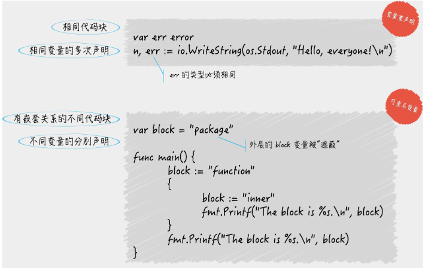

## 1. 工作区和GOPATH

**问：你知道设置 GOPATH 有什么意义吗？**

你可以把 GOPATH 简单理解成 Go 语言的工作目录，它的值是一个目录的路径，也可以是多个目录路径，每个目录都代表 Go 语言的一个工作区（workspace）。

我们需要利于这些工作区，去放置 Go 语言的源码文件（source file），以及安装（install）后的归档文件（archive file，也就是以“.a”为扩展名的文件）和可执行文件（executable file）。

<br>

事实上，由于 Go 语言项目在其生命周期内的所有操作（编码、依赖管理、构建、测试、安装等）基本上都是围绕着 GOPATH 和工作区进行的。所以，它的背后至少有 3 个知识点，

分别是：

**1.1. Go 语言源码的组织方式是怎样的；**

Go 语言的源码也是以代码包为基本组织单位的。在文件系统中，这些代码包其实是与目录一一对应的。由于目录可以有子目录，所以代码包也可以有子包。

一个代码包中可以包含任意个以.go 为扩展名的源码文件，这些源码文件都需要被声明属于同一个代码包。

代码包的名称一般会与源码文件所在的目录同名。如果不同名，那么在构建、安装的过程中会以代码包名称为准。每个代码包都会有导入路径。代码包的导入路径是其他代码在使用该包中的程序实体时，需要引入的路径。在实际使用程序实体之前，我们必须先导入其所在的代码包。具体的方式就是import该代码包的导入路径。

在工作区中，一个代码包的导入路径实际上就是从 src 子目录，到该包的实际存储位置的相对路径。

所以说，Go 语言源码的组织方式就是以环境变量 GOPATH、工作区、src 目录和代码包为主线的。一般情况下，Go 语言的源码文件都需要被存放在环境变量 GOPATH 包含的某个工作区（目录）中的 src 目录下的某个代码包（目录）中。

**1.2. 你是否了解源码安装后的结果（只有在安装后，Go 语言源码才能被我们或其他代码使**

**用）；**

源码文件通常会被放在某个工作区的 src 子目录下。那么在安装后如果产生了归档文件（以“.a”为扩展名的文件），就会放进该工作区的 pkg子目录；如果产生了可执行文件，就可能会放进该工作区的 bin 子目录。

**1.3. 你是否理解构建和安装 Go 程序的过程（这在开发程序以及查找程序问题的时候都很有**

**用，否则你很可能会走弯路）。**

构建使用命令go build，安装使用命令go install。构建和安装代码包的时候都会执行编译、打包等操作，并且，这些操作生成的任何文件都会先被保存到某个临时的目录中。

如果构建的是库源码文件，那么操作后产生的结果文件只会存在于临时目录中。这里的构建的主要意义在于检查和验证。

如果构建的是命令源码文件，那么操作的结果文件会被搬运到源码文件所在的目录中。

<br>

## 2. 命令源码文件

**问：命令源码文件的用途是什么，怎样编写它？**

命令源码文件是程序的运行入口，是每个可独立运行的程序必须拥有的。我们可以通过构建或安装，生成与其对应的可执行文件，后者一般会与该命令源码文件的直接父目录同名。

**如果一个源码文件声明属于`main`包，并且包含一个无参数声明且无结果声明的`main`函数，那么它就是命令源码文件。** 就像下面这段代码：

```go
package main
 
import "fmt"
 
func main() {
	fmt.Println("Hello, world!")
}
```

如果你把这段代码存成 demo1.go 文件，那么运行`go run demo1.go`命令后就会在屏幕（标准输出）中看到`Hello, world!`

> 当需要模块化编程时，我们往往会将代码拆分到多个文件，甚至拆分到不同的代码包中。但无论怎样，对于一个独立的程序来说，命令源码文件永远只会也只能有一个。如果有与命令源码文件同包的源码文件，那么它们也应该声明属于`main`包。

<br>

##  3. 库源码文件

**库源码文件是不能被直接运行的源码文件，它仅用于存放程序实体，这些程序实体可以被其他代码使用（只要遵从 Go 语言规范的话）。**

这里的“其他代码”可以与被使用的程序实体在同一个源码文件内，也可以在其他源码文件，甚至其他代码包中。

> 那么程序实体是什么呢？在 Go 语言中，程序实体是变量、常量、函数、结构体和接口的统称。
>
> 我们总是会先声明（或者说定义）程序实体，然后再去使用。比如在上一篇的例子中，我们先定义了变量`name`，然后在`main`函数中调用`fmt.Printf`函数的时候用到了它。
>
> 再多说一点，程序实体的名字被统称为标识符。标识符可以是任何 Unicode 编码可以表示的字母字符、数字以及下划线“_”，但是其首字母不能是数字。
>
> 从规则上说，我们可以用中文作为变量的名字。但是，我觉得这种命名方式非常不好，自己也会在开发团队中明令禁止这种做法。作为一名合格的程序员，我们应该向着编写国际水准的程序无限逼近。

**问：怎样把命令源码文件中的代码拆分到其他库源码文件？**

第一条规则，同目录下的源码文件的代码包声明语句要一致。也就是说，它们要同属于一个代码包。这对于所有源码文件都是适用的。

如果目录中有命令源码文件，那么其他种类的源码文件也应该声明属于`main`包。这也是我们能够成功构建和运行它们的前提。

第二条规则，源码文件声明的代码包的名称可以与其所在的目录的名称不同。在针对代码包进行构建时，生成的结果文件的主名称与其父目录的名称一致。

对于命令源码文件而言，构建生成的可执行文件的主名称会与其父目录的名称相同，这在我前面的回答中也验证过了。

<br>

## 4. 程序实体的那些事儿（上）

**Go 语言中的程序实体包括变量、常量、函数、结构体和接口。** Go 语言是静态类型的编程语言，所以我们在声明变量或常量的时候，都需要指定它们的类型，或者给予足够的信息，这样才可以让 Go 语言能够推导出它们的类型。

> 在 Go 语言中，变量的类型可以是其预定义的那些类型，也可以是程序自定义的函数、结构体或接口。常量的合法类型不多，只能是那些 Go 语言预定义的基本类型。它的声明方式也更简单一些

**问：声明变量有几种方式？**

一个是你要知道 Go 语言中的类型推断，以及它在代码中的基本体现，另一个是短变量声明的用法。

**问：Go 语言的类型推断可以带来哪些好处？**

Go 语言的类型推断可以明显提升程序的灵活性，使得代码重构变得更加容易，同时又不会给代码的维护带来额外负担（实际上，它恰恰可以避免散弹式的代码修改），更不会损失程序的运行效率。

**问：2. 变量的重声明是什么意思？**

这涉及了短变量声明。通过使用它，我们可以对同一个代码块中的变量进行重声明。其含义是对已经声明过的变量再次声明。变量重声明的前提条件如下。

1. 由于变量的类型在其初始化时就已经确定了，所以对它再次声明时赋予的类型必须与其原本的类型相同，否则会产生编译错误。
2. 变量的重声明只可能发生在某一个代码块中。如果与当前的变量重名的是外层代码块中的变量，那么就是另外一种含义了，我在下一篇文章中会讲到。
3. 变量的重声明只有在使用短变量声明时才会发生，否则也无法通过编译。如果要在此处声明全新的变量，那么就应该使用包含关键字`var`的声明语句，但是这时就不能与同一个代码块中的任何变量有重名了。
4. 被“声明并赋值”的变量必须是多个，并且其中至少有一个是新的变量。这时我们才可以说对其中的旧变量进行了重声明。

这样来看，变量重声明其实算是一个语法糖（或者叫便利措施）。它允许我们在使用短变量声明时不用理会被赋值的多个变量中是否包含旧变量。

## 5. 程序实体的那些事儿（中）

程序实体的访问权限有三种：包级私有的、模块级私有的和公开的。这其实就是 Go 语言在语言层面，依据代码块对程序实体作用域进行的定义。

**一个程序实体的作用域总是会被限制在某个代码块中，而这个作用域最大的用处，就是对程序实体的访问权限的控制。**对“高内聚，低耦合”这种程序设计思想的实践，恰恰可以从这里开始。

**问：如果一个变量与其外层代码块中的变量重名会出现什么状况**

```go
package main
 
import "fmt"
 
var block = "package"
 
func main() {
	block := "function"
	{
		block := "inner"
		fmt.Printf("The block is %s.\n", block)
	}
	fmt.Printf("The block is %s.\n", block)
}
```

这个命令源码文件中有四个代码块，它们是：全域代码块、`main`包代表的代码块、`main`函数代表的代码块，以及在`main`函数中的一个用花括号包起来的代码块。

能通过编译。运行后打印出的内容是：

```go
The block is inner.
The block is function.
```

- 首先，代码引用变量的时候总会最优先查找当前代码块中的那个变量。注意，这里的“当前代码块”仅仅是引用变量的代码所在的那个代码块，并不包含任何子代码块。
- 其次，如果当前代码块中没有声明以此为名的变量，那么程序会沿着代码块的嵌套关系，从直接包含当前代码块的那个代码块开始，一层一层地查找。
- 一般情况下，程序会一直查到当前代码包代表的代码块。如果仍然找不到，那么 Go 语言的编译器就会报错了

**问：不同代码块中的重名变量与变量重声明中的变量区别到底在哪儿？**

**为了方便描述，我就把不同代码块中的重名变量叫做“可重名变量”吧。**注意，在同一个代码块中不允许出现重名的变量，这违背了 Go 语言的语法。关于这两者的表象和机理，我们已经讨论得足够充分了。你现在可以说出几条区别？请想一想，然后再看下面的列表。

1. 变量重声明中的变量一定是在某一个代码块内的。注意，这里的“某一个代码块内”并不包含它的任何子代码块，否则就变成了“多个代码块之间”。而可重名变量指的正是在多个代码块之间由相同的标识符代表的变量。
2. 变量重声明是对同一个变量的多次声明，这里的变量只有一个。而可重名变量中涉及的变量肯定是有多个的。
3. 不论对变量重声明多少次，其类型必须始终一致，具体遵从它第一次被声明时给定的类型。而可重名变量之间不存在类似的限制，它们的类型可以是任意的。
4. 如果可重名变量所在的代码块之间，存在直接或间接的嵌套关系，那么它们之间一定会存在“屏蔽”的现象。但是这种现象绝对不会在变量重声明的场景下出现。



<br>

## 6. 程序实体的那些事儿 （下)

**问：怎样判断一个变量的类型**

答案是使用“类型断言”表达式。具体怎么写呢？

```go
value, ok := interface{}(container).([]string)

```


这里有一条赋值语句。在赋值符号的右边，是一个类型断言表达式。

它包括了用来把`container`变量的值转换为空接口值的`interface{}(container)`。以及一个用于判断前者的类型是否为切片类型 `[]string` 的 `.([]string)`。

这个表达式的结果可以被赋给两个变量，在这里由`value`和`ok`代表。变量`ok`是布尔（bool）类型的，它将代表类型判断的结果，`true`或`false`。

如果是`true`，那么被判断的值将会被自动转换为`[]string`类型的值，并赋给变量`value`，否则`value`将被赋予`nil`（即“空”）。

顺便提一下，这里的`ok`也可以没有。也就是说，类型断言表达式的结果，可以只被赋给一个变量，在这里是`value`。

但是这样的话，当判断为否时就会引发异常。

这种异常在 Go 语言中被叫做`panic`，我把它翻译为运行时恐慌。因为它是一种在 Go 程序运行期间才会被抛出的异常，而“恐慌”二字是英文 Panic 的中文直译。

除非显式地“恢复”这种“恐慌”，否则它会使 Go 程序崩溃并停止。所以，在一般情况下，我们还是应该使用带`ok`变量的写法。

**问题解析**

正式说明一下，类型断言表达式的语法形式是`x.(T)`。其中的`x`代表要被判断类型的值。这个值当下的类型必须是接口类型的，不过具体是哪个接口类型其实是无所谓的。

所以，当这里的`container`变量类型不是任何的接口类型时，我们就需要先把它转成某个接口类型的值。

如果`container`是某个接口类型的，那么这个类型断言表达式就可以是`container.([]string)`。

在 Go 语言中，`interface{}`代表空接口，任何类型都是它的实现类型。现在你只要知道，任何类型的值都可以很方便地被转换成空接口的值就行了。

其中的`x`可以是一个变量，也可以是一个代表值的字面量（比如`1.23`和`struct{}`），还可以是一个表达式。

注意，如果是表达式，那么该表达式的结果只能是一个值，而不能是多个值。在这个上下文中，`x`可以被叫做源值，它的类型就是源类型，而那个`T`代表的类型就是目标类型。

<br>

**问：什么是别名类型？什么是潜在类型？**

我们可以用关键字`type`声明自定义的各种类型。当然了，这些类型必须在 Go 语言基本类型和高级类型的范畴之内。在它们当中，有一种被叫做“别名类型”的类型。我们可以像下面这样声明它：

```go
type MyString = string

```

这条声明语句表示，`MyString`是`string`类型的别名类型。顾名思义，别名类型与其源类型的区别恐怕只是在名称上，它们是完全相同的。

源类型与别名类型是一对概念，是两个对立的称呼。别名类型主要是为了代码重构而存在的。更详细的信息可参见 Go 语言官方的文档[Proposal: Type Aliases](https://golang.org/design/18130-type-alias)。

Go 语言内建的基本类型中就存在两个别名类型。`byte`是`uint8`的别名类型，而`rune`是`int32`的别名类型。

一定要注意，如果我这样声明：

```go
type MyString2 string // 注意，这里没有等号。
```

`MyString2`和`string`就是两个不同的类型了。这里的`MyString2`是一个新的类型，不同于其他任何类型。

这种方式也可以被叫做对类型的再定义。我们刚刚把`string`类型再定义成了另外一个类型`MyString2`。

## 7.  数组和切片

**数组类型的值（以下简称数组）的长度是固定的，而切片类型的值（以下简称切片）是可变长的。**

数组的长度在声明它的时候就必须给定，并且之后不会再改变。可以说，数组的长度是其类型的一部分。比如，`[1]string`和`[2]string`就是两个不同的数组类型。

**问：怎样正确估算切片的长度和容量？**

当我们用`make`函数初始化切片时，如果不指明其容量，那么它就会和长度一致。如果在初始化时指明了容量，那么切片的实际容量也就是它了。

切片的容量代表了它的底层数组的长度，但这仅限于使用`make`函数或者切片值字面量初始化切片的情况。

**问：怎样估算切片容量的增长？**

一旦一个切片无法容纳更多的元素，Go 语言就会想办法扩容。但它并不会改变原来的切片，而是会生成一个容量更大的切片，然后将把原有的元素和新元素一并拷贝到新切片中。在一般的情况下，你可以简单地认为新切片的容量（以下简称新容量）将会是原切片容量（以下简称原容量）的 2 倍。

但是，当原切片的长度（以下简称原长度）大于或等于`1024`时，Go 语言将会以原容量的`1.25`倍作为新容量的基准（以下新容量基准）。新容量基准会被调整（不断地与`1.25`相乘），直到结果不小于原长度与要追加的元素数量之和（以下简称新长度）。最终，新容量往往会比新长度大一些，当然，相等也是可能的。

另外，如果我们一次追加的元素过多，以至于使新长度比原容量的 2 倍还要大，那么新容量就会以新长度为基准。注意，与前面那种情况一样，最终的新容量在很多时候都要比新容量基准更大一些。更多细节可参见`runtime`包中 slice.go 文件里的`growslice`及相关函数的具体实现。

我把展示上述扩容策略的一些例子都放到了 demo16.go 文件中。你可以去试运行看看。

**问：切片的底层数组什么时候会被替换？**

确切地说，一个切片的底层数组永远不会被替换。为什么？虽然在扩容的时候 Go 语言一定会生成新的底层数组，但是它也同时生成了新的切片。

它只是把新的切片作为了新底层数组的窗口，而没有对原切片，及其底层数组做任何改动。

请记住，在无需扩容时，`append`函数返回的是指向原底层数组的新切片，而在需要扩容时，`append`函数返回的是指向新底层数组的新切片。所以，严格来讲，“扩容”这个词用在这里虽然形象但并不合适。不过鉴于这种称呼已经用得很广泛了，我们也没必要另找新词了。

顺便说一下，只要新长度不会超过切片的原容量，那么使用`append`函数对其追加元素的时候就不会引起扩容。这只会使紧邻切片窗口右边的（底层数组中的）元素被新的元素替换掉。

## 8. container包中的那些容器

Go 语言的链表实现在标准库的`container/list`代码包中。这个代码包中有两个公开的程序实体——`List`和`Element`，List 实现了一个双向链表（以下简称链表），而 Element 则代表了链表中元素的结构。

**问：可以把自己生成的`Element`类型值传给链表吗**

我们在这里用到了`List`的四种方法。

`MoveBefore`方法和`MoveAfter`方法，它们分别用于把给定的元素移动到另一个元素的前面和后面。

`MoveToFront`方法和`MoveToBack`方法，分别用于把给定的元素移动到链表的最前端和最后端。

在这些方法中，“给定的元素”都是`*Element`类型的，`*Element`类型是`Element`类型的指针类型，`*Element`的值就是元素的指针。

```go
func (l *List) MoveBefore(e, mark *Element)
func (l *List) MoveAfter(e, mark *Element)
 
func (l *List) MoveToFront(e *Element)
func (l *List) MoveToBack(e *Element)
```

具体问题是，如果我们自己生成这样的值，然后把它作为“给定的元素”传给链表的方法，那么会发生什么？链表会接受它吗？

这里，给出一个**典型回答**：不会接受，这些方法将不会对链表做出任何改动。因为我们自己生成的`Element`值并不在链表中，所以也就谈不上“在链表中移动元素”。更何况链表不允许我们把自己生成的`Element`值插入其中。

**问题解析**

在`List`包含的方法中，用于插入新元素的那些方法都只接受`interface{}`类型的值。这些方法在内部会使用`Element`值，包装接收到的新元素。

这样做正是为了避免直接使用我们自己生成的元素，主要原因是避免链表的内部关联，遭到外界破坏，这对于链表本身以及我们这些使用者来说都是有益的。

`List`的方法还有下面这几种：

`Front`和`Back`方法分别用于获取链表中最前端和最后端的元素，
`InsertBefore`和`InsertAfter`方法分别用于在指定的元素之前和之后插入新元素，`PushFront`和`PushBack`方法则分别用于在链表的最前端和最后端插入新元素。

```go
func (l *List) Front() *Element
func (l *List) Back() *Element
 
func (l *List) InsertBefore(v interface{}, mark *Element) *Element
func (l *List) InsertAfter(v interface{}, mark *Element) *Element
 
func (l *List) PushFront(v interface{}) *Element
func (l *List) PushBack(v interface{}) *Element
```

这些方法都会把一个`Element`值的指针作为结果返回，它们就是链表留给我们的安全“接口”。拿到这些内部元素的指针，我们就可以去调用前面提到的用于移动元素的方法了。

**知识扩展**

**问：为什么链表可以做到开箱即用？**

`List`和`Element`都是结构体类型。结构体类型有一个特点，那就是它们的零值都会是拥有特定结构，但是没有任何定制化内容的值，相当于一个空壳。值中的字段也都会被分别赋予各自类型的零值。

> 广义来讲，所谓的零值就是只做了声明，但还未做初始化的变量被给予的缺省值。每个类型的零值都会依据该类型的特性而被设定。
>
> 比如，经过语句`var a [2]int`声明的变量`a`的值，将会是一个包含了两个`0`的整数数组。又比如，经过语句`var s []int`声明的变量`s`的值将会是一个`[]int`类型的、值为`nil`的切片。

那么经过语句`var l list.List`声明的变量`l`的值将会是什么呢？[1] 这个零值将会是一个长度为`0`的链表。这个链表持有的根元素也将会是一个空壳，其中只会包含缺省的内容。那这样的链表我们可以直接拿来使用吗？

答案是，可以的。这被称为“开箱即用”。Go 语言标准库中很多结构体类型的程序实体都做到了开箱即用。这也是在编写可供别人使用的代码包（或者说程序库）时，我们推荐遵循的最佳实践之一。那么，语句`var l list.List`声明的链表`l`可以直接使用，这是怎么做到的呢？

关键在于它的“延迟初始化”机制。

所谓的**延迟初始化**，你可以理解为把初始化操作延后，仅在实际需要的时候才进行。延迟初始化的优点在于“延后”，它可以分散初始化操作带来的计算量和存储空间消耗。

例如，如果我们需要集中声明非常多的大容量切片的话，那么那时的 CPU 和内存空间的使用量肯定都会一个激增，并且只有设法让其中的切片及其底层数组被回收，内存使用量才会有所降低。

如果数组是可以被延迟初始化的，那么计算量和存储空间的压力就可以被分散到实际使用它们的时候。这些数组被实际使用的时间越分散，延迟初始化带来的优势就会越明显。

> 实际上，Go 语言的切片就起到了延迟初始化其底层数组的作用，你可以想一想为什么会这么说的理由。
>
> 延迟初始化的缺点恰恰也在于“延后”。你可以想象一下，如果我在调用链表的每个方法的时候，它们都需要先去判断链表是否已经被初始化，那这也会是一个计算量上的浪费。在这些方法被非常频繁地调用的情况下，这种浪费的影响就开始显现了，程序的性能将会降低。

在这里的链表实现中，一些方法是无需对是否初始化做判断的。比如`Front`方法和`Back`方法，一旦发现链表的长度为`0`, 直接返回`nil`就好了。

又比如，在用于删除元素、移动元素，以及一些用于插入元素的方法中，只要判断一下传入的元素中指向所属链表的指针，是否与当前链表的指针相等就可以了。

如果不相等，就一定说明传入的元素不是这个链表中的，后续的操作就不用做了。反之，就一定说明这个链表已经被初始化了。

原因在于，链表的`PushFront`方法、`PushBack`方法、`PushBackList`方法以及`PushFrontList`方法总会先判断链表的状态，并在必要时进行初始化，这就是延迟初始化。

而且，我们在向一个空的链表中添加新元素的时候，肯定会调用这四个方法中的一个，这时新元素中指向所属链表的指针，一定会被设定为当前链表的指针。所以，指针相等是链表已经初始化的充分必要条件。

明白了吗？`List`利用了自身以及`Element`在结构上的特点，巧妙地平衡了延迟初始化的优缺点，使得链表可以开箱即用，并且在性能上可以达到最优。

**问：`Ring`与`List`的区别在哪儿？**

`container/ring`包中的`Ring`类型实现的是一个循环链表，也就是我们俗称的环。其实`List`在内部就是一个循环链表。它的根元素永远不会持有任何实际的元素值，而该元素的存在就是为了连接这个循环链表的首尾两端。

所以也可以说，`List`的零值是一个只包含了根元素，但不包含任何实际元素值的空链表。那么，既然`Ring`和`List`在本质上都是循环链表，那它们到底有什么不同呢？

最主要的不同有下面几种。

1. `Ring`类型的数据结构仅由它自身即可代表，而`List`类型则需要由它以及`Element`类型联合表示。这是表示方式上的不同，也是结构复杂度上的不同。
2. 一个`Ring`类型的值严格来讲，只代表了其所属的循环链表中的一个元素，而一个`List`类型的值则代表了一个完整的链表。这是表示维度上的不同。
3. 在创建并初始化一个`Ring`值的时候，我们可以指定它包含的元素的数量，但是对于一个`List`值来说却不能这样做（也没有必要这样做）。循环链表一旦被创建，其长度是不可变的。这是两个代码包中的`New`函数在功能上的不同，也是两个类型在初始化值方面的第一个不同。
4. 仅通过`var r ring.Ring`语句声明的`r`将会是一个长度为`1`的循环链表，而`List`类型的零值则是一个长度为`0`的链表。别忘了`List`中的根元素不会持有实际元素值，因此计算长度时不会包含它。这是两个类型在初始化值方面的第二个不同。
5. `Ring`值的`Len`方法的算法复杂度是 O(N) 的，而`List`值的`Len`方法的算法复杂度则是 O(1) 的。这是两者在性能方面最显而易见的差别。

其他的不同基本上都是方法方面的了。比如，循环链表也有用于插入、移动或删除元素的方法，不过用起来都显得更抽象一些，等等。

<br>

## 9. 字典的操作和约束

为什么字典的键类型会受到约束？

Go 语言的字典类型其实是一个哈希表（hash table）的特定实现，在这个实现中，键和元素的最大不同在于，键的类型是受限的，而元素却可以是任意类型的。

如果要探究限制的原因，我们就先要了解哈希表中最重要的一个过程：映射。

你可以把键理解为元素的一个索引，我们可以在哈希表中通过键查找与它成对的那个元素。

映射过程的第一步就是：把键值转换为哈希值。**

在 Go 语言的字典中，每一个键值都是由它的哈希值代表的。也就是说，字典不会独立存储任何键的值，但会独立存储它们的哈希值。


**问：字典的键类型不能是哪些类型？**

Go 语言字典的键类型不可以是函数类型、字典类型和切片类型。


Go 语言规范规定，在键类型的值之间必须可以施加操作符`==`和`!=`。换句话说，键类型的值必须要支持判等操作。由于函数类型、字典类型和切片类型的值并不支持判等操作，所以字典的键类型不能是这些类型。

另外，如果键的类型是接口类型的，那么键值的实际类型也不能是上述三种类型，否则在程序运行过程中会引发 panic（即运行时恐慌）。

我们举个例子：

```go
var badMap2 = map[interface{}]int{
	"1":   1,
	[]int{2}: 2, // 这里会引发 panic。
	3:    3,
}
```

这里的变量`badMap2`的类型是键类型为`interface{}`、值类型为`int`的字典类型。这样声明并不会引起什么错误。或者说，我通过这样的声明躲过了 Go 语言编译器的检查。

注意，我用字面量在声明该字典的同时对它进行了初始化，使它包含了三个键 - 元素对。其中第二个键 - 元素对的键值是`[]int{2}`，元素值是`2`。这样的键值也不会让 Go 语言编译器报错，因为从语法上说，这样做是可以的。

但是，当我们运行这段代码的时候，Go 语言的运行时（runtime）系统就会发现这里的问题，它会抛出一个 panic，并把根源指向字面量中定义第二个键 - 元素对的那一行。我们越晚发现问题，修正问题的成本就会越高，所以最好不要把字典的键类型设定为任何接口类型。

还要注意，如果键的类型是数组类型，那么还要确保该类型的元素类型不是函数类型、字典类型或切片类型。


**问：应该优先考虑哪些类型作为字典的键类型？**

你现在已经清楚了，在 Go 语言中，有些类型的值是支持判等的，有些是不支持的。那么在这些值支持判等的类型当中，哪些更适合作为字典的键类型呢？

**求哈希和判等操作的速度越快，对应的类型就越适合作为键类型。**

答案是，优先选用数值类型和指针类型，通常情况下类型的宽度越小越好。如果非要选择字符串类型的话，最好对键值的长度进行额外的约束。


**问题 2：在值为`nil`的字典上执行读操作会成功吗，那写操作呢？**

由于字典是引用类型，所以当我们仅声明而不初始化一个字典类型的变量的时候，它的值会是`nil`。

除了添加键 - 元素对，我们在一个值为`nil`的字典上做任何操作都不会引起错误。当我们试图在一个值为`nil`的字典中添加键 - 元素对的时候，Go 语言的运行时系统就会立即抛出一个 panic。

<br>

## 10. 通道的基本操作

通道类型的值本身就是并发安全的，这也是 Go 语言自带的、唯一一个可以满足并发安全性的类型。

当容量为`0`时，我们可以称通道为非缓冲通道，也就是不带缓冲的通道。而当容量大于`0`时，我们可以称为缓冲通道，也就是带有缓冲的通道

**一个通道相当于一个先进先出（FIFO）的队列。也就是说，通道中的各个元素值都是严格地按照发送的顺序排列的，先被发送通道的元素值一定会先被接收。元素值的发送和接收都需要用到操作符`<-`。我们也可以叫它接送操作符。一个左尖括号紧接着一个减号形象地代表了元素值的传输方向。**

**问：对通道的发送和接收操作都有哪些基本的特性？**

它们的基本特性如下。

1. 对于同一个通道，发送操作之间是互斥的，接收操作之间也是互斥的。
2. 发送操作和接收操作中对元素值的处理都是不可分割的。
3. 发送操作在完全完成之前会被阻塞。接收操作也是如此。

**问题解析**

**我们先来看第一个基本特性。** 在同一时刻，Go 语言的运行时系统（以下简称运行时系统）只会执行对同一个通道的任意个发送操作中的某一个。

直到这个元素值被完全复制进该通道之后，其他针对该通道的发送操作才可能被执行。

类似的，在同一时刻，运行时系统也只会执行，对同一个通道的任意个接收操作中的某一个。

直到这个元素值完全被移出该通道之后，其他针对该通道的接收操作才可能被执行。即使这些操作是并发执行的也是如此。

这里所谓的并发执行，你可以这样认为，多个代码块分别在不同的 goroutine 之中，并有机会在同一个时间段内被执行。

另外，对于通道中的同一个元素值来说，发送操作和接收操作之间也是互斥的。例如，虽然会出现，正在被复制进通道但还未复制完成的元素值，但是这时它绝不会被想接收它的一方看到和取走。

**这里要注意的一个细节是，元素值从外界进入通道时会被复制。更具体地说，进入通道的并不是在接收操作符右边的那个元素值，而是它的副本。**

另一方面，元素值从通道进入外界时会被移动。这个移动操作实际上包含了两步，第一步是生成正在通道中的这个元素值的副本，并准备给到接收方，第二步是删除在通道中的这个元素值。

**顺着这个细节再来看第二个基本特性。** 这里的“不可分割”的意思是，它们处理元素值时都是一气呵成的，绝不会被打断。

例如，发送操作要么还没复制元素值，要么已经复制完毕，绝不会出现只复制了一部分的情况。

又例如，接收操作在准备好元素值的副本之后，一定会删除掉通道中的原值，绝不会出现通道中仍有残留的情况。

这既是为了保证通道中元素值的完整性，也是为了保证通道操作的唯一性。对于通道中的同一个元素值来说，它只可能是某一个发送操作放入的，同时也只可能被某一个接收操作取出。

**再来说第三个基本特性。** 一般情况下，发送操作包括了“复制元素值”和“放置副本到通道内部”这两个步骤。

在这两个步骤完全完成之前，发起这个发送操作的那句代码会一直阻塞在那里。也就是说，在它之后的代码不会有执行的机会，直到这句代码的阻塞解除。

更细致地说，在通道完成发送操作之后，运行时系统会通知这句代码所在的 goroutine，以使它去争取继续运行代码的机会。

另外，接收操作通常包含了“复制通道内的元素值”“放置副本到接收方”“删掉原值”三个步骤。

在所有这些步骤完全完成之前，发起该操作的代码也会一直阻塞，直到该代码所在的 goroutine 收到了运行时系统的通知并重新获得运行机会为止。

说到这里，你可能已经感觉到，**如此阻塞代码其实就是为了实现操作的互斥和元素值的完整。**


**知识扩展**

**问题 1：发送操作和接收操作在什么时候可能被长时间的阻塞？**

先说针对**缓冲通道**的情况。如果通道已满，那么对它的所有发送操作都会被阻塞，直到通道中有元素值被接收走。

这时，通道会优先通知最早因此而等待的、那个发送操作所在的 goroutine，后者会再次执行发送操作。

由于发送操作在这种情况下被阻塞后，它们所在的 goroutine 会顺序地进入通道内部的发送等待队列，所以通知的顺序总是公平的。

相对的，如果通道已空，那么对它的所有接收操作都会被阻塞，直到通道中有新的元素值出现。这时，通道会通知最早等待的那个接收操作所在的 goroutine，并使它再次执行接收操作。

因此而等待的、所有接收操作所在的 goroutine，都会按照先后顺序被放入通道内部的接收等待队列。

对于**非缓冲通道**，情况要简单一些。无论是发送操作还是接收操作，一开始执行就会被阻塞，直到配对的操作也开始执行，才会继续传递。由此可见，非缓冲通道是在用同步的方式传递数据。也就是说，只有收发双方对接上了，数据才会被传递。

并且，数据是直接从发送方复制到接收方的，中间并不会用非缓冲通道做中转。相比之下，缓冲通道则在用异步的方式传递数据。

在大多数情况下，缓冲通道会作为收发双方的中间件。正如前文所述，元素值会先从发送方复制到缓冲通道，之后再由缓冲通道复制给接收方。

但是，当发送操作在执行的时候发现空的通道中，正好有等待的接收操作，那么它会直接把元素值复制给接收方。

以上说的都是在正确使用通道的前提下会发生的事情。下面我特别说明一下，由于错误使用通道而造成的阻塞。

对于值为`nil`的通道，不论它的具体类型是什么，对它的发送操作和接收操作都会永久地处于阻塞状态。它们所属的 goroutine 中的任何代码，都不再会被执行。

注意，由于通道类型是引用类型，所以它的零值就是`nil`。换句话说，当我们只声明该类型的变量但没有用`make`函数对它进行初始化时，该变量的值就会是`nil`。我们一定不要忘记初始化通道！

你可以去看一下 demo21.go，我在里面用代码罗列了一下会造成阻塞的几种情况。

**问题 2：发送操作和接收操作在什么时候会引发 panic？**

对于一个已初始化，但并未关闭的通道来说，收发操作一定不会引发 panic。但是通道一旦关闭，再对它进行发送操作，就会引发 panic。

另外，如果我们试图关闭一个已经关闭了的通道，也会引发 panic。注意，接收操作是可以感知到通道的关闭的，并能够安全退出。

更具体地说，当我们把接收表达式的结果同时赋给两个变量时，第二个变量的类型就是一定`bool`类型。它的值如果为`false`就说明通道已经关闭，并且再没有元素值可取了。

注意，如果通道关闭时，里面还有元素值未被取出，那么接收表达式的第一个结果，仍会是通道中的某一个元素值，而第二个结果值一定会是`true`。

因此，通过接收表达式的第二个结果值，来判断通道是否关闭是可能有延时的。

由于通道的收发操作有上述特性，所以除非有特殊的保障措施，我们千万不要让接收方关闭通道，而应当让发送方做这件事。